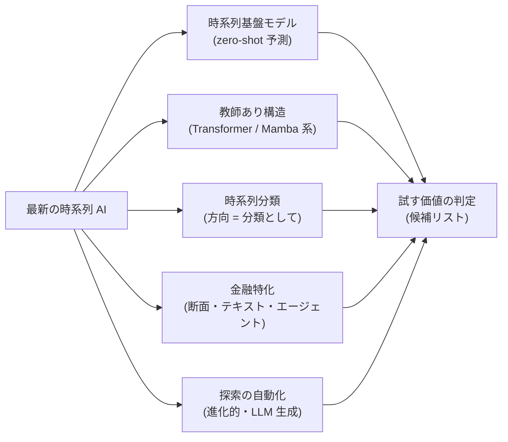

# 時系列から上昇下降トレンドを学習する最新 AI 技術の調査

作成日: 2026-09-10。派生元: TODO「DeepLearning と GAN を使った検証をかなり増やす」（利用者の指示 2026-09-10）。

## 1. 目的・背景

- feature-discovery（[§9](../specs/experiments/feature-discovery.md)）と gpu-models（[§6](../specs/experiments/gpu-models.md)）で「価格だけからは方向が出ない」が 3 軸（選別・断面・モデル）で再現した
- 利用者の指示（2026-09-10）: 「**時系列のデータから上昇下降のトレンドを学習するような最新の AI 技術がないか調べて**」
- 目的は **DL 検証拡充タスクの候補リストを作ること**。各技術を「この実験基盤（日足 13 万行・コスト 5bp・walk-forward・DSR）で試す価値があるか」で仕分ける

## 2. 対応方針

> この図の主張: 調査は 5 つの系統に分け、それぞれを既存の結論（価格だけでは出ない）に照らして仕分ける。

- 一次情報（論文・公式リポジトリ・ベンチマーク）を Web で当たり、出典 URL と取得日を残す
- 数値は【公表値】（出典つき）か【推測】で明示する。ベンチマークの数字は「金融の日次リターンで再現する保証はない」を毎回付す
- 成果物: `docs/specs/experiments/ts-trend-ai-survey.md`（1 ファイル）

## 3. 影響範囲

- 新規ファイル 2 つ（本プランと調査結果）と `TODO.md` の子タスク追記のみ。コード変更なし
- 後続タスク（DL / GAN の手法を増やして検証を回す）の候補選定に使う

## 4. テスト方針

- コードが無いのでテストは無し。代わりに出典の質で担保する: 主張は論文・公式発表・査読つきベンチマークに当て、二次記事だけの主張は【推測】に落とす
- 各候補に「n_trials への影響（rules §11-4）」を書き、多重検定の数え方を先に決めてから検証タスクに渡す
