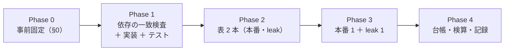

# 時系列分類器 3 本（MiniRocket ・ Hydra ・ QUANT）を閾値売買で回す

親タスク: 「DeepLearning と進化的探索（遺伝的アルゴリズム）を使った検証をかなり増やす」の子「DL / 進化的探索の手法を増やして検証を回す」
利用者の指示（2026-09-15）: **TODO で次にやるべきものを選んで → 進めます**（Claude が候補 2「MiniRocket ＋ Hydra ＋ QUANT」を推した）
候補の出所: [ts-trend-ai-survey.md §7](../../specs/experiments/ts-trend-ai-survey.md) の優先 2（「モデルの軸の最終確認。期待は低い。実装 半日・実行 数十分」）
規約: [rules.md 13 章](../../specs/experiments/feature-discovery/rules.md)（閾値つき売買）／ [15-1](../../specs/experiments/feature-discovery/rules.md)（検知器の契約）／ [14-10](../../specs/experiments/feature-discovery/rules.md)（空白は積極的に埋める）
台帳: [ledger.md](../../specs/experiments/feature-discovery/ledger.md)（着手時点 **n_trials 553**【実測 2026-09-15】・テスト **294 件 pass**【実測】）

---

## 0. 目的と背景

⚠ **埋めるのは「入力の形」の空白である。** これまでの手法はすべて **手で作った 35 列（own 層）** を入力にしてきた。
⚠ **生の価格の窓そのものから特徴を学ぶ手法は 1 本も回していない。** 時系列分類（TSC）の標準手法 3 本がそれに当たる【公表値: 各論文】。

| 手法 | 中身 | 出典 |
| --- | --- | --- |
| **MiniRocket** | 固定の畳み込み核（84 種 × 膨張率）の出力の「正になった割合（PPV）」を約 1 万列 | [arXiv:2012.08791](https://arxiv.org/abs/2012.08791)（取得 2026-09-15）|
| **Hydra** | 競合する核のグループで「どの核が最強応答か」を数える | [arXiv:2203.13652](https://arxiv.org/abs/2203.13652)（同）|
| **QUANT** | 系列を区間に割り、区間ごとの分位点を並べる | [arXiv:2308.00928](https://arxiv.org/abs/2308.00928)（同）|

⚠ **回す理由は「効くはず」ではない。** 調査の判定は ⚠ **期待「低い」**（金融の一次評価は汎用の新手法に否定的。[ts-trend-ai-survey.md §9](../../specs/experiments/ts-trend-ai-survey.md)）。
⚠ **「未実施」を「効かなかった」と区別するために回す**（[14-10 規約 4](../../specs/experiments/feature-discovery/rules.md)）。⚠ **良い数字が出たらまず配線を疑う**（11 章 規約 7）。

### 0-1. ⚠ 回す前に固定すること（結果を見てから決めない）

⚠ **事前固定するのは構造だけ**（14-9）。⚠ **本節は Phase 1 に入る前に書き終える。**

| 固定するもの | 値 | ⚠ 理由 |
| --- | --- | --- |
| 手法 | **MiniRocket ／ Hydra ／ QUANT の 3 本**（検知器として登録） | 利用者に示した候補どおり。⚠ **結合（Hydra＋QUANT など）は回さない**（§0-2 の 4） |
| 変換の水準 | ⚠ **aeon 1.5.0 の既定のまま**: MiniRocket 核 10,000（→ **9,996 列**）／ Hydra 核 8 × 群 64（→ **3,072 列**）／ QUANT 深さ 6・分位の割り 4（→ **653 列**）【実測 2026-09-15。長さ 60 の乱数系列】 | ⚠ **水準を振ると n_trials が増える**（13-6 の 3）。⚠ **論文の既定を使えば「選んだ」自由度が無い** |
| 入力の窓 | ⚠ **過去 60 営業日の対数リターンを、直近を 0 とした累積の道筋にした 1 本の系列**（長さ 60・float32） | 60 は own 層の最長窓と同じ。⚠ **道筋にするのは「形」を渡すため**で、⚠ **Hydra と QUANT は内部で 1 次差分も取る**のでリターンの情報も残る（§0-2 の 2） |
| 窓の置き場 | ⚠ **表の列**（新しい `seq` 層。`own_seq60_r0` … `own_seq60_r59` ＝ r_i … r_{i−59}） | ⚠ **検知器は訓練と検証しか受け取らず、パージで削れた行が抜ける**ので、検証の頭の窓が組めない。⚠ **表の段で作れば 1994 年からの足で全行が埋まる**（§0-2 の 1） |
| 学習の対象 | ⚠ **`y`（1 日先の対数リターン）** | ⚠ **own 表のモデルの軸（Ridge・LightGBM・MLP・GAN 増強）と同じ対象**。⚠ **長いラベル（`y_fwd_W`）は D 系で「θ ≥ 50 では出口が立たない」と分かっている**（[theta-placement.md](../../specs/experiments/theta-placement.md)） |
| 頭（ヘッド） | 変換 → `StandardScaler`（訓練で fit）→ **Ridge（α = 1。config の `model`）** → **Platt 較正**（`calibrate.fit`・訓練の尻の holdout）→ 買い% | ⚠ **13-2: 分類器の確率には替えない。** ⚠ **論文の頭（RidgeClassifierCV・QUANT は ExtraTrees）とは違う**が、⚠ **3 本とも同じ頭にしないと「変換の差」として読めない**。モデルは台帳の鍵 |
| 表 | **us63 × 2018-01-31 以降 × own ＋ seq**（`trade_ownseq_ridge_a` が表の持ち主） | ⚠ **own_2018 と同じ期間・銘柄。** ⚠ **行が own_2018 と 1 行も違わないことを検算する**（§4 の 7） |
| 形式 | ⚠ **(A) 共通だけ** | (B) は 63 銘柄 × 5 fold で 1 万列の Ridge を解くことになる。⚠ **足すなら別の試行**（＋9） |
| θ ／ 種 ／ embargo | **50 / 55 / 60** ／ **0** ／ **0 本** | 13-3・13-6 の 4。own は断面を含まない |
| 数え方 | **n_trials 553 → 562**（＋9 ＝ 3 手法 × 3 θ）【推測】 | 13-9 |
| 判定 | **対 B&H 上乗せ**の符号と t（13-7） | |
| ⚠ **「効く」と言う条件** | ⚠ **13-7 の「採る」**（上乗せ > 0 かつ fold 5/5）に加えて、⚠ **own 表の Ridge「全部使う」（`trade_own_ridge_a`。同じ期間・同じ行）を 3 θ すべてで上回る** | ⚠ **頭が同じ Ridge なので、手で作った 35 列に勝てなければ「窓から学ぶ」意味が無い**（E8「複雑なモデルは Ridge を超えないと採らない」）。⚠ **表が違うので 13-8 の厳密な橋渡しではなく、参考の比較** |
| 門（14-5） | ⚠ **記録するだけ**（`cli/run.py` の既定） | 14-10 規約 2 |

### 0-2. ⚠ 判断が要った点

| # | 判断 | 理由 |
| ---: | --- | --- |
| 1 | ⚠ **窓は表の列にする**（`cli/run.py` は変えない） | 代案は「全期間の表を ctx で検知器に渡す」だが、⚠ **配線（`cli/run.py`）を変えると既存の全実行の経路に触る**。⚠ **`seq` 層は `trend` 層と同じ形**（接頭辞 `own_`・足 i までしか見ない）で、⚠ **既存の表は 1 列も増えない**（`feature_layers` に書いた実験だけが持つ） |
| 2 | ⚠ **入力は累積の道筋（リターンそのものではない）** | どちらも同じ情報だが、畳み込み系は並べ方で出力が変わる。⚠ **トレンドの「形」を見るのが調査の問いだった**ので道筋を選んだ。⚠ **窓ごとの z 正規化はしない**（振れ幅 ＝ ボラティリティの情報を消さない） |
| 3 | ⚠ **aeon は依存なしで入れ、numba 0.67.0 と組み合わせる** | ⚠ **aeon 1.5.0 は `numba<0.64` を宣言し、numba 0.63 は `numpy<2.4` なので、宣言どおり入れると numpy が 2.4.2 → 2.3.5 に下がる**【実測。pip の依存解決】。⚠ **これまでの全実行は numpy 2.4.2 で記録されている**ので下げない。⚠ **宣言の外で使うことになる**ので、⚠ **宣言どおりの環境（numba 0.63.1・numpy 2.3.5）と出力が一致することを先に確かめる**（§4 の 3）。⚠ **aeon は検知器の関数の中でだけ import する** ＝ 既存の実行は numba を読み込まない |
| 4 | ⚠ **結合（Hydra＋QUANT）は回さない** | 調査に 2025-12 の結合の報告（平均精度 ＋0.007）があるが、⚠ **結合の手順は論文で確かめていない**。⚠ **利用者に示したのは 3 本（＋9 試行）**。⚠ **結合は単独の最良に勝って初めて意味がある**（14-6 a）ので、単独 3 本の結果を見る前に足さない |
| 5 | 実験名は `trade_ownseq_ridge_a`（表の呼び名 `ownseq` ＝ own ＋ seq） | [rules.md 10-1](../../specs/experiments/feature-discovery/rules.md) の形。⚠ **呼び名の表に `ownseq` を 1 行足す**（規約の変更ではない） |

---

## 1. 対応方針

> この図の主張: ⚠ **新しく作るのは「seq 層」と「検知器 3 本」だけで、較正から先は既存の経路をそのまま使う。**


| 部品 | 書き方 |
| --- | --- |
| `ail/features/seq.py`（新規） | `own_seq60_r{k}` ＝ `log(c).diff().shift(k)`（k = 0 … 59）。⚠ **`shift(-k)` は使わない** |
| `ail/detectors/tsc.py`（新規） | 共通の `_run(変換を作る関数, tr, te, feats, ctx)`: 窓の列 → (行, 1, 60) の道筋 → 変換を**訓練で fit** → 訓練・検証に transform → ⚠ **`LEAK_` 列があれば変換の出力の横に足す**（13-10）→ `StandardScaler` → `calibrate.fit` → Ridge → 買い%。⚠ **numpy の float32 のまま扱う**（DataFrame にしない。1 万列 × 11.5 万行は 4.6GB） |
| `ail/bootstrap.py` | `seq` と `tsc` の import を 2 行 |
| `cli/build.py` | `ORDER` に `seq` を足す（`trend` の後ろ） |
| `config/experiment/trade_ownseq_ridge_a.toml`（新規） | 表の持ち主。`detectors` に 3 本 |
| `requirements.txt` | `numba==0.67.0`・`llvmlite==0.49.0`・`aeon==1.5.0`（⚠ `--no-deps` の注記）・`Deprecated`・`wrapt` |
| `tests/` | §4 |

---

## 2. 影響範囲

| 触るもの | 中身 |
| --- | --- |
| `experiments/feature-discovery/ail/features/seq.py` | **新規** |
| `experiments/feature-discovery/ail/detectors/tsc.py` | **新規** |
| `experiments/feature-discovery/ail/bootstrap.py` ／ `cli/build.py` | import 2 行 ／ `ORDER` に 1 語 |
| `experiments/feature-discovery/config/experiment/trade_ownseq_ridge_a.toml` | **新規** |
| `experiments/feature-discovery/requirements.txt` ／ `.venv` | 依存 5 本を足す（⚠ **numpy・scikit-learn・pandas・torch の版は変えない**） |
| `experiments/feature-discovery/tests/test_no_lookahead.py` ／ `tests/test_tsc.py`（新規） | §4 |
| `docs/specs/experiments/feature-discovery/rules.md` | 10-1 の表の呼び名に `ownseq` を 1 行 |
| `docs/specs/experiments/tsc-threshold.md` | **新規**。記録 |
| `docs/specs/experiments/feature-discovery/ledger.md` | ⚠ **生成物。`cli.report --catalog` で吐き直す** |

| ⚠ 触らないもの | 理由 |
| --- | --- |
| `cli/run.py` ／ `ail/validation/*` ／ `ail/models/*` ／ 既存の検知器 | ⚠ **既存の全実行の経路**。変えると再現が崩れる |
| `own` 層・`trend` 層の式 | own.py の注意書き |
| 既存の表・`runs/`・台帳の既存行 | 14-10 規約 5 |

---

## 3. Phase 構成



### Phase 1: 依存の一致検査 → 実装 → テスト

1. ⚠ **使い捨ての venv 2 つで、aeon の出力が宣言どおりの環境と一致するかを確かめる**（§4 の 3）。⚠ **一致しなければ止めて、利用者に「numpy を下げる／自前実装」を諮る**
2. 本体の venv に依存を入れ、`pytest` が 294 件のまま pass することを確かめる（⚠ **既存の経路は aeon を読まない**）
3. `seq` 層・検知器 3 本・テストを書く

### Phase 2: 表を作る

```bash
cd experiments/feature-discovery
./.venv/bin/python -m cli.build --experiment trade_ownseq_ridge_a
./.venv/bin/python -m cli.build --experiment trade_ownseq_ridge_a --leak
```

### Phase 3: 本番 1 本 ＋ leak 対照 1 本（直列）

```bash
./.venv/bin/python -m cli.run --experiment trade_ownseq_ridge_a
./.venv/bin/python -m cli.run --experiment trade_ownseq_ridge_a --leak
```

⚠ **leak 対照は毎回通す**（13-10）。⚠ **キューの走行中はコミットしない**（own §6-1）。

### Phase 4: 台帳の吐き直し・検算・記録

`cli.report --catalog` → 検算（§4）→ `docs/specs/experiments/tsc-threshold.md` → TODO / DONE → プランを archive へ。

---

## 4. テスト方針・検算

| # | 検算 | ⚠ 落ちたら |
| ---: | --- | --- |
| 1 | `pytest -q tests` が全件 pass（着手時点 **294 件** ＋ 新規） | 配線が壊れている |
| 2 | ⚠ **依存を入れた直後、コードを変える前に 294 件 pass** | ⚠ **依存の追加だけで既存が壊れた** |
| 3 | ⚠ **aeon の 3 変換の出力が、宣言どおりの環境（numba 0.63.1・numpy 2.3.5）と本体の組み合わせ（numba 0.67.0・numpy 2.4.2）で一致する**（同じ入力・同じ種） | ⚠ **宣言の外で使うと数が変わる** → Phase 1 で止める |
| 4 | ⚠ **`seq` 層が未来を見ない**（`test_no_lookahead` の層の一覧に `seq` を足す：足 i より先を切っても過去の値が変わらない） | 先読み |
| 5 | ⚠ **窓の中身が正しい**: `own_seq60_r{k}` が k 日前の対数リターンと一致し、道筋の最後の点が 0・道筋の差分がリターンに戻る | 窓の向きの取り違え（新しい → 古いを逆に並べる事故） |
| 6 | ⚠ **検知器の契約**: 買い% が 0〜100・検証の行数ぶん・使う列は `own_seq60_` と `LEAK_` だけ（15-1） | 契約違反 |
| 7 | ⚠ **表の行と own 列が `own_2018` と一致**（`symbol`・`ts`・`y`・own 35 列が 1 ビットも違わない） | ⚠ **表の差が混ざる**（比較の条件が崩れる） |
| 8 | ⚠ **leak 対照の上乗せが跳ねる**（既存は ＋16,108〜25,131bp・t 7.9〜27.0） | ⚠ **1 万列の中に `LEAK_` 1 列が埋もれて Ridge が拾わない可能性**がある（§6 の 4） |
| 9 | **n_trials 553 → 562**（＋9） | 数え落とし |
| 10 | `checks.json` の `calibration` が `std` ／ 台帳の既存行の数字が 1 つも変わらない ／ 3 手法が「検知器」の系統で載る | |
| 11 | ⚠ **基準線（B&H・直前符号）が `trade_own_ridge_a` と一致**（同じ行・同じ y なら一致するはず） | 表の行が違う |

---

## 5. 費用の見積り【推測】

| 項目 | 見込み | 根拠 |
| --- | --- | --- |
| 実装 ＋ テスト | 半日 | 部品 2 ファイル ＋ テスト |
| 表 2 本 | 10〜30 分 | own 層の組み立てが主（`ac1_60` の `rolling.apply`） |
| 本番 1 本 | ⚠ **30〜90 分** | 変換の実測【2026-09-15・2 万行・CPU】: MiniRocket 2.0 秒（初回は JIT で ＋9 秒）／ ⚠ **Hydra 19.7 秒** ／ QUANT 0.6 秒 → 13.6 万行で Hydra 約 2 分。Ridge は 4 万行 × 9,996 列で 3.6 秒【実測】→ 11.5 万行で約 10 秒 × 較正と本番の 2 回。⚠ **門が検知器を訓練の内側でもう 1 回呼ぶ**ので ⚠ **約 2 倍** |
| leak 対照 | 同程度 | |
| メモリ | ⚠ **ピーク 15GB 前後** | 4 万行 × 9,996 列の Ridge で最大 RSS 6.1GB【実測】。11.5 万行で X と標準化後の 2 本が各 4.6GB |

⚠ **見積りは過去 5 回過大に外した**。⚠ **1 本が 3 時間を超えたら止めて、どこが重いかを測ってから続ける。**

---

## 6. ⚠ 先に書く失敗モードと限界

| # | 起こりうること | ⚠ そのときどうするか |
| ---: | --- | --- |
| 1 | ⚠ **メモリが足りない**（MiniRocket × fold 5） | ⚠ **核の数を減らして回さない**（水準の変更 ＝ 別の試行）。止めて、配列の持ち方（コピーを減らす）を直す |
| 2 | ⚠ **買い% の幅が θ の間隔より狭く潰れる** | LightGBM・MLP で起きた既知の形。⚠ **θ 別の差を「閾値の効き」と読まない** |
| 3 | ⚠ **1 万列 × Ridge（α=1）が過学習し、holdout AUC が 0.5 を割る** | ⚠ **α を振らない**（振れば n_trials が増え、結果を見て動かすことになる）。そのまま記録する |
| 4 | ⚠ **leak 対照が跳ねない**（`LEAK_` 1 列が 1 万列に埋もれる） | ⚠ **本番の数字を読まない。** 配線（列の足し方・並び）をまず疑う。⚠ **跳ねないまま「効かなかった」と書かない** |
| 5 | ⚠ **3 手法とも「全部使う（own 35 列）」に負ける** | ⚠ **想定どおり**（期待「低い」）。⚠ **落とす結果でも記録を残す** |
| 6 | 上乗せが正で 5/5 | ⚠ **まず配線を疑う**（11 章 規約 7）。窓の向き（検算 5）と表の行（検算 7）を先に見直す |
| 7 | ⚠ **aeon の出力が環境で一致しない** | Phase 1 で止め、利用者に諮る（§0-2 の 3） |

⚠ **限界（消せないもの）**: (a) 63 銘柄は独立でない（12 章 限界 2）／ (b) 生存バイアス（12 章 限界 1）／
(c) ⚠ **検出限界**（fold 約 340 日 × 5 では上乗せ t は 1 前後まで）／ (d) ⚠ **aeon を宣言の外（numba 0.67）で使う**（検算 3 で出力の一致は確かめるが、aeon の保証の外である）。

---

## 7. 完了条件

1. `runs/` に 2 実行（本番・leak）が 1 実行 1 ディレクトリで残っている
2. 台帳が吐き直され、**n_trials 553 → 562**、⚠ **既存行の数字が変わっていない**
3. `docs/specs/experiments/tsc-threshold.md` に 3 手法 × 3 θ の結果・判定・own 表 Ridge との比較が載っている
4. ⚠ **判定が「落とす」でも完了とする**（14-10 規約 5）
