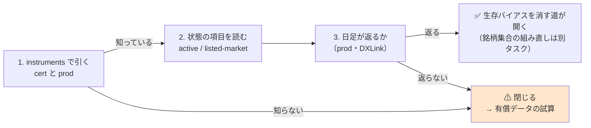
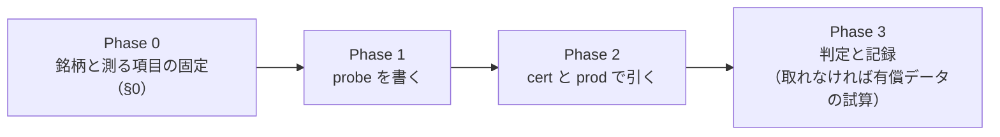

# 段 4: 上場廃止銘柄の日足が取れるか確かめる

親タスク: 「銘柄集合を広げる」の子「段 4」
利用者の指示（2026-09-15）: **今着手できるものを全て順番にやって**
⚠ **これは「API の挙動」なので [CLAUDE.md](../../../CLAUDE.md) の 2026-09-05 の例外に当たり、実測してよい**（読み取りだけ・金銭は発生しない）。
関連: [universe-widening.md](../../specs/experiments/universe-widening.md) ／ [midcap-targets.md §5](../../specs/experiments/midcap-targets.md)（生存バイアスは us63 より深い）

---

## 0. 目的と背景

⚠ **生存バイアスは、この基盤で消せていない唯一の構造的な穴である。** 銘柄集合はどれも ⚠ **「いま上場している銘柄」を過去に当てはめたもの**で、
⚠ **当時存在して消えた会社は 1 本も入っていない**（[rules.md 12 章 限界 1](../../specs/experiments/feature-discovery/rules.md)）。

⚠ **消せる道は 1 つだけ**: ⚠ **上場廃止になった銘柄の日足が手に入るかどうか。** 手に入るなら銘柄集合を「当時の構成」で組み直せる。
⚠ **手に入らないなら、有償の point-in-time データの試算に切り替える**（⚠ **金銭が発生するので提案と試算で止める**）。

⚠ **確かめるのは安い**: tastytrade の instruments で廃止銘柄を引くだけ。⚠ **見込みは「取れない」**（broker の配信は上場中の銘柄だけ、という【推測】）。

### 0-1. ⚠ 引く銘柄を先に固定する（結果を見てから足さない）

⚠ **「取れた銘柄だけ」を後から並べると、取れる確率を過大に見せることになる。** ⚠ **だから回す前に 8 本を決める。**

| 銘柄 | 種別 | 上場廃止（またはその事由） | 出典 |
| --- | --- | --- | --- |
| **TWTR** | 廃止（買収・非公開化） | NYSE 上場廃止 **2022-11-08**（Musk による買収の完了は 2022-10-27） | [SEC 8-K](https://www.sec.gov/Archives/edgar/data/1418091/000119312522244289/d403306dex991.htm)【公表値・取得 2026-09-15】 |
| **ATVI** | 廃止（買収） | Nasdaq 上場廃止 **2023-10-13**（Microsoft の買収完了） | [Nasdaq Trader ECA2023-588](https://nasdaqtrader.com/TraderNews.aspx?id=ECA2023-588)【公表値・同】 |
| **SIVB** | 廃止（破綻） | FDIC 管財人・S&P 500 から **2023-03-15** 除外 | [S&P Global](https://press.spglobal.com/2023-03-10-Insulet-Set-to-Join-S-P-500)【公表値・同】 |
| **FRC** | 廃止（破綻） | FDIC 管財人（2023-05） | 同上の系列【推測】（日付は probe の結論に影響しない） |
| **XLNX** | 廃止（買収） | AMD が買収（2022-02） | 【推測】 |
| **CERN** | 廃止（買収） | Oracle が買収（2022-06） | 【推測】 |
| **AAPL** | ⚠ **対照（上場中）** | — | ⚠ **「API が生きていること」を確かめるための対照** |
| **SPY** | ⚠ **対照（上場中・ETF）** | — | 同上 |

⚠ **日付は文脈であって測定対象ではない。** ⚠ **測るのは「API が何を返すか」だけ。**

### 0-2. ⚠ 何を測るか（回す前に決める）

| # | 問い | 見る場所 |
| ---: | --- | --- |
| 1 | ⚠ **instruments はその銘柄を知っているか** | `GET /instruments/equities/{symbol}` の HTTP 状態と `error.code` |
| 2 | 知っているなら ⚠ **「もう取引できない」と分かる形か** | 応答の項目（`active`・`is-illiquid`・`listed-market` など。⚠ **名前は実測で確かめる**。公式リファレンスは項目名を載せていない【実測 2026-09-15】） |
| 3 | ⚠ **日足（ヒストリカル）が取れるか** | ⚠ **これが本題。** 既存の取得経路（`cli/fetch.py` が使う DXLink のろうそく足）で、廃止銘柄の過去の足が返るか |
| 4 | cert（sandbox）と prod で違うか | 両方で 1 と 2 を引く（⚠ **cert は相場データを配信しない**ので 3 は prod だけ） |
| 5 | ⚠ **レート制限に触れないか** | 8 銘柄 × 2 環境なので 16 回。⚠ **60 回/分は 2026-09-08 に実測で問題なし** |

⚠ **判定**: ⚠ **3 が「取れる」でなければ、この道は閉じる**（1・2 が取れても、価格が無ければ検証には使えない）。

### 0-3. ⚠ やらないこと

| やらないこと | 理由 |
| --- | --- |
| ⚠ **発注系に触れる** | 読み取りだけ。⚠ **`sample.py` の本番ガードは触らない** |
| ⚠ **有償データの契約・申し込み** | ⚠ **金銭が発生する行動は提案と試算で止める**（CLAUDE.md） |
| 廃止銘柄を銘柄集合に足して回す | ⚠ **取れると分かってから**。取れたとしても別タスク（銘柄集合の組み直しは規則から書き直す必要がある） |

---

## 1. 対応方針

> この図の主張: ⚠ **3 段階で、前の段が通らなければ次に進まない。**

| 部品 | 中身 |
| --- | --- |
| `experiments/tastytrade-api-sample/delisted_probe.py`（新規） | 8 銘柄 × cert/prod で instruments を引き、prod で日足も引く。⚠ **記録は既存の `record.py` に通す**（トークンと口座番号をマスク） |
| 記録 | `docs/specs/experiments/universe-delisted.md`（新規） |

---

## 2. 影響範囲

| 触るもの | 中身 |
| --- | --- |
| `experiments/tastytrade-api-sample/delisted_probe.py` | **新規**（読み取りだけ） |
| `docs/specs/experiments/universe-delisted.md` | **新規**。記録 |
| `TODO.md` ／ `DONE.md` | 段 4 の扱い |

| ⚠ 触らないもの | 理由 |
| --- | --- |
| `sample.py` ・ `ttclient.py` ・ 本番ガード | ⚠ **発注の経路には 1 行も触れない** |
| `experiments/feature-discovery/` | この段では銘柄集合を変えない |

---

## 3. Phase 構成

---

## 4. 検算

| # | 検算 | ⚠ 落ちたら |
| ---: | --- | --- |
| 1 | ⚠ **対照（AAPL・SPY）が両環境で引ける** | API か資格情報の問題であって、廃止銘柄の話ではない |
| 2 | ⚠ **記録にトークン・口座番号が出ていない** | `record.py` のマスクを通していない |
| 3 | 引いた回数が 16 回前後（レート制限の内側） | 無駄に叩いている |
| 4 | ⚠ **結論が「取れない」でも、応答の中身をそのまま残す** | 後から読み直せない |

---

## 5. 費用の見積り【推測】

| 項目 | 見込み |
| --- | --- |
| probe の実装 | 30 分 |
| 実行 | 1 分（16 リクエスト） |
| 記録と判定（取れない場合の有償データの試算を含む） | 1 時間 |

⚠ **金銭は発生しない**（読み取りだけ）。

---

## 6. ⚠ 先に書く失敗モードと限界

| # | 起こりうること | ⚠ そのときどうするか |
| ---: | --- | --- |
| 1 | ⚠ **prod の資格情報が期限切れ** | refresh token から取り直す（`sample.py` と同じ経路）。⚠ **失敗を繰り返すと IP が約 8 時間ブロックされる**ので再試行しない |
| 2 | ⚠ **廃止銘柄のティッカーが別の会社に再利用されている** | ⚠ **「取れた」と読まない。** 応答の会社名・CUSIP・上場市場を必ず記録して突き合わせる |
| 3 | ⚠ **日足は返るが期間が短い**（廃止の直前だけ） | ⚠ **「取れる」とは言わない。** 何年ぶん返ったかを記録する |
| 4 | cert だけで判断してしまう | ⚠ **cert は相場データを配信しない。** 日足は prod でしか測れない |

⚠ **限界**: (a) ⚠ **1 社（tastytrade）の挙動しか測っていない** — 他社で取れる可能性は残る（[trading-fee-comparison.md](../../specs/trading-fee-comparison.md) の比較対象は 2026-09-04 に外した）／
(b) 8 銘柄しか引かない ／ (c) ⚠ **取れても「当時の構成銘柄の一覧」は別の問題**（S&P 500 の過去の構成は有償データか手作業）。

---

## 7. 完了条件

1. `delisted_probe.py` が動き、記録（マスク済み）が `out/` に残っている
2. `docs/specs/experiments/universe-delisted.md` に 8 銘柄の応答と判定が載っている
3. ⚠ **「取れない」なら、有償データ（point-in-time）の選択肢と概算費用を試算として書く**（⚠ **契約はしない**）
4. TODO の「段 4」を閉じ、⚠ **生存バイアスの限界に「確かめた結果」を書き足す**
