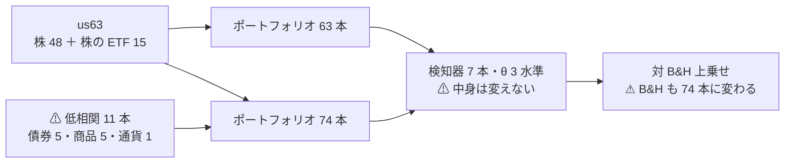

# 段 1: 低相関の 11 本を売買の対象に加える

- 親タスク: `TODO.md`「銘柄集合を広げる」→「段 1」
- 検討: [universe-widening.md §8](../../specs/experiments/universe-widening.md)
- 記録の置き場: [universe-lowcorr-trade.md](../../specs/experiments/universe-lowcorr-trade.md)
- 利用者の決定（2026-09-12）: **(a) 売買する**（入力にだけ使う (b) ではない）

## 0. 目的

⚠ **株どうしは相関するので、株を何本足しても実効系列数は 8.35 本で頭打ちになる**（[§7-1](../../specs/experiments/daily-data-sources.md)）。
⚠ **伸ばせるのは相関の低いものを入れたときだけ。** 取得済みの債券・商品・通貨 ETF 11 本を ⚠ **売買の対象に加える。**

> この図の主張: ⚠ **足すのは「当てる材料」ではなく「売買する対象」である。** 判断の仕方は 1 つも変えない。

## 1. ⚠ 何を測るのか — 「t が上がるはず」ではない

⚠ **§8-0 の通り、t ×1.170 は「足した 11 本でも同じだけ効く」ことに賭けた上限である。**
⚠ **効かなければ t は ×0.95 と下がる。** ⚠ **だから測るのは「11 本で効くかどうか」であって、伸びの確認ではない。**

| 出す量 | 何が分かるか |
| --- | --- |
| 74 本での対 B&H 上乗せ | 全体の判定（13-7） |
| ⚠ **銘柄別 bp を 63 本 / 11 本に分けた内訳** | ⚠ **足した 11 本で効いたのか、株の分を薄めただけか** |
| 実効系列数（`checks.json`） | 実際に 6.62 → 9 付近まで伸びたか |
| 既存 `trend_scales_1995`（63 本）との対 | ⚠ **橋渡し対**（13-8）。⚠ **数字を直接比べず、並べて読む** |

## 2. ⚠ 事前に分かっている限界

| # | 限界 | ⚠ 効き方 |
| ---: | --- | --- |
| 1 | ⚠ **11 本の開始は 2002-07 〜 2007-04**【実測 2026-09-12】。⚠ **検証の始まり 2000-09-08 には 1 本も無い** | ⚠ **fold 1 はほぼ 63 本のまま。** 効果が出るのは fold 2 以降。⚠ **fold ごとに実際の本数を記録する** |
| 2 | ⚠ **B&H が「株の籠」から「株 ＋ 債券 ＋ 商品の籠」に変わる** | ⚠ **問いが変わる。** 13-8 の橋渡し対として読む |
| 3 | ⚠ **UNG・USO・DBC は回転が小さく片道 2.5bp が疑わしい**【推測】 | ⚠ **除かずに入れ、銘柄別 bp で個別に見る**（除くと選別になる） |
| 4 | ⚠ **銘柄集合は試行の次元**（11 章 規約 4） | ⚠ **21 試行が増える**（7 検知器 × 3 閾値） |
| 5 | 生存バイアス（12-1） | ⚠ **ETF も 2026 年に存在するものから選んでいる。** 消えた ETF は入っていない |

## 3. Phase

### Phase 0: 設計決定 ✅（本プランで確定）

| 決めごと | 決めた内容 | ⚠ 理由 |
| --- | --- | --- |
| 広げる相手の実験 | **`trend_scales_1995`** | ⚠ **いまの最前線であり、橋渡し対の相手が既にある**（再実行が要らない） |
| 本数 | **11 本**（GDX を含めない） | ⚠ **資産クラスで線を引く**（[§7-4](../../specs/experiments/daily-data-sources.md)）。⚠ **測った相関で選ばない** |
| universe の名前 | `us74`（us63 ＋ 低相関 11） | — |
| 群 | 既存の `etf` / `company` に加え **`lowcorr`** を新設 | ⚠ **後から内訳を分けて読むため** |
| 対象 | `targets = "all"`（74 本すべて売買する） | ⚠ **(a) の意味そのもの** |
| 変えないもの | 層・スケール・検知器・θ・形式・種・パージ・コスト | ⚠ **動かす軸を銘柄集合だけにする** |

### Phase 1: 設定を書く

- `config/universe/us74.toml`（⚠ **既存 2 ファイルは書き換えない。新規に 1 つ**）
- `config/dataset/daily74.toml`（`universe = "us74"`・他は `daily.toml` と同一）
- `config/experiment/trend_scales_1995_us74.toml`（⚠ **`trend_scales_1995.toml` から `dataset` だけを変える**）

### Phase 2: 表を作る

- `cli.build` で本番と `--leak` の 2 本
- ⚠ **検算**: 行数・銘柄数・期間・fold ごとの銘柄数を記録する

### Phase 3: 回す

- 本番と leak 対照の 2 実行（⚠ **leak が跳ねなければ配線を疑う**・7 章 規約 7）

### Phase 4: 記録と台帳

- 記録を書き、⚠ **台帳を再生成して n_trials を確認**（160 → 181 の見込み）
- ⚠ **既存 160 行が 1 行も変わらないことを検算する**

## 4. テスト方針

| 何を確かめるか |
| --- |
| ⚠ **既存の `us63` を使う実行の結果が 1 つも変わらないこと**（新規ファイルしか足していないので、変わったら配線の事故） |
| feature-discovery のテストが通ること |
| ⚠ **leak 対照が跳ねること** |
| ⚠ **fold 1 の銘柄数が 63 付近・fold 5 が 74 であること**（11 本の開始日と整合するか） |

## 5. 影響範囲

| 触る | 触らない |
| --- | --- |
| `config/universe/us74.toml`（新規）／ `config/dataset/daily74.toml`（新規）／ `config/experiment/trend_scales_1995_us74.toml`（新規）／ `runs/`（新規 2 本）／ 記録・台帳 | ⚠ **コード（`ail/` `cli/`）／ 既存の config ／ 既存の `runs/` ／ `raw/` `adjusted/`** |
