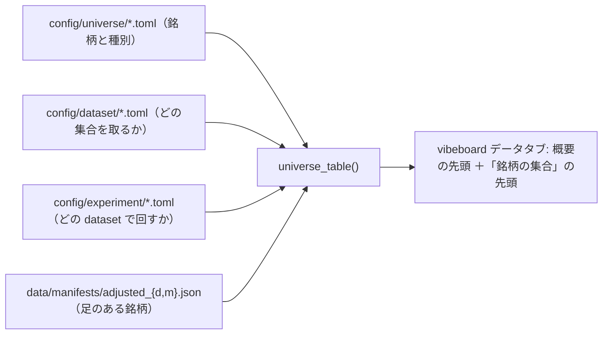

# 予想に使える銘柄集合の一覧表を vibeboard のデータタブの先頭に出す

2026-09-18。利用者の指示（2026-09-17）「予想に使える銘柄集合の一覧表を vibeboard の見やすい場所に出す」。着手は「そっちで進められるのをやって」（2026-09-18）。

## 1. 目的・背景

「いま予想に使える銘柄は何本あるか」を聞かれるたびに、`config/universe/*.toml` と `data/adjusted/d/` を手で数えていた（TODO の「136 本」【実測 2026-09-17】も手の集計）。データタブには「銘柄の集合」の節があるが、集合ごとの説明と銘柄名の折りたたみだけで、**集合を横に比べる表・足の有無・重複を除いた合計が無い**。

## 2. 対応方針

**主張: 表は 4 つの正本を写して組む。画面は数え直さない・手で書かない。**

- **置き場（着手時に決めた）**: データタブの**概要の先頭**（タブを開いて最初に見える）と「銘柄の集合」の節の先頭。TODO の 2 案のうち、データの話なのでデータタブにした（検証タブは実行の一覧で、集合の在庫とは軸が違う）
- 列: 集合 ／ 売買の対象（`ail.config.symbols_of` と同じ ＝ `etf` ＋ `company`）と内訳 ／ その他のグループ（`equity_like`・材料 `inputs_*`）／ 日足あり ／ 1 分足あり ／ データセット ／ 実験の設定 ／ 選定日
- 最後の行: **重複を除いた合計**（全集合の全グループ ＋ 材料の和集合）と、そのうち足のある本数
- ⚠ **足の有無は manifest（調整後）の銘柄名と突き合わせる**（CSV を開かない・ディレクトリを数えない。データタブの原則「manifest の写し」）
- ⚠ **増やしたら表が自動で更新される**: universe の toml を足す → 行が増える ／ 足を取る → manifest が増えて「足あり」が増える
- 組むのは `dashboard/app/inventory.py`（vibetab が import する。⚠ 「外すと決めた 11 行」でも `inventory.py` は残すもの）。画面は `dashboard/vibetab.py`

## 3. 影響範囲

- `dashboard/app/inventory.py`（`load_universes` に材料のキー・`load_experiment_datasets`・`universe_table`）
- `dashboard/vibetab.py`（概要と「銘柄の集合」に表）
- `dashboard/tests/test_inventory.py`・`test_vibetab.py`
- `docs/specs/dashboard.md` §11（データの画面）
- ⚠ 管理画面の `/data`（左ペインから外した。消す予定）には足さない

## 4. テスト方針

| 何を固定するか |
|---|
| 売買の対象 ＝ `etf` ＋ `company`（`equity_like`・材料は対象に数えない） |
| 足あり ＝ manifest の銘柄名との突き合わせ（`BRK/B` のような名前もそのまま） |
| 重複を除いた合計（同じ銘柄が複数の集合にあっても 1 本） |
| データセット・実験の設定の本数は config の写し |
| 画面に表が出る（概要の先頭） |

確認は実データでも行う: 和集合 136・日足あり 136・1 分足あり 63 になるはず（TODO の【実測 2026-09-17】と一致するか）。
