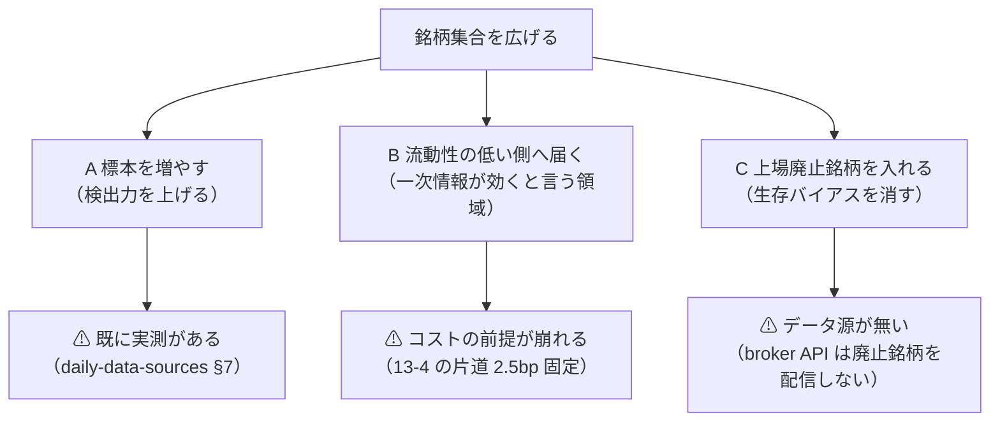

# 銘柄集合をどこまで広げられるか（検討）

- 親タスク: `TODO.md`「銘柄集合を広げる」
- 記録: [universe-widening.md](../../specs/experiments/universe-widening.md)
- 利用者の指示（2026-09-12）: **「時価総額上位 63 本、最も流動性が高い」も変更します。どれくらいの幅まで広げられるか検討して**

## 0. なぜ広げたいのか — ⚠ 目的を 3 つに分ける

⚠ **「広げる」には目的の違う 3 つが混ざっている。** ⚠ **分けないと、効かない広げ方に手間を掛けることになる。**

## 1. 調べること

| # | 問い | 答え方 |
| ---: | --- | --- |
| 1 | 広げると検出力はどれだけ上がるか | ⚠ **既存の実測**（[daily-data-sources §7](../../specs/experiments/daily-data-sources.md)）を引く。新しい測定はしない |
| 2 | 取得の上限はどこか | `ail/data/sources/tastytrade.py` と `config/dataset/daily.toml` を読む |
| 3 | 広げると何の規約が壊れるか | ⚠ **コスト（13-4）・銘柄集合の数え方（11 章 規約 4）・橋渡し対（13-8）** |
| 4 | 手作業はどれだけ増えるか | ⚠ **分割調整の「要確認」**（63 銘柄で 12 件）の外挿 |
| 5 | どこまで広げるか | 段階に分けて、段ごとに ⚠ **要る規約変更**を書く |

## 2. 影響範囲

| 段 | 触る | 触らない |
| --- | --- | --- |
| この検討 | ⚠ **文書だけ** | ⚠ **コード・`runs/`・台帳・`raw/`。新しい取得も新しい試行もしない** |

## 3. テスト方針

⚠ **コードを触らないのでテストは無い。** 引用した数字が保存済みの記録・設定と一致することを確かめる。
