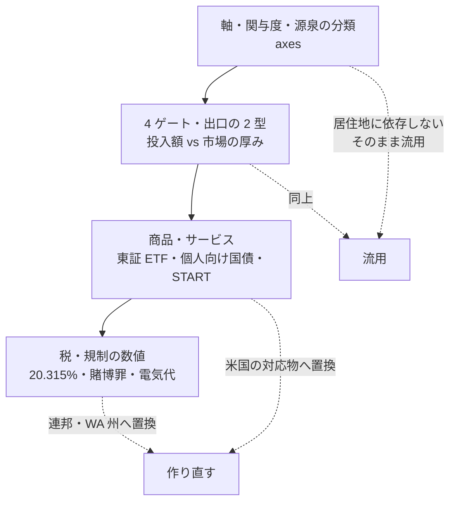

# 前提の見直し — 米国居住前提へ（調査・改訂プラン）

起票: 2026-08-28（[TODO.md](../../../TODO.md)「前提の見直し」）

## 目的と背景

体系の前提条件に**税務上の居住地が入っていなかった**。
[shortlist.md「前提条件の確定」](../../specs/income-taxonomy/shortlist.md) の表は元手・投下時間・回収期間・既存スキルの 4 項目だけで、
それにもかかわらず `docs/specs/experiments/` の 5 件はすべて暗黙に日本居住で書かれている。

正しい前提は **米国居住者（ワシントン州シアトル）が扱えるか**。この差は数値の換算ではなく、**結論の向きを変える**。

- 日本: 上場株の配当・譲渡益は一律 20.315% の申告分離。REIT も株式 ETF も同率
- 米国: 適格配当は 0/15/20%＋NIIT、REIT 分配は原則**非適格**（通常所得）。**「J-REIT が 1.9 倍有利」の根拠が消える**
- 日本: 予測市場は ⚠ 賭博罪、暗号資産は総合課税で最大約 55% → **どちらも米国では反転しうる**
- 日本: 電気代 40.49 円/kWh が I8 打ち切りの主要入力 → **シアトルは全米最安水準で、打ち切り判定が動きうる**

## 確定した前提（2026-08-28、ユーザー確認済み）

| 項目 | 確定値 | 影響先 |
| --- | --- | --- |
| 税務上の居住地 | **米国・ワシントン州シアトル** | 全ファイル |
| 通貨 | **USD で定義し直す**（axes の資本区分ごと） | axes・catalog・shortlist・experiments |
| 日本側の口座・資産 | 口座はあるが不使用・少額 | 一般則＋⚠ PFIC の注記のみ。個別事情には踏み込まない |
| 試算に使う所得階層 | **中位・上位の 2 ケース併記** | 税引後試算のすべて |

**州の選択が効く 3 箇所**（この前提でなければ結論が変わる場所）:

1. 州所得税 0%（WA） → E1・E2 の税引後が連邦＋NIIT だけで決まる
2. ⚠ **WA 独自のキャピタルゲイン税** → E8 に直撃する。連邦とは別枠で要確認
3. Seattle City Light の電気料金 → I8 の再判定の主要入力

## 対応方針

**枠組みは流用し、数値と出典を作り直す。** 横断調査の 4 ゲート・出口の 2 型（板型／買取保証型）・
「投入額 vs 市場の厚み」の判定方法は居住地に依存しないため、そのまま使う。

この図の主張: 作り直すのは 4 層のうち下 2 層だけで、上 2 層（軸と判定方法）は居住地に依存しない。

## Phase 構成

### Phase 1: 前提条件と通貨の確定

- shortlist の「前提条件の確定」表に **居住地 = 米国（WA 州シアトル）** を追加する
- axes の必要資本の区分を USD で定義し直す。確定セグメント「資金 大」も USD 表記へ
- 旧・円建て区分との対応を 1 行残す（過去の記述を読むときの換算表）

**影響範囲**: `axes.md`、`shortlist.md`

### Phase 2: 横断調査を米国基準で作り直す

`docs/specs/online-tradable-assets.md` を**米国基準で全面改訂する**（ファイル名・リンク先は維持）。
旧版（日本居住前提）の結論との差分を節として残し、**どの結論が反転したか**を追える形にする。

| Step | 内容 |
| --- | --- |
| 2-1 | ゲート 4 を「米国居住者が口座を開き USD で受け取れるか」へ置換 |
| 2-2 | ⚠ 逆向きの確認: 米国居住者が日本の証券口座を維持できるか（一般則＋ PFIC） |
| 2-3 | 商品を米国の対応物へ置換（高配当 ETF・US REIT・国債・I Bonds・金 ETF・債券 ETF） |
| 2-4 | 税務の組み直し。`(1 − 0.20315)` は使えない。適格／非適格配当・保有期間・NIIT・⚠ WA キャピタルゲイン税・§199A |
| 2-5 | ⚠ **予測市場（Kalshi・Polymarket）と暗号資産を母集団へ戻して再判定**。落選理由が両方とも日本固有 |
| 2-6 | 税優遇枠を NISA から **IRA / 401(k) / HSA** へ置換して手取りを見る |
| 2-7 | Phase 4 の順位を組み直す。**REIT が 1 位から落ちるかを確認する** |

**影響範囲**: `docs/specs/online-tradable-assets.md`

### Phase 3: 既存 experiments の日本依存の洗い出しと再判定

| 優先 | 対象 | 再判定の理由 | 想定される動き |
| --- | --- | --- | --- |
| 1 | **D7** | 唯一の残存候補。最大リスクが「日本語話者の実例ゼロ」だった | 米国居住・英語話者なら**懸念そのものが消える**。成立側へ動く可能性が高い |
| 2 | **I8** | 電気代 40.49 円/kWh が回収計算の主要入力 | シアトルは全米最安水準。打ち切り判定が動きうる |
| 3 | I7 / B14 | 時給・案件が日本在住・日本語ネイティブ前提 | 米国は案件数・時給とも上振れ見込み |
| 4 | C4/C5 | 日本依存が薄い（13 箇所） | 再判定不要の見込み。確認して結論を残す |

**影響範囲**: `experiments/` の 4 ファイル（追記形式。既存の判定は消さず、米国前提での再判定を節として足す）

### Phase 4: 体系側の日本前提を直す

- catalog の日本法令 14 箇所（宅建業免許・古物商・貸金業法・農地法・FIT/FIP ほか）を米国の対応規制へ置換
- catalog の E1・E2・E8 備考にある日本銘柄（J-REIT・個人向け国債・1540）を米国の対応物へ差し替え
- shortlist の「時間を使わない枠」の追記を米国基準へ
- overview の記述（ファイル早見表・現在地）を更新

**影響範囲**: `catalog.md`、`shortlist.md`、`overview.md`、`income-taxonomy.md`

## テスト方針

コードが無いため、検証は次の 3 点で行う。

| 観点 | 方法 |
| --- | --- |
| 出典の実在 | 【公表値】には URL と取得日を併記する。IRS・SEC・WA DOR・Treasury など**一次情報を優先**し、取れないものは【推測】へ落とす |
| 日本前提の残存 | 改訂後に `grep` で「円」「20.315」「東証」「NISA」「日本」を全ファイル走査し、意図的に残したもの以外がゼロであることを確認する |
| 本文と図の整合 | CLAUDE.md の図の原則に従い、結論が変わった箇所は図も直す（本文が正） |

## リスク・留意点

- ⚠ 税務の記述は一般的な制度の説明にとどめ、個別の税務助言は行わない。数値は【公表値】の税率と【推測】の試算に分けて書く
- ⚠ 金融商品の推奨は行わない。「その手法が成立するか」の判定として書く
- 旧版の結論を消さない。**反転した結論は「何が前提だったから反転したか」を残す**（これ自体が体系への知見）
