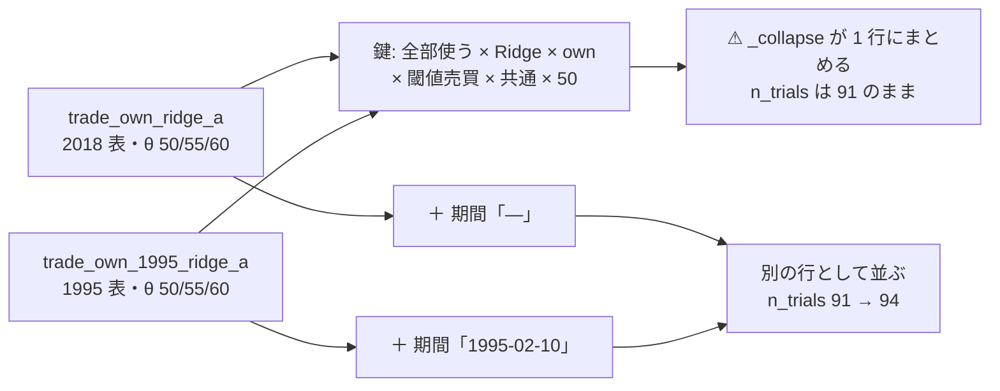
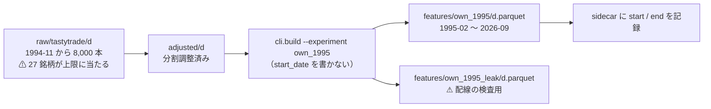

# 検証期間の延長（1995 表の構築と橋渡し対）

作成 2026-09-11。派生元: TODO「検証方式の改善の反映と実装」の子タスク（残り 1 件）。
検討記録: [validation-power.md §3-3](../../specs/experiments/feature-discovery/validation-power.md)（試算と採否）／ 規約: [rules.md 14-4](../../specs/experiments/feature-discovery/rules.md)（正本）・[12 章](../../specs/experiments/feature-discovery/rules.md)（既知の限界。生存バイアスの追記先）・[13-8](../../specs/experiments/feature-discovery/rules.md)（橋渡しの形）。

## 目的・背景

物差しの改善 3 方向のうち、**標本そのものが増えるのは期間延長だけ**（validation-power.md §6-1）。
検出限界は σ/√L に比例するので、検証日数が 1,801 → 約 6,750 日になれば **÷1.94**。下げ相場の回数も 2〜3 回 → 8 回程度になる【推測】。

⚠ **raw の日足は 1994-11 から 8,000 本取得済みで、再取得は不要**（1 購読 8,000 本の上限 = 日足で約 32 年。12 章 限界 3）。やることは features の表を前へ引き直すことだけである。

| 本タスクの成果物 | 中身 |
| --- | --- |
| 1995 表 | `config/experiment/own_1995.toml` ＋ `data/features/own_1995/d.parquet`（＋ `_leak`） |
| 橋渡し対 | 同じ手法 × モデル（**全部使う × Ridge × (A) 共通**）を 2018 表と 1995 表の両方で回した 1 組（13-8 と同じ形） |
| 12 章の追記 | ⚠ **生存バイアスは深くなる**・パネルが痩せる・分割調整の「要確認」が古い期間に偏る |

## ⚠ 先に固めておく設計決定（走り出す前に書く）

| # | 決定 | 理由 |
| ---: | --- | --- |
| 1 | 1995 表は **`own` 層だけ**。`ex` は 2018 年から・`rel_sec_*` はセクター ETF が 1998-12 からで、混ぜると期間が切り戻る | 延長の目的（日数を増やす）と衝突する。橋渡しの相手 `own_2018` とも層が揃う |
| 2 | **開始日は手で選ばない**（`start_date` を書かない）。`own_` の 60 本の助走が終わった最初の日が自動的に開始になる | ⚠ 手で選んだ日付は 1 つずつが自由度（14-9 の向き）。表の実際の開始は sidecar に記録する |
| 3 | 橋渡しは **`trade_own_ridge_a`（2018 表・既存の実行）と `trade_own_1995_ridge_a`（1995 表・新規）の 1 組**。形式は (A) 共通だけ・θ は 3 水準のまま | 14-4 の「1 組」。(B) も回すと試行が倍になる。(A) × Ridge は検出限界（§3-1・§3-2）を計算した当の行なので、期間差が一番読みやすい |
| 4 | ⚠ **1995 側は `--ignore-gate` で回し、3 試行として数える**（n_trials 91 → 94） | 14-4 が橋渡し対を要求し、§3-3 が「延長表で回すのは新しい試行で数える」と明言している。門前でも回すと**先に決めてから**回すので、14-5 規律 3（後から回したら普通に数える）の形になり数え落としにならない |
| 5 | 台帳の鍵に **期間**を足す。値は**その実行が読んだ表の最古の日**で、⚠ **記録が無い実行は「—」**（後から埋めない） | 足さないと 1995 の行が 2018 の行と同じ鍵になり、`_collapse` が黙ってまとめて **n_trials が 94 にならない**（ledger の再現列に「2 実行・幅 N bp」と出るだけになる） |
| 6 | ⚠ **既存の行は 1 行も動かさない。** 既存の実行はすべて期間「—」に寄るので、鍵が割れない | 14 章「旧 91 試行は残す・再計算しない・判定の列も変えない」 |

⚠ **決定 5・6 で分かったことを先に書いておく（利用者の判断が要る別件）**: 期間を**記録のある実行にも遡って当てる**と、いま同じ鍵にまとまっている 26 行が割れて n_trials が 91 → 117 になる（`own_only_h1` の表は既に 1995-02 開始で、2018 表の実行と同じ鍵にまとまっている）。本タスクでは**遡らない**（決定 6）。遡るかは別途、利用者の裁定を仰ぐ。

> この図の主張: ⚠ **期間を鍵に入れないと、1995 の行は 2018 の行に飲まれて試行として数えられない。**

## 対応方針

### Phase 1: 1995 表の構築

> この図の主張: ⚠ **表は前へ伸びるが、早い期間ほど銘柄が減る。** 日数と銘柄数を同時に見る。

- `config/experiment/own_1995.toml`: `own_2018.toml` の写しから **`start_date` を落とすだけ**（dataset・horizon・cost_bp・feature_layers・targets・k・model・baselines・validation・features は同一）
- `python3 -m cli.build --experiment own_1995` と `--leak` の 2 本
- 表の実測を取る: 行数・銘柄数・開始日と終了日・**年ごとの銘柄数**・検証日数（fold に切ってから数える）・`date_edges` の 5 fold の境目

### Phase 2: 表の期間を記録に残す（`cli/build.py`・`cli/run.py`）

- `cli/build.py`: sidecar（`<表>.meta.json`）に **`start` / `end`**（表の最古・最新の日付）を足す
- `cli/run.py`: `inputs.json` に **`panel_start` / `panel_end`**（⚠ **その実行が実際に読んだ表**の最古・最新）を足す。自己申告ではなく読んだ表から取る
- ⚠ どちらも追加だけ。既存の鍵・既存の値は変えない

### Phase 3: 台帳の「期間」列（`ail/catalog.py`・`cli/ledger.py`）

- `_period_of(run)`: `inputs.panel_start` → 無ければ `inputs.features_meta.start` → どちらも無ければ **`"—"`**
  - ⚠ **config の `start_date` からは埋めない**（借り手の実行（`features_from`）には無く、現在の config を過去の実行に当てるのは自己申告になる）
- 行に `期間` を足し、`KEY` に加える（層の次）。legacy（旧配線の表）も `"—"`
- `cli/ledger.py`: §1 の列の説明と §2 の表に `期間` を足す。「—」の意味（記録より前の実行）を書く
- テスト: 期間の導出（3 経路）・鍵が期間で割れること・⚠ **既存の台帳が 91 試行・判定不変のまま**であること

### Phase 4: 橋渡し対を回す

- `config/experiment/trade_own_1995_ridge_a.toml`: `trade_own_ridge_a.toml` の写しで `features_from = "own_1995"` にするだけ
- `python3 -m cli.run --experiment trade_own_1995_ridge_a --ignore-gate`（決定 4）
- `--leak` も回す（13-10。⚠ **上乗せが跳ねなければ配線が壊れている**。leak の行は台帳に入らない ＝ 試行に数えない）
- 読むもの:

| 量 | 2018 表（既存） | 1995 表（新規） | 何が分かるか |
| --- | --- | --- | --- |
| 検証日数 | 1,801 | ? | §3-3 の ×3.7 の検算 |
| 日次上乗せの σ | 52.6bp/日 | ? | ⚠ **検出限界 ÷1.94 の前提**（σ が変わらなければ成立する） |
| B&H の純利 bp/fold | 1,652 | ? | レジーム級の物差しの目盛り |
| 対 B&H 上乗せ・fold の符号 | +12.79bp・1/5 | ? | 期間だけの差（13-8 の読み方） |
| 門の 2 指標 | AUC 0.4976・幅 0.0001 | ? | 期間を延ばしても確率に情報が無いか |

### Phase 5: 文書とテスト

- `rules.md` **12 章**: 生存バイアス（限界 1）へ 1995 表の追記 ／ 分割調整の「要確認」の偏り（限界 5）／ ⚠ **パネルが痩せる**を新しい限界として足す
- `rules.md` **14-4**: 試算を実測に差し替え、付録の実装対応表の「14-4 は後続」を実装済みに直す
- `validation-power.md` **§8-2**: 1995 表と橋渡し対の実測（§8-1 と同じ形。⚠ **§3-3 の試算と突き合わせる**）
- `ledger.md` を再生成（⚠ 手で書かない）。n_trials が 91 → 94 になることを確認
- `pytest -q tests` 全部

## 影響範囲

| 触るもの | 種類 |
| --- | --- |
| `config/experiment/own_1995.toml` ／ `trade_own_1995_ridge_a.toml` | 新規 |
| `cli/build.py` ／ `cli/run.py` | 記録の追加のみ |
| `ail/catalog.py` ／ `cli/ledger.py` | 期間の列（鍵に 1 列追加） |
| `tests/test_catalog.py` ／ `tests/test_invariants.py`(?) | 追加 |
| `docs/specs/experiments/feature-discovery/rules.md` ／ `validation-power.md` ／ `ledger.md` | 追記・再生成 |
| ⚠ `data/features/own_1995*` ／ `runs/*` | 生成物（git 管理外） |

⚠ **触らないもの**: 既存の `runs/`（記録は書き換えない。10 章）・既存の台帳の判定列・門の水準（14-5 で事前固定）・シミュレータと採否の物差し（13 章）。

## テスト方針

| # | 確かめること | やり方 |
| ---: | --- | --- |
| 1 | 1995 表が 1995 年から始まり、列が `own_2018` と完全に同じ | 表を読んで列の一致と日付範囲を検算 |
| 2 | ⚠ **既存の台帳が動かない** | 期間の列を足す前後で 91 試行・判定の内訳（採る 0・落とす 66・保留 25）が不変 |
| 3 | 期間の導出が 3 経路とも効く | 単体テスト（`panel_start` あり／ sidecar だけ／ どちらも無い） |
| 4 | 鍵が期間で割れる | 同じ鍵 ＋ 期間違いの 2 行が `_collapse` でまとまらない |
| 5 | ⚠ **1995 表でも leak が跳ねる** | `--leak` の実行で対 B&H 上乗せが跳ね、fold の符号が全部正 |
| 6 | 試行数が 94 になる | 台帳を再生成して n_trials を確認 |
