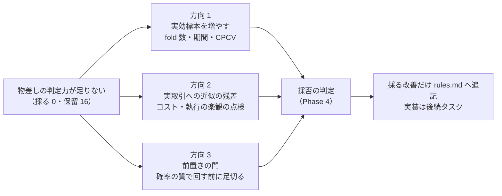
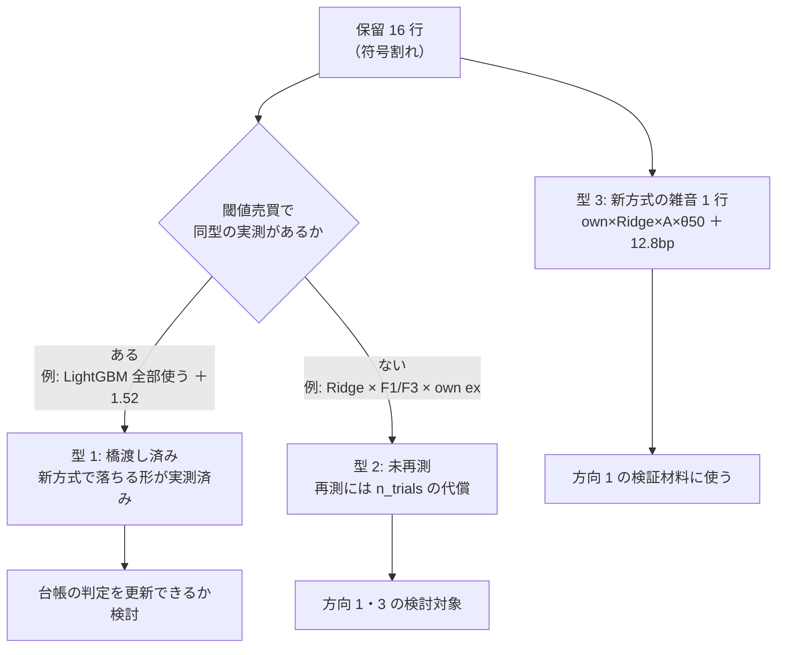
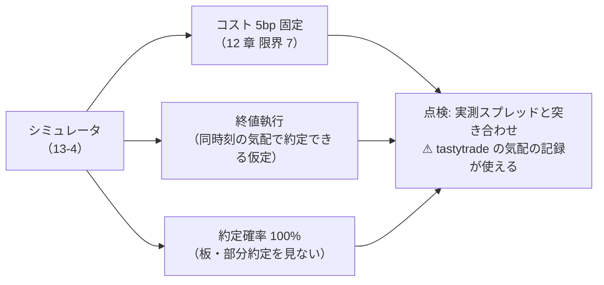
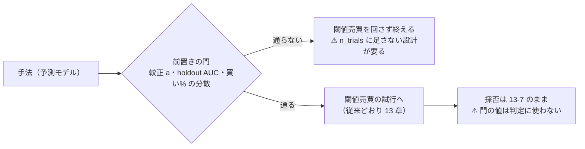
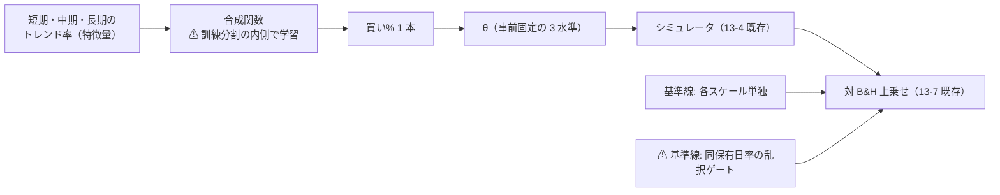

# 検証方式の検討（物差しの改善）

作成日: 2026-09-11 ／ ✅ **2026-09-11 完了**（成果物: [validation-power.md](../../specs/experiments/feature-discovery/validation-power.md)。後続は TODO「検証方式の改善の反映と実装」）。
派生元: [TODO「検証方式の検討」](../../../TODO.md)（2026-09-11 の方針「手法追加より先に物差しを整える」）。
規約: [rules.md](../../specs/experiments/feature-discovery/rules.md)（9・11・13 章）／ 台帳: [ledger.md](../../specs/experiments/feature-discovery/ledger.md)／ 直前の検証方式の記録: [threshold-trading.md](../../specs/experiments/threshold-trading.md)。

> ⚠ **本タスクは検討（設計と試算）であり、新しい試行は 1 つも回さない。**
> 判断材料はすべて既存 `runs/` の日次系列・`fitted/` の再集計から作る。**n_trials（現在 91）はこのタスクでは増えない。**

## 0. 目的・背景

台帳は **採る 0・保留 25 行**（無効・要再測 9 行 ＋「純利は正だが fold の符号が割れる」16 行）。
手法を足すほど n_trials が増えて DSR の基準が上がり、保留はさらに通りにくくなる。**先に物差し側を改善して、保留に白黒つけられる判定力を確保する**のが本タスクの目的。

⚠ **[threshold-trading.md §7](../../specs/experiments/threshold-trading.md) の「検証方式の軸はこれで閉じる」との整合**:
あれは「実取引への近似を上げると数字は良くなるか」という問いへの答え（ならない）である。
本タスクの問いは別で、**「今の物差しに、保留を白黒つける検出力があるか」**。近似の軸は閉じたまま、検出力の軸を検討する。

問題の核心は 2 つ。

| # | 問題 | 数字 |
| ---: | --- | --- |
| 1 | ⚠ **fold 5 本での符号判定は分解能が粗い。** 全部正でも p = 1/32 ≈ 3%、1 本割れたら即保留 | 保留 16 行の大半が符号 1〜3/5 で宙吊り |
| 2 | ⚠ **確率に情報が無い手法にも 24 試行（2 形式 × 3 閾値 × …）を払っている。** 較正の実測 a ≈ 0 は試行を回す前に分かる形をしていた | 閾値売買の追試 24 試行中 23 落とす（[threshold-trading.md §2](../../specs/experiments/threshold-trading.md)） |

> この図の主張: 検討する方向は 3 つで、**どれも「試行を増やさずに判定力を上げる（または無駄な試行を減らす）」向き**である。

## 1. 対応方針

- **検討の道具は既存 runs の再集計だけ。** 閾値売買 10 実行のポートフォリオ日次系列（fold 連結で約 1,800 日）と `fitted/calibration_f*.json` を読み直す。新しい fit・新しい試行はしない
- 3 方向を **「判定力への効き / n_trials への負担 / 実装の手間」** の 3 列で採点し、採るものだけ後続の実装タスクに切る
- ⚠ **判定力の物差し自体の検証には leak 対照と既知の雑音を使う**: 改善後の物差しが、leak（本物の信号）を採り、own × Ridge × (A) × θ=50 の＋12.8bp（t = 0.13 の雑音）を落とせるなら「効く」。どちらかを取り違えるなら「効かない」
- rules.md の制約を守る: 新方式は旧方式との橋渡しの対を作る（13-8）／ 検証方式・形式・閾値は処置で n_trials に数える（13-9）／ 水準は事前固定（13-3）／ 変更時は「なぜ変えたか・前の結果をどう扱うか」を先に書く（13 章冒頭の変更規約）

## 2. Phase 構成

| Phase | 内容 | 工数【推測】 | 新試行 |
| ---: | --- | --- | :-: |
| 0 | 論点の整理と保留 16 行の棚卸し | 0.5 日 | なし |
| 1 | 実効標本を増やす方向の試算（fold 数・期間・CPCV） | 1〜2 日 | なし |
| 2 | 実取引への近似の残差の点検（コスト・執行） | 0.5〜1 日 | なし |
| 3 | 前置きの門の設計（確率の質で足切り） | 1 日 | なし |
| 4 | 採否の判定・rules.md への反映・後続タスクの切り出し | 0.5 日 | なし |

### Phase 0: 論点の整理と保留 16 行の棚卸し

保留 16 行は一枚岩ではない。**新方式（閾値売買）で答えが出ている型か、未再測か**で分けてから、方向 1〜3 の検討対象を絞る。

> この図の主張: ⚠ **保留 16 行は 3 つの型に割れ、型ごとに出口が違う。**

- Step 0-1: 台帳から保留 16 行を抜き出し、上の 3 型に分類した表を作る（実行 ID・入力・モデル付き）
- Step 0-2: threshold-trading §7 との整合（§0 の 1 段落）を検討記録の冒頭に書く
- 出力: 棚卸し表（検討記録 `docs/specs/experiments/feature-discovery/validation-power.md` を新設して書く。⚠ 台帳は生成物なので手で触らない）

### Phase 1: 実効標本を増やす方向の試算

**fold 5 本の符号判定を、既存データのまま何本まで増やせるか**を机上で測る。処置（モデル・表・シミュレータ）は一切動かさない。

| 候補 | 中身 | ⚠ 論点 |
| --- | --- | --- |
| fold 数を増やす | 日付 edge を 5 → 10・15 に引き直す | 1 fold が短くなり、fold あたりの取引が減る。符号の分解能と引き換えに 1 本あたりの雑音は増える |
| 検証期間を前へ伸ばす | 現状の検証は 2019-07 以降。訓練の最小長を決めて、どこまで前から fold を取れるか | (B) 銘柄別は fold 1 で既に訓練 360 日/銘柄しかない（13-6 の 5）。伸ばせるのは (A) だけの可能性 |
| CPCV（組み合わせパージ CV） | fold の組み合わせで検証経路を増やし、符号の分布を取る | ⚠ **経路の選び方が「選べた自由度」にならないか**（11 章 規約 4 の向き）。実装の手間も最大 |
| 実効標本数の常時併記 | 相関行列の固有値から実効銘柄数を出す（12 章 限界 2） | 判定力は上がらないが、t の過大読みを防ぐ。手間は小さい |

- Step 1-1: 既存 10 実行のポートフォリオ日次系列を読み、summary.csv の fold 値を再現できることを検算する（⚠ 再集計の配線をまず疑う。11 章 規約 7）
- Step 1-2: 日付 edge を 10・15 本で引き直し、leak 対照と雑音 1 行（own × Ridge × (A) × θ=50）の符号・t・DSR を再計算する
- Step 1-3: 合否 — **leak が全符号正のまま・雑音が割れて落ちる**なら「効く」。leak の符号まで割れるなら fold が短すぎる
- ⚠ 注意: fold の引き直しは「検証方式の変更」に当たる。採る場合は 13-8 の橋渡し（同じ表・同じ処置で新旧 fold の対）と 13 章冒頭の変更規約が要る — これは Phase 4 で設計する

### Phase 2: 実取引への近似の残差の点検

⚠ **この方向は判定力を上げない**（threshold-trading の実測: 近似を上げても数字は良くならない）。目的は**楽観バイアスの残りを点検し、「採る候補が出たときの最終確認の門」として設計だけしておく**こと。

> この図の主張: 近似の残差は 3 か所にあり、⚠ **どれも「甘い方向」にしか効かない**（点検しないと採るときに楽観が残る）。

- Step 2-1: 対象 63 銘柄の実測スプレッド（tastytrade 本番気配の記録。`experiments/tastytrade-api-sample/out/`）と 5bp の仮定を突き合わせる。日足・大型株でどちら向きに外れているかだけ判定する
- Step 2-2: 終値執行 → 翌寄り執行に変えた場合の差を、既存系列で概算できるか検討する（⚠ 寄り付きデータの有無を先に確認。無ければ「できない」を結論として残す）
- 出力: 残差の一覧と「採る候補が出たときに通す最終確認」の設計（実装はしない）

### Phase 3: 前置きの門の設計（確率の質で足切る）

較正の実測（a ≈ 0 ＝ 予測と「上がるか」に単調関係が無い）は、**24 試行を回す前に分かる形をしていた**。
これを「前置きの門」として設計する — 通らない手法は閾値売買の試行を回さずに終える。⚠ **n_trials を増やさず減らす、唯一の方向**である。

> この図の主張: ⚠ **門は「回すかどうか」の足切りにだけ使い、採否の判定には使わない**（判定に混ぜると門自体が選べた自由度になる）。

- Step 3-1: 門の指標の候補（較正係数 a の大きさ・holdout の AUC・買い% の分散）を、既存 10 実行の `fitted/calibration_f*.json` から計算する
- Step 3-2: 門が **leak（通るべき）と本番 8 実行（通らないべき）を正しく分けるか**を確認する
- Step 3-3: ⚠ 論点を詰める — (1) 門を通らなかった手法は台帳にどう載せるか（「門前で落とす」の新判定?）。(2) 門の閾値の事前固定（結果を見て動かせない。13-3 の 4 と同じ向き）。(3) ⚠ **門で足切った手法を n_trials に数えるか**は多重検定の解釈に関わる — rules.md への追記案を作って利用者に判断を仰ぐ
- 出力: 門の設計案（指標・閾値・台帳の扱い・rules.md 追記案）

### Phase 4: 採否の判定と反映

- Step 4-1: 3 方向を「判定力への効き / n_trials への負担 / 実装の手間」で採点した表を検討記録に書き、採否を決める
- Step 4-2: 採る改善について、rules.md の変更規約の 2 問（なぜ変えたか・変える前の結果をどう扱うか）に答える追記案を書く（14 章として起案。⚠ 反映は利用者の確認後）
- Step 4-3: 保留 16 行の処遇を決める — (a) 新物差しで再測（増える n_trials を明記して提案）／ (b) 同型の実測で代表済みとして判定を更新（台帳の生成側で。手で書かない）／ (c) 判定不能のまま閉じる、のどれかを型ごとに選ぶ
- Step 4-4: 実装が要るものは TODO に後続タスクとして切り、本プランは `docs/plans/archive/` へ移す

## 3. 影響範囲

| 種別 | 対象 | 本タスクで触るか |
| --- | --- | :-: |
| 検討記録 | `docs/specs/experiments/feature-discovery/validation-power.md`（新設） | ⚠ **書く** |
| プラン | 本ファイル・`TODO.md` | 書く |
| 規約 | `rules.md`（14 章の追記案） | ⚠ **案まで。反映は利用者の確認後** |
| 台帳 | `ledger.md` | 触らない（生成物。処遇が決まったら生成側で） |
| コード | `ail/validation/`（splits・stats）・`ail/catalog.py` | ⚠ **触らない**（後続の実装タスクの範囲）。再集計の一時スクリプトはリポジトリに残さない（残す価値が出たら `cli/` か `tests/` に昇格を検討） |

## 4. テスト方針

- **検討段階（本タスク）**: 再集計の検算を最初に置く — 既存 `summary.csv` の fold 値・B&H の純利（own 1652.0 / ownex 1650.6bp）を再集計で再現できてから、fold の引き直しに進む（⚠ 数字が合わなければまず配線を疑う。11 章 規約 7）
- **物差しの検証**: leak 対照（採るべき）と雑音 1 行（落とすべき）を両方通す。片方だけで「効く」と言わない
- **実装段階（後続タスク）**: 旧 91 試行の不変テスト（13-9 の 2 と同じ形）／ 日付 edge の性質テスト／ leak の跳ねの維持、を後続プランに引き継ぐ

## 5. 追記（2026-09-11）— 下降トレンド検知の検証を受け止める要件

TODO「下降トレンドの検知の検証（長期・中期・短期）」（同日追加）は本タスクが整えた物差しの上で回す。
その議論で決まった要件を先に固定し、各 Phase に割り当てる。⚠ **要件を足しても本タスクは設計と試算のままで、新しい試行は回さない。**

> この図の主張: ⚠ **検証は「買い% 1 本」の後ろだけを見る。** スケールの組み合わせがモデルの中でどうなっていようが、物差しは変わらない。

| # | 要件 | ⚠ 理由 | 割り当て |
| ---: | --- | --- | --- |
| 1 | **出力の契約で検証を定義する**: 手法の出力は「銘柄 s・日 t のポジション（0/1 または買い%）を t までの情報だけで出す」の 1 点。検証はこの系列だけを受け取る | モデルの中身を知らずに検証を先に決められる。13 章が既にこの形 | Phase 4 の rules 追記案に「契約」として明文化 |
| 2 | **パージ・fold 長は最長のラベルスケールに合わせる**: 中期ラベル（例: 60 日先）を使うなら境界で 60 日落とす（9 章 規約 2）。fold は最長スケールより十分長く | 長いスケールほど境界で標本を食い、ラベルの重なりで実効標本も減る | Phase 1 の fold 設計・期間延長の検討項目に足す |
| 3 | **基準線を 2 種類足す**: (a) 各スケール単独（組み合わせは最良の単独に勝つこと。「全部使う」対 選別と同じ構図）／ (b) ⚠ **同じ保有日率の乱択ゲート**（同じ日数だけでたらめに休む） | (b) が「正しい日を休んだのか、ただ休んだだけか」を分離する。「θ が高いほど良い」の罠（13-10）と同型の罠を基準線が先回りして潰す | Phase 4 の rules 追記案（13-5 の拡張） |
| 4 | **エピソード表は成果物・採否に使わない**: 既知の下げ相場ごとに退出・再進入を並べる。⚠ 実効標本は日数ではなく下降エピソードの回数で、長期は 32 年でも 7〜8 回【推測】 | エピソードは少なすぎて検定に使えないが、「どこで効いたか」の診断には要る。銘柄別 bp（13-7）と同じ位置づけ | Phase 4（Phase 1 の期間延長が前提） |
| 5 | **数値は学習・構造だけ事前固定**: 「中期 10% × 短期 20% で買い」のような数値の組み合わせは事前固定せず、訓練分割の内側で学習させる（3 章 B。Platt の (a, b) と同じ扱いで `fitted/` に残す）。事前固定はスケールの定義・出力が買い% 1 本であること・θ の水準・試す構成の数だけ | 手で選んだ数値は 1 つずつが自由度で n_trials が膨らみ、結果を見て直せば検証データでの最適化になる | Phase 4 の rules 追記案（3 章 B の適用の明文化） |
