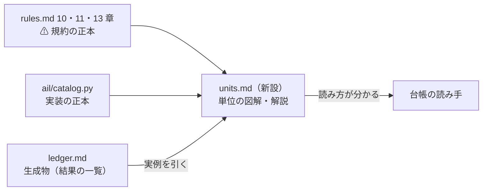
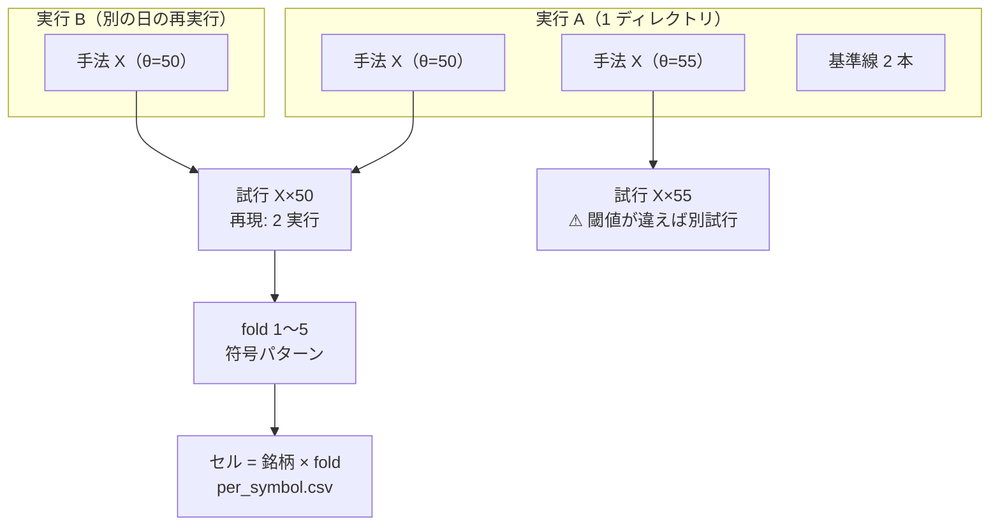

# 検証の単位の解説ページ（実行 → 手法 → 試行 → fold → セル）

作成日: 2026-09-10。利用者の指示（2026-09-10）: **実行 → 手法 → 試行 → fold → セルを図などを使い分かりやすく解説する specs のページを作成する**
関連: [rules.md](../specs/experiments/feature-discovery/rules.md)（10・11・13 章）／ [ledger.md](../specs/experiments/feature-discovery/ledger.md) ／ `ail/catalog.py` ／ [閾値つき売買のプラン](archive/trading-validation.md)

## 0. 目的・背景

台帳（ledger.md）は 166 行あり、「1 行 = 1 試行」の意味・実行と試行の対応・fold とセルの関係は、
[rules.md](../specs/experiments/feature-discovery/rules.md) の 10・11・13 章と `ail/catalog.py` の docstring に**分散して**書かれている。
初見の読み手（と数日後の自分）が台帳を読むには、単位の関係を 1 か所で図解したページが要る。

⚠ **ページは「解説」であり、規約の正本は動かさない。**

| 役割 | 正本 | ⚠ 注意 |
| --- | --- | --- |
| 規約（単位の定義・数え方） | [rules.md](../specs/experiments/feature-discovery/rules.md) 10・11・13 章 | ⚠ **本ページと食い違ったら rules.md が勝ち、ページを直す** |
| 実装（鍵・数え方・畳み込み） | `ail/catalog.py`（`KEY`・`is_trial`・`_collapse`・`canonical`） | 同上 |
| 結果の一覧 | [ledger.md](../specs/experiments/feature-discovery/ledger.md)（生成物） | ⚠ **手で書き換えない**（`cli/report.py --catalog` の出力） |

> この図の主張: 新ページは正本 2 つ（規約・実装）の**読み方を教える**だけで、定義はどちらにも足さない。



## 1. 成果物と置き場

- 新規ページ: `docs/specs/experiments/feature-discovery/units.md`（rules.md・ledger.md と同じディレクトリ）
- 1 ページ完結。規約の再掲は 1 行要約＋章番号リンクにとどめ、**図と実例**に紙面を使う

## 2. 解説する 5 つの単位（確認済みの正本との対応）

ページの背骨。⚠ **すべて 2026-09-10 にコード・記録で確認済み**の関係で、新しい定義は無い。

| 単位 | 実体 | 正本 |
| --- | --- | --- |
| **実行** | `runs/<時刻>_<実験名>/` の 1 ディレクトリ（config・inputs・env・summary・result・fitted・log） | rules.md §10 |
| **手法** | 実行の中の 1 行（`summary.csv`）。TOML の `selectors` ＋ `baselines` の 2 本（常に上・直前リターンの符号。`cli/run.py` が「基準 」を付けて測る） | rules.md §9・§10 |
| **試行** | 台帳の 1 行。鍵 = `catalog.KEY` の 9 列（鍵・モデル・粒度・地平・特徴量の層・層・検証方式・形式・閾値） | rules.md §11・§13-9 ／ `catalog.KEY` |
| **fold** | 試行の中のウォークフォワード分割（`result.csv` の 1 行 = 手法 × fold（× 閾値）。符号パターン「3/5 ＋−＋＋−」の元） | rules.md §9 ／ §11 規約 5 |
| **セル** | 銘柄 × fold（最小の集計単位。旧方式は全セルの単純平均、新方式は `per_symbol.csv` の行） | rules.md §13-4・§13-8 |

盛り込む関係（TODO の 2026-09-10 確認結果。ページの必須要素）:

1. **1 実行に複数の手法**: TOML の `selectors` ＋ 自動で付く基準線 2 本
2. **同じ鍵の手法が複数の実行にあれば 1 試行にまとめる**（`_collapse`）。「再現」列で本数と幅を出す
3. **鍵のどれかが違えば同じ手法名でも別試行**（モデル違い・層違い・閾値違いで行が割れる）
4. **leak 実行は別の表**（台帳 §5。本体に混ぜると台帳全体が嘘になる）
5. **13 章で鍵に足した 3 列**（検証方式・形式・閾値）: 旧実行は（毎日往復・共通・—）として読むので既存の行は割れない。⚠ **閾値は 1 水準 = 1 試行**（1 fit を 3 水準で使い回しても 3 つと数える）
6. **試行の下の量**（新方式）: 銘柄別 bp（成果物。⚠ 採否に使わない）とポートフォリオ日次純利（63 銘柄等加重。⚠ 採否はこれ。fold の符号は対 B&H の上乗せで見る）

> この図の主張: 5 つの単位は「入れ子」ではない。**実行 → 手法は入れ子だが、手法 → 試行は「複数の実行をまたいだ畳み込み」**である。ここが一番誤解されやすい。



## 3. ページの構成案

各節に最低 1 枚の図を置く（CLAUDE.md の図の原則: 1 図 1 主張・直前に主張 1 行・ノード 12 個以内・一覧は表）。

| 節 | 中身 | 図の主張（1 図 1 主張） |
| --- | --- | --- |
| §0 | この頁の位置づけ。正本は rules.md と catalog.py で、食い違ったら正本が勝つ | §0 の図（本プラン §0 の図を清書） |
| §1 | 全体図 — 5 つの単位と、どのファイルに実体があるか | 実行 → 手法 → 試行 → fold → セルの 1 枚図（本プラン §2 の図を清書） |
| §2 | 実行 — 1 実行 1 ディレクトリ。中身 7 点（rules §10 の表を要約）。⚠ leak 実行（`_leak`）は台帳の本体に入らず別の表 | 実行ディレクトリの中身と、summary.csv の行 = 手法、の対応 |
| §3 | 手法 → 試行の畳み込み — 同じ鍵は 1 行（再現列で幅）、鍵が 1 つでも違えば別試行。`canonical` の ID 照合（名前で照合すると同じ試行が 2 行に割れる） | 2 実行の同鍵手法が 1 行にまとまり、モデル違いが別行に割れる図 |
| §4 | 鍵の 9 列 — 2026-09-09 にモデル、2026-09-10 に検証方式・形式・閾値を追加。旧実行は既定値で読むので既存の行は割れない | 鍵 9 列の追加の年表（表で足りれば表にする） |
| §5 | 試行の数え方 — `is_trial` と n_trials。基準線は数えない・閾値 1 水準 1 試行・「全部使う × Ridge 以外」は数える。⚠ 数え落とすと DSR が必ず甘くなる | 台帳の行 → 数える / 数えないの分岐図 |
| §6 | fold — ウォークフォワード・パージ・エンバーゴ（rules §9 へのリンク中心）。符号パターンの読み方。⚠ 新方式では符号を純利ではなく対 B&H の上乗せで見る（13-7） | 符号パターン「3/5 ＋−＋＋−」が result.csv のどの行から出るかの図 |
| §7 | セルと試行の下の量 — 旧方式: 全セル単純平均 bp。新方式: 銘柄別 bp（成果物・採否に使わない）＋ ポートフォリオ日次純利（等加重・採否はこれ・標本数は検証日数） | セル → 2 通りの集計（銘柄別 / ポートフォリオ）の分岐図 |

実例の方針:

- ⚠ **架空の例を作らない。** 実在の台帳行・実行から引く。候補は 2026-09-10 の閾値売買 8 実行（`trade_own_lgbm_a` など）:
  - 「常に上（ドリフト）」が形式 × 閾値で 6 行に割れる実例（§3・§4 用。数値まで同一なのに行が割れる = 鍵で割れることの最良の見本）
  - 同鍵 2 実行が「2 実行・一致」とまとまる実例（再現列）
  - leak 実行（`_leak`）が §5 の別表に行く実例
- 引用する数字（n_trials = 91・台帳 166 行など）は【実測】とし、⚠ **台帳の生成日（2026-09-10）を併記する**（台帳が再生成されると変わる数字だと明示する）

## 4. 対応方針（書き方の原則）

| # | 原則 | 理由 |
| ---: | --- | --- |
| 1 | 規約はページで再定義しない。1 行要約 ＋ rules.md の章番号リンク | 正本を 2 つにしない（冒頭の変更規約に触れない） |
| 2 | 図は関係・流れだけ。一覧・属性は表 | CLAUDE.md の図の原則 |
| 3 | 実例は実在の実行・台帳行から引き、生成日を書く | §3 の実例の方針 |
| 4 | rules.md には**付録（本書と実装の対応）へのリンク 1 行だけ**足す。規約の本文は変えない | ⚠ rules.md の変更規約（なぜ変えたか・前の結果の扱い）を発動させない。リンク追加は規約の変更ではない旨を commit メッセージに書く |
| 5 | ledger.md へのリンクは `cli/report.py` の出力に足す（§1「台帳の読み方」の冒頭に 1 行）。⚠ **ledger.md を手で書かない** | ledger.md は生成物 |

## 5. 影響範囲

| 対象 | 変更 |
| --- | --- |
| `docs/specs/experiments/feature-discovery/units.md` | **新規**（本体） |
| `TODO.md` | プランへのリンクと子タスク（本プラン作成時に実施） |
| `docs/specs/experiments/feature-discovery/rules.md` | 付録にリンク 1 行（規約の本文は変えない） |
| `docs/specs/experiments/feature-discovery.md` | 冒頭の案内ブロックにリンク 1 行（ledger.md の案内の隣） |
| `experiments/feature-discovery/cli/report.py` | 台帳 §1 冒頭に units.md へのリンク 1 行を出力 → `ledger.md` 再生成 |
| 変えないもの | 規約の中身・`ail/catalog.py` のロジック・`runs/`・台帳の数字 |

## 6. テスト方針

| # | 検査 | 合格条件 |
| ---: | --- | --- |
| 1 | 図の原則 | 各図の直前に主張 1 行・ノード 12 個以内・` ```mermaid ` フェンス（vibeboard の mermaid@11 でレンダリングできる構文） |
| 2 | 鍵 9 列の突き合わせ | ページに書いた列名が `python -c "from ail import catalog; print(catalog.KEY)"` の出力と完全一致 |
| 3 | 引用数字 | n_trials・台帳の行数などが 2026-09-10 生成の ledger.md と一致し、生成日を併記している |
| 4 | リンク | ページ内・ページへの相対リンクが全部解決する（rules.md・ledger.md・feature-discovery.md・threshold-trading.md） |
| 5 | 台帳の再生成 | `cli.report --catalog` の再生成で、差分が**リンクの 1 行だけ**であること（既存 166 行が 1 行も変わらない） |
| 6 | 正本との読み合わせ | rules.md 10・11・13 章と `catalog.py` docstring に対して、ページの記述に矛盾が無いこと（特に「1 試行の単位」「閾値 1 水準 1 試行」「基準線は数えない」「leak は別表」） |

## 7. Step

- **Step 1**: units.md の骨組みと §0〜§2（位置づけ・全体図・実行）
- **Step 2**: §3〜§5（試行への畳み込み・鍵 9 列・数え方）。実例を台帳から採取
- **Step 3**: §6〜§7（fold・セル・試行の下の量）
- **Step 4**: リンクの張り込み（rules.md 付録・feature-discovery.md 冒頭・`cli/report.py` → ledger.md 再生成）と §6 の検査 1〜6
