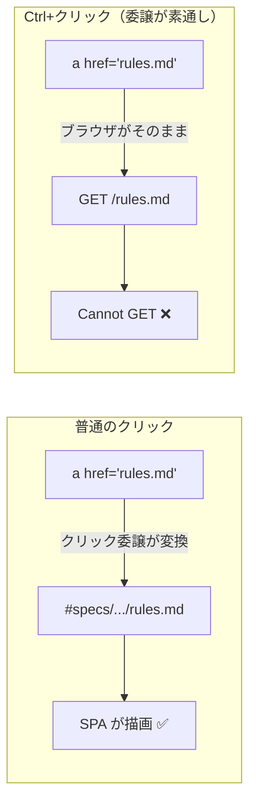

# vibeboard: 本文の相対リンクを Ctrl+クリックすると Cannot GET になる問題の修正

## 目的・背景

`http://titan-income-vibeboard/#specs/experiments/feature-discovery/units.md` で本文中の
`rules.md` などの相対リンクを **普通にクリックすると開けるが、Ctrl+クリック（新規タブ）だと
`Cannot GET /rules.md`** になる（利用者報告 2026-09-11）。

原因は `vibeboard/src/web/app.js` のリンク処理の設計。相対リンクは **クリック委譲**
（`setupDocLinkInterception`）でハッシュ遷移へ変換しているが、この委譲は修飾キー付きクリック
（Ctrl / Meta / Shift / Alt・中クリック）を意図的に素通しする。href 属性は相対パスのままなので、
新規タブではブラウザが `/rules.md` をサーバへ取りにいき、該当ルートが無く 404 になる。

普通のクリックと Ctrl+クリックで通る経路が違う、というのが問題の骨子。

## 対応方針

クリック時ではなく **描画時に href 属性そのものをハッシュ URL に書き換える**
（`rewriteRelativeDocLinks(root)` を新設し、既存の `resolveDocLinkHash` で解決する）。
これで新規タブ側も `/#specs/...` を開くことになり、SPA が正しくルーティングする。
中クリック・「リンクのアドレスをコピー」も同時に直る。

- 書き換えたリンクには `data-doc-link="1"` を付け、クリック委譲は従来どおり
  「同じハッシュへのクリックで再描画（handleRoute）」の挙動を保つ
- 呼び出し箇所は Markdown 描画の 2 か所: プレビュー本文（`renderDocPreviewBody`）と
  TODO ツリー（`renderDocTreeBody`。タスク本文とメモに相対リンクが出る）
- 対象外は従来と同じ（絶対 URL / `data:` / `mailto:` / ページ内アンカー / `/` 始まり、
  メディアはサーバ側で `/files` に書き換え済み）

## 影響範囲

- `vibeboard/src/web/app.js` のみ（サーバ側・Markdown 原文は無変更）。
  `src/web` は生のまま配信されるのでビルド不要
- upstream 改造（`/ext` 中継と同様、vendor 済みコードへの手当て）

## テスト方針

- `node --check` で構文検査
- vibeboard を起動し、units.md の本文で相対リンク（`rules.md` 等）の href が
  `#specs/...` 形式になっていること、普通クリック / Ctrl+クリックの両方で開けることを確認
- TOC リンク（独自ハンドラ）・チップ（元から `#` href）・外部リンクが従来どおりであることを確認
