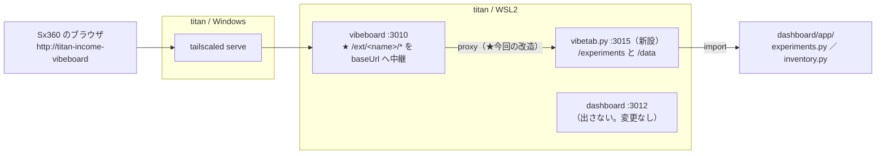

# vibeboard に検証・データのタブを足し、Sx360 から見られるようにする

作成: 2026-09-10

## 目的・背景

- 検証（特徴量発見の run）とデータ在庫を **Sx360 から**見たい
- dashboard（3012）を tailnet に出す案は不採用のまま維持する（serve 経由は全部ループバックに見え、発注の面が無認証で開く。[vibeboard-remote-view](archive/vibeboard-remote-view.md) の決定）
- vibeboard は既に `http://titan-income-vibeboard`（Tailscale Services）で Sx360 から届いている。**ここにタブを足すのが最短**
- vibeboard には customTabs 機構が既にある（`vibeboard.config.json` に name / label / baseUrl / command、プラグイン側は `/api/sidebar`・`/view?item=`・`/api/watch` の 3 エンドポイント）。ただし ⚠ **ブラウザが baseUrl（127.0.0.1）を直接 fetch する作り**なので、Sx360 から開くと Sx360 自身のループバックを叩いて死ぬ

## 対応方針

この図の主張: vibeboard に proxy を 1 本足せば、カスタムタブの中身も既存の serve 経路にそのまま乗る。

| 決めごと | 内容 | 理由 |
|---|---|---|
| vibeboard の改造は upstream に入れる | `~/src/vibeboard`（clone）で実装 → `update --from` で vendor へ配る | vendor 直改造は次の update で消える（CLAUDE.md の運用） |
| proxy の形 | `/ext/<name>/*` → その customTab の `baseUrl` に中継。クライアントには `baseUrl` の代わりに `base: "/ext/<name>"` を配る | 同一オリジンになり CORS / CSP も消える。serve・`ssh -L`・LAN どの経路でも動く |
| タブは 2 つ、サーバは 1 本 | `experiments`（検証）と `data`（データ）。baseUrl はパス付き（`http://127.0.0.1:3015/experiments` / `…/data`）。`command` は先頭のタブにだけ書く（sidecar の二重起動を避ける） | baseUrl はパス prefix を許す実装になっている |
| プラグインは dashboard の解析部を再利用 | `dashboard/vibetab.py`（標準ライブラリのみ）が `app/experiments.py`・`app/inventory.py` を import し、素の HTML を返す | 解析・検査の読み方を二重に持たない。⚠ 資格情報・発注系のコードは import しない |
| dashboard は触らない | 3012 の面・契約は不変。g3plus にも影響なし（vibetab.py は `dashboard/app/` の外なので COPY されない） | |

- ⚠ proxy は「customTab の baseUrl」以外へは繋がない（`/ext/<name>` の name は設定済みタブのみ）。**baseUrl に dashboard（3012）を指定しない**こと（proxy 経由はループバック扱いになり、[vibeboard-remote-view](archive/vibeboard-remote-view.md) で塞いだ穴が開く）。vibetab.py は読み取り専用・秘密なしなので出してよい
- vibetab.py が読むもの: `experiments/feature-discovery/runs/`（検証）と `data/manifests/`・`data/features/*/*.meta.json`・`config/**.toml`（データ在庫）。すべて git 管理外 or 管理内の非秘密

## 影響範囲

- upstream `akiraak/vibeboard`（`~/src/vibeboard`）: `src/server.ts`（proxy）・`src/web/app.js`（`baseUrl` → `base` 3 箇所）・`sample-custom-tab/`（CSP と README）・`test/`（proxy の単体テスト）。⚠ **commit / push は利用者の依頼があってから**
- このリポジトリ: `vibeboard/`（`update --from` で更新）・`vibeboard.config.json`（customTabs 追記）・`dashboard/vibetab.py`（新設）・`dashboard/tests/test_vibetab.py`・`CLAUDE.md`
- 動いている vibeboard（3010）は `update --restart` で起動し直る（portGuard が置き換える）

## Phase

### Phase 1: vibeboard に `/ext/<name>` proxy を足す（upstream clone で）

- Step 1-1: `src/ext.ts`（新設）: 中継先 URL の組み立て・hop-by-hop ヘッダの除去を純関数で書き、`server.ts` から使う。SSE を素通しする（バッファしない・タイムアウトを掛けない）。上流に繋がらなければ 502
- Step 1-2: `server.ts`: `/ext/:name/*` を **`express.json()` より前に**登録（POST の body を素で流すため）。クライアント設定は `baseUrl` をやめて `base: "/ext/<name>"` を配る
- Step 1-3: `app.js`: `tab.baseUrl` の 3 箇所（sidebar fetch / iframe src / EventSource）を `tab.base` に
- Step 1-4: `sample-custom-tab`: CSP を `frame-ancestors 'self'` に、README に proxy 経由の説明
- Step 1-5: `npm test`（既存 3 本 ＋ ext の単体テスト）

### Phase 2: 検証・データのプラグインサーバ（このリポジトリ）

- Step 2-1: `dashboard/vibetab.py`: `ThreadingHTTPServer`（127.0.0.1:3015、`AIL_VIBETAB_PORT` で変更可）。`/experiments/*` は run の一覧（種類 group・スコア badge）と 1 run の詳細（スコア・6 検査・fold）、`/data/*` は在庫の節（系列・特徴量・規約・枠と仮説・割り当て）。`/api/watch` は 5 秒ごとの mtime 監視で `sidebar` / `item-changed` を流す
- Step 2-2: `dashboard/tests/test_vibetab.py`: 一時ディレクトリの最小 run / manifest で sidebar・view の 200 と中身、秘密が出ないこと（そもそも読む対象に無い）を確認
- Step 2-3: `vibeboard.config.json` に customTabs 2 つ（command は experiments 側だけ）

### Phase 3: 配って確認

- Step 3-1: `node vibeboard/dist/cli.js update --from ~/src/vibeboard --restart`
- Step 3-2: ループバックで確認（下のテスト表 T1〜T6）
- Step 3-3: Sx360 のブラウザで `http://titan-income-vibeboard` の 検証・データ タブ（利用者）
- Step 3-4: CLAUDE.md（vibeboard 節）更新・TODO / DONE 整理・プランを archive へ

## テスト方針

| # | どこから | 何を | 期待 |
|---|---|---|---|
| T1 | titan | `npm test`（clone）・`pytest dashboard/tests` | 全部通る |
| T2 | titan | `http://127.0.0.1:3010/ext/experiments/api/sidebar` | 200・run が並ぶ |
| T3 | titan | `http://127.0.0.1:3010/ext/experiments/view?item=<run>`・`/ext/data/view?item=…` | 200・HTML |
| T4 | titan | `/ext/experiments/api/watch` に curl | SSE が繋がり ping が来る |
| T5 | titan | 既存タブの回帰: `/`・`/api/tree`・`/api/docs` | 200 |
| T6 | titan | `/ext/nazo/api/sidebar`（未定義タブ） | 404 |
| T7 | Sx360 | ブラウザで 検証・データ タブ（利用者） | 中身が出る・SSE 更新 |
| T8 | Sx360 | `http://titan-income-vibeboard:3015` 等で直接 3015 に届かないこと | タイムアウト（3015 は 127.0.0.1 bind） |

## 実測（2026-09-10）

Phase 1〜3 を実施。**残りは T7（Sx360 のブラウザ確認。利用者）だけ**。

| # | 何を | 結果 |
|---|---|---|
| T1 | clone の `npm test`（既存 ＋ ext の 7 件） | **55 件 pass** ✅ |
| T1 | `dashboard/.venv` の pytest（vibetab 15 件を追加） | **70 件 pass** ✅（約 3 分かかるのは元から） |
| T2 | `/ext/experiments/api/sidebar` | 200・26 項目（まとめ ＋ 断面 ／ プーリング ／ 先読みの検査、スコアの badge 付き） ✅ |
| T3 | `/ext/experiments/view?item=<run>`・`/ext/data/view?item=<節>` | 全部 200（データは 7 節とも） ✅ |
| T4 | `/ext/experiments/api/watch` | `: hello` → `checks.json` の touch から 5 秒以内に `sidebar` ＋ `item-changed`（該当 run と overview）が届く ✅ |
| T5 | 回帰 `/`・`/api/tree` | 200 ✅ |
| T6 | `/ext/nazo/api/sidebar` | 404 ✅ |
| bind | `ss -ltn` | 3015 は `127.0.0.1` だけ ✅（T8 の土台） |
| sidecar | vibeboard のログ | `customTab experiments: python3 dashboard/vibetab.py (pid …)` が本体と一緒に起動 ✅ |

### 落とし穴（実施中に踏んだもの）

- ⚠ **`vibeboard update` の `init` は CLAUDE.md のマーカー間を置換する**。マーカーの中に書いてあった titan の Tailscale Services の記述が消えた → マーカーの**外**の「vibeboard のこのプロジェクト固有の運用」節に置き直した。プロジェクト固有の記述はマーカーの中に書かない
- ⚠ サイドバーは `index()` のスコア降順のままだと種類の group 見出しが繰り返される（クライアントは「連続する同 group」だけまとめる）→ 種類でまとめてから各種類の中をスコア順にした

### 残作業と upstream の扱い（2026-09-10 に全部済み）

- [x] T7: Sx360 のブラウザで 検証・データ タブが出ることを利用者が確認（2026-09-10）
- [x] upstream へ push 済み: `akiraak/vibeboard` の **b86cf26**（Proxy custom tab traffic through /ext/&lt;name&gt;）。以後は素の `vibeboard update` で proxy 入りが配られる
- 他プロジェクトへの影響の確認（2026-09-10）: customTabs を使うのは ai-income-lab だけ（titan の全プロジェクトの config を確認）。customTabs 無しの構成で新ビルドを起動して主要 API の回帰なし・`/ext/*` は 404。旧式プラグインとの差分は「view の HTML の root 絶対パス参照」と「CSP `frame-ancestors http://127.0.0.1:*`」の 2 点だけで、該当する既存プラグインは無い
