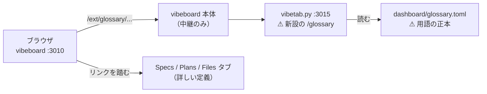

# vibeboard に「用語」のタブを足す

作成日: 2026-09-12。TODO「vibeboardに用語解説のページを追加」。
利用者の追加指示: ⚠ **specs に詳細がある場合はリンクを張る。**

## 1. 目的・背景

このプロジェクトの文書は用語が濃い。`試行` `上乗せ` `門前` `im_` `cert` のように、
⚠ **定義が別のファイルの特定の節にあり、知らないと 1 行も読めない**語が多い。

| 今どうなっているか | ⚠ 困ること |
| --- | --- |
| 定義は各 spec の中にある（[rules.md](../../specs/experiments/feature-discovery/rules.md) 6・9・11・13・14 章、[units.md](../../specs/experiments/feature-discovery/units.md)、[dsr.md](../../specs/experiments/feature-discovery/dsr.md) など） | ⚠ **語から引けない。** 「門前って何だっけ」で全文検索するしかない |
| [overview.md §5](../../specs/overview.md) に記号の早見表がある | ⚠ **体系（軸 A・B・C と根拠の記号）だけ**で、検証・売買・API の語は無い |
| vibeboard には Files / Plans / Specs / Tasks ＋ 検証・データのタブ | ⚠ **語から入る入口が無い** |

作るのは**索引**であって解説書ではない。⚠ **1 語 1〜2 行 ＋ 詳しい定義へのリンク**に徹する。

## 2. 対応方針

検証・データのタブと同じ作り（[vibeboard-experiments-tabs.md](vibeboard-experiments-tabs.md)）に乗せる。
⚠ **vibeboard 本体は改造しない**（customTabs と `/ext/<name>` の中継は既にある）。

| # | 決めごと | ⚠ 理由 |
| ---: | --- | --- |
| 1 | 用語の正本は **`dashboard/glossary.toml`**（`tomllib` は標準ライブラリ） | ⚠ **画面は写しを出すだけ**という既存の原則（dashboard.md §10-2）に合わせる。⚠ **説明を Python のコードに埋めない** |
| 2 | ⚠ **1 語 1〜2 行。詳しい定義は書かない** | 定義が 2 か所になると必ず食い違う。⚠ **食い違ったらリンク先が勝つ** |
| 3 | ⚠ **数字を書かない**（`139 試行` のような「いまの値」を用語表に置かない） | ⚠ **数字は動く。** 動いた数字が用語表に残ると嘘になる。数字は検証タブと spec が持つ |
| 4 | リンクは vibeboard の hash URL（`/#specs/<path>` ／ `/#plans/<path>` ／ `/#files/<path>`）へ `target="_top"` で飛ばす | ⚠ **同じ画面の中で定義まで辿れる**。⚠ **節のアンカー（`#§5`）は vibeboard が未対応**なので、節は文字で書く |
| 5 | ⚠ **リンク先の実在をテストで固定する** | ⚠ **リンク切れは索引の価値を消す。** 文書を移したら赤くなるようにする |
| 6 | 節（分類）は用語の性質で切る: 進め方 ／ 検証の単位 ／ 統計の検査 ／ 閾値売買 ／ データ ／ 手法とモデル ／ 口座と API ／ 収入の体系 | 引きたい語の近くに関連語が並ぶ |

## 3. 影響範囲

| ファイル | 変更 |
| --- | --- |
| `dashboard/glossary.toml` | **新規**（用語の正本） |
| `dashboard/vibetab.py` | `/glossary` の 3 経路（`api/sidebar`・`view`・`api/watch`）を足す。⚠ **既存の 2 タブには触らない** |
| `dashboard/tests/test_vibetab.py` | 用語タブの検査を追加（サイドバー・view・404・⚠ **リンク先の実在**・説明の長さ） |
| `vibeboard.config.json` | customTabs に `glossary`（label「用語」）を足す。⚠ **command は experiments 側だけ**（sidecar は 1 本） |
| `docs/specs/dashboard.md` | §12 として仕様を書く。§9 更新履歴に 1 行 |

⚠ **CLAUDE.md は触らない**（別セッションからの依頼でプロジェクトの決めごとは変えない。必要なら利用者が判断する）。
⚠ **dashboard（3012）の面・契約は変えない**（`vibetab.py` は `dashboard/app/` の外なので g3plus にも載らない）。

## 4. テスト方針

`dashboard/.venv/bin/python -m pytest -q tests`（既存 96 件＋追加）で次を見る。

1. `/glossary/api/sidebar` が節を返す ／ `view?item=<節>` が 200 で用語を含む ／ 知らない item は 404
2. ⚠ **`glossary.toml` の全リンク先がリポジトリに実在する**（相対パスを root から解決して `exists()`）
3. ⚠ **どの語も説明が空でない・長すぎない**（索引であることの固定）
4. 用語名が節をまたいで重複していない
5. HTML に秘密が出ないこと（そもそも読む対象に無い）＝ 既存方針のまま

## 5. Step

- Step 1: `dashboard/glossary.toml` を書く（8 節・語ごとに `name` / `short` / `doc` / `where`）
- Step 2: `vibetab.py` に `/glossary`（サイドバー・view・watch）を足す
- Step 3: テストを足して全件通す
- Step 4: `vibeboard.config.json` に customTab を足し、実際に起動して見る
- Step 5: `docs/specs/dashboard.md` §12 ＋ 更新履歴 ／ TODO → DONE ／ プランを archive へ
