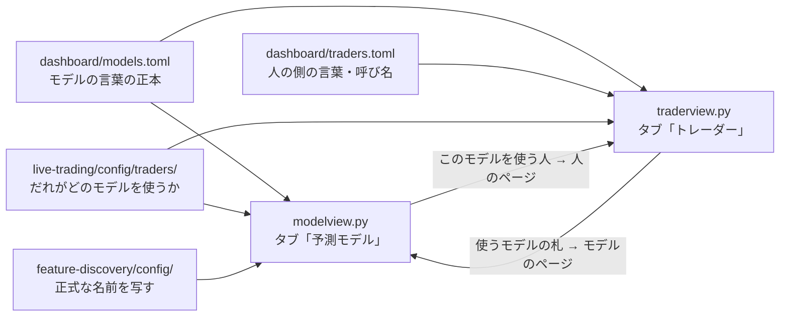

# vibeboard のタブに「予測モデル」を足す — モデルの一覧と、やさしい言葉の解説

利用者の指示（2026-09-20）: **vibeboard のタブに予測モデルを追加。予測モデル一覧と分かりやすい解説を付ける**。追加の指示: **プランを作成してから実装する**。

✅ **2026-09-20: 実装した**（Step 1〜5。管理画面の pytest 196 本）。仕様の正本は [dashboard.md §17](../../specs/dashboard.md)。残りは利用者の作業 ＝ vibeboard の入れ直し（タブが出る）と `dashboard/models.toml` の文の読み直し（`TODO.md`）。

## 0. 目的

「このプロジェクトにはどんな予測モデルがあって、それぞれ何を見て・どう答えを出し・試したらどうだったか」を、用語を知らなくても読める形で 1 か所に出す。
トレーダーのタブ（[dashboard.md §16](../../specs/dashboard.md)）は「人」から入る画面で、その人が使うモデルしか出ない。こちらは「モデル」から入る画面で、机上で試しただけのモデルも載る。

⚠ **トレーダーのタブと同じ決まりで書く**: やさしい言葉（専門用語は「正式な名前」にだけ）／ 特性には「どこまで確かか」の印 ／ ほかのモデルとくらべる文を書かない ／ 白地に固定 ／ 数字は設定から写すだけ ／ 読むだけ・`out/`・`state/`・`.env` を開かない。

## 1. 先に確かめたこと（2026-09-20）

| 確かめたこと | 分かったこと |
| --- | --- |
| 机上で試したモデルの実数（`ail/registry.py` の登録表） | `model` 12（Ridge ／ LightGBM ／ MLP ／ PatchTST ＋ GAN 増強 6 種 ＋ 基準線 2）・`detector` 23（尺度 7 ＋ 入口と出口の対 12 ＋ 時系列分類器 3 ＋ PatchTST 1）・`transform` 6。⚠ **GAN 増強の「6 種」＝ 基になるモデル 3 × batch 2 水準**。⚠ config は 90 本・実行は 256 本あり、**config や実行の単位では一覧にならない**（多すぎる・同じモデルが何度も出る） |
| 検証タブの読み手 `dashboard/app/experiments.py` が使えるか | ⚠ **使えない**。実行 1 本の `summary.csv`・`checks.json` を写す読み手で、**採る ／ 保留 ／ 落とす を持っていない**（`checks.json` にも判定の鍵は無い） |
| 判定が機械で読める形で残っているか | ⚠ **台帳（`ledger.md`。生成物の Markdown・1,155 行）にしか無い**。行の鍵は 手法 × モデル × 層 × θ × 較正 で、**モデル 1 つに 1 つの判定は引けない**（例: いま `T1` が使う構成は、較正「旧」の行では保留・いまのコードの行では落とす）。唯一の例外は条件付き GAN の `verdict.json` |
| 台帳の総括 | 「採る」は 0 件（落とす 551 ／ 保留 116）。実売買の 3 本も「採る」ではない（[live-trading.md §0-1](../../specs/experiments/live-trading.md): 選んだ基準は型の違いで、成績ではない） |

## 2. 決めたこと（⚠ タスクの「未決」3 つ。推奨で作り、利用者の裁定で直す）

| # | 決めること | 決めた形 | 理由・直し方 |
| --- | --- | --- | --- |
| Q1 | どこまでを一覧に載せるか | **モデルの「型」を 1 ページにする**（config・実行の単位ではない）。左の一覧は 2 つの束 ＝ **いま使っている**（実売買の設定から引く）／ **机上で試した**。最初に載せるのは 12 ページ ＝ いまの 3 本 ＋ 数字をまぜ合わせる型（MLP）／ にせの過去データで学ぶ量を増やすやり方（GAN 増強 6 種）／ 式を進化させる型（記号回帰）／ 上がり調子の門（検知器 7 本）／ 入口と出口で見る長さを変える門（検知器 12 本）／ 時系列分類器の残り 2 本（MiniRocket・Hydra）／ PatchTST ／ 条件付き GAN | タスクが名指ししたもの ＋ 記号回帰（利用者の言う「GAN」＝ 進化的探索）。⚠ **載せていないもの**: 選別 19 手法・変換 5 本（多項式・tsfresh・行列プロファイル・ウェーブレット・PCA）・上位 K・基準線 ＝ モデルではなく前段や売買の規則。足すなら `[[model]]` を 1 つ書くだけ（コードは触らない） |
| Q2 | 「落とす」と判定したモデルをどう見せるか | **隠さない・同じ形のページで出す**。束は判定ではなく「いま使っているか」で分ける（台帳に「採る」は 1 件も無いので、判定で分けると全部が同じ束になる） | 「試して駄目だった」も成果物（CLAUDE.md「満たさないものは理由を残して打ち切る」） |
| Q3 | 机上の検証の結論を出すか | **出す**（大見出し 4「過去のデータで試した結果」＝ 採る ／ 保留 ／ 落とす の印 ＋ やさしい言葉の 1〜2 文 ＋ 記録へのリンク）。⚠ **bp などの数字は書かない**（数字は記録と検証タブ）。⚠ **これは机上の試しの結論で、実売買の損益ではない**（売買結果は今回も出さない） | やさしい言葉だけの紹介は「うまくいくモデル」に読めてしまう（トレーダーのタブの Q2 と同じ理由）。⚠ 判定は台帳から機械では引けない（§1）ので**人が記録から写す**。消したいときは `models.toml` の `show_result = false` の 1 行（一覧の印も消える） |
| Q4 | 言葉の正本 | **`dashboard/models.toml` を新しく作り、`traders.toml` の `[[model]]` 3 本をそこへ移す**。トレーダーのページも `models.toml` から写す（正本は 1 つのまま）。`traders.toml` に残るのは人の側の言葉（`[nicks]`・`[common]` ＝ いつ・いくら・線の文） | 12 本を `traders.toml` に足すと「トレーダーの言葉」のファイルの大半がモデルになる。タスクの「必要ならファイル名を見直す」 |

## 3. 出すもの

> この図の主張: モデルの言葉の正本は `models.toml` 1 本で、予測モデルのタブとトレーダーのタブの両方がそこから写す。

左の一覧: `一覧` ／ 束「いま使っている」／ 束「机上で試した」。⚠ **本数を数えない**（モデルは増えたり減ったりする）。

`一覧` のページ ＝ モデル 1 本 1 枚の札（やさしい呼び方・ひとこと・見るもの ／ 決め方・試した結果の印）。押すとそのモデルのページへ。⚠ **見くらべる表・順位は作らない**。

モデル 1 本のページの大見出し（全部同じ順・番号つき）:

| # | 大見出し | 中身 | 出どころ |
| --- | --- | --- | --- |
| 1 | どんなモデルか | やさしい呼び方・ひとこと・見るもの ／ 決め方・**このモデルを使う人**（居れば。トレーダーのページへのリンク） | `[[model]]` ＋ 実売買の設定 |
| 2 | モデルの特性 | 1 項目 1 行 ＋ どこまで確かかの印 ＋ 理由 | `traits` |
| 3 | 何を見て、どう答えを出すか | 見ている数字のまとまり ＋ 答えの出し方 | `sees`・`how` |
| 4 | 過去のデータで試した結果 | 印（採る ／ 保留 ／ 落とす）＋ 1〜2 文 ＋ 記録へのリンク ＋ 共通の注意（試しは過去のデータ・実売買の結果ではない） | `result`・`records` ＋ `[common]` |
| 5 | 気をつけること | モデルの苦手なこと ＋ 共通の限界 | `limits` ＋ `[common]` |
| （畳む） | 正式な名前 | 正式な名前・実験の設定のファイルと、そこから写した `model`・`feature_layers`・`detectors`・`transform` | `formal`・`configs` ＋ `feature-discovery/config/` |

## 4. つくり

| 部品 | 中身 |
| --- | --- |
| `dashboard/models.toml`（新） | `[common]`（印の文・札の見出し・共通の注意・`show_result`）＋ `[[model]]` × 12。`id`（ページの鍵。英数と `-`）・`name`／`method`（実売買の設定と同じ綴り。使っているモデルだけ）・`formal`・`configs`・`label`・`summary`・`card`・`traits`・`sees`・`how`・`limits`・`result`・`records` |
| `dashboard/traders.toml` | `[[model]]` と、モデルの側の共通の文（印・札の見出し・「説明はまだ」）を `models.toml` へ移す |
| `dashboard/modelview.py`（新） | 一覧・1 本のページ・見張りの指紋。標準ライブラリだけ・開くのは TOML だけ。CSS と印の部品は `traderview` のものを使う |
| `dashboard/traderview.py` | `[[model]]` を `models.toml` から読む（`TraderPaths.models`）。「使うモデル」の札に、モデルのページへのリンク |
| `dashboard/vibetab.py`・`vibeboard.config.json` | 6 本目のタブ `models`（ラベル「予測モデル」） |
| テスト | `tests/test_models_tab.py`（新）＋ `tests/test_traders_tab.py`（正本の場所が変わったぶん） |

⚠ **守ること**: 読むだけ・操作を足さない ／ baseUrl に 3012 を指定しない ／ `out/`・`state/`・`.env`・`runs/` を開かない ／ vibeboard 本体と `dashboard/app/` は変えない。

## 5. Step

1. `models.toml` を作り `[[model]]` 3 本を移す・`traderview.py` をそこから読む形に直す・トレーダーのテストを通す
2. `modelview.py` ＋ `vibetab.py` の経路 ＋ `vibeboard.config.json`・トレーダーの札からのリンク
3. 机上で試した 9 本の文を書く（⚠ 記録とコードを読んで確かめる。特性には印。確かめていない理由を言い切らない）
4. テスト（やさしい言葉・くらべる文・印・設定の数字が無い・判定の印・TOML しか開かない・経路・白地）→ 管理画面の pytest を全部流す
5. 文書: `dashboard.md` §17（＋ §16 の正本の場所）・`CLAUDE.md`・`TODO.md`／`DONE.md`・このプランを archive へ

## 6. テスト方針

- 本物の `models.toml`: `FORBIDDEN`・`COMPARING`（トレーダーのテストと同じ一覧を使う）／ 全部の特性に `basis` ／ 設定の数字と `$` が無い ／ `id` が重ならない・英数と `-` だけ ／ `result.verdict` は 3 つのどれか・`records` のファイルが在る ／ `configs` のファイルが在る ／ いま設定に居る人のモデルが全部「いま使っている」の束に出る
- 最小の置き場（tmp）: 束分け・大見出しの順・使う人のリンク・`show_result = false` で結果の段と印が消える・知らない `id` は 404・escape・開くのは `.toml` だけ・経路・指紋
- `dashboard/.venv/bin/python -m pytest -q tests` を全部流す

## 7. 限界

- 文と判定の印は**人が記録から写したもの**で、台帳を作り直しても自動では変わらない（§1。自動なのは「いま使っているか」「使う人」「正式な名前の段」）。⚠ 新しい試しで判定が変わったら `result` を読み直す
- タブが出るのは vibeboard と sidecar（3015）を入れ直した後（⚠ 利用者）
