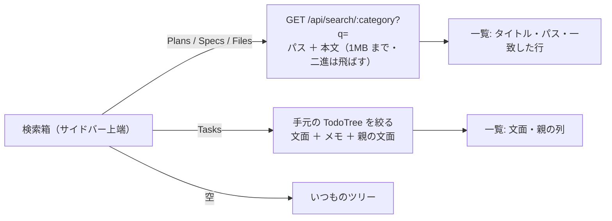

# vibeboard の Tasks・Plans・Specs・Files に検索機能を入れる

作成: 2026-09-18

## 目的・背景

利用者の指示（2026-09-18）: Tasks タブに検索機能を入れる。追加の指示で **Tasks・Plans・Specs・Files の 4 つ**に入れることになった。
TODO が 140 行・文書が 60 本を超え、サイドバーのツリーを開いて探すのが遅い。文字列で絞り込めるようにする。

## 対応方針

> この図の主張: 検索箱はサイドバーの上に 1 つ。文書のタブはサーバが本文まで探し、Tasks は手元の木をそのまま絞る。結果はどちらも「平らな一覧」で、ツリーは触らない。

| 項目 | 決め |
| --- | --- |
| 置き場 | サイドバー上端（並び順の行の下）。Tasks・カテゴリ（Plans / Specs）・Files で出す。customTab には出さない |
| 一致 | 大文字小文字を区別しない部分一致。空白区切りは **AND**（全部の語がパスか本文のどこかにある） |
| 文書の対象 | カテゴリは `.md` / `.html`（ツリーと同じ・dotfile を飛ばす）。Files は `files.exclude` 以外の全ファイル（dotfile も）。本文は `MAX_SOURCE_BYTES`（1MB）まで・二進は飛ばす |
| 結果 | 上限 200 件。パスの一致を先に、次に本文の一致（一致した行数の多い順）。1 件に一致した最初の行を 1 行添える |
| Tasks の対象 | 済んだタスクは出さない（一覧と同じ）。一致は文面・メモ・親の文面。結果の 1 件をクリックすると、いつもの詳細（右ペイン）が開く |
| 状態 | 検索語はタブごとにメモリに持つ（再読み込みで消える）。Escape で消す。250ms のデバウンス |
| 触らないもの | ツリーの描画・並び順・新規作成・タスクの実行。検索語が空なら今までどおり |

## 影響範囲

| 場所 | 変更 |
| --- | --- |
| `vibeboard/src/search.ts`（新） | 文書の検索（純粋な関数 ＋ ファイル走査）。テスト対象 |
| `vibeboard/src/server.ts` | `GET /api/search/:category` |
| `vibeboard/src/web/index.html` / `app.js` / `style.css` | 検索箱・結果の一覧・Tasks の絞り込み |
| `vibeboard/test/search.test.js`（新） | 一致の規則・除外・二進・上限 |
| akiraak/vibeboard 本体（`~/src/vibeboard`） | 同じ差分を入れて push（⚠ **vendor だけ直すと `vibeboard update` で消える**） |
| `CLAUDE.md` の vibeboard 節 | 検索の一言 |

## テスト方針

- `npm test`（`node --test`）: 検索の規則（AND・大文字小文字・パス一致・本文一致・二進と 1MB 超の除外・dotfile の扱い・上限）
- 手動: この repo で vibeboard を起動し、Tasks で「トレーダー」、Specs で「差 1」、Files で「HALT」を引いて一覧と遷移を見る
- 本体側でも `npm test` が通ること・vendor と本体の `src` / `test` が `diff -rq` で一致すること

## Phase

- Phase 1: サーバ（`search.ts` ＋ 経路 ＋ テスト）
- Phase 2: 画面（検索箱・文書の一覧・Tasks の絞り込み）
- Phase 3: 本体への反映と後片付け（push・`diff -rq`・CLAUDE.md・DONE）
