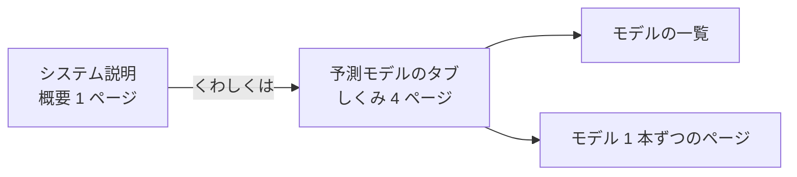

# 「システム説明」を概要だけにし、モデルのしくみを「予測モデル」タブへ移す

2026-09-21 作成。利用者の指示（2026-09-21 夜）: **vibeboard の予測モデルタブにシステム説明の「モデルを作る」「過去のデータを確かめる」「実際の売買で使う」のモデル関連の部分を書く。システム説明は概要だけにする**。

## 1. 目的・背景

「システム説明」タブ（§18）は 5 ページ（全体 ／ モデルを作る ／ 過去のデータで確かめる ／ 実際の売買で使う ／ 名前と識別名）で、うち 4 ページはモデルの話。モデルの話は「予測モデル」タブ（§17）にまとめ、「システム説明」はシステム全体の概要 1 ページにする。

> この図の主張: モデルの話は予測モデルのタブに集まり、システム説明は入口の 1 ページだけになる。

## 2. 対応方針

| もとのページ（system.toml） | 行き先 |
| --- | --- |
| 全体のしくみ | システム説明に残す（唯一のページ）。リンク先を予測モデルのタブのしくみのページへ。実際の売買のうちモデルでない部分（売買履歴と口座の突き合わせ・安全の仕掛け・何を見て判定するか）は、短い箇条書きの段 1 つにして残す |
| モデルを作る | 予測モデルのタブ「モデルを作る」（全部の段がモデルの話） |
| 過去のデータで確かめる | 予測モデルのタブ「過去のデータで確かめる」（全部） |
| 実際の売買で使う | 予測モデルのタブ「実際の売買で使う」: トレーダー ＝ モデル ＋ 買う線 ＋ 予算 ／ 1 日の流れ ／ 出力スコアから注文へ（モデルの話の点だけ）／ 出力スコアの読み方。⚠ 帳面と口座 ／ 安全の仕掛け ／ 何を見て判定するか ＝ モデルでないのでシステム説明の概要へ（短く） |
| 名前と識別名 | 予測モデルのタブ「名前と識別名」（モデルの内部の呼び名 ＝ モデルの話） |

- 言葉の正本: しくみのページは `dashboard/models.toml` の `[[page]]`（予測モデルのタブの言葉の正本を 1 本のまま）。`system.toml` は概要だけ
- 画面: ページの描き方（段・図・表・「詳しく」・検証結果一覧の合計・型ごとのしくみ）は `modelview.py` へ移し、`systemview.py` はそれを使う（循環しない向き）。期間を分ける図 `folds_svg` は `figures.py` へ
- 左の一覧（予測モデルのタブ）: 一覧 → しくみ（4 ページ）→ いま使っている → 机上で試した
- 決まりは今までどおり: やさしい言葉（本文）／ 用語は「詳しく」だけ ／ 図は 1 図 1 主張・箱 12 個以内 ／ 読むだけ ／ 白地

## 3. 影響範囲

`dashboard/models.toml`・`system.toml`・`modelview.py`・`systemview.py`・`figures.py`・`tests/test_models_tab.py`・`tests/test_system_tab.py`・`docs/specs/dashboard.md` §17・§18。vibeboard 本体と `vibeboard.config.json` は変えない（タブの並びも同じ）。sidecar（3015）の入れ直しが要る。

## 4. テスト方針

- `cd dashboard && .venv/bin/python -m pytest -q tests`（しくみのページのやさしい言葉・図・リンク先・検証結果一覧の合計・型ごとのしくみ・左の一覧・システム説明は概要だけ・リンクが予測モデルのタブへ）
- 手元で見る: `python3 dashboard/vibetab.py --port 3016` → `/models/view?item=build` ほか・`/system/view?item=overview`

## 5. Phase

- ✅ Phase 1: ページの描き方を `modelview.py` へ移す（`systemview.py` はそれを使う）
- ✅ Phase 2: しくみの 4 ページを `models.toml` へ移し、左の一覧に出す
- ✅ Phase 3: `system.toml` を概要だけにし、リンク先を直す
- ✅ Phase 4: テスト・仕様・sidecar の入れ直し
