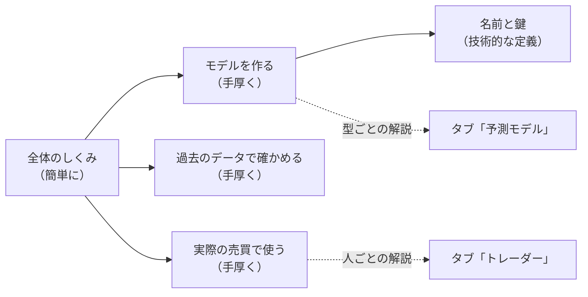

# vibeboard の先頭に「しくみ」タブを足す — このシステムの説明（モデルの生成・検証・実際に使うところを手厚く）

利用者の指示（2026-09-20）:
- **モデルに追加解説するページを vibeboard にタブ追加**
- 裁定（質問への答え）: **新規タブを先頭に作り、このシステムの説明にする。全体の説明はまず簡単にして、モデルの生成と検証と実際に使われるところの説明は手厚くする**
- 中身は 4 つとも ＝ 仕組みを図つきで深く ／ 技術的な定義 ／ 検証の経緯と数字 ／ 読み方・使いどころ
- 言葉づかいは**両方を並べる** ＝ 各段をやさしい言葉で書き、その下に畳んだ「くわしく（用語あり）」を付ける

✅ **2026-09-20: 実装した**（Step 1〜4。管理画面の pytest 212 本）。仕様の正本は [dashboard.md §18](../../specs/dashboard.md)。残りは利用者の作業 ＝ vibeboard の入れ直し（タブが出る）と `dashboard/system.toml` の文の読み直し（`TODO.md`）。

## 0. 目的

vibeboard を開いた人が最初に読む「このシステムは何をしているのか」の説明。トレーダーのタブ（人）・予測モデルのタブ（モデル）の手前に置く入口で、
モデルが**どう作られ・どう確かめられ・実際の売買でどう使われるか**を 1 本の流れとして読めるようにする。

## 1. 出すもの

> この図の主張: 入口のページは簡単に全体を見せ、手厚い 3 ページ（作る・確かめる・使う）と、引くためのページ（名前と鍵）へ分かれる。

| ページ（`id`） | 中身 | 手厚さ |
| --- | --- | --- |
| 全体のしくみ（`overview`） | 何のためのシステムか ／ 1 枚の流れ図（データ → 数字 → モデル → 点 → 確かめる → 使う）／ 目的は「もうかるか」ではなく「注文が計画どおりに出るか」／ ほかのタブの案内 | 簡単に |
| モデルを作る（`build`） | データを集める → 値段の目盛りを直す → 見ている数字を作る → 学ぶ → 点を 0〜100 に直す、の各段 ＋ 先を見ない決まり ＋ 型ごとのしくみの図（いま使っているモデル。文は `models.toml` から写す） | 手厚く |
| 過去のデータで確かめる（`verify`） | 期間を 5 つに分けて先へ進みながら試す図 ／ 売り買いのまねごと ／ ものさし ＝ ただ持ち続ける ／ 採る・保留・落とす ／ わざと答えを見せる試し（配線の検査）／ 試した数を数える理由 ／ **これまでの経緯**（日付・何を・結果）／ 台帳の合計（⚠ 台帳から写す） | 手厚く |
| 実際の売買で使う（`live`） | 1 日の流れの図（朝の準備 → 15:50 → 日足 → 今日の点 → 注文 → 約定の確認）／ トレーダー ＝ モデル ＋ 買う線 ＋ 予算 ／ 注文は 2 段 ／ 帳尻合わせ ／ 安全の仕掛け（鍵 3 段・停止・予算の上限・窓）／ シミュレーション ／ 何を見て判定するか ／ 点の読み方 | 手厚く |
| 名前と鍵（`names`） | モデル 1 本 ＝ 実験名 × 手法名 ／ 部品の登録名 ／ どれが台帳の鍵か（rules.md 10-1）／ 記録のどこに何の名前が出るか | 技術的な定義（用語あり） |

各段 ＝ やさしい言葉の本文（＋ 図 ＋ 表）→ 畳んだ **「くわしく（用語あり）」**（正式な名前・コードと config の場所・数字と出典・規約の節）。

## 2. 決めたこと

| # | 決めること | 決めた形 | 理由 |
| --- | --- | --- | --- |
| 1 | タブの名前と位置 | `system`・ラベル「しくみ」・**customTabs の先頭**（topbar のいちばん左） | 利用者の裁定「先頭に」。ラベルは 1 語で短く（変えるのは `vibeboard.config.json` の 1 行） |
| 2 | 言葉の正本 | **`dashboard/system.toml`**（ページ → 段 → 本文 ／ 図 ／ 表 ／ くわしく）。説明を Python に書かない | `glossary.toml`・`models.toml` と同じ考え方。利用者が vibeboard の Files から直せる |
| 3 | やさしい言葉の検査 | **本文（`text`・`points`・`table`・図の文字）は §16-2 の表の検査を受ける。`detail`（くわしく）は検査の外**（用語を使ってよい） | 「両方を並べる」の裁定 |
| 4 | 図 | **サーバで組むインライン SVG**（`flow` ＝ 箱と矢印 ／ `folds` ＝ 期間を分けて試す図）。図の中身（箱の文字）は TOML・描き方は Python。⚠ 1 図 1 主張・図の直前に主張を 1 行・箱は 12 個以内（CLAUDE.md の図の原則。テストが数える） | sidecar のページは外部リソースなし（Mermaid は使えない）。管理画面の `charts.py` と同じ流儀 |
| 5 | 型ごとのしくみ | `build` のページで、**いま使っているモデル**（実売買の設定から引く）ごとに図を出す。⚠ **文（呼び方・ひとこと・答えの出し方）は `models.toml` から写す**（正本を増やさない）。図の箱だけ `models.toml` の `[[model]]` に `flow` として足す | 「モデルの生成は手厚く」。机上だけのモデルは予測モデルのタブへリンク |
| 6 | 数字 | 経緯の表の数字（何通り・採る ／ 保留 ／ 落とす の内訳）は記録から写して `system.toml` に書く（出典の文書へリンク・【実測】と日付は「くわしく」に）。**台帳の合計（試した行数・採る ／ 保留 ／ 落とす）は描くたびに `ledger.md` §0 から読む**（読めなければその行を出さない） | 台帳は作り直すたびに動く。閉じた実験の内訳は動かない |
| 7 | 出さないもの | 売買結果（損益・注文・約定・持ち高）・資格情報。⚠ 開くのは TOML と `ledger.md` だけ（`out/`・`state/`・`.env`・`runs/` を開かない） | §16・§17 と同じ |
| 8 | 見た目 | 白地に固定（`traderview.CSS` を土台に）・番号つきの大見出し | §16 と同じ |

## 3. つくり

| 部品 | 中身 |
| --- | --- |
| `dashboard/system.toml`（新） | `[common]` ＋ `[[page]]`（`id`・`label`・`lead`）＋ `[[page.section]]`（`title`・`text`・`points`・`figure`・`table`・`detail`・`detail_table`・`links`・`models = true`・`ledger = true`） |
| `dashboard/systemview.py`（新） | 一覧・ページ・SVG の図・台帳 §0 の読み手・見張りの指紋。標準ライブラリだけ |
| `dashboard/models.toml` | いま使っている 3 本に `flow`（型ごとの図の箱）を足す |
| `dashboard/vibetab.py`・`vibeboard.config.json` | 7 本目の経路 `system`。customTabs は**先頭**に置く（⚠ sidecar を起こす `command` は検証タブの項に付けたまま） |
| テスト | `tests/test_system_tab.py`（新） |

⚠ **守ること**: 読むだけ・操作を足さない ／ baseUrl に 3012 を指定しない ／ vibeboard 本体と `dashboard/app/` は変えない。

## 4. Step

1. `systemview.py`（ページ・図・台帳の読み手）＋ `vibetab.py` の経路 ＋ `vibeboard.config.json`（先頭）
2. `system.toml` の 5 ページを書く（⚠ 規約・記録・コードを読んで確かめた事実だけ。出典を「くわしく」に）＋ `models.toml` の `flow`
3. テスト → 管理画面の pytest を全部 → 別のポートで撮って読む
4. 文書: `dashboard.md` §18・`TODO.md`／`DONE.md`・プランを archive へ（⚠ `CLAUDE.md` は利用者の了承を待つ ＝ 予測モデルのタブと同じ扱い）

## 5. テスト方針

- 本物の `system.toml`: 本文に `FORBIDDEN` が無い（`detail` は除く）／ `$` と設定の数字が無い ／ ページの `id` が重ならない ／ 図は主張つき・箱 12 個以内 ／ リンク先の文書が在る ／ 手厚い 3 ページが在り、どの段にも「くわしく」がある
- 最小の置き場: 大見出しの順と番号・`detail` が `
` に入る・図が SVG で出て箱の数が合う・`models = true` が実売買の設定のモデルだけを出す・台帳の数字を読む（無ければ出さない）・escape・開くのは `.toml` と `ledger.md` だけ・経路・白地・指紋
- `vibeboard.config.json` の customTabs の先頭が `system`

## 6. 限界

- 説明の文は人が書いたもので、仕組みを変えても自動では変わらない（自動なのは、いま使っているモデルの束と台帳の合計）。⚠ 仕組みを変えたら該当の段を読み直す
- タブが出るのは vibeboard の入れ直しの後（⚠ 利用者）
