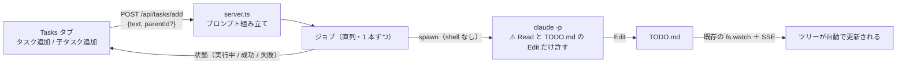
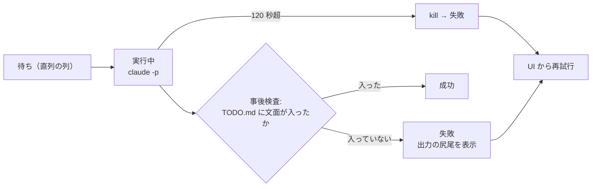

# vibeboard の Tasks にタスク追加・子タスク追加を実装する（バックグラウンドの Claude Code を通す）

作成日: 2026-09-11。利用者の指示: **vibeboardのTasksにタスク追加と既存のタスクへの子タスク追加を実装。削除と違いClaude Codeの処理を通す**。追記: **Claude Code の処理は既存のターミナルの Claude Code ではなくバックグラウンドで動かす**。

## 1. 目的・背景

vibeboard の Tasks タブは今、タスクを**渡す**（実行 / プラン作成 / 説明 → セッションへ投函）ことと**消す**（削除 → サーバが TODO.md を直接書き換え。`src/server.ts` の `POST /api/tasks/delete`）ことはできるが、**足す**ことができない。タスクを足すには Files タブで TODO.md を手で編集するしかなく、チェックボックス形式・置き場所・メモの関連付けというタスク管理ルール（CLAUDE.md）を人が毎回思い出す必要がある。

そこで「タスク追加」「子タスク追加」を Tasks タブに付ける。ただし削除のようにサーバが機械的に書くのではなく、**Claude Code に TODO.md を編集させる**。理由は、追加は削除と違って判断を含むからである（どのセクションに置くか、親のどの位置に挿すか、文面の整形、`利用者の指示` メモの付け方）。

⚠ 投函先は**既存のターミナルのセッションではない**。実行 / プラン作成 / 説明は人が見ているセッションに文面を渡して任せるが、タスク追加は「押したら TODO.md に反映されて終わり」の小さな仕事で、人のセッションの文脈を汚す必要がない。**vibeboard がバックグラウンドの Claude Code（`claude -p` のヘッドレス実行)を起こして処理する**。

| | 削除（既存） | 実行 / プラン作成 / 説明（既存） | ⚠ 追加（本プラン） |
| --- | --- | --- | --- |
| 誰が処理するか | vibeboard のサーバ | ターミナルの Claude Code セッション | **バックグラウンドの `claude -p`** |
| TODO.md を書くのは | サーバ（`removeTask` ＋ 原子的置換） | セッション | **ヘッドレスの Claude Code** |
| 判断 | 無し（部分木を外すだけ） | 人が見ている前で行う | **タスク管理ルールの適用だけを無人で行う** |

## 2. 対応方針

> この図の主張: 追加は削除と違い、サーバが TODO.md を書かずにバックグラウンドの Claude Code に書かせる。画面への反映は既存の watch/SSE にそのまま乗るので、新しい反映経路は作らない。

### 2-1. UI（`src/web/app.js`）

- **タスク追加**: 左ペイン上の「プロジェクト全体」（commit & push と同じ場所）に「タスク追加」を置く。文面の入力欄（複数行可。1 行目がタスク、続く行はメモとして扱う）＋ 追加ボタン
- **子タスク追加**: タスク詳細ペイン（実行 / プラン作成 / 説明 / 削除 のボタン列）に「子タスク追加」を足す。入力欄は同じ形式。親はいま開いているタスク
- ジョブの状態（実行中 → 成功 / 失敗）をボタンの近くに出す。⚠ **ツリーへの反映は何もしない** — Claude Code が TODO.md を書けば既存の `fs.watch` ＋ SSE が拾って更新される
- 失敗時は理由（タイムアウト / claude の出力の尻尾）を出し、再試行できる

### 2-2. サーバ（`src/server.ts`・`src/todo.ts`・新モジュール）

- `POST /api/tasks/add` — `{ text, parentId? }` を受ける。`parentId` があれば `findTaskById` で親の存在を確認し、プロンプトに親の文面と部分木を埋める
- **プロンプトの組み立て**は `todo.ts` の `buildPrompt` / `buildPlanPrompt` の並びに `buildAddTaskPrompt` を足す。内容: 追加する文面・親（あれば）・タスク管理ルールの要点（`- [ ] 文面` 形式・置き場所の選び方・`利用者の指示（日付）` メモ・依存/関連の書式）・⚠ **禁止事項（TODO.md 以外を触らない・実装しない・コミットしない・タスクの削除や並べ替えをしない）**
- **バックグラウンド実行**は新モジュール（`src/claudeJob.ts`）。`sidecar.ts` と同じ流儀で **shell を通さず** `spawn('claude', ['-p', …])`、cwd はプロジェクト root、タイムアウト付き（既定 120 秒。超えたら kill して失敗）。stdout/stderr は尻尾だけ保持してログへ
- ⚠ **直列にするのは追加ジョブどうしだけ**（1 本ずつ）。同時に 2 つ走ると同じ TODO.md を取り合う（Claude Code 側の Edit は「読んだ内容と一致したら書く」なので、負けた方が失敗する）ため。追加は 1 件数十秒の小さなジョブなので、直列でも「連打したら順に入る」だけで待ちは小さい。⚠ **実行 / プラン作成 / 説明の投函や、人のターミナルのセッションとは独立で、それらと並行して動く**（投函の queue には乗せない。ここが直列になったらバックグラウンドにする意味がない）
- **成功判定は事後検査**: 終了コードではなく「TODO.md に頼んだ文面（1 行目）が入ったか」を読み直して判定する。入っていなければ失敗として出力の尻尾を見せる
- `GET /api/tasks/add-jobs` — ジョブの一覧（待ち / 実行中 / 成功 / 失敗）。UI がポーリング（既存の queue 表示と同じ頻度）

> この図の主張: ジョブは直列で走り、成功は「TODO.md に文面が入ったか」の事後検査で決める（claude の終了コードを信用しない）。

### 2-3. ヘッドレス実行の権限と安全

- ⚠ **許すツールを最小にする**: ねらいは `--allowedTools` で Read と **TODO.md への Edit だけ**（`Edit(TODO.md)` のようなパス限定の書式が `-p` で効くかを Phase 0 で実測。効かなければ `--permission-mode` ＋ `--disallowedTools` の組み合わせで代替し、事後検査で「TODO.md 以外の変更が無いこと」を `git status` で確かめる）
- ⚠ **入力の文面はそのままプロンプトに埋まる**（プロンプト注入は防げない）。だからこそツールを絞って、注入が成立しても影響が「TODO.md の編集まで」に留まるようにする。vibeboard は tailnet（`http://titan-income-vibeboard`）から届くが、既存の削除・commit & push と同じ利用者しか居ない面である
- モデル・料金: 1 回の追加 ＝ 1 回のヘッドレス実行（数十秒・少額）。既定モデルで始め、遅い / 高いと感じたら `--model` で下げる（Phase 0 の決定事項）
- ⚠ **`claude` が PATH に無い環境**（他人が vibeboard だけ使う場合）ではボタンを出さない（起動時に `claude --version` を 1 回試して機能フラグにする）

### 2-4. 競合と一貫性

- Files タブの手編集との競合は既存の楽観ロック（mtime・409）が Files 側で受け持つ。追加ジョブ側は直列化と事後検査で受ける
- ⚠ **追加ジョブ × ターミナルのセッションが同時に TODO.md を書く**重なりは直列化では防げないが、防がずに失敗として表に出す: Edit の一致確認で負けた方が失敗 → 事後検査で UI に失敗と出る → 再試行で入れ直す。頻度が低いのでロックの共有までは作らない
- 親タスクがジョブ実行までに消えた場合: プロンプトに「親の文面が見つからなければ何もせず、その旨だけ出力して終わる」を入れ、事後検査で失敗として見せる

## 3. 影響範囲

- `vibeboard/src/web/app.js` — 追加フォーム・子タスク追加ボタン・ジョブ状態表示
- `vibeboard/src/server.ts` — `POST /api/tasks/add`・`GET /api/tasks/add-jobs`・機能フラグ
- `vibeboard/src/todo.ts` — `buildAddTaskPrompt`
- `vibeboard/src/claudeJob.ts`（新規） — ヘッドレス実行・直列化・タイムアウト・事後検査
- `vibeboard/test/` — 追加分のテスト。ビルドは `npm run build`（tsc）
- ⚠ **upstream 改造**（`/ext` 中継・Ctrl+クリック修正と同類）。`vibeboard update` の再 degit で消えるので、**akiraak/vibeboard 本体にも同じ変更を入れる**。完了時に CLAUDE.md の vibeboard 節（Tasks タブの説明）へ追記する
- dashboard・実験コードには触れない

## 4. テスト方針

- **自動テスト（実 claude なし)**: `claude` を偽のスクリプト（受けたプロンプトを記録し、TODO.md に決まった行を書いて終わる）に差し替えて、①直列化（2 件同時 → 順に走る）②タイムアウト → kill → 失敗 ③事後検査（書かない偽 claude → 失敗になる)④親が消えた場合 ⑤プロンプトに親の文面とルール要点が入ること、を `vibeboard/test/` の流儀（node:test）で
- **通しの手動テスト（実 claude）**: 本物の `claude -p` で「トップレベルに 1 件」「既存タスクに子 1 件」を追加し、(a) TODO.md がタスク管理ルールどおりか (b) ツリーが SSE で自動更新されるか (c) `git status` で TODO.md 以外に変更が無いか、を確認
- **権限の実測**（Phase 0): `--allowedTools` のパス限定書式が `-p` で効くか、効かない場合の代替の挙動

## 5. Phase 分割

- **Phase 0: 設計決定と権限の実測** — `claude -p` の権限フラグの実挙動（パス限定 Edit・disallowedTools）、モデルの選択、UI の置き場の最終確認、タイムアウト値。⚠ ここの結果で 2-3 の書き方が変わる
- **Phase 1: サーバ** — `buildAddTaskPrompt`（todo.ts）・`claudeJob.ts`（直列・タイムアウト・事後検査）・`POST /api/tasks/add`・`GET /api/tasks/add-jobs`・機能フラグ。偽 claude での自動テストまで
- **Phase 2: UI** — タスク追加フォーム（プロジェクト全体）・子タスク追加（タスク詳細）・ジョブ状態表示・再試行
- **Phase 3: 通しの確認と反映** — 実 claude での通しテスト、CLAUDE.md の vibeboard 節への追記、akiraak/vibeboard 本体への反映
