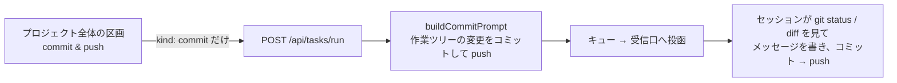

# vibeboard の Tasks タブに「commit & push」ボタンを足す

作成: 2026-09-07

## 目的・背景

タスクを「実行」で済ませたあと、毎回「コミットして push」と頼んでいる。Tasks タブのボタンから同じ文面を
送り先のセッションへ投函できるようにする。vibeboard 自身が git を叩くのではなく、**セッションに頼む**
（コミットメッセージを書き、TODO.md / DONE.md を整え、秘密を含めない、をセッションの判断と承認の中でやらせる）。

## 対応方針

「実行 / プラン作成 / 説明」と同じ経路（`POST /api/tasks/run`）に `kind: 'commit'` を足す。文面はサーバが組む。
**タスクには紐づけない**（2026-09-07 の指示: 全体での操作なので、他のボタンとは表示位置を変える）。`id` は送らず、
文面にもタスクの文脈を入れない。画面では、タスクのボタン列から離した「プロジェクト全体」の区画に置く（送り先の選択は共有）。

文面の要点:

1. `git status` / `git diff` で変更を確かめる。まとまりの違う変更が混ざっていれば、分けるか 1 つにするかを判断して書き残す
2. TODO.md を確認し、済んだタスクは DONE.md へ移してから
3. 変更内容から要点をまとめたコミットメッセージを書き、コミットして push する
4. 秘密（`.env`・資格情報・トークン）や管理外にすべきファイルは含めない
5. ブランチや push 先の決まりが CLAUDE.md にあればそれに従う

タスクのボタン列は 実行 / プラン作成 / 説明 / 削除 のまま。**commit & push は左ペインの上**（タスク一覧の上の「プロジェクト全体」の帯）に置く
（2026-09-07 の 2 度目の指示。最初はタスクの画面の下に区画を作ったが、タスクに紐づかない操作なので左ペインへ）。送り先は右の画面の選択を借り、結果はトーストで出す。

## 影響範囲

upstream `akiraak/vibeboard` だけ。`src/todo.ts`（`buildCommitPrompt`）、`src/tasks.ts` / `src/server.ts`（`TaskKind` に `commit`）、
`src/web/app.js`（5 つ目のボタン・状態文・案内文・キューの種別）、`test/todo.test.js`、`README.md`、`src/templates/claude-md-snippet.md`。
⚠ サーバ側が変わるので、**動いている vibeboard は起動し直さないと `commit` を `run` に丸めて「実行」として届く**。

## テスト方針

- `npm test`（文面の検査）
- 実機: 3010 を起動し直したあと、Tasks タブで commit & push を押して、セッションにその文面が届くこと
