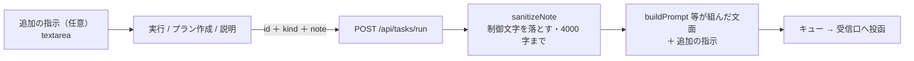

# vibeboard の Tasks 画面にテキスト入力を足す

作成: 2026-09-08

## 目的・背景

Tasks タブの「実行 / プラン作成 / 説明」は、TODO.md の文面そのままでしか送れない。
「このタスクの Phase 6 だけやって」「テストは走らせなくていい」のような**その場の条件**を足したいときは、
セッションの画面に戻って自分で打ち直すことになる。

実行ボタンの上にテキストフィールドを置き、**入力があればその文面を足して送る / 空欄なら今までと同じ文面で送る**ようにする。

⚠ 今の設計は「**文面はサーバが TODO.md から組み、ブラウザからは id と決め打ちの種別しか受けない**」（`src/server.ts` の Tasks 節）。
自由入力はこの前提を一段ゆるめる。vibeboard は既定で `127.0.0.1` にしか bind せず（`src/config.ts`）、
送り先も同じ機械の Claude Code のセッションなので**ローカル前提として許容**する。ただし入力は長さ上限と制御文字の除去を通す。

## 対応方針

- **画面**（`src/web/app.js`）: タスクの画面の、送り先の行とボタンの行のあいだに `textarea` を 1 つ置く。
  ラベルは「追加の指示（任意）」。**空欄なら今までと同じ**（`note` を送らない）。Ctrl+Enter で「実行」。
  TODO.md が外で変わると画面を描き直すので、打ちかけの文面は id ごとにメモリへ持って復元する
- **サーバ**（`src/server.ts`）: `POST /api/tasks/run` が `note` を受ける。長すぎれば 400。**文面を組むのは今までどおりサーバ**
- **文面**（`src/todo.ts`）: `sanitizeNote()`（制御文字除去・4000 字）と `appendNote()`（末尾に「追加の指示:」の節を足す）を足す。
  実行の文面は「終わったら DONE.md へ」で終わるので、**食い違うときは追加の指示を優先**の 1 行も一緒に足す
- 削除は今までどおり（テキストは見ない）。左ペインの commit & push も今までどおり（`note` を送らない）

## 影響範囲

upstream `akiraak/vibeboard` だけ。`src/todo.ts`（2 関数）・`src/server.ts`（`note` の受け取り）・`src/web/app.js`（textarea と送信）・
`src/web/style.css`・`test/todo.test.js`・`README.md`・`src/templates/claude-md-snippet.md`。

⚠ **サーバ側が変わるので、動いている vibeboard は起動し直さないと `note` が無視される**（今までどおりの文面が届く）。
ai-income-lab の 3010 は利用者が端末の前面で動かしているので、取り込みだけして起動し直しは利用者に頼む。

## テスト方針

- `npm test`（`appendNote` / `sanitizeNote` の文面と、空欄なら今までと同じ文面になること）
- 実機: 別ポートで起動し、①空欄で実行 → 今までの文面、②文面を入れて実行 → 末尾に「追加の指示」が付いた文面、が届くこと
