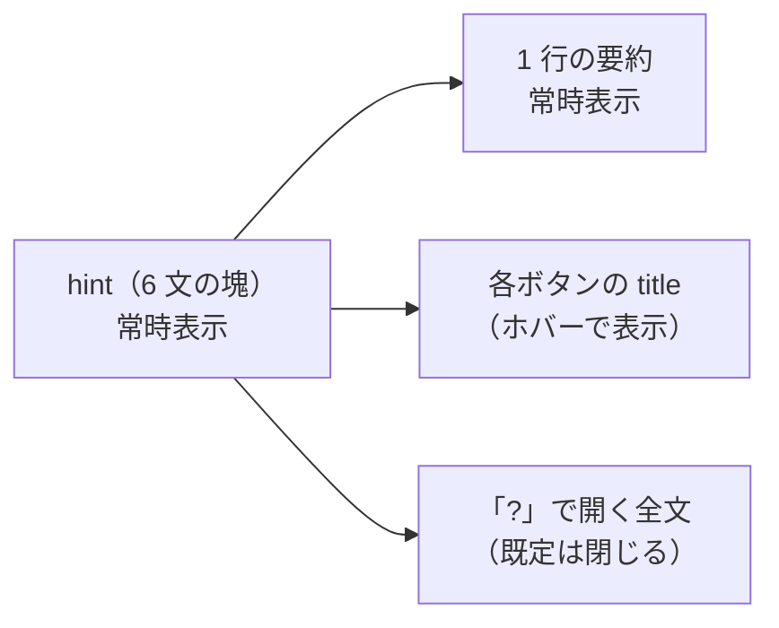

# vibeboard の Tasks 詳細ペインの説明文を短くする

作成日: 2026-09-11。対象タスク: **vibeboardのTasksの画面上右の説明文が長すぎる**。

## 1. 目的・背景

タスク詳細ペイン（画面右）の下部にある説明文（`vibeboard/src/web/app.js` の `hint`、約 340 字・6 文）が、どのタスクを開いても毎回全文表示される。

- 中身は「投函の仕組み」「プラン作成・説明・削除・子タスク追加それぞれの説明」「追加の指示の効き方」「送り先の登録の仕組み」の 4 種で、**機能を足すたびに 1 文ずつ増えてきた**（直近は 2026-09-11 の子タスク追加）
- 毎回読む必要のある文はほぼ無い。初見に要るのは「ボタンを押すと何が起きるか」だけで、それも押す直前にそのボタンの分だけ分かればよい

## 2. 対応方針

説明を「見えるのは 1 行・詳細は出どころに寄せる」に組み替える。

> この図の主張: いま 1 つの塊に入っている 4 種の文を、読む場面に合わせて 3 か所へ振り分ける（常時見えるのは 1 行だけ）。

1. **常時表示は 1 行だけ**: 「実行・プラン作成・説明は選んだセッションへ投函し、子タスク追加はバックグラウンドの Claude Code が処理します。」＋ 末尾に「?」トグル
2. **ボタンごとの説明は title（ツールチップ）へ**: 実行 / プラン作成 / 説明 / 削除に 1 文ずつ付ける（子タスク追加には既にある）。「追加の指示」の効き方は textarea 側の title に付ける
3. **全文は「?」を押したときだけ開く**: いまの 6 文をそのまま折りたたみブロックへ移す（情報は 1 文字も捨てない。ツールチップはホバーできない環境の代替にもなる）。開閉状態は保持しない（既定で閉じる）
4. **条件つきの警告は今のまま**: `loadTaskTargets` が出す「hook が入っていない」「未登録のセッションがある」の注意（`note` 要素）は別物なので触らない

## 3. 影響範囲

- `vibeboard/src/web/app.js` — `hint` の組み立ての置き換え・各ボタンへの title 追加・「?」トグル
- `vibeboard/src/web/style.css` — トグルと折りたたみブロックの少量のスタイル
- サーバ無変更（再起動不要。src/web はディスク配信）
- ⚠ **本体（akiraak/vibeboard）にも同じ変更を入れる**。2026-09-11 に vendor と本体を一致させたばかりなので、実装したら同じ差分を本体へ push して一致を保つ（放置すると次の `vibeboard update` で消える状態に戻る）

## 4. テスト方針

- `node --check` で構文検査
- ブラウザで確認: 常時表示が 1 行になっている ／「?」で全文が開閉する ／ 各ボタンにツールチップが出る
- 情報の取りこぼし検査: いまの 6 文の内容が「1 行・title・全文ブロック」のどこかに全部残っていることを突き合わせる

## 5. Step

1 Step（app.js ＋ style.css の同時変更）。Phase 分割はしない。実装後に本体へ反映して完了。
