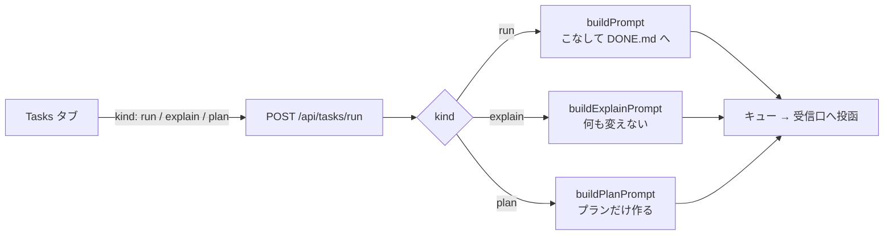
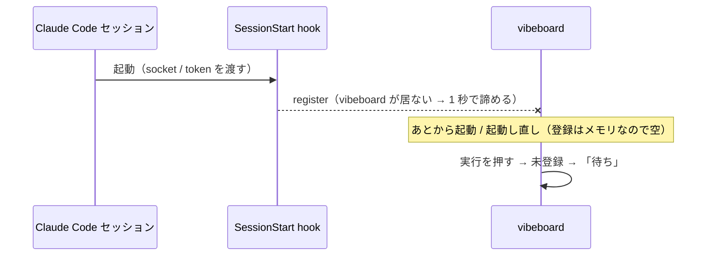

# vibeboard の Tasks タブに「プラン作成」ボタンを足す

作成: 2026-09-07

## 目的・背景

Tasks タブのボタンは 実行 / 説明 / 削除 の 3 つ。「実行」は実装まで進み、「説明」は何も変えない。
その中間の **「プランだけ作らせる」** 入口が無い。CLAUDE.md の作業着手ルール 1〜3（プランファイルを作り、
TODO.md にリンクを付け、Phase / Step を子タスクにする）はどのプロジェクトでも最初にやることなので、
ボタン 1 つで投函できるようにする。

あわせて、投函が「待ち」のまま進まない不具合（2026-09-07 に実機で踏んだ）も同じ push で直す。

## 対応方針

### Phase 1: プラン作成ボタン

「実行」「説明」と同じ経路（`POST /api/tasks/run`）に 3 つ目の `kind: 'plan'` を足す。文面はサーバが組む方針は変えない。

プランの文面を「実行」「説明」と並べると、違いは末尾の指示だけ。

`buildPlanPrompt` の指示（作業着手ルール 1〜3 を、TODO.md のこの項目に当てはめた形）:

1. `docs/plans/<task-name>.md` にプランを作る（目的・背景、対応方針、影響範囲、テスト方針。Phase / Step があれば明示）
2. `TODO.md` のこのタスクにプランへのリンク `[plan](docs/plans/<task-name>.md)` を付ける
3. Phase / Step があれば、このタスクの子タスクとして足す
4. **実装には着手しない**。`TODO.md` の変更はリンクと子タスクの追加だけ。DONE.md にも移さない

### Phase 2: 「待ち」のまま進まない不具合

現状の登録はメモリだけで、hook は SessionStart にしか無い。**vibeboard より先に起動したセッション**と、
**vibeboard を起動し直した後**のセッションは未登録のままになり、投函が「待ち」→ 5 分で「失敗」になる。

直し方: 登録が無いときは **`claude agents --json` の `pid` から受信口の場所を組み立てて投函する**
（`$XDG_RUNTIME_DIR/cc-socks/<pid>.sock` ほか候補を順に探し、存在するものを使う）。token は無しで送る
（Linux では auth 行は省略可。受信側が prompting 系なら外部プロセスからの投函も配送される）。
hook の登録はそのまま残す（token が要る環境と、`claude` が PATH に無い環境の経路）。

## 影響範囲

upstream `akiraak/vibeboard` だけ。このリポジトリは再 degit と `vibeboard init` で取り込む。

| ファイル | 変更 |
| --- | --- |
| `src/todo.ts` | `buildPlanPrompt` を追加 |
| `src/tasks.ts` | `TaskKind` に `plan`。キューの読み直しで `plan` を残す。受信口の場所を pid から組み立てる関数 |
| `src/server.ts` | `/api/tasks/run` の `kind` に `plan`。`drain` で登録が無ければ pid から受信口を引く |
| `src/web/app.js` | 4 つ目のボタン、状態文の動詞、案内文、キューの種別表示 |
| `test/todo.test.js` / `test/tasks.test.js` | 文面の検査、受信口の場所の検査 |
| `src/templates/claude-md-snippet.md` / `README.md` | 「実行 / 説明 / 削除」を 4 つに。「待ち」の説明を更新 |

## テスト方針

- `npm test`（純関数とテスト内のソケットへの投函）
- 実機: このリポジトリで vibeboard を起動し直し → Tasks タブで「プラン作成」を押す → 送り先のセッションが
  プランファイルと TODO.md のリンク・子タスクだけを作り、コードに触れないことを見る
- 実機: vibeboard を起動し直した直後に「実行」を押しても「待ち」にならず届くことを見る（Phase 2 の確認）
