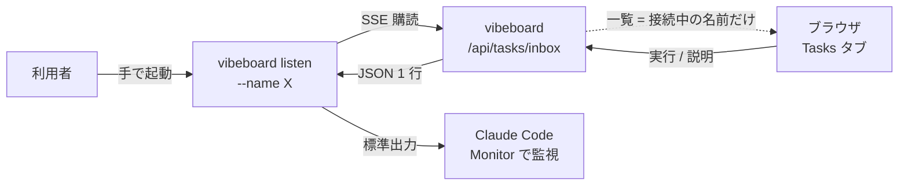
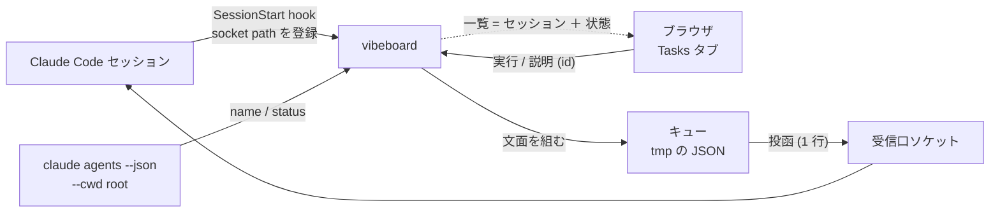
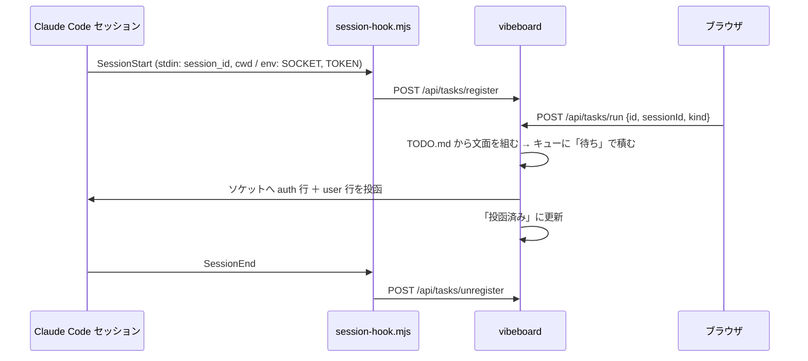
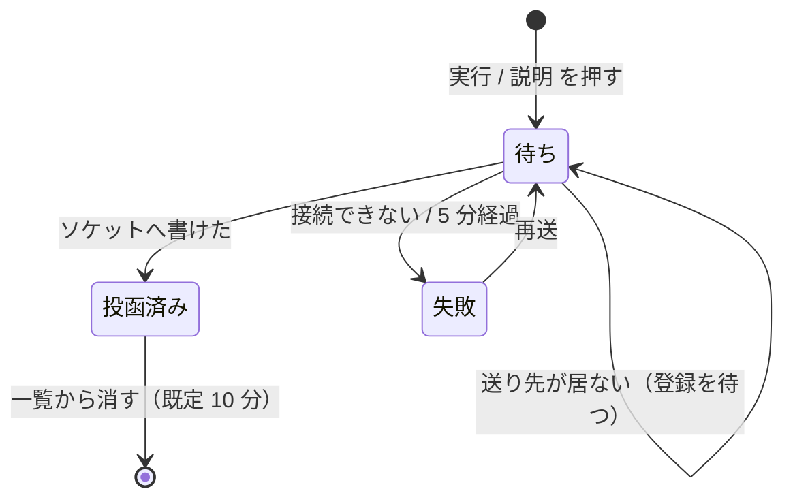

# vibeboard の Tasks を listener なしで届ける（セッションの発見と投函を Claude Code に任せる）

起票: 2026-09-07（[TODO.md](../../../TODO.md)「vibeboard の Tasks を listener なしで届ける」）。
対象は upstream の [akiraak/vibeboard](https://github.com/akiraak/vibeboard)（手元クローン `/home/ubuntu/vibeboard`、`main` は origin と一致）。
このリポジトリの `vibeboard/` は vendor なので直接は触らず、upstream に実装して再 degit する（daily-note の決まりと同じ）。

⚠ 売買システムの管理画面 `dashboard/` とは無関係。vibeboard は `docs/` と `TODO.md` を見る開発用の道具。

## 0. 決定事項

| 論点 | 決定 | 理由 |
| --- | --- | --- |
| 送り先の発見 | **`claude agents --json --cwd <root>`** を vibeboard が読む。listener の接続で一覧を作るのをやめる | 対話セッションも `name` / `cwd` / `status` / `pid` / `sessionId` 付きで返る（2026-09-07 実機確認。この画面が `ai-income-lab-41` として出た） |
| 受け渡し | **セッションの受信口（Unix ソケット）へ vibeboard が直接投函**する | 公式ドキュメントが「スクリプトや hook から投函する」用途を明記。受信側が idle なら新しいターンが始まる |
| ソケットの所在 | **SessionStart hook がセッション自身を vibeboard に登録**する（パスは hook に `CLAUDE_CODE_MESSAGING_SOCKET` として渡る）。SessionEnd で解除 | `/run/user/<uid>/cc-socks/<pid>.sock` という形は実装の都合で、規則として頼らない。hook に渡る値だけを正とする |
| hook の配置 | **`vibeboard init` がプロジェクトの `.claude/settings.json` に書く**（既存の hooks と併合、二重登録なし） | CLAUDE.md のスニペットと同じ仕組みで、clone した先でも効く。セッションごとの手作業を無くす |
| キュー | **ディスクに持つ**（`os.tmpdir()/vibeboard-tasks-<root の hash>.json`）。状態は 待ち / 投函済み / 失敗 | 送り先が居なくても受け付け、vibeboard を再起動しても消えない。再起動をまたぐ必要は無いので tmp でよい |
| 文面 | 変えない。**サーバが TODO.md から組む**（`buildPrompt` / `buildExplainPrompt`） | ブラウザからは id と決め打ちの値しか受けない方針は維持 |
| 端末が無いとき | **`claude --bg -n todo-<id>`** で起こす（Phase 4、任意）。状態は `claude agents --json` の `state` / `waitingFor`。**2026-09-07: 見送り**（§10） | 以前「判定方法が未確定」だった承認待ちが `state: blocked` / `waitingFor: "permission prompt"` で取れる。ただしこの環境で起動を検証できず、既定の worktree 隔離で TODO.md の更新先がずれる問題も未解決 |
| `vibeboard listen` | **残す**が既定の経路ではなくなる（互換。Windows など投函が通らない環境の逃げ道） | 消すのは 1 版置いてから |
| channels | 使わない | research preview で、独自 channel は毎回 `--dangerously-load-development-channels` が要る。preview を抜けたら再検討 |

## 1. 目的と背景

Tasks タブは「受け取る画面で `vibeboard listen --name <名前>` を回しておく」設計で、送り先の一覧はサーバのメモリ上の SSE 接続だけから作っている。
そのため (1) 誰かが手で listener を起動するまで「待ち受けている画面がありません」のままになり、(2) 名前を人が決めて覚える必要があり、(3) vibeboard を再起動すると溜め置きも消える。
2026-09-07 の調査で、この 3 つはすべて Claude Code 側が既に持っている機能で置き換えられると分かった。

> この図の主張: 今は人が起動する listener が経路の真ん中にいて、それが無いと何も届かない。



調べて確認した事実（出典: [cross-session-messaging](https://code.claude.com/docs/en/cross-session-messaging.md) / [agent-view](https://code.claude.com/docs/en/agent-view.md) / [hooks](https://code.claude.com/docs/en/hooks.md)、いずれも 2026-09-07 取得）:

- `claude agents --json` は対話セッションも返す（`--help` に「interactive and background」）。`--cwd <path>` で絞れる
- 各セッションは受信口の Unix ソケットを持ち、パスとトークンが `CLAUDE_CODE_MESSAGING_SOCKET` / `CLAUDE_CODE_MESSAGING_TOKEN` として **hooks（SessionStart を含む）と Bash 子プロセス**に渡る。Linux では auth 行は省略可
- 届いた文面は「他セッションから」と明示され、承認の代わりにならず、`/` コマンドは実行されない。受信側の権限プロンプトはその端末で出る（今の inbox 方式と同じ性質）
- 受け入れ規則: `crossSessionInbound` 未設定なら、受信側が通常の権限モード（default / auto / acceptEdits / dontAsk）のとき素通しで届く。受信側が bypassPermissions のときは承認ダイアログで保留
- 投函の書式はドキュメントに auth 行しか無いが、Claude Code 2.1.263 のバイナリ自身がデバッグ案内として次を埋め込んでいる:
  `{"type":"auth","token":"…"}` の次に `{"type":"user","message":{"role":"user","content":"…"}}` を 1 行、`socat - UNIX-CONNECT:<path>` で送る
- ⚠ 自セッションのソケットへ投函する実証は、この画面では auto mode の分類器に止められた。**Phase 0 で利用者が端末から試す**

## 2. 対応方針

> この図の主張: listener が消え、発見は `claude agents`、所在は hook の登録、配送はソケットへの投函、に分かれる。



### 2-1. 送り先の発見（Phase 1）

- `GET /api/tasks/windows` の中身を `claude agents --json --cwd <root>` に置き換える。返すのは `sessionId` / `name` / `status`（busy / idle）/ `kind` / `registered`（hook の登録があるか）
- `claude` が PATH に無い、または JSON が読めないときは hook の登録だけで一覧を作る（名前は sessionId の先頭 8 文字）
- 既存の `vibeboard listen` の接続も同じ一覧に混ぜる（`kind: "listen"`）。互換のため
- 一覧は 5 秒おきに取り直す（`claude agents` の起動コストが見合わなければ 10 秒）

### 2-2. 登録と投函（Phase 2）

> この図の主張: セッションは起動時に自分の所在を 1 回知らせるだけで、以後は vibeboard が押す側になる。



- **hook スクリプト** `vibeboard/scripts/session-hook.mjs`（Node、依存なし）。stdin の hook JSON（`session_id` / `cwd` / `hook_event_name`）と env の 2 変数を読み、vibeboard へ POST する。ポートは `VIBEBOARD_PORT` → `vibeboard.config.json` の `port` → 3010（vibeboard 本体と同じ「環境変数 > 設定ファイル」の順）。**vibeboard が落ちていても 1 秒で諦めて exit 0**（セッションの起動を止めない）。`async: true` で登録する
- **登録の中身**: `sessionId` / `cwd` / `socket` / `token` / `pid`。**token はメモリにだけ持ち、ディスクにもブラウザにも出さない**。`cwd` が `--root` の外なら登録を拒む
- **投函**: Unix ソケットへ接続し、auth 行と user 行を書いて閉じる。接続できない（ENOENT / ECONNREFUSED）なら「失敗」にして登録を外す。1 セッションへの連投は 1 秒に 1 件に絞る（受信側の burst 制限に当たらないため）
- **`vibeboard init` の拡張**: CLAUDE.md のスニペットに加えて、`.claude/settings.json` に `SessionStart` / `SessionEnd` の hook を書く。既存の hooks は残し、コマンドが `vibeboard/scripts/session-hook.mjs` を指す項目だけを自分のものとして置き換える（冪等）。`--dry-run` で内容を出す。`.claude/settings.json` を書きたくない人のために `--no-hooks` を付ける

### 2-3. キューと状態（Phase 3）

> この図の主張: タスクは「待ち」から始まり、投函できたかどうかだけで分かれる。実行の成否は追わない。



- キューは `os.tmpdir()/vibeboard-tasks-<sha1(root) 先頭 8 文字>.json`。1 件 = `{ id, taskId, text, kind, sessionId, state, at, error }`。書き込みは tmp → rename
- 送り先が未登録のまま押されたときは「待ち」で積み、その sessionId の登録が来た時点で投函する。登録が来ないまま 5 分で「失敗」
- Tasks タブに各タスクの状態（待ち / 投函済み / 失敗）とセッションの状態（busy / idle / 未登録）を出す。「失敗」には再送ボタン
- **実行の成否は追わない**（transcript を読む案は非スコープ。完了は TODO.md から消えたかで分かる）

### 2-4. 端末が無いとき（Phase 4、任意）

- 送り先の一覧に「新しいセッションで実行（`claude --bg`）」を足す。`claude --bg -n todo-<taskId> --permission-mode default "<文面>"` を `--root` で起動し、返る短い id を記録する
- 状態は `claude agents --json` の `state`（working / blocked / done / failed / stopped）と `waitingFor` で出す。`blocked` には `claude attach <id>` を案内する
- ⚠ 既定で worktree に隔離される（`worktree.bgIsolation`）。`.claude/settings.json` で `"none"` にするかは各プロジェクトの判断。プランではそのまま（隔離あり）を既定にする

### 2-5. 互換と後片付け（Phase 5）

- `vibeboard listen` は残す。README では「投函が通らない環境の逃げ道」に格下げする
- `claude-md-snippet.md` の待ち受けの 1 行を「`vibeboard init` が hooks を書く。手で回すなら `listen`」に書き換える
- upstream へ commit / push → ai-income-lab と daily-note で再 degit → `vibeboard init` を流し直す

## 3. API（すべて同一オリジン。返しは `{ success, data, error }`）

| 口 | 役目 | 変更 |
| --- | --- | --- |
| `GET /api/tasks/windows` | 送り先の一覧。`claude agents --json` ＋ 登録 ＋ listen 接続 | 中身を差し替え |
| `POST /api/tasks/register` | hook からの登録 `{ sessionId, cwd, socket, token, pid }` | 新設。**127.0.0.1 からの POST だけ**（既存の門番と同じ） |
| `POST /api/tasks/unregister` | `{ sessionId }` | 新設 |
| `POST /api/tasks/run` | `{ id, sessionId, kind }`。`windowId` を `sessionId` に改める（listen 経由は名前のまま） | 変更 |
| `GET /api/tasks/queue` | キューの一覧（状態つき） | 新設 |
| `POST /api/tasks/retry` | `{ queueId }` を「待ち」に戻す | 新設 |
| `POST /api/tasks/dismiss` | `{ queueId }` を一覧から消す（投函済み / 失敗） | 新設 |
| `POST /api/tasks/spawn` | `{ id, kind }` で `claude --bg` を起動 | 新設（Phase 4） |
| `GET /api/tasks/inbox` | listen 用 SSE | 残す |

## 4. 影響範囲

| 場所 | 変更 |
| --- | --- |
| `src/server.ts` 742〜870 行（Tasks の区画） | windows の差し替え、register / unregister / queue / retry / spawn、ソケット投函 |
| `src/tasks.ts`（新設） | キュー（読み書き・状態遷移）、`claude agents --json` の読み取り、ソケット投函。**純関数と I/O を分け、純関数側をテスト**する |
| `src/cli.ts` | `init` に hooks の書き込み（`--no-hooks` / `--dry-run`）。`listen` はそのまま |
| `src/init.ts` | `.claude/settings.json` の冪等な併合 |
| `scripts/session-hook.mjs`（新設） | hook 本体。`files` に `scripts` は既に入っている |
| `src/web/app.js` 2285〜2520 行、`style.css` | 送り先にセッション名と状態、キューの一覧、再送、`--bg` の項目 |
| `test/tasks.test.js`（新設） | §6 |
| `README.md` / `src/templates/claude-md-snippet.md` | Tasks の説明と `init` の説明 |
| ai-income-lab / daily-note | 再 degit、`vibeboard init` の再実行、`.claude/settings.json` の差分確認 |

`src/todo.ts`（解釈と文面）と `portGuard.ts` / `sidecar.ts` / `source.ts` は触らない。

## 5. Phase 構成

### Phase 0: 実証（着手の門）

利用者が端末で行う（この画面の Claude は分類器に止められる。§10）。**実装（Phase 1〜3）は先に済ませたので、実証は Tasks タブから行うのが最短**。結果を §10 に記録する。

1. vibeboard を起動し直す（ai-income-lab で `./run-vibeboard.sh`。古いものは同じ root なので自動で止まる）
2. 新しい端末で `claude` を起動する（ai-income-lab 直下）。SessionStart hook が登録し、Tasks タブの送り先に「登録済み・待機中」で出る
3. Tasks タブで小さいタスクを選び「説明」を押す。そのセッションで新しいターンが始まり、説明が返れば **門の 2 は通過**
4. 同じセッションが busy のとき（長い処理中）にもう 1 度押し、tool 呼び出しの合間に読まれることを確認する（**門の 3**）
5. `claude --permission-mode bypassPermissions` で起動したセッションへ送り、承認ダイアログで保留になることを確認する（想定どおり。画面の案内文に書いてある）
6. 届かないとき: `.claude/settings.json` に `session-hook.mjs` があるか → `/status` の `Peer address` にあるソケットへ手で 1 行送る
   ```bash
   echo '{"type":"user","message":{"role":"user","content":"投函テスト。何もせず「届いた」とだけ答えて"}}' | nc -U <Peer address の uds: 以降>
   ```
   （`socat` はこの機械に無い。`nc -U` は使える）

**門**: 3 と 4 が通らなければ、この案は取り下げて代替（Stop / UserPromptSubmit hook でキューを読ませる ＋ `listen` を残す）を別プランにする。`listen` は残してあるので、その間も Tasks タブは使える。

### Phase 1: 送り先の発見（§2-1）

- `src/tasks.ts` に `listSessions(root)`（`claude agents --json` の実行と整形）と、その純関数部分（JSON → 一覧）
- `GET /api/tasks/windows` を差し替え。UI の送り先にセッション名と状態を出す

### Phase 2: 登録と投函（§2-2）

- `scripts/session-hook.mjs`、`POST /api/tasks/register` / `unregister`、ソケット投函
- `vibeboard init` の hooks 書き込み（冪等・`--dry-run`・`--no-hooks`）
- 「実行 / 説明」がソケット経由で届くところまで

### Phase 3: キューと状態（§2-3）

- tmp のキュー、状態遷移、送り先待ちの投函、5 分の失敗、再送
- Tasks タブにキューの一覧と状態

### Phase 4: 端末が無いとき（§2-4、任意）

- `POST /api/tasks/spawn`、`claude --bg` の起動と `state` の表示、`claude attach` の案内

### Phase 5: 互換・ドキュメント・取り込み（§2-5）

- README / snippet、upstream へ push、2 プロジェクトで再 degit と `init`

## 6. テスト方針

- **単体（`node --test`、`test/tasks.test.js`）**
  - `claude agents --json` の出力（実機で控えた JSON を fixture に）→ 一覧の整形。`name` 無し・`status` 無し・他プロジェクトの行を除く
  - キューの状態遷移（待ち → 投函済み / 失敗、5 分の失敗、再送）。時計は注入する
  - `.claude/settings.json` の併合: 空 / 他の hooks あり / 既に自分の項目あり、の 3 通りで冪等
  - ソケット投函: テスト内で Unix ソケットのサーバを立て、**auth 行と user 行が 1 行ずつ届く**こと、接続失敗で「失敗」になること
- **手動（Phase ごと）**
  - Phase 2: 端末を 2 つ開き、idle のセッションへ送って新しいターンが始まる／busy のセッションへ送って合間に読まれる
  - Phase 3: 送り先が居ない状態で押す → セッションを起動 → 登録と同時に届く。vibeboard を再起動しても「待ち」が残る
  - 受信側が bypassPermissions のとき保留になる（Phase 0 と同じ）
  - `claude` が PATH に無い環境（PATH を細工）で一覧が登録だけで出る
- **回帰**: `npm test`（既存 24 件）と `selftest` 相当の起動確認。`listen` 経由の実行が今までどおり動く

## 7. 作業量の見積もり【推測】

| Phase | 作業 | 目安 |
| --- | --- | --- |
| 0 | 実証（利用者） | 0.5 時間 |
| 1 | 発見 | 0.5 日 |
| 2 | 登録・投函・init | 1 日 |
| 3 | キューと状態 | 0.5 日 |
| 4 | `--bg`（任意） | 0.5 日 |
| 5 | 互換・文書・取り込み | 0.5 日 |

合計 2.5〜3 日【推測】。Phase 4 を落とせば 2〜2.5 日。

## 8. 未確定・リスク

- **投函の書式はドキュメントではなくバイナリの案内文に依る**。Claude Code の版が変わると壊れうる。失敗をキューの「失敗」として画面に出し、`listen` を逃げ道として残す。Phase 0 の結果をここに追記する
- **同じ OS ユーザーなら誰でも投函できる**。vibeboard は 127.0.0.1 固定で、文面はサーバが組む。register は 127.0.0.1 からの POST だけ受ける。token はメモリだけ
- **hook が session の起動を遅らせない**こと。`async: true` と 1 秒のタイムアウト。vibeboard が落ちていれば黙って exit 0
- **`.claude/settings.json` を `init` が書くことへの抵抗**。`--no-hooks` と `--dry-run` を用意し、README に「hooks の中身」を丸ごと載せる（手で貼れる）
- **`claude agents --json` の起動コスト**。5 秒おきが重ければ 10 秒、または Tasks タブを開いている間だけ
- **Windows**（native）は auth 行が必須で名前付きパイプ。対象外だが、token を登録に含めておけば後から対応できる
- **channels が preview を抜けたら**、投函を channel に載せ替える案を再検討する（この設計の hook 登録とキューはそのまま使える）

## 9. 非スコープ

- 実行結果の追跡（transcript の読み取り）。完了は TODO.md から消えたかで分かる
- 承認の中継（channels の permission relay 相当）
- Windows native 対応
- Tasks タブの見た目の作り直し

## 10. 実施記録

### 2026-09-07: Phase 1〜3 と Phase 5 の文書を実装。Phase 0 は利用者待ち

- **Phase 0 を Claude が代行する試みは、auto mode の分類器に 3 回止められた**: (1) 自セッションのソケットへの投函（調査時）、(2) 検証用の `claude --bg` セッションを SessionStart hook 付きで起こして socket を控え、Node で投函する一式、(3) `strings` でバイナリから書式の案内文を抜き直す。**投函の実証は利用者の端末でしか通らない**と結論し、§5 Phase 0 を「Tasks タブから行う」手順に書き換えた
- 実装先は upstream の作業ツリー `/home/ubuntu/vibeboard`（**未コミット**。コミット / push は利用者の依頼で行う）
  - 新設: `src/tasks.ts`（`parseAgentsJson` / `listClaudeSessions` / `Registry` / `postToInbox` / キューの純関数と `TaskQueue`）、`scripts/session-hook.mjs`、`test/tasks.test.js`
  - 変更: `src/server.ts`（Tasks 区画。`windows` の差し替え、`register` / `unregister` / `queue` / `retry` / `dismiss`、投函と drain、listen は互換で残す）、`src/init.ts`（`mergeHooks` / `planHooks`、`--no-hooks`）、`src/cli.ts`、`src/web/app.js`（送り先にセッション名と状態、投函の状態の一覧、5 秒おきの取り直し）、`src/web/style.css`、`README.md`（「Tasks タブの仕組み」節とトラブルシュート 2 件）、`src/templates/claude-md-snippet.md`
- **検証**（Claude Code の実物は使わない）
  - 単体 38 件（既存 24 ＋ 新規 14）: `claude agents --json` の実機出力を fixture にした整形、キューの遷移と期限（時計を注入）、`mergeHooks` の冪等と混在グループ、テスト内の Unix ソケットへ auth 行と user 行が 1 行ずつ届くこと、ENOENT で reject、peer が閉じなくても書き終えていれば成功
  - 端から端までのスモーク（偽の受信口ソケット ＋ 実サーバ）: hook script → 登録 → 「説明」で即投函（2 行届く）→ 未登録あては「待ち」→ 登録が来た時点で投函 → 壊れたソケットは「失敗」＋ 登録を外す → 再送 → 消す → SessionEnd で解除 → root の外は 403 → `init` の dry-run / 実書き込み / 2 回目は変更なし / `--no-hooks`
- **ai-income-lab への取り込み**: upstream の作業ツリーから写してビルド（`diff -r` で一致）。`node vibeboard/dist/cli.js init --root .` で CLAUDE.md のマーカー内を更新し、`.claude/settings.json` に SessionStart / SessionEnd の hook を書いた。**今開いているセッションには効かない**（起動し直すと登録される）。動いている vibeboard も起動し直しが要る
- **Phase 4 は見送り**（§0 の表）
- 残り: Phase 0（利用者）→ 通れば upstream へ commit / push → daily-note で再 degit（daily-note の CLAUDE.md にはマーカーが無いので `init` は `--no-hooks` にして hooks は README の JSON を手で貼るか、そのまま `init` で末尾に追記するかを決める）

### 2026-09-07 15:37 PT: Phase 0 の門の 2 が実物で通った（Tasks タブ → ソケット → セッション）

- 経緯: 利用者が vibeboard を起動し直し（15:35:42、`ai-income-lab/vibeboard/dist` の新ビルド。§5 の手順 1）、新しい端末で `claude` を起動した（15:36:13。`claude agents --json` で `name: ai-income-lab-48` / `kind: interactive`）。SessionStart hook が登録し、`GET /api/tasks/windows` に `registered: true` で出た。**`listen` の接続は 0**（手順 2）
- 投函の記録（`GET /api/tasks/queue`。§2-3 のキュー）:

| 時刻 (PDT) | 種別 | 対象 | 状態 |
| --- | --- | --- | --- |
| 15:37:14 | 説明 | Phase 5 の子タスク | 投函済み |
| 15:39:33 | 実行 | 親タスク | 投函済み |

- 受信側の見え方: どちらも「Another Claude session sent a message」の前置きで届き、文面は `buildExplainPrompt` / `buildPrompt` のまま。**idle の状態で受け、新しいターンが始まった**（手順 3 ＝ 門の 2）。1 通目に対して説明を返し、2 通目のターンでこの記録を書いている
- 未実証のまま残るもの: **門の 3**（busy 中に押して tool 呼び出しの合間に読まれるか。手順 4）と **bypassPermissions で保留になるか**（手順 5）。どちらも利用者が Tasks タブから押す必要がある（受信側の Claude は自分に投函できない。§10 の 1 つ目の記録）
- 回帰: upstream の `npm test` 38 件 pass（2026-09-07）。vendor（`ai-income-lab/vibeboard/`）の `src` / `scripts` / `README.md` は upstream の作業ツリーと `diff -r` で一致
- Phase 5 の残りの現状
  - ai-income-lab の vibeboard は新ビルドで動いている（上の投函がその証拠）。**起動し直しは済み**
  - upstream は未コミットのまま（利用者の依頼待ち）。degit は GitHub から取るので、daily-note の再 degit は push の後。push 前に取り込むなら ai-income-lab と同じく作業ツリーから写してビルドする
  - daily-note で `init --dry-run` を流した（ai-income-lab 側の新ビルドで。**書き込みなし**）: CLAUDE.md にマーカーが無いので**末尾にスニペット（約 35 行）を追記**し、`.claude/settings.json` を**新規作成**する。daily-note の CLAUDE.md には手書きの「vibeboard の Tasks タブ」節（`listen --name daily-note` を案内）があり、そのまま流すと重複する。選択肢は (a) `init --no-hooks` で CLAUDE.md には触れず、hooks は README の JSON を手で貼り、手書きの節を書き直す、(b) `init` をそのまま流して手書きの節を削る。どちらでも手書きの節の書き直しは要る（`listen` が既定でなくなるため）。**利用者の判断**
  - daily-note の vibeboard（3011、14:06 起動）と `listen --name daily-note` は旧ビルドのまま動いている。`listen` は互換で残るので、取り込みまでそのまま使える

### 2026-09-07 15:50 PT: 門の 3（busy 中）も通った

- 手順 4 の実施: 受信側のセッション（`ai-income-lab-48`）で 60 秒かかるコマンド（`python3 -c "time.sleep(60)"`）を実行中に、利用者が Tasks タブから Phase 5 の子タスクへ「説明」を押した（キューの記録 15:50:09、状態は投函済み。送り先の状態は busy）
- 受信側の見え方: tool の結果と一緒に「Another Claude session sent a message while you were working」の前置きで届き、コマンド終了直後のターンで読めた。**busy 中でも取りこぼさず、tool 呼び出しの合間に読まれる**
- 残りは **bypassPermissions で保留になるか**（手順 5）だけ

### 2026-09-07 15:5x PT: bypassPermissions の保留も確認。Phase 0 はすべて通過

- 手順 5 の実施: 利用者が `claude --permission-mode bypassPermissions` で起動したセッションへ Tasks タブから「説明」を送り、承認ダイアログで保留になることを確認した（利用者の報告。§1 の受け入れ規則どおり）
- これで §5 Phase 0 の門（2・3）と手順 5 がすべて通った。**この案は採用**。`listen` は互換の逃げ道として残す
- upstream へ commit / push 済み（利用者の依頼。`e5b24d2` "Deliver Tasks to Claude Code sessions without a listener"、`main` → `origin/main`。直前に build と単体 38 件を再確認）。次は daily-note の再 degit（§2-5）
