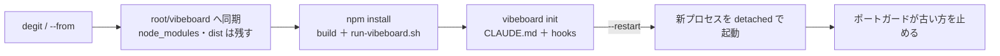

# vibeboard の更新（再 degit → npm install → init → 起動し直し）を 1 コマンドにする

作成: 2026-09-07

## 目的・背景

vibeboard 本体に変更が入るたびに、vendor 先のプロジェクトごとに「再 degit → `npm install` → `vibeboard init` →
動いている vibeboard の起動し直し」を手でやっている（2026-09-07 は ai-income-lab と daily-note で 2 回）。
利用者から「これは自動化できないか」と問われた。`vibeboard update` として upstream に入れ、各プロジェクトから
1 コマンドで済むようにする。

## 対応方針

更新の 5 段を `vibeboard update` にまとめる。起動し直しは既存のポートガード（同じ root の古いプロセスを止めて
自分がポートを取る）に任せ、update 側は新しいプロセスをバックグラウンドで起動して応答を待つだけにする。

- 取り込み元は GitHub（`npx degit akiraak/vibeboard[#ref]`）。`--from <dir>` でローカルの開発クローンからも取れる
- 同期は「上流に在るものは全部上書き、vendor 先にだけ在るものは消す」（vendor は上流の写し）。`--dry-run` で計画だけ出す
- 走っている `dist/cli.js` 自身が書き換わるので、要るモジュールは先頭で読み、`npm install` 以降は新しい dist を別プロセスで走らせる
- `run-vibeboard.sh --update` でも同じことをしてから前面で起動する（スクリプト自身が postinstall で上書きされるので、本体を関数に包んで最後に呼ぶ）

## 影響範囲

upstream `akiraak/vibeboard` だけ。`src/update.ts`（新規）、`src/cli.ts`、`run-vibeboard.sh`、`README.md`、
`src/templates/claude-md-snippet.md`（更新の 1 行）、`test/update.test.js`（新規）。

## テスト方針

- `npm test`（同期の計画と実体、mode の引き継ぎ、上流に無いファイルの削除、node_modules / dist を残すこと）
- 実機: `--from /home/ubuntu/vibeboard --restart` で daily-note（3011）を更新し、古いプロセスが止まって新しい pid が応答すること。
  ai-income-lab は `--from` で更新だけ（3010 は利用者が動かしているので起動し直しは任せる）
