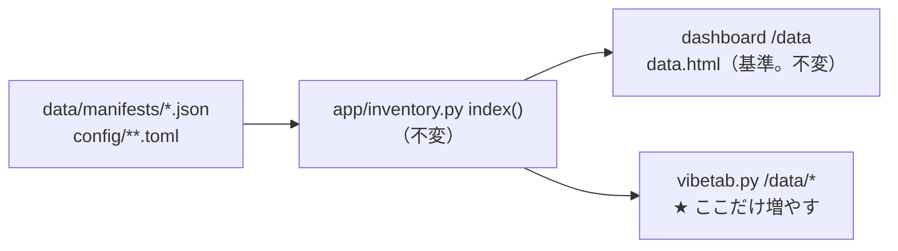

# vibeboard データタブを dashboard の /data と同じ情報量にする

作成: 2026-09-10

## 目的・背景

- 利用者の指示（2026-09-10）: 「**vibeboard データを run-server.sh と同じように情報量を増やす**」
- 対象は `dashboard/vibetab.py` の `/data/*`。比較の基準は dashboard の `/data`
  （`app/templates/data.html`、仕様は [dashboard.md §11](../specs/dashboard.md)）
- 読み方は今までどおり `app/inventory.py`（同じ数字を 2 か所で計算しない）。
  **`inventory.index()` は必要な項目を全部持っている**ので、足りないのは vibetab 側の描画だけ

## 対応方針

この図の主張: 変えるのは描画（右端）だけ。読み口・数字の出所・watch は不変。

data.html と見比べた不足と、その埋め方:

| 節 | いま vibetab に無いもの | 埋め方 |
|---|---|---|
| 概要 | 「この画面は読むだけ」の前置き | data.html の冒頭注記と同じ文を置く |
| 足（価格） | manifest のファイル名 ／ 脚注（種別は universe の宣言・raw の断層） | kv に `manifest` を足し、節の末尾に脚注 |
| 外部系列 | **系列の一覧**（各系列の行数・期間）／ dataset・取得日 ／ 規約の列 ／ 偽薬の既定文（値動きと因果を想定しない）／ 脚注（偽発見率・ずらし幅の意味） | 列を data.html と同じ並び（枠 ／ 取得元 ／ 系列 ／ 行数 ／ 期間 ／ ずらし幅 ／ 規約 ／ 仮説）にし、取得元のセルに系列一覧の details。取得元ごとの注記の details は「規約とずらし幅」の列に引っ越すので消す |
| 特徴量の表 | 調整前の層の ⚠ ／ 先読みの表の脚注 | 層のセルに ⚠、末尾に脚注 |
| 規約とずらし幅 | 根拠（terms_note）と公表の遅れ（publish_note）が 1 列に混ざる ／ 取得元のコード表記 ／ 「要判断」の脚注 | 列を 取得元 ／ 規約の判定 ／ 根拠 ／ 公表の遅れ・ずらし幅 に分け、脚注を足す |
| 割り当て | **【推測】・後知恵の注記の箱** ／ 経路の表の粒度（取得元・系列・形・重みの表）／ 脚注（重み 0 の意味・偽薬 im_scramble） | data.html と同じ構成（注記 → 経路の表 → 重みの details）に組み替える |
| 銘柄の集合 | 生存バイアスの説明の括弧書き | 「⚠ あり（選定時点で存在する銘柄から選んでいる）」にする |

- ⚠ 脚注の文面は data.html の文をそのまま使う（言い回しを 2 つ作らない）。正本は dashboard.md §11 と rules.md
- ⚠ 数字は今までどおり `inventory.index()` の写しだけ。CSV / parquet は開かない
- 銘柄の集合の全銘柄一覧・概要の節は vibetab が既に data.html より厚いので、そのまま残す

### Step

- Step 1: `dashboard/vibetab.py` の `data_section_html` を上の表のとおり増やす
- Step 2: `dashboard/tests/test_vibetab.py` — 外部系列の系列一覧と偽薬の既定文・規約の列の分離・割り当ての注記と経路の表・脚注、の検査を足す（fixture に偽薬の manifest と経路の詳細を追加）
- Step 3: 後片付け — 3015 の反映、TODO / DONE の整理、本プランを `docs/plans/archive/` へ

## 影響範囲

- `dashboard/vibetab.py`（データの節の描画だけ。検証タブ・HTTP 層・SSE・`app/inventory.py` は不変）
- `dashboard/tests/test_vibetab.py`（fixture の拡張と検査の追加）
- dashboard 本体（3012 の `/data`）・g3plus・vibeboard 本体は触らない

## テスト方針

| # | 何を | 期待 |
|---|---|---|
| T1 | 外部系列: 偽薬の manifest（仮説なし）を fixture に足して描画 | 系列の一覧が出る・「値動きと因果を想定しない（偽薬）」・規約の列に sources.toml の判定 |
| T2 | 規約とずらし幅 | 「1 日ずらす」と根拠（terms_note）が別の列に出る |
| T3 | 割り当て: fixture の経路に source / series / kind / weights を足す | 「重みは全部【推測】」の注記・経路の表に取得元と系列・脚注（im_scramble） |
| T4 | 足（価格）・特徴量・集合 | manifest のファイル名・種別の脚注・先読みの脚注・生存バイアスの括弧書き |
| T5 | 実データで全 7 節を描画 | 例外なく HTML が返る（既存の 200 テストも維持） |

## 実測（2026-09-10）

Step 1〜3 を実施。全部 ✅。

| # | 何を | 結果 |
|---|---|---|
| T1〜T4 | `tests/test_vibetab.py`（偽薬の manifest・経路の詳細・survivorship_bias を fixture に追加、検査 4 本を追加） | **27 件 pass**（dashboard 全体は 80 件 pass、約 3 分） |
| T5 | 実データで全 7 節を描画 | 例外なし。外部系列に系列の一覧（ECB 7 本 49,349 行など）・規約の列・manifest の注記が出る |
| 反映 | 3015 をポートから引いて止め、起動し直し | vibeboard の中継 `/ext/data/view?item=external` に系列の一覧と偽発見率の脚注、`?item=exposures` に【推測】の注記と im_scramble の脚注が出る |

- 既存テストの更新 2 件: overview の行数合計（fixture に偽薬 200 行を足したので 1,300 → 1,500）と、後知恵の文言（kv の「⚠ あり」→ 注記の箱の「後知恵あり」）
- 取得元ごとの注記の details（旧 external 節の末尾）は削除した。publish_note / terms_note は「規約とずらし幅」の列（根拠 ／ 公表の遅れ）に移った
