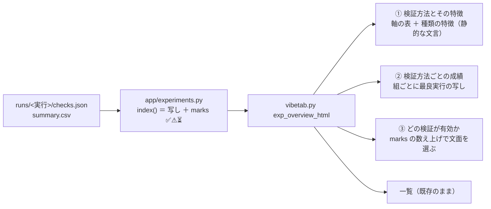

# vibeboard 検証タブの「まとめ」に検証方法の説明と有効性の分析を足す

作成: 2026-09-10

## 目的・背景

- 利用者の指示（2026-09-10）: 「**vibeboard 検証のまとめにそれぞれの検証方法の特徴などを説明。どの検証が有効かの分析も入れる**」
- 対象は `dashboard/vibetab.py` の `/experiments/view?item=overview`（検証タブの「まとめ」ページ）。
  いまは件数の kv 表と一覧の表だけで、「断面」「プーリング」が何を意味するのか・どの検証を信じてよいのかがページの中に無い
- 「検証方法」＝ **種類（断面 ／ プーリング ／ 先読みの検査）・粒度・先・層の 4 軸の組**。
  一覧のタイトルの部品（[dashboard.md §10-1](../specs/dashboard.md)）と同じ軸を使う

## 対応方針

この図の主張: 新しい 3 節も既存の一覧と同じで、**数字は checks.json の写しと marks の数え上げだけ**から組む（画面側で統計を計算しない）。

| 決めごと | 内容 | 理由 |
|---|---|---|
| 数字の出所 | 組ごとの数字は「その組で最もスコアの高い実行」の `checks.json` の写し。分析の節で数えるのは **実行の件数と ✅ の件数だけ** | 「検査は実験側が書いたものを読むだけ」（dashboard.md §10）の立て方を維持 |
| 判定の言い回し | `with_marks` の ✅ / ⚠ / ⏳ をそのまま使う。しきい値（t > 3 など）を vibetab 側に二重に持たない | 仕様 §10-3 と画面がずれない |
| 説明文の置き場 | `vibetab.py` の定数（画面向けの文言）。**文言に数字を書かない**。正本は [rules.md](../specs/experiments/feature-discovery/rules.md) §6・§7・§9 と dashboard.md §10 | 文言に数字を書くと `runs/` とずれる |
| 分析は文面の分岐だけ | 「先読みの検査が全部跳ねたか」「4 検査を同時に満たす実検証があるか」「層 ⚠ の組を比較から外す」を **写しから機械的に**選ぶ。run が増えれば文面も変わる | 手で書いた分析は次の実行で古くなる |

### Step

- Step 1: `dashboard/vibetab.py` — まとめページに 3 節（検証方法とその特徴 ／ 検証方法ごとの成績 ／ どの検証が有効か）を足す
- Step 2: `dashboard/tests/test_vibetab.py` — 組の表・分析の分岐（配線 ✅ ／ 先読み無し ／ 合格 0 件 ／ 層 ⚠ の除外 ／ 2 組の比較）の検査を足す
- Step 3: 後片付け — TODO / DONE の整理、本プランを `docs/plans/archive/` へ

## 影響範囲

- `dashboard/vibetab.py`（まとめページの HTML だけ。run 詳細・データタブ・HTTP 層・SSE は不変）
- `dashboard/tests/test_vibetab.py`（検査の追加）
- dashboard 本体（3012 の `/experiments`）・g3plus・vibeboard 本体は触らない

## テスト方針

| # | 何を | 期待 |
|---|---|---|
| T1 | 既存 fixture（4 検査 ✅ の実検証 ＋ 先読みの検査）でまとめを描画 | 組の表に「断面・日足・1 日先・調整後」、分析に「配線は働いている」「4 検査を満たす実行が 1 件」 |
| T2 | 先読みの検査が無く、検査も通らない run だけ | 「配線の確認がまだ無い」「『発見あり』と言える検証はまだ無い」 |
| T3 | 調整前（`raw`）の run を混ぜる | 「有効性の比較から外す」に調整前の組が出る |
| T4 | 断面とプーリングの 2 組 | 比較の文（スコアの上では …）に両方の組が出る |
| T5 | 実データ（`experiments/feature-discovery/runs/`）で描画 | 例外なく HTML が返り、数字が checks.json の写しと一致 |

## 実測（2026-09-10）

Step 1〜3 を実施。全部 ✅。

| # | 何を | 結果 |
|---|---|---|
| T1〜T4 | `tests/test_vibetab.py`（8 件を追加、跳ねない先読みの分岐も追加） | **23 件 pass**（dashboard 全体は 76 件 pass、約 3 分） |
| T5 | 実データ 25 run で描画 | 数字が写しと一致: 断面の最良 +2.30bp・fold 2/5・t 0.71・DSR 0.928・実効観測数 10,870 ／ 先読みの検査 9 件は +103.42〜+136.71bp で全部 ✅ ／ 調整前 3 件は比較から除外 |
| 反映 | 3015 の旧プロセスを**ポートから引いて**止め、起動し直し | vibeboard の中継 `http://127.0.0.1:3010/ext/experiments/view?item=overview` に 3 節が出る（⚠ vibeboard 本体 3010 は触っていない。sidecar は次回の vibeboard 起動時に 3015 が居れば静かに引く作りなので二重起動にならない） |
