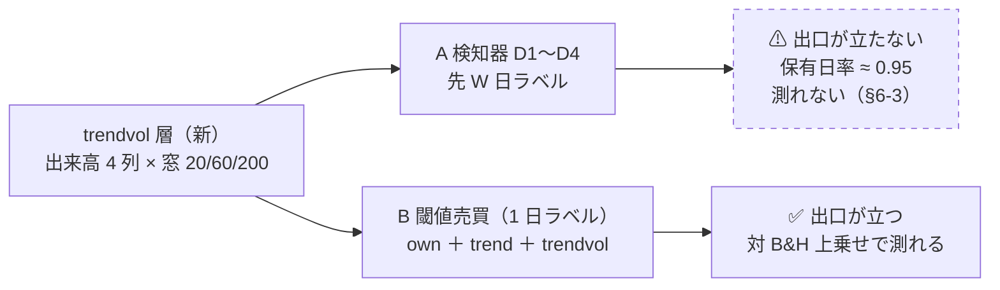
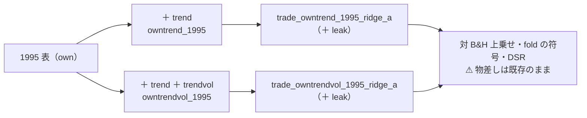

# 出来高を `trend` 層に足して検知器を回す

作成: 2026-09-17 ／ 状態: プラン（⚠ **Phase 0 の裁定が先。利用者に聞く**）
対象: `experiments/feature-discovery/`（`ail/features/trendvol.py`（新）・`cli/build.py` の `ORDER`・`config/experiment/`・`tests/`）、`docs/specs/experiments/feature-discovery/rules.md` 15-2
派生元: TODO「出来高を含んだデータから機械学習でトレンドを判断できるか調査する」（✅ 2026-09-12 完了。[volume-trend-ml.md](../specs/experiments/volume-trend-ml.md)）。✅ **利用者の決定（2026-09-12）: 回す**
親タスク（2026-09-17）: TODO「閾値売買の記録を広げる 4 本（保有日数の分布・逆売買の診断・出来高の入力・`ex_` / `im_` の回し直し）を、配線の順序を決めて回す」
関連: [theta-placement.md §2・§6-3](../specs/experiments/theta-placement.md)（θ ≥ 50 では出口が立たない・検知器の軸は閉じた）／ [rules.md 15-2](../specs/experiments/feature-discovery/rules.md)（スケールは窓だけ・同じ形の列）／ [14-4 規約 2](../specs/experiments/feature-discovery/rules.md)（名前を変えないなら 1 ビットも変えない）／ [14-9](../specs/experiments/feature-discovery/rules.md)（事前固定は構造だけ）／ [14-10](../specs/experiments/feature-discovery/rules.md)（空白は積極的に埋める）

## 1. 目的・背景

### 1-1. 何を埋めるのか

調査（[volume-trend-ml.md §2](../specs/experiments/volume-trend-ml.md)）で空いていた枠は **「出来高 × 先 W 日のラベル」** の 1 つだった。
`own` 層に出来高 4 列（`own_vratio_5/20/60`・`own_dollar_20`）はあるが、`trend` 層は終値だけで作ってある（15-2 規約 2-1）。
⚠ **回す理由は「効くはず」ではなく「価格だけの入力の軸を閉じるため」**（結果を見てから理由を決めない。[14-10 規約 3](../specs/experiments/feature-discovery/rules.md)）。

### 1-2. ⚠ 2026-09-13 に前提が変わった — 検知器では測れない

調査は「検知器は入口と出口を同時に動かすので測れる」と判定したが、その翌日に [theta-placement.md §2](../specs/experiments/theta-placement.md) が
⚠ **θ ≥ 50 では学習ゲート D1〜D4 の出口が構造的に立たない**ことを示した（先 W 日が上がる確率の中央値 59〜69。出口は買い% < 50 を要求する）。

| 実測【`runs/2026-09-12T20-40-14_trend_scales_1995` の `checks.json`】 | θ=50 | θ=55 | θ=60 |
| --- | ---: | ---: | ---: |
| 最良の学習ゲート | D4 | D2 | D3 |
| 保有日率 | 0.955 | 0.944 | 0.915 |
| 取引回数 / fold | 186 | 92 | 59 |
| 対 B&H 上乗せ bp | ＋14.7 | ＋100.6 | −56.0 |

⚠ **保有日率 0.91〜0.95 ＝ ほぼ B&H**。出来高を足しても、較正が正しいかぎり中央値は 50 を跨がない（ドリフトの側の性質で、入力の側ではない）。
⚠ **§6-3 は「追加の検証はしない」（14-10 規約 1 の『測れない』）と閉じた**。⚠ **だから本タスクは「対象を D 系から変える」か「見送る」の裁定が先**（TODO のメモ）。

### 1-3. 測れる経路 — 1 日ラベルの閾値売買

同じ出来高の列を **1 日ラベルの閾値売買**（`trade_*`。選別 × モデルの経路）に足せば、出口は立つ（保有日率 0.01〜0.83【実測。`trade_own_1995_ridge_a`】）。
⚠ **ここには出来高がもう入っている**（`own` 層の 4 列。窓 5〜60 日）ので、足すのは ⚠ **長い窓（20 / 60 / 200）の出来高**である。調査 §4-1 の一次情報（Lee & Swaminathan）が言う「出来高 × モメンタムの持続」は数か月の窓の話で、これに当たる。

> この図の主張: ⚠ **出来高の列は 1 つの層として作り、どちらの経路にも同じ列を差せる**。測れるのは右の経路。

## 2. 対応方針

### 2-0. Phase 0 — 裁定（⚠ **利用者**）

| 案 | 中身 | n_trials | 測れるか | 推奨 |
| --- | --- | ---: | :-: | :-: |
| **A** 検知器（元の決定どおり） | `trend_scales_1995` に `trendvol` を足し、D1〜D4 だけ回す | ＋12 | ⚠ **測れない**（§1-2。行は「保留・測っていない」の枠に入る） | — |
| **B** 1 日ラベルの閾値売買 | 1995 表で `own＋trend`（価格だけ）と `own＋trend＋trendvol` の対を Ridge (A) で回す | ＋6 | ✅ | ✅ **推奨** |
| **C** 見送る | 「価格だけの入力の軸」を閉じないまま残す | 0 | — | — |
| A ＋ B | 両方 | ＋18 | B だけ | 利用者が A の行も台帳に残したいときだけ |

⚠ **Claude の推奨は B**。理由: (1) 測れる (2) 出来高の効果を「長い窓の価格」から切り離せる（対の片方は価格だけ）(3) 実行は秒、実装は半日。
⚠ **A を選ぶなら 14-10 規約 1 との整合を先に書く**（「測れない」の枠に 12 行を足す理由。例: 「検知器の行に出来高の有無を並べて残す」）。
⚠ **裁定は結果を見る前に TODO に書く**（14-10 規約 3）。以下は B で書き、A の差分は §2-5 に置く。

### 2-1. Phase 1 — `trendvol` 層

⚠ **`trend` 層（`trend.py`）は 1 列も触らない**（14-4 規約 2・15-2 規約 2）。別ファイル `ail/features/trendvol.py` に `@register("feature", "trendvol")` で足し、`cli/build.py` の `ORDER` に入れる。
接頭辞は `own_`、列名は `own_trend{W}_v*`。⚠ **こう付けると `trend.scale_columns(feats, W)` が自動で拾う**ので、A を選んだときも検知器のコードを変えずに済む。

| 列（窓 W ごと） | 定義 | 由来 |
| --- | --- | --- |
| `own_trend{W}_vratio` | log(v ÷ v の W 日平均) | `own_vratio_*` と同じ形を長い窓に |
| `own_trend{W}_dollar` | log((c × v) の W 日平均) | `own_dollar_20` と同じ形 |
| `own_trend{W}_updown` | log(上げ日の平均出来高 ÷ 下げ日の平均出来高)（窓 W） | 調査 §5 の「上げ日と下げ日の出来高比」 |
| `own_trend{W}_vslope` | log v を窓 W で 1 次回帰した傾き × W | `trend._slope` をそのまま使う |

- 3 スケール × 4 列 ＝ **12 列**。⚠ **全スケールに同じ 4 列**（15-2 規約 1）
- ⚠ **窓は i で閉じる**（`shift(-k)` を使わない）。⚠ **出来高 0 の日は log で −∞ になる**ので NaN にする（`ail/data/check.py` の `zero_volume` は警告どまりで実データに残っている）
- ⚠ **分割調整は済んだ表を読む**（`ail/data/adjust.py` が価格を割った日に出来高を掛けている。⚠ **層の側で二重に直さない**）
- ⚠ **数値は 1 つも手で置かない**（窓は `trend.WINDOWS` を使い回す。14-9）
- 規約: `rules.md` 15-2 に **規約 2-2** を足す — 「出来高の長い窓は `trendvol` 層（`own_trend{W}_v*`）。⚠ **`trend` 層には混ぜない。** config に書いたときだけ表に入る」

### 2-2. Phase 2 — 表を 2 つ作り、対で回す（B）

| 表 ／ 実験 | `feature_layers` | 何のため |
| --- | --- | --- |
| `owntrend_1995`（表） | own trend | 価格だけの対照。⚠ **`own_1995` とは期間が違う**（`trend200` の助走 200 本で 1995-08-31 始まり【実測。台帳の `trend_*` 行】）ので、`trade_own_1995_ridge_a` は参考にしかならない |
| `owntrendvol_1995`（表） | own trend trendvol | 処置 |
| `trade_owntrend_1995_ridge_a` | `features_from = owntrend_1995` | `trade_own_1995_ridge_a` と `features_from` 以外は同じ（Ridge・(A)・θ 50/55/60・選別は 全部使う ＋ 乱択） |
| `trade_owntrendvol_1995_ridge_a` | `features_from = owntrendvol_1995` | 〃 |

- ⚠ **動かす軸は入力だけ**（スケール・ラベル・θ・形式・モデルは据え置き）。対の 2 本は `feature_layers` と `features_from` 以外 **1 key も違わない**ことを `tomllib` で照合する（[gan-threshold-ownex.md](../specs/experiments/gan-threshold-ownex.md) と同じ手順）
- 各本に **leak 対照**（`--leak`。7 章 規約 7）。⚠ **入力を増やすと配線の穴も増える**
- n_trials: 全部使う × Ridge × 3 θ × 2 本 ＝ **＋6**（[`is_trial`](../../experiments/feature-discovery/ail/catalog.py): 閾値売買では「全部使う × Ridge」も数える）。⚠ **回す前に決めた数**。乱択・B&H・直前符号・leak は数えない
- 計算時間【実測から推測】: 表の構築は `trend_scales_1995` と同じ規模（数分）、`trade_own_1995_ridge_a` の実行は **6 秒**【実測。`log.txt` の更新時刻】。4 本で 1 分以内

> この図の主張: 対の 2 本は表が違うだけで、⚠ **選別・モデル・シミュレータ・基準線・台帳はそのまま**。

### 2-3. 読み方（⚠ 結果を見る前に固定）

| 問い | 何を見る |
| --- | --- |
| 出来高は効いたか | 処置 − 対照 の上乗せ（θ ごと・fold ごとの符号）。⚠ **良い数字が出たらまず疑う**（調査 §4-3: 効く条件を 1 つも共有していない） |
| 採否 | 既存の判定式（13-7・11 章）。⚠ **軸は増やさない** |
| 価格だけの入力の軸を閉じられたか | 処置が対照を fold 5/5 で超えなければ「閉じる」。超えたら [14-6 (b)](../specs/experiments/feature-discovery/rules.md) の乱択ゲートと leak 対照を通してから「保留」 |

### 2-4. Phase 3 — 記録と台帳

- 記録: `docs/specs/experiments/volume-trend-input.md`（調査 [volume-trend-ml.md](../specs/experiments/volume-trend-ml.md) の続き。裁定・列の定義・対の結果・判定・限界）
- 台帳を吐き直す（`cli.report --catalog`）。⚠ **6 行（A なら 18 行）が増え、`n_trials` が 604 → 610 になる**ことを検算
- 調査記録 §7 の「保留（条件つきで採る）」に「✅ 2026-09-xx に回した → 結果」を 1 行足す
- TODO の子タスクを `DONE.md` へ

### 2-5. A を選んだ場合の差分

| # | 変更 |
| ---: | --- |
| 1 | config `trend_scales_1995_vol.toml` ＝ `trend_scales_1995` に `"trendvol"` を足し、`detectors` を **D1〜D4 だけ**にする（C1〜C3 は公表された価格の規則なので触らない。⚠ 入れると同じ数字の行が 9 行増えるだけ） |
| 2 | `k` は 6 → 10（スケールごとの列数。`scale_columns` が拾う数と一致することを検算） |
| 3 | 本番 ＋ leak の 2 本。＋12 試行。計算時間は `trend_scales_1995` と同じ（数分〜数十分【調査 §6 の推測】） |
| 4 | ⚠ **保有日率が 0.9 以上のままなら「測っていない」と記録する**（§1-2。「効かなかった」と書かない） |

## 3. 影響範囲

| 場所 | 変更 | 既存の数字への影響 |
| --- | --- | :-: |
| `ail/features/trendvol.py`（新） | 層 1 つ | なし（config に書いたときだけ表に入る） |
| `cli/build.py` | `ORDER` に `trendvol` を足す | なし |
| `ail/features/trend.py`・`ail/detectors/scale.py` | ⚠ **触らない** | なし |
| `config/experiment/` | 表 2 つ ＋ 実験 2 つ（A なら ＋1） | — |
| `rules.md` 15-2 | 規約 2-2 を 1 行 | — |
| 台帳 | 行が 6（A なら 18）増える | `n_trials` 604 → 610（A ＋B なら 622） |

## 4. テスト方針

| 対象 | テスト | 場所 |
| --- | --- | --- |
| `trendvol.build_one` | 行数・並びが入力と同じ ／ 窓が i で閉じる（末尾を切っても前の値が変わらない） ／ 出来高 0 の日が NaN ／ 分割日（NVDA 2024-06-10 10:1）をまたいで `vratio` が跳ねない（調整済みの表を読めば跳ねない） | `tests/test_trendvol.py`（新） |
| `scale_columns` | `trendvol` を入れた表で窓 W の列が 10 本、入れない表で 6 本（既存の数と同じ） | 〃 |
| 既定経路の不変 | `trend_scales_1995`（`trendvol` なし）の表の指紋が変わらない ／ 保有日数 Phase 2 で作る指紋テストがそのまま通る | `tests/test_downtrend.py`・`tests/test_trading_run.py` |
| 対の config | `feature_layers`・`features_from`・`name` 以外の key が一致 | 実行前に `tomllib` で照合し、記録に書く |
| leak 対照 | 2 本とも上乗せが跳ねる（13-10） | 実行後に `checks.json` |

## 5. 作業量・順序【推測】

| Phase | 人手 | 計算 | 依存 |
| :-: | --- | --- | --- |
| 0 | 利用者の裁定 | — | なし |
| 1 | 層 ＋ テスト ＋ 規約 1 行で **半日** | — | Phase 0。⚠ **保有日数・逆売買の Phase 2 と触るファイルが重ならない**ので並行可 |
| 2 | config 4 つ ＋ 照合で 1 時間 | 表 2 つ数分 ＋ 実行 4 本 1 分以内 | ⚠ **保有日数・逆売買の Phase 2 が入ってから回す**（新しい実行に `holds.csv` と逆売買の列が自動で残る。親タスクの順序） |
| 3 | 記録と台帳で 半日 | 台帳 数分 | Phase 2 |

金銭・契約の発生する行動はない。
