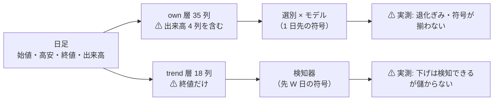
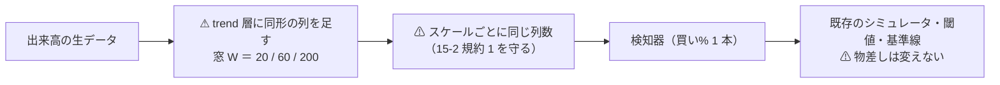

# 出来高を含めた機械学習でトレンドを判断できるか（調査）

- 親タスク: `TODO.md`「出来高を含んだデータから機械学習でトレンドを判断できるか調査する」
- 記録の置き場: [volume-trend-ml.md](../../specs/experiments/volume-trend-ml.md)
- 関連: [ts-trend-ai-survey.md](../../specs/experiments/ts-trend-ai-survey.md)（モデルの軸の調査。⚠ **入力の軸は扱っていない**）／ [entry-timing.md](../../specs/experiments/entry-timing.md)（検出限界）

利用者の指示（2026-09-12）: **出来高も含んだデータから機械学習でトレンドを判断するようなものは作れるか調査して**

## 0. なぜこの調査が要るか

⚠ **出来高は表にあるのに、トレンドの検知器には 1 列も渡っていない**（[rules.md 15-2 規約 2-1](../../specs/experiments/feature-discovery/rules.md)）。

> この図の主張: ⚠ **出来高は「表にある」と「使われている」の間で止まっている。**

⚠ **空いている枠は 1 つだけ** — **出来高 × 先 W 日のラベル**。ここは 1 度も試していない。

## 1. 調査の問い

| # | 問い | 答え方 |
| ---: | --- | --- |
| 1 | 作れるか（配線として） | ⚠ **既存コードを読んで判定する。** 契約（買い% 1 本）を変えずに済むか |
| 2 | 効く見込みはあるか | ⚠ **一次情報**（学術・公開評価）＋ ⚠ **手元の実測**（出来高が入力に入っていた実行の結果） |
| 3 | 測れるか | ⚠ **検出限界で判定する**（[14-2](../../specs/experiments/feature-discovery/rules.md)）。⚠ **入力を増やしても壁は下がらない** |
| 4 | いくら掛かるか | 実装量・実行時間・⚠ **n_trials への影響** |
| 5 | 採るか | 上の 4 つから「採る / 保留 / 落とす」 |

## 2. Phase 0: 手元の実測を先に集める

⚠ **外を見る前に手元を見る。** 出来高が入力に入っていた実行は既にある（`own` 層 35 列 ＝ 出来高 4 列を含む）。

| 見るもの | どこから |
| --- | --- |
| 出来高込み 35 列の「全部使う」の対 B&H 上乗せ | `runs/*trade_own*/checks.json` |
| 学習ゲートが退化した理由（買い% の幅） | `runs/*trend_scales*/checks.json` の `gate` |
| 出来高の列の定義と調整の落とし穴 | `ail/features/own.py` ／ [rules.md 分割調整](../../specs/experiments/feature-discovery/rules.md) |

## 3. Phase 1: 一次情報を当たる

⚠ **出典（URL・取得日）を必ず残す。** 取れないものは【推測】として扱う（CLAUDE.md）。

| 軸 | 何を確かめるか |
| --- | --- |
| 出来高に予測力があるか | 学術の一次評価。⚠ **「効いた」だけでなく「どの地平で・どの規模で」** |
| どう特徴量にするか | 出来高そのものか・回転率か・売買代金か・価格との相互作用か |
| ML の変数重要度での位置 | ⚠ **出来高系が上位に来る評価があるか** |
| ⚠ **否定的な評価** | ⚠ **肯定だけ集めない**（11 章 規約 2 と同じ向き） |

## 4. Phase 2: 設計案を書く（実装はしない）

⚠ **事前固定するのは構造だけ**（[14-9](../../specs/experiments/feature-discovery/rules.md)）。⚠ **「出来高が平均の 2 倍で売り」のような数値は置かない。**

## 5. Phase 3: 判定

⚠ **上の 5 問に答えて「採る / 保留 / 落とす」を書く。** ⚠ **採るなら n_trials の増分を事前に数える。**

## 6. 影響範囲

| 段 | 触る | 触らない |
| --- | --- | --- |
| 全 Phase | ⚠ **文書だけ**（調査タスク） | ⚠ **コード・`runs/`・台帳には触れない。新しい試行を作らない** |

## 7. テスト方針

⚠ **コードを触らないのでテストは無い。** 代わりに ⚠ **引用した数字が保存済みの記録と一致することを検算する**（実行ディレクトリと突き合わせる）。
