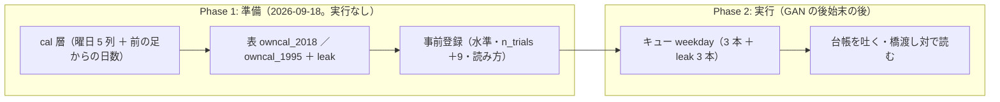

# データに曜日を含めたものを検証する

2026-09-18。利用者の指示（2026-09-17）「データに曜日を含めたものを検証する」。着手は「おススメ順でやって」（2026-09-18）。

## 1. 目的・背景

いまの特徴量の表には暦の情報が 1 列も無い（`own_` は値動きと出来高だけ）。曜日で翌日のリターンの分布が違うなら（いわゆる月曜効果・週末をまたぐリターン）、買い% に曜日を入れると張り方が変わる。⚠ 可能性は低い（既知のアノマリーは 1 日あたり数 bp 未満で、検出限界 4.74bp/日 より小さい見込み）が、**コストが低いので回す**（CLAUDE.md 2026-09-12・rules.md 14-10）。

## 2. 対応方針

**主張: 表だけを変えた橋渡し対で読む。準備（層・表・設定・事前登録）を先に済ませ、実行は GAN × ownex の後始末の後。**

- ⚠ **なぜ実行を待つか**: GAN 24 本の後始末で「台帳の n_trials が 613 のまま・判定の差分が GAN の行だけ」を検算する。先に `runs/` に足すと検算が濁る
- 層は `ail/features/cal.py`（接頭辞 `cal_`。`own_` にしない: 値は全銘柄で同じ）。⚠ config に書いたときだけ入る（既定の表は 1 ビットも変わらない ＝ 指紋テストで確認）
- ⚠ **次の足までの日数（連休の前か）は入れない**（表の上では `shift(-1)` でしか作れない。rules.md 7 章）

## 3. Phase と Step

| Phase | 中身 | 状態 |
| --- | --- | --- |
| 1 | `cal` 層 ＋ テスト ／ 表 2 つ（＋ leak）を作り、行数が基準の表と一致することを確かめる ／ 設定 5 本 ＋ キュー ／ 事前登録（`docs/specs/experiments/weekday-feature.md` §1） | ✅ 2026-09-18 |
| 2 | キュー `weekday` を回す → 台帳を吐く → 橋渡し対・leak 対照・曜日別の診断を記録に書く | ✅ 2026-09-19（[記録 §3](../../specs/experiments/weekday-feature.md)。n_trials 613 → 622） |

## 4. 影響範囲

- 新規: `ail/features/cal.py`・`tests/test_cal.py`・`config/experiment/{owncal_2018,owncal_1995,trade_owncal_ridge_a,trade_owncal_lgbm_a,trade_owncal_1995_ridge_a}.toml`・`config/queue/weekday.toml`
- 変更: `ail/bootstrap.py`（import 1 行）・`cli/build.py`（`ORDER` の最後に `cal`）・`ail/contracts.py`（接頭辞 `cal_`）
- ⚠ 回っている GAN のキューは凍結した worktree のコードを使うので、本体の変更は混ざらない

## 5. テスト方針

`tests/test_cal.py`（行数と並び・曜日の one-hot と連休明けの日数・先読み無し・`ORDER` の最後で接頭辞 `cal_`）。全体 414 件が通ること（指紋テストを含む ＝ 既存の表と実行は変わらない）。
