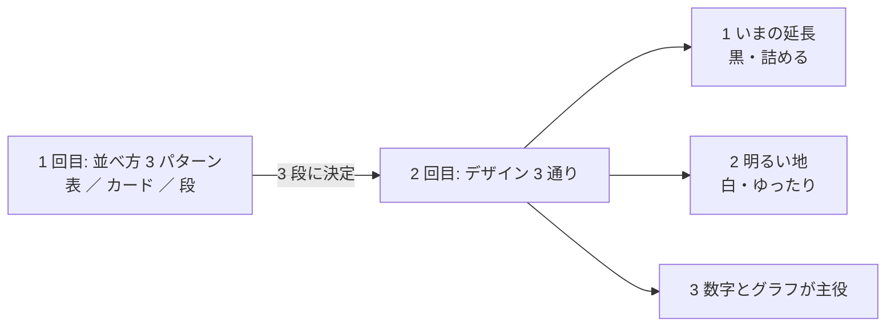

# 管理画面の画面構成とデザイン（モック）

[管理画面に必要な機能を決める](../../archive/dashboard-required-features.md) の Phase 5 で作ったモック。
⚠ **数字は執行器のモック 20 営業日の値で【実測】ではない**（試験用トレーダー 3 人。10-19 はわざと起動していない）。

> この図の主張: ⚠ **1 回目で並べ方を「3 段」に決め、2 回目はその並べ方のまま見た目だけを 3 通り変えた。**



## 2 回目: デザイン 3 通り（2026-09-18）— ⚠ いま選んでもらうのはこちら

構成は 3 つとも同じ: **上に全体の概要、その下にトレーダー（1 人 1 段）、詳細はクリック**。日次は概要から外し、**全体の詳細**へ移した（利用者の指示）。
⚠ **ナビは左ペイン**（ページ・トレーダー・操作・デザインの切り替え）。左ペインの「デザイン（比べる用）」で、同じページのまま見た目を切り替えられる。

| デザイン | 方向 | 開く |
| --- | --- | --- |
| 1 いまの延長 | 黒ベース・情報を詰める（dashboard.md §15 のまま） | [概要](design-1-dark/overview.html) ・ [全体の詳細](design-1-dark/overall.html) |
| 2 明るい地 | 白い地・余白を多めに・グラフを大きく | [概要](design-2-light/overview.html) ・ [全体の詳細](design-2-light/overall.html) |
| 3 数字とグラフが主役 | 大きな数字 1 つとグラフが主役。監視は細い帯に畳み、最新の日の表は全体の詳細へ | [概要](design-3-numbers/overview.html) ・ [全体の詳細](design-3-numbers/overall.html) |

## 1 回目: トレーダーの一覧の並べ方 3 パターン（2026-09-18）— 「3 段」に決定

[layouts/](layouts/README.md)（表 ／ カード ／ 段。記録として残す）

## 見かたの注意

- vibeboard の Plans タブ（`assets › dashboard-patterns`）で開く。グラフの点やマスに触れると値が出る（SVG の `<title>`）
- ⚠ **CSS は vibeboard の `/files/` から読む**ので、ファイルを直接（`file://`）開くと飾りが当たらない
- 管理画面と同じ CSP（`script-src 'self'; style-src 'self'`）で書いてある（スクリプトなし・インラインの style なし。CSP 違反 0 件【実測 2026-09-18】）

## 作り直す

```bash
cd docs/plans/assets/dashboard-patterns
fixtures/run.sh /tmp/lt3                  # 3 人 × 20 営業日のモックの記録（mock_c は fixtures/ にだけある）
python3 build.py --live-dir /tmp/lt3      # layouts/ と design-*/ の HTML（監視の値は fixtures/monitor-demo.json）
```

| ファイル | 中身 |
| --- | --- |
| `build.py` | 生成スクリプト。`dashboard/app/live.py` を読むのに使うだけ（本番のコードは変えない） |
| `patterns.css` | `app.css`（dashboard.md §15）に足りない部品。系列の色（黒い地）もここ |
| `theme-light.css` | デザイン 2 の色と余白（系列の色は明るい地で選び直した 3 色） |
| `design-numbers.css` | デザイン 3 の数字の段と監視の帯 |
| `fixtures/` | 3 人目の試験用トレーダー `mock_c`・記録を作る `run.sh`・デモの監視の値 |
