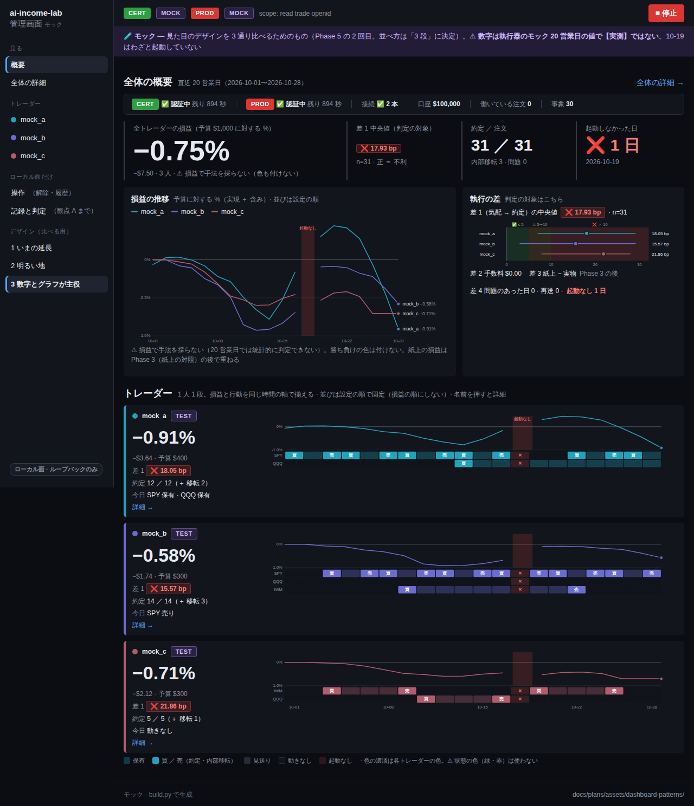

# デザイン 3 数字とグラフが主役（モック）

[3 通りのデザイン](../README.md) の 1 つ。大きな数字 1 つとグラフが主役。監視は細い帯に畳み、表は全体の詳細へ。
⚠ **数字は執行器のモック 20 営業日の値で【実測】ではない**。

| 開く | 中身 |
| --- | --- |
| [概要](overview.html) | 上に全体の概要、その下にトレーダー（1 人 1 段）。名前を押すと詳細 |
| [全体の詳細](overall.html) | 日次（概要から移した）・注文の履歴・監視の事象 |
| [mock_a](trader-mock_a.html) ・ [mock_b](trader-mock_b.html) ・ [mock_c](trader-mock_c.html) | トレーダーの詳細 |

