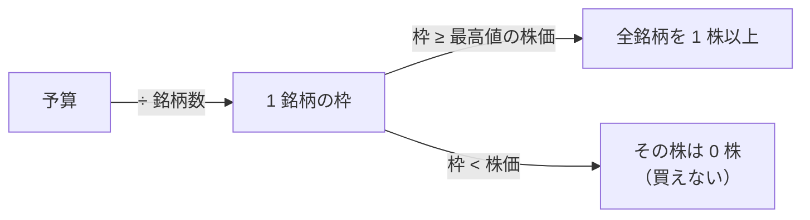
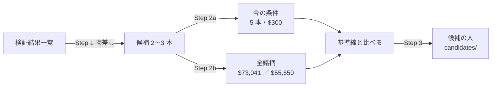

# 検証結果のうちで一番いい成績のものをベースに新しいトレーダーを作る

作成 2026-09-30（Sx360 の Claude）。親タスク: TODO「titan を使って、新規の予測モデルと、複数の予測モデルを持ったトレーダーを作成する方法を確立する」の子「検証結果のうちで一番いい成績のものをベースにして新しいトレーダーを投入する」。

## 0. 目的・背景

- 利用者の指示（2026-09-29）: **検証結果のうちで一番いい成績のものをベースにして新しいトレーダーを投入する**
- 利用者の指示（2026-09-30）: **今のトレーダーは 300 ドルしか割り振られてないけど、予算を全銘柄を購入できる条件にしての検証もする。全銘柄を購入できるトレーダーの予算金額も出す**
- 利用者の了承（2026-09-30）: 「一番いい」を成績の順でそのまま選ばず、先に物差しを決めてから今のトレーダーと同じ条件で机上にかける（下の §2）

⚠ 成績の順でそのまま選べない理由【実測。`ledger.md` 2026-09-27 生成】:

| 事実 | 意味 |
| --- | --- |
| 採る 0 ／ 745 行。保留 118 行は全部「fold の符号が割れる」か無効 | 本当に良い行は無い |
| 純利の上位は上位 K の行（例 T3 QUANT〔上位1・整数株A〕＋6,946.61bp） | 上位 K は「ボラ上位」の基準線に 10 対中 9 対で負けた ＝ 荒い株への集中と生存バイアス（`topk-holdings.md`）。CLAUDE.md「この結果で実売買の K を選ばない」 |
| 上位の成績は 63 ／ 48 銘柄・等加重・端数・予算なし・終値 | 今のトレーダー（5 本・整数株・$300・T+1）では誰も確かめていない（TODO「予測モデルの検証のようにトレーダーの検証も行う」） |

## 1. 全銘柄を買えるトレーダーの予算【計算】

株価は 13500t の `data-live/adjusted/d` の 2026-09-30 の終値【実測】（調整済み ＝ 直近の値は実際の値段とほぼ同じ）。予算はそこからの計算で、⚠ **株価が動けば変わる**。

この図の主張: 等配分の整数株では、**いちばん高い株（LLY $1,159.38）を 1 株買える枠**が全銘柄を買う条件になる。

| 見る株 | 銘柄数 | 1 株ずつ買う合計 | **等配分で全銘柄を 1 株以上** | 平均の取りこぼし ≤5% | ≤2% |
| --- | ---: | ---: | ---: | ---: | ---: |
| 会社 ＋ ETF（T1・T3 のモデルが出力する株） | 63 | $18,034 | **$73,041**（1 銘柄 $1,159.38） | 約 $175,000 | 約 $425,000 |
| 会社だけ（T2 のモデルが出力する株） | 48 | $14,661 | **$55,650**（同） | 約 $134,000 | 約 $354,000 |

- 「1 株ずつ買う合計」は等配分にならない（高い株ほど重くなる）ので、机上の等加重の検証とは別物
- 「取りこぼし」＝ 1 銘柄の枠のうち、整数株に丸めて使えなかった割合（銘柄の平均）。等配分で全銘柄を買えたときでも平均 9.6%（63 本）／ 9.3%（48 本）
- 今の予算との比べ【計算】:

| 予算 | 63 本で 1 株以上買える銘柄 | 48 本で |
| --- | ---: | ---: |
| $300（今の 1 人） | 0 | 0 |
| $1,000（規模 A の合計） | 0 | 0 |
| $10,000（規模 B） | 24 | 21 |
| $50,000 | 59 | 47 |

⚠ **$55,650〜$73,041 は口座（規模 A $1,000）の 55〜73 倍で、規模 B（$10,000。⚠ 実際の取引で使えない可能性がある）も大きく超える** ＝ この予算は**机上の検証だけ**に使う。実際に入金するかは利用者の判断で、このプランでは提案しない。

## 2. 対応方針

この図の主張: 物差しを先に固定し、同じ候補を 2 つの予算で机上にかけてから、残ったものだけを候補の人にする。

### Step 1: 「一番いい」の物差しを先に書く（結果を見る前に固定）

✅ **2026-09-30 利用者決定「進めて」＝ 推す案で固定**（候補を拾う前にここへ書いた）:

| # | 決まり | 理由 |
| ---: | --- | --- |
| 1 | 対象は検証方式「閾値売買」・判定が **保留**（＝ 上乗せ > 0）の行だけ | 実売買の執行器は閾値売買の形。毎日往復（旧）は別の物差し（13-8）。落とすは上乗せ ≤ 0 |
| 2 | 除く: 基準線 ／ 上位 K の行（手法名に〔上位…〕）／ 無効・要再測（日足 × `raw`）／ 較正「旧」（買い% が定数に潰れている ＝ [buy-pct-width-collapse.md](../specs/experiments/buy-pct-width-collapse.md)） | 上位 K は基準線に負けた・残り 2 つは既知の壊れ |
| 3 | 第 1 キー ＝ fold の上乗せの符号が正の数（`fold` 列の分子）、第 2 キー ＝ 上乗せの平均（bp/fold。判定の理由の「上乗せの平均だけ正（+X bp）」） | 平均より「どの区切りでも勝つ」を先に見る |
| 4 | 同じモデル（予測モデル名）が θ 違いで並んだら、その中の 1 位の 1 行だけを数える | 同じものを 3 本取らない |
| 5 | 上位 3 本を候補にする。今の T1〜T3 と同じモデルが入っても除かない（比べる相手として残す） | — |
| 6 | 拾った候補が `cli.predict` で予測を出せない形なら、候補のまま印を付ける（Step 2 は机上なので回せる・Step 3 で道を通す） | 実売買に載るかは別の問題 |

✅ **2026-09-30 に当てた結果**（`ledger.md` 2026-09-27 生成・1,245 行 → 決まり 1・2 で 17 行 → 決まり 3・4 で並べた）:

| 順 | 行 | fold（上乗せの符号） | 上乗せの平均 | θ | 実行 | 印（決まり 6） |
| ---: | --- | --- | ---: | ---: | --- | --- |
| 1 | **F1-7 情報係数（IC）の時系列安定性**（選別 ＋ Ridge・`own`・1995 年から・共通） | 3/5 ＋＋−−＋ | +728.46bp | 50 | `2026-09-12T20-39-38_sel_small4_1995` | `cli.predict` は選別を扱える。⚠ 1995 年からの表 ＝ 本番の `data-live/` は 2018 年からの写しが種なので、予測の道は Step 3 で確かめる |
| 2 | **F2-2 再帰的特徴量削減（RFE）**（同上） | 3/5 ＋＋−−＋ | +578.12bp | 50 | 同上 | 同上 |
| 3 | **D2 中期ゲート（60日・学習）**（検知器・Ridge・`own trend`・1995 年から・共通・**us74**） | 3/5 ＋−0＋＋ | +120.90bp | 55 | `2026-09-13T09-02-03_trend_scales_1995_us74` | ⚠ 74 銘柄 ＝ 本番の 63 銘柄に無い 11 本の日足が要る |

- 決まり 4 で数えなかった行: D2 の us63 ／ us70 版（+100.57 ／ +97.85bp）・D4 合成ゲート（3/5・+34.03bp。4 位）
- ⚠ 3 本とも **fold の符号は 3/5**（割れている）＝ 「採る」の一歩手前ではない（`ledger.md` §0）。⚠ 今の T1〜T3 のモデルは上位に入らなかった（`T3 QUANT` の単体の行は 2/5・+61.92bp で 8 位）
- ⚠ F1-7・F2-2 は `ledger.md` の理由に「閉じる（2026-09-16・代表済み）」の印がある（同じ選別の系統の代表として閉じた行）。決まりに無いので除いていない

### Step 2: トレーダーと同じ形で机上にかける（＝ TODO「トレーダーの検証も行う」と一緒に回す）

| | 2a 今の条件 | 2b 全銘柄を買える予算 |
| --- | --- | --- |
| 銘柄 | T・PFE・NKE・VZ・BAC の 5 本（事前固定） | モデルが出力する株の全部（63 ／ 48 本） |
| 予算 | $300（1 銘柄 $60） | 評価期間を通して全銘柄を 1 株以上買える額 ＝ 銘柄数 × **評価期間中の最高値**（⚠ §1 は 9/30 の株価。過去の期間では別の値になるので Step 2 の最初に計算して書く） |
| 共通 | 整数株・売却代金は翌日（T+1）・往復 5bp・θ と合成規則は検証結果一覧の行のまま・学び直しの頻度は回す前に決める |
| 基準線 | 同じ銘柄をただ持ち続ける ／ 同じ銘柄を乱択で売り買い（同じ予算・同じ整数株） |
| 器 | `ail/validation/simulate.py` の `simulate_topk`（予算・整数株を持つ。rules.md 17 章）を、銘柄を事前固定・K ＝ 銘柄数にして使う |

- 判定の物差し（採る ／ 保留 ／ 落とす）は回す前に rules.md に書く（17 章の拡張）
- ⚠ 回したものは全部 `n_trials` に数える（2a と 2b は別の検証。候補 3 本なら ＋6、leak 対照は queue が足す）
- ⚠ 2b は、机上の等加重（端数・予算なし）と 2a の間を埋める ＝「予算が足りないことでどれだけ変わるか」を測る位置づけ

**作り方の案（2026-09-30 Sx360 で読んで書いた。titan で実装する前に確かめる）**:

- 候補 3 本の実行の config（`sel_small4_1995` ／ `trend_scales_1995_us74`）を写した新しい config を作り、`[trading]` に `trader = { symbols = [...], budgets_usd = {...} }` の口を足す（`top_k` と同じく **既存の行を作り終えた後に足すだけ** ＝ `trader` の無い config は 1 行も変わらない。`cli/run.py` の `_topk_fold` の隣に `_trader_fold`）
- 1 fold ぶんの評価期間の行（`te`）を `symbols` の銘柄だけに絞ってから `simulate_topk(…, k = 銘柄数, price = close, budget_usd = …)` を呼ぶ。学習・較正・θ は元の行と同じ（絞るのは売買だけ）＝ **学び直しは fold ごと**（検証結果一覧と同じ単位。毎日の学び直しは実売買だけで、机上では再現しない ＝ 違いとして記録に書く）
- 2b の予算: fold ごとに「評価期間の `close` の最高値 × 銘柄数」を計算して渡し、記録に書く（⚠ 1995 年からの表なので、fold ごとに額が大きく違う）
- 基準線（`基準 ` で始める ＝ n_trials に数えない）: 「持ち続ける」＝ 買い% 100・出口% 0 を同じ関数に通す ／「乱択」＝ `rng` を渡す（17-4 と同じ）
- ⚠ **受渡し待ち（T+1）は `simulate_topk` に無い**。整数株の枠は「予算 ÷ K」で固定なので、売った代金を同じ日に別の銘柄へ回すことは元から起きない ＝ 効くのは「売った翌日に同じ枠で買い直す」場合だけ。足すかは実装の前に決める（足さないなら記録に「T+1 は見ていない」と書く）
- 判定: 上乗せ（対「持ち続ける」）> 0 かつ fold の符号が全部正 ＝ 採る ／ 平均だけ正 ＝ 保留 ／ ≤ 0 ＝ 落とす（13-7 と同じ形）。rules.md に新しい章として先に書く
- 検証数: 3 本 × 2 条件 ＝ ＋6（2b の銘柄数が 63 ／ 74 で違っても 1 本 1 条件）。leak 対照は `cli.queue` が足す

**✅ 2026-10-01 titan で実装した（回す前に [rules.md 20 章](../specs/experiments/feature-discovery/rules.md) へ固定 ＝ コミット `6bd2eee`）**。上の案から変えた点:

| 案 | 実装 | 理由 |
| --- | --- | --- |
| `trader = { symbols, budgets_usd }` | `[[trading.trader]]`（`tag`・`symbols`・`budget_usd`。省けば全銘柄 ／ 全銘柄を買える予算）。`cli/run.py` の `trader_conditions`・`_trader_fold` | 条件 2 つを同じ形で書ける |
| 2a の K ＝ 銘柄数 | **決めた本数（5）で固定**。評価期間に行の無い銘柄（T は 2006 年から）の枠は現金 | 行のある本数で割ると fold 1 の枠が $75 になり「枠 $60」が崩れる |
| 乱択 ＝ `rng` を渡す（17-4） | **(買い%, 出口%) の組を行のあいだで並べ替える**（種 5 の平均・診断だけ） | K ＝ 銘柄数では枠が余るので、買う順を乱しても何も変わらない |
| T+1 を足すか | **足さない**（20-1 の 4） | 17-1 の 4「売った枠は翌営業日から」がそのまま T+1。枠が固定なので売った代金を同じ日に回すことが起きない |
| 判定の相手 | `ail/catalog.py` の `_edge_vs_bh` が `〔トレーダー・…〕` の行だけ `基準 持ち続ける〔…〕` と比べる | 式は 13-7 のまま |
| — | `canonical` が ID つきの名前でも〔トレーダー・…〕を鍵に残す | 残さないと元の F1-7 の行と 1 行にまとまる。⚠ 直す前後で `ledger.md` は 1 文字も変わらないことを確かめた |

config `trader_sel_small4_1995`（F2-2・F1-7・θ 50）／ `trader_trend_scales_1995_us74`（D2・θ 55）・queue `trader_shape`。テスト `tests/test_trader_shape.py` 10 本。

**✅ 2026-10-01 に回した**（記録 [trader-shaped-validation.md](../specs/experiments/trader-shaped-validation.md)）: **採る 0 ／ 6**（保留 5・落とす 1）・n_trials 745 → 751。上乗せは 2a・2b とも残るが fold は 3/5 以下で割れる。⚠ Step 3 の進め方は記録 §4 の (a) ／ (b) を利用者が決める。

### Step 3: 残ったものを候補の人にする

- `config/traders/candidates/<置き場>/T6.toml` ほか（手順書 `howto-model-trader.md` §2）→ sim で配線を通す → 呼び名は利用者
- ⚠ 本番に入れるか・予算の上限 $1,000 の扱い（K7）は 10/20 の判定の後に利用者が決める

**✅ 2026-10-01 titan で通した**（利用者決定「(b) で進めて」。候補は 2a の上乗せが最大だった **F2-2 RFE**）:

| 手順 | 結果【実測】 |
| --- | --- |
| `cli.predict --experiment sel_small4_1995 --method "F2-2 RFE" --asof 2026-09-04`（研究用の `data/`） | 63 行・訓練 431,633 行（1995-02-10〜2026-09-02）・表 31.5 秒 ＋ fit 0.92 秒。⚠ 買い% は 63 銘柄とも 52.52（Platt a ＝ 0.0098） |
| 設定 | `config/traders/candidates/best/T6.toml`（asis・θ 50・5 本・整数株・$300）・`sim_T6`・`config/sim/sim6.toml`・`dashboard/traders.toml` の `[symbols_why]`・`models.toml` の `rfe-own1995`・`tests/test_trader.py` に 1 本 |
| `simpredict.py make sim6` → `run-sim.sh sim6`（作業用の置き場） | 64 本 349 秒 ／ 64 営業日 12 秒・注文 5 本 全部 Filled（初日に買って売らない）・検査 5,150 行 印なし 0 |
| 見つかったこと | ⚠ **今の時期の F2-2 は毎日「全部買う」**（64 日 × 63 銘柄とも買い% > 50）＝ T6 は「持ち続ける」と同じ動き。机上の上乗せは下げの時期に降りたことから来ている |

⚠ 残り: 呼び名（利用者）／ Sx360 へ `sim-predict/` を写して sim6（任意）／ 本番に入れるかと学ぶ期間（`data-live/` は 2018 年から）・予算の上限（K7。10/20 の後・利用者）

## 3. 影響範囲

- 研究側: `experiments/feature-discovery/`（config・必要なら `simulate_topk` に「銘柄の事前固定」の口）。⚠ 既定経路の指紋テスト（`tests/test_trading_run.py`）を変えない
- 文書: `rules.md`（判定の物差し）・記録 `docs/specs/experiments/trader-shaped-validation.md`（新規）・`ledger.md`（生成）
- 執行器・管理画面・本番: **変えない**（10/20 まで執行器を凍結）

## 4. テスト方針

- `simulate_topk` に口を足すなら: 口を使わない config は 1 ビットも変わらない（指紋テスト）・予算と整数株の手計算の例
- 2b の予算は「評価期間のどの日でも全銘柄が 1 株以上買える」ことをテストで確かめる
- 研究側の pytest ＋ `./run-tests.sh --fast`

## 5. 機械

- Step 1・計画: どちらでも ／ Step 2 の計算: **titan**（研究用の `data/` と DB `runs/research.sqlite`）／ Step 3 の sim: titan（作業用の置き場）か Sx360
