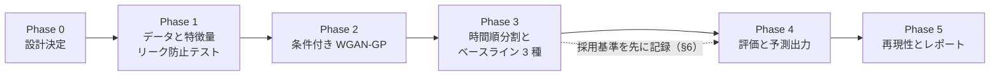
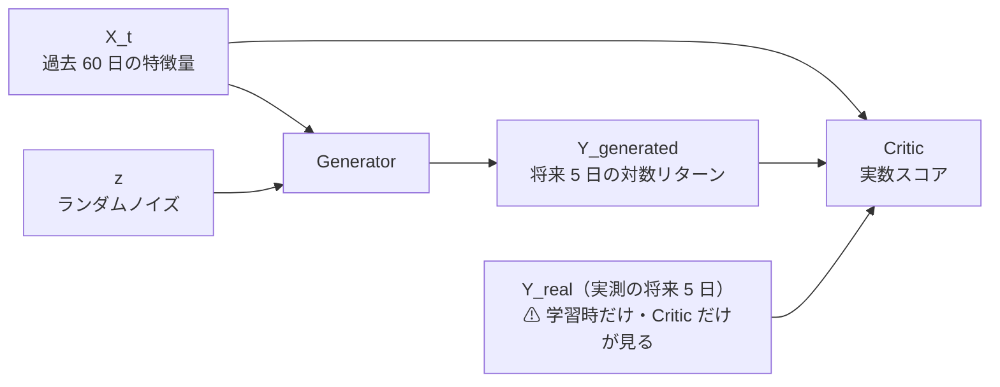

# 条件付き GAN による株価シナリオ予測（ChatGPT 案）

作成日: 2026-09-10。派生元: [TODO](../../TODO.md) の「ChatGPT からの GAN 案の実装」（利用者の指示 2026-09-10）。
出所: ChatGPT が作成した実装指示書。**§1 以降は指示書の内容をこのリポジトリの書式に写したもの**（仕様・制約・完了条件は指示書のまま）。プロジェクト固有の統合方針と用語の注意は §0 にだけ足した。

> ⚠ **資金は動かさない**（2026-08-27 の方針）。データは取得済みの日足（tastytrade の読み取り）だけを使い、発注系には触れない。指示書 §6 の売買バックテストを使う場合も机上のシミュレーションに限る。

## 0. このプロジェクトでの位置づけ（指示書の外側）

### 0-1. 用語の注意 — このリポジトリには「GAN」が 3 つある

| 呼び名 | 中身 | 状態 |
| --- | --- | --- |
| 利用者の「GAN」 | 遺伝的アルゴリズム（進化的モデル探索）。TODO 親タスクの意図 | 別タスク（未着手） |
| 増強 GAN | WGAN-GP で**訓練データを増やす**（`ail/models/gan.py`） | ⚠ **2026-09-09 に「落とす」判定**（[gpu-models.md §4](../specs/experiments/gpu-models.md)） |
| **本プラン** | **条件付き WGAN-GP を予測器として使う**。過去 60 日を条件に将来 5 日の**分布**を生成 | このプランで検証する |

⚠ 増強 GAN の「落とす」は本プランの結論を先取りしない（役割が違う）。ただし**同じ価格系列で増強が悪化した事実は、期待値を下げる方向の材料**として §6 の採用判断に書き添える。

### 0-2. 統合先と影響範囲

- 統合先は `experiments/feature-discovery/`。⚠ **1 実行 1 ディレクトリ・seed / config / 入力の指紋を残す**（rules §10）
- ⚠ **出力が点予測ではなく 1,000 本のシナリオ（分布）** なので、既存の評価ループ（`cli/run.py`）にそのまま載らない可能性が高い。載せ方（既存配線 or 専用 CLI）は Phase 0 で決めて理由を記録する
- ⚠ **手法・ハイパラ・seed を足すたび n_trials が増える**（rules §11）。振る水準は事前固定し、試した数は台帳に反映する
- 対象銘柄の初期案: **SPY**（`config/universe/us63.toml` の市場代表 `market = "SPY"`。日足は取得済み）。指示書 §2 の「流動性の高い ETF 1 銘柄」に合致。⚠ 対象を SPY にすると特徴量の「市場全体のリターン」が自分自身と重なるので、扱い（外す・別指標にする）を Phase 0 で決める
- 調整・検査は既存資産を使う: `ail/data/adjust.py`（rules 2 章）・`cli/check`・先読みの対照実験（rules 7 章の `--leak` に相当する検査を分布出力でも通す）
- 表示は**静的な評価図 ＋ CLI 出力を既定**とする（指示書 §7 が許容）。⚠ dashboard / vibetab に重い依存（pandas・torch）を入れない制約があるため、画面に出すなら実験側が書いた成果物を読ませる形にする
- 評価レポート（成果物）は `docs/specs/experiments/` に 1 ファイル（例: `cgan-scenario.md`）
- 計算資源: 3090 Ti（メモリは全部使ってよい。デバイスは `AIL_TORCH_DEVICE`）。増強 GAN の実測では WGAN-GP 1 fit ≒ GPU 3 分【実測から換算】（[gpu-models.md](../specs/experiments/gpu-models.md)）

影響範囲:

| 場所 | 変更 |
| --- | --- |
| `ail/models/` | 条件付き WGAN-GP を新ファイルで追加（既存 `gan.py` は増強用なので触らない。部品の再利用可否は Phase 0 で判断） |
| `ail/validation/` | 分布の指標（CRPS・被覆率・Brier）を追加 |
| `ail/features/` ほか | 60 日窓 → 5 日ラベルの系列テンソル化（既存はテーブル形式なので追加が要る） |
| `config/experiment/` | 新 TOML（ハイパラ・seed・分割を設定に分離） |
| `cli/` | 学習・評価・指定日予測・最新日予測の入口（Phase 0 で既存配線に載るか決める） |
| `tests/` | §8 のテスト一式 |

### 0-3. Phase 分割

> この図の主張: 先にリークを塞ぎ（Phase 1）、次にモデル（Phase 2）。採用基準を記録してから最終テストに触れる（Phase 3 → 4）。



| Phase | 中身 | 指示書の節 |
| --- | --- | --- |
| 0 | 統合位置・対象銘柄・既存 `gan.py` の再利用可否・設定の分離。設計判断は理由を記録 | §1・§2 |
| 1 | 特徴量（予測時点で利用可能な値だけ）・scaler の分割内 fit・調整の確認。リーク防止テスト | §3・§8 |
| 2 | 生成器・Critic・WGAN-GP 損失・checkpoint 選択・モード崩壊の検出 | §4 |
| 3 | 時間順分割・walk-forward・比較対象 3 種。⚠ 最終テストを見る前に採用基準を記録 | §5・§6 |
| 4 | 評価指標（CRPS ほか）・予測 JSON・校正図・予測区間図 | §6・§7 |
| 5 | 保存 → 再読込 → 再現の確認・比較表・評価レポート・採用判断 | §8・§9 |

---

以降は ChatGPT の実装指示書の内容。

## 1. 目的と作業方針

目的は、**今日までに利用可能な情報を条件に、今後の値動きを多数生成し、上昇確率・予測区間・下落リスクを推定する**こと。条件付き GAN を、既存モデルと比較可能な予測モデルとして追加する。

- 「本物らしいチャートを生成できること」と「未知の期間の予測が優れていること」を**分けて評価する**
- ⚠ **GAN の採用や収益性を前提にしない**。比較結果が悪ければ、その結果を明確に報告する
- 作業開始時に、CLAUDE.md などの適用される指示、作業中の変更、データソース、既存モデルの入出力、テスト・実行方法、利用可能な計算資源を確認する。既存の作業を保全し、**モデルを設定で切り替えられる形**で追加する
- 通常の設計判断は理由を記録して進め、計画の提示だけで止まらず、実装・実行・評価・ドキュメント作成まで進める。質問するのは進行に不可欠な情報（認証情報・利用できない実データ・重大な仕様の矛盾）だけ。既存の権限・承認ルールに従う

## 2. 最初の実装範囲

以下は初期値。既存の対象市場・銘柄・基盤を優先し、**変更可能な設定**にする。

| 項目 | 初期仕様 |
| --- | --- |
| 対象 | 既存システムの 1 銘柄。未指定なら、既存ソースで取得可能な流動性の高い ETF 1 銘柄（→ §0-2 の初期案は SPY） |
| データ頻度 | 日足 |
| 予測時点 | 当日の日足確定後。**データ利用可能時刻を明示する** |
| 入力期間 | 直前 60 営業日 |
| 出力期間 | 次の 5 営業日 |
| 生成数 | 1 回の予測につき 1,000 シナリオ |
| 予測対象 | 5 日分の日次対数リターン |
| 初期モデル | 小規模な条件付き WGAN-GP を第一候補とする |
| 実装基盤 | 既存基盤を優先。未定なら Python・PyTorch |
| 操作 | 学習、評価、指定日での予測、最新日での予測 |

初期段階では、**ニュースの文章解析・複数銘柄の同時生成・大規模な探索・新規の自動発注機能は範囲外**。まず 1 銘柄で再現可能な検証を完成させる。

## 3. データと特徴量

既存ソースから、時刻・営業日・銘柄を整合させた価格と出来高を取得する。可能なら市場全体のリターンを追加する。

初期特徴量（⚠ **大量に追加する前に、この最小構成を評価する**）:

| # | 特徴量 |
| ---: | --- |
| 1 | 日次対数リターン |
| 2 | 出来高の対数変換または過去平均との差 |
| 3 | 過去 5 日・20 日の実現ボラティリティ |
| 4 | 過去 5 日・20 日の累積リターン |
| 5 | 市場全体のリターン（⚠ 対象が SPY なら扱いを Phase 0 で決める。§0-2） |

決算までの日数は、**予測時点で公表されていた予定を取得できる場合のみ**追加する。現在の決算カレンダーを「過去にも知られていた情報」として扱わない。

データ処理の必須条件:

| # | 条件 |
| ---: | --- |
| 1 | すべての特徴量を、**その予測時点で利用可能だった値**から計算する。未来方向の補間・中央移動平均・未来のデータによる欠損補完は禁止 |
| 2 | scaler や欠損処理の学習は**各学習区間だけ**で行う。検証・テストへの変換は固定したものを使用する |
| 3 | 株式分割・配当調整、欠損、重複、タイムゾーン、休場日を確認する。**分割による見かけの暴落を学習させない** |
| 4 | 価格リターンか配当込みリターンかを明記する。配当込み系列を、そのまま将来の市場価格と表示しない |
| 5 | 過去データの取得時点と調整方式を記録する。現在取得した調整済み系列の制約を明記し、**将来の調整に依存する価格水準を特徴量に混入させない** |
| 6 | 市場が異なる情報は**公開時刻**で結合する。「過去日付だから利用可能だった」と決めつけない |
| 7 | 学習データが不足する場合、短い実行で動作確認し、予測性能を評価できない理由を示す。**合成データの結果を実データの成績として報告しない** |

## 4. GAN の入出力と学習

予測起点を t、入力特徴量を X_t、将来 5 日間の対数リターンを Y_t とする。

```text
X_t: [batch, 60, features]
z:   [batch, latent_dim]  # ランダムノイズ
Y_t: [batch, 5, 1]

Generator(X_t, z)         -> Y_generated
Critic(X_t, Y_real)       -> score_real
Critic(X_t, Y_generated)  -> score_generated
```

> この図の主張: ⚠ **生成器と Critic は同じ過去 X_t を条件に受け、実測の未来 Y_real は学習時に Critic だけが見る**（生成器に未来の実測値を渡さない。Y_real は予測時の入力ではない）。



- 小規模な GRU・TCN、または既存の時系列エンコーダを使い、**5 日分をまとめて生成**する。初期モデルを大型化しすぎない
- ⚠ **時点の異なる X と Y の組み合わせを取り違えない**

WGAN-GP を採用する場合:

| # | 条件 |
| ---: | --- |
| 1 | Critic は確率ではなく**実数スコア**を返す。出力に sigmoid や通常の二値分類損失を使わない |
| 2 | Critic を最小化する損失は原則 `mean(score_generated) − mean(score_real) + gradient_penalty`。Generator は `−mean(score_generated)` を最小化する |
| 3 | gradient penalty は、**同じ X_t の下で**実測・生成の未来系列を補間し、**その未来系列に関する勾配**に適用する |
| 4 | Critic 更新時は生成結果を detach し、Generator 更新時には生成器まで勾配が届くようにする |
| 5 | 学習率・latent_dim・隠れ層サイズ・Critic 更新回数・gradient penalty 係数・batch size・seed・学習上限を**設定に分離**する |
| 6 | 最良 checkpoint は**検証期間の予測評価指標**で選ぶ。敵対的損失の低さだけで選ばない |

- ⚠ **モード崩壊の検出**: ランダムノイズを変えても同じ未来しか出さない状態や、極端な値を繰り返す状態を検出する
- ⚠ 各生成サンプルを唯一の実測未来へ近づける **MSE を主目的にすると分布が縮む**ため、安易に追加しない。補助損失が必要なら、その理由と**有無の比較結果**を記録する
- WGAN-GP は**学習安定化のための候補**であり、株価予測精度の保証ではない。既存実装との整合性から別方式を選ぶ場合は根拠を記録する（原論文は §10）

## 5. 時間順の分割と評価

- ⚠ **データセット全体をランダム分割しない**。学習・検証・テストは時間順とし、**テスト期間はモデルや閾値の選択から隔離する**。学習用サンプル内のミニバッチ shuffle は構わない
- **予測起点と、そのサンプルの答えが確定する日付を別々に管理する**。5 営業日の予測ラベルが後続の検証・テスト期間へ入り込む学習サンプルを除外する。過去 60 日間の入力が前の期間と重なること自体は問題ない。**禁止するのは、予測時点で未確定の答えを使った学習**

> この図の主張: 分割は時間順で、境界の直前 5 営業日はラベルが次の期間に食い込むため学習から除外する。


- 可能なら複数の期間で **walk-forward 評価**を実施する。各予測時点では、そこまでにラベルが確定したデータだけを利用する。**再学習頻度・拡張窓か固定長窓か・検証期間の取り方を事前に設定**し、前処理も同じ制約を守る
- ハイパーパラメータと checkpoint を検証期間で決め、**最終テストでの試行錯誤を避ける**。原則として **3 つの seed** で学習し、平均・ばらつきと期間別成績を示す。計算資源が制約になる場合は、実行した範囲と残りの再現コマンドを明記する
- ⚠ **重なった 5 日予測は独立な観測ではない**。不確実性の評価には時系列ブロックによる再標本化、または 5 営業日ごとの非重複起点による補助集計を用い、**単純な独立標本の検定で優位性を主張しない**（rules §11 の多重検定の扱いとも整合させる）

比較対象は次の 3 種類:

| # | 比較対象 | 中身 |
| ---: | --- | --- |
| 1 | 履歴ベース | 学習区間内の**連続 5 日間リターンを再標本化**するシナリオ生成。5 日間の順番を維持する |
| 2 | 軽量モデル | 同じ入力特徴量を使う軽量な予測モデル。例: 上昇判定のロジスティック回帰と、騰落率の分位点回帰 |
| 3 | 既存モデル | 現在のシステムに存在する予測モデル（Ridge・LightGBM 等） |

比較では**情報の利用可能時点・予測期間・テスト期間を揃え**、モデルが出せない指標は「対象外」とする。決定的な点予測を、無理に確率モデルとして扱わない。

## 6. 評価指標と採用判断

**主評価指標は、5 営業日後の累積リターン分布の CRPS**。サンプルから計算できる実装を用い、**低いほどよい**ことを明記する。

補助指標:

| 観点 | 指標 |
| --- | --- |
| 上昇確率 | Brier score、確率帯別の予想と実際の上昇率、および**各帯の観測件数** |
| 予測区間 | 50%・80%・95% 区間の**被覆率と平均幅**（⚠ 広げるだけで評価がよくならないようにする） |
| 中央値 | 5 営業日累積リターンの MAE |
| 下落リスク | 5 日以内の終値ベースで起点価格から 5% 以上下がる事象の Brier score と**実件数** |
| 生成品質 | 分散、裾、日次・絶対リターンの自己相関、生成パスの多様性（⚠ **予測精度と別に報告する**） |

- ⚠ 生成サンプルを 1,000 本に増やしても、実際の評価日数が 1,000 倍になるわけではない。**サンプル数を増やす効果と、モデル自体の不確実性を区別する**。まれな下落の観測件数が少ない場合は、精度を断定しない
- 確率補正を実装する場合は、学習・補正・最終評価の役割を分離し、**補正は検証期間だけで学習する**。上昇確率だけを補正した値と、元の生成分布の値を混同しない
- ⚠ **最終テストを見る前に採用基準を記録する**。少なくとも履歴ベースとの CRPS 比較、期間・seed によるばらつき、確率と区間の整合性を含める。改善の根拠が弱い場合は、**既存モデルを自動で置換せず実験モデルとして残す**
- 既存の売買バックテスト（[threshold-trading.md](../specs/experiments/threshold-trading.md) の方式）を利用する場合だけ、手数料・スプレッド・スリッページ・売買時刻・**5 日保有の重複ポジション**を明示する。⚠ **当日終値を見た後、同じ終値で買えると仮定しない**。価格予測の評価と売買収益の評価は分ける

## 7. 予測結果の定義と表示

日次対数リターン r から、k 日目までの**累積単純リターンを `exp(sum(r_1...r_k)) − 1`** として計算する。価格に戻せる系列の場合は起点価格を掛ける。

最低限、以下を JSON など既存の出力形式で返す:

| フィールド例 | 内容 |
| --- | --- |
| `symbol` / `as_of` / `data_cutoff` | 対象、予測作成時点、利用データの最終時点 |
| `horizon_dates` / `n_scenarios` | 予測対象の営業日、生成数 |
| `model_version` / `training_cutoff` | モデル識別子、学習に使ったラベルの最終日 |
| `return_basis` | 価格リターン・配当込みなどの定義 |
| `probability_up_5d` | 5 日累積リターンが 0 より大きいシナリオの割合 |
| `median_return_5d` | 5 日累積リターンの中央値 |
| `return_quantiles_by_day` | 各日の累積リターンの 2.5・10・25・50・75・90・97.5% 分位点 |
| `probability_close_below_minus_5pct` | 1〜5 日目のいずれかの終値が起点から 5% 以上下がる割合 |
| `calibration_status` / `data_quality_flags` | 確率検証の状況、データ欠損・鮮度など |

- ⚠ 「起点から 5% 下落」と「途中の最高値からの最大ドローダウン」を**同じ指標にしない**
- ⚠ 日足終値しか生成しない場合、**日中の安値到達確率やストップ注文の約定確率とは表示しない**
- 既存 UI に足す場合は、過去価格・生成パスの一部・中央値・50%・80%・95% の予測帯を追加する。⚠ **予測帯は各日の周辺分布の区間**であり、「経路全体がこの帯に入る確率」ではないと分かるようにする。**UI がなければ静的な評価図と CLI 出力で完了できる**（→ §0-2 のとおり本プロジェクトでは静的図 ＋ CLI を既定とする）
- 表示は「**モデル推定の**上昇確率」などとし、生成割合を保証された確率として表現しない。過去の予測実績・観測件数を確認できるようにする

## 8. 再現性と必要なテスト

既存の保存・設定方式に合わせて、モデル重み・前処理・特徴量順序・設定・seed・データ取得元・期間・識別情報・依存関係・評価結果を保存する。学習時と推論時に同じ変換を使用し、**保存したモデルから予測を再現できる**ようにする。

必要なテストは、**重要な失敗を検出できるものに絞る**:

| # | テスト |
| ---: | --- |
| 1 | 未来側の価格を書き換えても、それ以前の特徴量・学習用前処理が変わらない |
| 2 | 学習ラベルの最終日が、検証・テストで利用できない未来に入らない |
| 3 | 推論に未来ラベルが不要である |
| 4 | 既知の短いリターン系列で、累積リターン・分位点・下落事象が定義どおりになる |
| 5 | 異なる z で生成結果が変わり、有限値と所定の形状を返す（⚠ 多様性の**最低限の動作確認**であり、品質保証と区別する） |
| 6 | 保存・再読込後に同じ seed で整合した予測が得られる。GPU の非決定性が残る場合は許容差と制約を記載する |
| 7 | 小規模データで学習 → 保存 → 読込 → 推論 → 評価まで実行できる。⚠ **合成データはこの動作確認用途に限定する** |

## 9. 納品物と完了条件

納品物:

| # | 納品物 |
| ---: | --- |
| 1 | 既存プロジェクトに統合した実装と設定例 |
| 2 | 学習・評価・推論の実行コマンドと、必要データの説明 |
| 3 | 重要なテストと実行結果 |
| 4 | ベースラインと GAN の比較表、期間・seed 別結果、確率校正図、予測区間図 |
| 5 | 既知の制約・計算時間・採用判断を含む短い評価レポート（→ `docs/specs/experiments/` に置く。§0-2） |

完了時は、変更内容・実行したコマンド・実測結果・未完了項目を報告する。⚠ **「実装済み」「動作確認済み」「実データ評価済み」を区別し、未実行の成績を作らない**（このリポジトリの【実測】/【推測】の区別と同じ）。

完了条件:

1. 条件付き生成が動くこと
2. 時間的リークを防ぐこと
3. 既存方式と同じ条件で比較できること
4. 結果を再現できること

⚠ **GAN がベースラインを上回らなくても、検証を完了し結果を明示できれば、この実装・検証タスクは完了とする。**

## 10. 参考資料と設計の位置づけ

| 資料 | 位置づけ |
| --- | --- |
| Time Series Simulation by Conditional Generative Adversarial Net | 条件付き GAN による時系列の条件付き分布生成と金融リスクへの応用 |
| Improved Training of Wasserstein GANs | WGAN-GP の勾配ペナルティによる学習方法（原論文） |

- ⚠ 着手時に原文（arXiv）を当たり、URL と取得日を残す（【公表値】の扱いに合わせる）
- ⚠ この指示書の **60 日入力・5 日予測・1,000 本生成・特徴量・評価設計は本プロジェクトの初期構想**である。参考論文が、この構成での株価予測の優位性や利益を実証したという意味ではない
- 採用するライブラリの API は、既存環境のバージョンと公式ドキュメントで確認する
