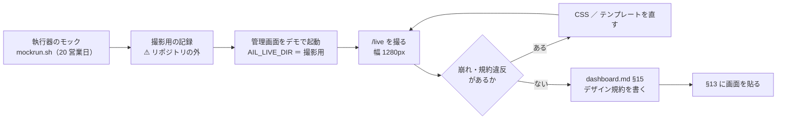

# 管理画面のデザイン規約を仕様書に移し、`/live` の見た目を確かめる

作成: 2026-09-18

## 目的・背景

`/live`（実売買の画面）は機能仕様（[dashboard.md §13](../specs/dashboard.md)）と実装が済んだが、**見た目の決めごとの正本が仕様書に無い**。
黒ベースの規約は、アーカイブしたプラン（[dashboard-dark-design.md](archive/dashboard-dark-design.md)）と `app/static/app.css` の冒頭コメントにしか書かれていない。
このため `/live` は「他の画面のクラスを借りて書いた」だけで、どの色が何を意味するか・どのクラスを使うかを仕様から引けない。
あわせて `/live` は一度も実物を目で見ていない（テストは 200 と秘密の不在だけ）。

利用者の指示（2026-09-18）: デザイン仕様とスクリーンショットを進める（`TODO.md` の Phase 4 の子タスク 2 本）。

## 対応方針

この図の主張: **先に実物を撮って見てから規約を書く**（見ずに書くと、規約と画面が食い違ったまま正本になる）。

| 項目 | 決め |
| --- | --- |
| 規約の置き場 | `docs/specs/dashboard.md` に **§15 デザイン規約**を足す（§9 の更新履歴は末尾のまま）。アーカイブしたプランは経緯として残し、⚠ **正本は §15** と書く |
| 規約の中身 | 配色 2 系統（環境の色 ／ 状態の色）・面の明るさの段・環境の帯とバッジ・状態のチップとセル・等幅数字・表の折り返し・画面ごとのクラスの対応。⚠ **値は `app.css` の変数名で書く**（色コードの二重管理を避け、コードを正とする） |
| `/live` の節 | §15 の中に「`/live` が使うクラス」（`exp` 表・`exp-cards`・`cell-ok/warn/ng/na`・`orders`・`td.nw`・TEST バッジ。⚠ `kv` は撮ったら崩れたのでやめた）と**差 1 の色分けの規則**（閾値の正本は `live-trading.md` §0-2。§15 は「どのクラスに写すか」だけ） |
| 撮影用の記録 | `mockrun.sh` に `KEEP_DIR`（任意）を足し、終了時に `config/`・`state/cert/`・`out/` を写す。⚠ **既定の動作は変えない**（指定しなければ今までどおり消す）。撮影用はスクラッチに置き、リポジトリの `out/` には混ぜない |
| 撮り方 | playwright の chromium（`~/.cache/ms-playwright/`。headless shell を直接叩く）。幅 1280px。管理画面は別ポート（3019）でデモ起動し、3012 は触らない |
| 画像の置き場 | `docs/plans/assets/dashboard-live.png`（§13 から貼る） |
| 直す範囲 | 撮って崩れていたところだけ（`app.css` ／ `live.html`）。⚠ **画面の項目・文言・面の規則は変えない** |

## 影響範囲

- `docs/specs/dashboard.md`（§15 新設・§13 に画像・§9 更新履歴）
- `docs/plans/assets/dashboard-live.png`（新）
- `experiments/live-trading/mockrun.sh`（`KEEP_DIR`）・`README.md`（1 行）
- 崩れがあれば `dashboard/app/static/app.css`・`dashboard/app/templates/live.html`
- `dashboard/app/live.py`（⚠ 当初は触らない予定だったが、撮ったら差 1 の中央値に二進の端数が出ていたので `_median` を 0.01bp に丸めた）。`main.py` は触らない。本番の鍵・執行器の起動には関わらない（モックだけ）

## テスト方針

- `dashboard` の pytest（`.venv/bin/python -m pytest -q tests`）が通る
- `experiments/live-trading` の `./mockrun.sh` が `KEEP_DIR` なしで今までどおり「すべて通った」
- 撮った画像を目で見る（崩れ・折り返し・色の意味が規約どおりか）

## Step

1. ✅ 撮影用の記録を作る（`mockrun.sh` に `KEEP_DIR`。2026-09-18 titan）
2. 🔶 デモ起動して `/live` を撮り、崩れを直す（崩れ 3 つは直して目で確認済み。⚠ **高さ 1800 で撮り直して `assets/` に置くのが残り**）
3. ⬜ `dashboard.md` §15 デザイン規約を書く（未着手）
4. ⬜ §13 に画像を貼り、`TODO.md` ／ 更新履歴 ／ `live-trading/README.md`（`KEEP_DIR`）を直す

## 引継ぎ（2026-09-18）

titan で Step 2 の途中まで進め、**Sx360 で続ける**（利用者の指示）。直した崩れ・撮り方・踏んだ落とし穴・titan に残っているプロセスは `TODO.md` の Phase 4 の子タスク 2 本の下に書いた。⚠ 撮影用の記録と画像は titan のスクラッチにしか無いので、Sx360 で `KEEP_DIR` から作り直す。
