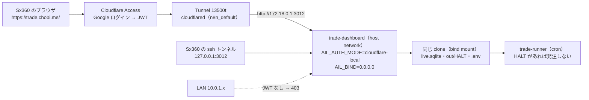
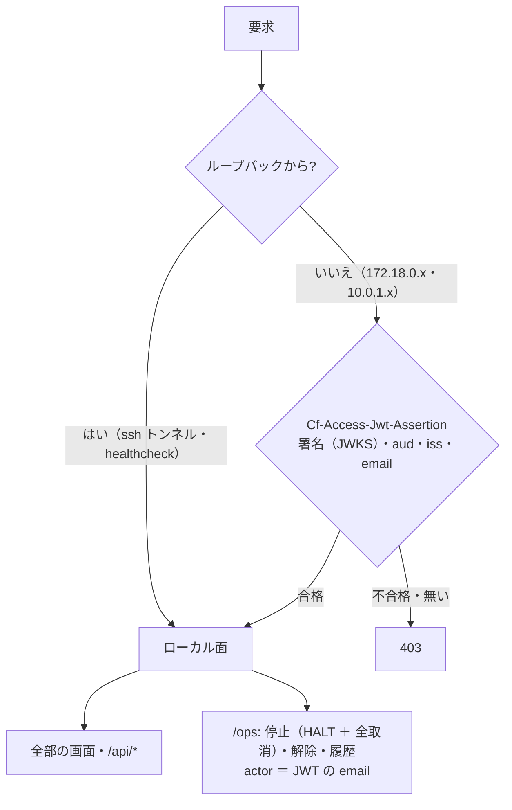
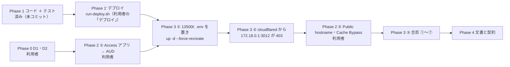

# 13500t の管理画面を `trade.chobi.me` で開く（Cloudflare Access の後ろにローカル面と同じ機能）

- 状態: **コードは書いた（`cloudflare-local` 面。2026-09-26 夜・Sx360・未コミット）。Phase 0 の残り（D1・D2）と Phase 2 ①（Access アプリ → AUD）待ち。13500t はまだ触っていない**
- 親タスク: TODO「Sx360 から 13500t の管理画面にアクセスしやすくする」
- 利用者の決定:
  - **2026-09-26「Cでいく」**（候補 A〜D の比較は §1-2。「sx360のブラウザから分かりやすいurlでアクセスできるとよい」）
  - **2026-09-26「trade.chobi.me で見れる管理画面はローカルのものと同一の機能とする」** ＝ 公開面（監視と停止だけ）ではなく、Access を通った人に**ローカル面そのもの**（操作・解除・履歴・取消も）
- 関係する正本: [dashboard.md §2・§7・§7-1](../specs/dashboard.md)・[three-machines.md](three-machines.md) K5・g3plus-ops の `trade-dashboard/`（private。Sx360 にだけある）

## 1. 目的・背景

### 1-1. いま

13500t の管理画面は**ローカル面だけ**（`AIL_AUTH_MODE=loopback`・`network_mode: host`・`AIL_BIND=127.0.0.1`。K5 の決定）。Sx360 から見るには
`./run-dashboard-tunnel.sh --host 13500t.lan` で ssh のトンネルを張り、`http://127.0.0.1:3013/` を開く。
トンネルは端末を 1 つ占有し、Ctrl+C や回線の切れで止まる ＝ 見るたびに起こし直す。URL も「どの機械の何番か」を覚えている必要がある。

### 1-2. 候補と決定

| 手法 | 得られる URL | 使える場所 | 変える決定 | 決定 |
| --- | --- | --- | --- | --- |
| A. トンネルを常駐させ hosts に名前を付ける | `http://13500t:3013/` | どこでも | なし | — |
| B. 13500t で LAN 面（`local`）を開ける | `http://13500t:3012/` | 家の LAN だけ | K5「ループバックだけ」。LAN の全機器から停止 ／ 解除が無認証 | — |
| **C. Cloudflare Access の後ろに出す** | `https://trade.chobi.me/` | どこでも・スマホも | **K5「公開面は出さない」を見直す** | ✅ 2026-09-26「Cでいく」＋「ローカルと同一の機能」 |
| D. 13500t を tailnet に入れ Tailscale の身元で守る面を作る | `http://trade-dashboard/` | tailnet | 新しい面をコードに足す | — |

### 1-3. 「同一の機能」が決めるもの

| 論点 | 決め | 理由 |
| --- | --- | --- |
| 面 | 新しい面 **`cloudflare-local`** をコードに足す（2026-09-26 に書いた） | 既存の `cloudflare` は面が「公開」＝ `/ops` `/dev` 404・POST は停止だけ。判定（JWT を全リクエストで検証）はそのまま使い、面だけローカルにする。⚠ **検証を緩めない** |
| コンテナ | **今の 1 つのまま**（`trade-dashboard`）。2 つ目は作らない | 同一の機能 ＝ 取消・口座の監視が要る ＝ 売買と同じ `.env` が要る。2 つ目のコンテナに同じ `.env` を渡すと監視の記録の書き込みが 2 本になる。1 つなら何も増えない |
| 届き方 | `AIL_BIND=0.0.0.0`（host network）。Tunnel の Public hostname は `http://172.18.0.1:3012`（`n8n_default` のゲートウェイ ＝ ホスト。ssh の Public hostname `172.18.0.1:22` と同じ届き方） | cloudflared はブリッジの中に居て、ホストのループバックには届かない。ゲートウェイ経由なら届く。⚠ `127.0.0.1` と `172.18.0.1` の両方に bind はできないので `0.0.0.0` |
| LAN から | 10.0.1.x からは **JWT が無いので 403**（接続拒否 → 403 に変わるだけ） | `cloudflare-local` はループバック以外を全部検証する（`tests/test_access.py`・`test_app.py`）。⚠ `X-Forwarded-For` は見ない（接続元は `scope["client"]` だけ）＝ LAN からループバックを名乗れない |
| ssh のトンネル | 今までどおり（ループバックは免除） | 解除・取消の予備の道として残す（D5） |
| 資格情報 | 売買と同じ `experiments/tastytrade-api-sample/.env`（`config.py` の既定。変えない） | 取消（停止ボタン）と口座 ／ 接続の監視に要る。⚠ `live.env`（発注の許可）はコンテナに渡らないまま。管理画面に発注の経路は無い |
| K5 の代償 | 「発注の許可と資格情報のある機械に、外から届く口がある」。守りは **Access（Google ＋ 1 人の email）＋ JWT を全リクエストで検証 ＋ 発注の経路が無い ＋ 停止は `HALT`** | 利用者が受け入れた（2026-09-26）。⚠ Access のセッションは短め（D2） |

## 2. 決めること（Phase 0。⚠ 利用者）

| # | 決めること | 推す案 ／ 決定 | 備考 |
| --- | --- | --- | --- |
| D1 | 公開ホスト名 | `trade.chobi.me`（利用者の言葉に出た名前） | Tunnel `13500t` に足す。ssh は `ssh-13500t.chobi.me` で同じ Tunnel |
| D2 | Access アプリ（誰を通すか） | Self-hosted ／ Google のみ ／ Emails `akiraak@gmail.com` ／ セッション **24 時間** | チームは `akiraak`（`akiraak.cloudflareaccess.com`）。作ると **AUD** が出る ＝ `CF_ACCESS_AUD` |
| D3 | 資格情報 | ✅ **売買と同じ `.env`**（「同一の機能」の帰結。§1-3） | — |
| D4 | できること | ✅ **ローカル面と同じ**（停止・解除・履歴・取消・全部の画面） | — |
| D5 | ローカル面のトンネルは残すか | **残す** | `run-dashboard-tunnel.sh` は消さない |

## 3. 構成

> この図の主張: コンテナは 1 つのまま。**外から来る要求は Access → Tunnel → ゲートウェイ越しに同じコンテナへ届き、JWT で判定される**。ループバック（ssh のトンネル・healthcheck）は今までどおり免除。

| 項目 | いま | 変えたあと |
| --- | --- | --- |
| コンテナ | `trade-dashboard`（host network・`trade-runner:latest`・uid 1000） | 同じ 1 つ |
| `AIL_AUTH_MODE` | `loopback` | **`cloudflare-local`** ＋ `CF_ACCESS_TEAM=akiraak`・`CF_ACCESS_AUD=<D2>`・`CF_ACCESS_EMAIL=akiraak@gmail.com`（3 つそろわないと起動しない） |
| `AIL_BIND` | `127.0.0.1` | **`0.0.0.0`**（`172.18.0.1` でも受ける） |
| 設定の置き場 | compose の `environment:` に直書き | g3plus-ops `trade-dashboard/.env`（600・git に入れない。雛形 `.env.example` は書いた）。compose は `env_file: ./.env（required: false）` ＋ `AIL_AUTH_MODE: ${AIL_AUTH_MODE:-loopback}`・`AIL_BIND: ${AIL_BIND:-127.0.0.1}` ＝ **`.env` が無ければ今までどおり loopback**（fail-safe） |
| Tunnel | Public hostname なし | `trade.chobi.me` → `HTTP` `172.18.0.1:3012` |
| 資格情報・volume・healthcheck・起こし直し（auto-update） | — | 変えない |

## 4. 面の判定（`cloudflare-local`）

> この図の主張: **JWT が無ければ何も見せない**のは `cloudflare` と同じ。違いは通った先が**ローカル面**（操作も出る）であることだけ。

- 判定は `dashboard/app/access.py`（`cloudflare` と同じ分岐）・面は `config.py` の `face`（`cloudflare` だけ公開）。2026-09-26 に足したもの: `AUTH_MODES` に `cloudflare-local`・`CF_MODES`・検証の条件・左ペインの印「ローカル面 · Access」・用語集の文・`dashboard.md` §2 の表・CLAUDE.md
- テスト: `tests/test_access.py`（ループバック 200・cloudflared ／ LAN から JWT なし 403・合格で `face=local`・email 違い 403・設定の 3 つそろい）・`tests/test_app.py::test_cloudflare_local_face_keeps_ops`（`/ops` 200・停止 303 → `HALT`・履歴の actor が email・解除 303・LAN 403）
- 3 秒ごとの `?partial=live`・`/api/live` も同じ JWT（cookie `CF_Authorization`）で通る。CSRF の印（cookie `ail_csrf`）は今までどおり

## 5. 手順

> この図の主張: **コードを先に本番へ（デプロイ）→ 13500t の `.env` を置いて起こし直す（この時点では外から届かない）→ 最後に hostname**。逆にすると、判定の無い口が一瞬でも外に出る。

### Phase 1: コードとテスト（Sx360 の Claude）✅ 2026-09-26 夜

| # | 何を | 結果 |
| --- | --- | --- |
| 1-1 | 机上の確認（前の設計の名残。記録として残す）: `test_access.py` 3 passed ／ 資格情報なし・`AIL_DEMO=0` でも実売買の画面は本物の記録で 200・デモの帯なし ／ `cloudflare` 面は非ループバックが GET ／ POST とも 403・ループバック 200・`/ops` 404 | ✅【実測・in-process】 |
| 1-2 | `cloudflare-local` 面を足す（`config.py`・`access.py`・`base.html`・`glossary.toml`）とテスト 2 本 | ✅ 書いた。テストの結果は TODO の Phase 1 の行 |
| 1-3 | **デプロイ**（本番に効く道 ＝ `dashboard/app/`・`glossary.toml`）。⚠ 利用者の「デプロイ」で `run-deploy.sh` | ⏳ 13500t の `.env` を置く前に済ませる（コンテナが `cloudflare-local` を知らないと起動しない） |

### Phase 2: Cloudflare 側（⚠ 利用者。Zero Trust のダッシュボード）

| # | 何を | 出口 |
| --- | --- | --- |
| 2-① | Access → Applications → Self-hosted: D1 のホスト名・D2 の方針（Google のみ ／ Emails ／ セッション） | **AUD** を控えて Claude に渡す（`.env` に書く。git に入れない） |
| 2-② | Networks → Tunnels → **`13500t`** → Public Hostname: D1 → Service `HTTP` **`172.18.0.1:3012`** | ⚠ **Phase 3 ② の後に** |
| 2-③ | Cache Rules: D1 のホスト全体を **Bypass**（§7。キャッシュ HIT は認証の前に配信される） | — |

### Phase 3: 13500t（⚠ Sx360 の Claude。scp と compose）

| # | 何を | 出口 |
| --- | --- | --- |
| 3-① | g3plus-ops の compose（`env_file` ＋ `${…:-既定}`）と `.env`（600。`AIL_AUTH_MODE=cloudflare-local`・`AIL_BIND=0.0.0.0`・`CF_ACCESS_*` 3 つ）を 13500t へ → `compose up -d --force-recreate` | 起動ログに `mode=cloudflare-local face=local demo=False`・healthy（ループバック免除） |
| 3-② | `docker exec cloudflared wget -qO- http://172.18.0.1:3012/` | **403**（JWT なし）。ssh トンネル越しの `http://127.0.0.1:3013/` は 200 のまま |
| 3-③ | 利用者が 2-② を済ませたら合否 ①〜⑦ | 全部 ✅ |

合否（⚠ 停止の試しは**市場の外**で、終わったら解除して `HALT` を残さない・働いている注文が無い時間に）:

| # | 合否 | 見る |
| --- | --- | --- |
| ① | Sx360 のブラウザで `https://<D1>/` → Access のログイン → 概要 200・左ペインに「ローカル面 · Access」と自分の email | 目視 |
| ② | JWT なしは 403（cloudflared から `wget`・LAN の 10.0.1.x から `curl`） | 403 |
| ③ | `/ops` `/records` `/judge` `/traders/T1` `/overall` が 200（`cloudflared access curl`） | 200 |
| ④ | 停止 → 303・`out/HALT`・履歴の actor が email → 同じ画面で解除 → `HALT` が消える | ファイルと履歴 |
| ⑤ | 秘密の grep: 全ページと `/api/live` `/api/records` に client secret・トークン・口座番号・`eyJ` が 0 件 | 0 件 |
| ⑥ | `run.sh trade` の cron・`live.env`・ssh トンネルに変化なし | 変化なし |
| ⑦ | 次の `auto-update` の `done` で起こし直されても `.env` が効いたまま healthy | `auto-update.log`・起動ログ |

### Phase 4: 契約と文書（push）

| 文書 | 直すこと |
| --- | --- |
| `dashboard.md` §7-1 | 「公開面は出さない」を外し **§7-2「13500t の `trade.chobi.me`（`cloudflare-local`）」**を足す（§3 の表・合否の結果） |
| `three-machines.md` §2 K5 | 「2026-09-26 に見直し: Access の後ろにローカル面を出す（1 コンテナ・同じ `.env`）」を追記（経緯として残す） |
| `CLAUDE.md` | 管理画面の項の「見るのはトンネル」を直す（済み: 面の一覧に `cloudflare-local`。URL は書かない ＝ hostname は g3plus-ops 側だけ） |
| g3plus-ops `docs/workflows/trade-dashboard.md`・compose・`.env.example` | 手順・戻し方（⚠ Sx360 の Claude。scp） |
| `run-dashboard-tunnel.sh` の注記 | 「`trade.chobi.me` でも同じ面が開く。トンネルは予備」を 1 行 |
| TODO のメモ | 決定 2 つに合わせる（済み） |

## 6. 影響範囲

- **このリポジトリ（本番に効く道 ＝ デプロイが要る）**: `dashboard/app/config.py`（`AUTH_MODES`・`CF_MODES`・検証）・`dashboard/app/access.py`（verifier を作る条件・docstring）・`dashboard/app/templates/base.html`（印）・`dashboard/glossary.toml`（文）。テスト: `tests/test_access.py`・`tests/test_app.py`。文書: `dashboard.md` §2・CLAUDE.md・このプラン
- **g3plus-ops（Sx360 にだけある）**: `trade-dashboard/docker-compose.yml`（`env_file: ./.env（required: false）` ＋ `AIL_AUTH_MODE: ${AIL_AUTH_MODE:-loopback}`・`AIL_BIND: ${AIL_BIND:-127.0.0.1}`。✅ 2026-09-27 に書いた〔利用者の指示〕・`docker compose config` で `.env` なし ＝ loopback ／ 127.0.0.1、あり ＝ cloudflare-local ／ 0.0.0.0 を確かめた）・`.env`（新規・600・git に入れない。13500t にだけ置く）・`.env.example`（書いた）・`.gitignore`（`trade-dashboard/.env` を足した）・手順書
- **13500t**: コンテナは 1 つのまま。`AIL_BIND` が `0.0.0.0` になる（LAN からは 403）。cron・`run.sh`・`live.env`・売買は触らない。⚠ **20 営業日（Phase 6）のあいだは執行器を変えない**（live-trading.md §0-15）＝ 執行器には触らない
- **Cloudflare**: Access アプリ 1 つ・Public hostname 1 つ・Cache Rule 1 つ（利用者）

## 7. テスト方針

- 単体: `tests/test_access.py`（新モードの判定と設定の検証）・`tests/test_app.py::test_cloudflare_local_face_keeps_ops`（面・停止・履歴・解除・LAN 403）・既存の `test_public_face_hides_ops_and_dev`（`cloudflare` は変わらない）・`test_help.py`（用語）
- 関門: `run-deploy.sh`（`run-tests.sh` ＋ 指紋テスト）を通してから 13500t へ
- 実機: §5 Phase 3 の合否 ①〜⑦
- 戻し方: 13500t の `.env` を消して `up -d --force-recreate`（＝ loopback・127.0.0.1 に戻る）→ Public hostname を消す（Cloudflare）。コードの `cloudflare-local` は残っても害が無い（使われないだけ）

## 8. やらないこと

- JWT の検証を緩める・ループバック以外を無検証で通す・`X-Forwarded-For` を信じる
- Sx360 の `tailscale serve` でトンネルの先を出す（tailnet の全員に無認証で開く。CLAUDE.md の禁止と同じ理由）
- LAN 面（`AIL_AUTH_MODE=local`）を 13500t で開ける（B）
- 管理画面に発注の経路を足す（どの面にも無い。変えない）
- `run.sh`・cron・執行器・`live.env` を変える
- 2 つ目のコンテナ（前の設計。監視の記録が 2 本になる）

## 9. まだ分かっていないこと

| # | 分からないこと | 確かめ方 |
| --- | --- | --- |
| ① | 13500t の 3012 が LAN に見えるようになる（403 の壁）。ufw 等で `wlan` 側の 3012 を閉じるかは利用者の裁量（sudo。Claude はやらない） | Phase 3 ② で LAN からの `curl` が 403 であることまで確かめる |
| ② | Access のセッション 24 時間の切れ目で、3 秒ごとの取り直しがどう見えるか | 合否 ① のあと 1 日使って見る。ログイン画面に戻るだけなら可 |
| ③ | `cloudflared access curl` で合否 ③ ⑤ を機械的に回せるか（org のログインは ssh で済んでいる） | Phase 3 ③ で試す。だめならブラウザで目視 |
| ④ | 手間【推測】: Phase 1' デプロイ 5 分（＋ 待ち 20 分）／ Phase 2 20 分（利用者）／ Phase 3 30 分 ／ Phase 4 1 時間 | — |
