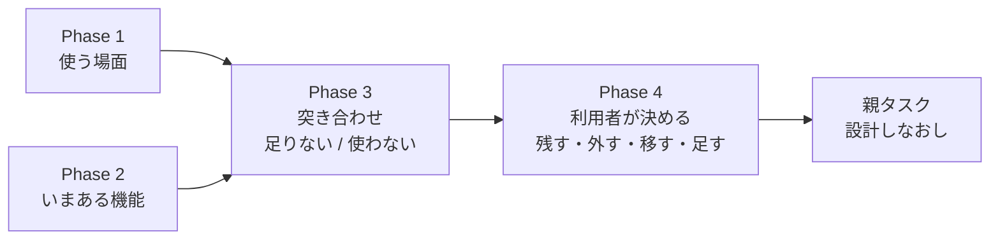
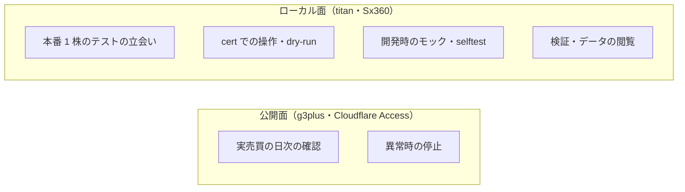
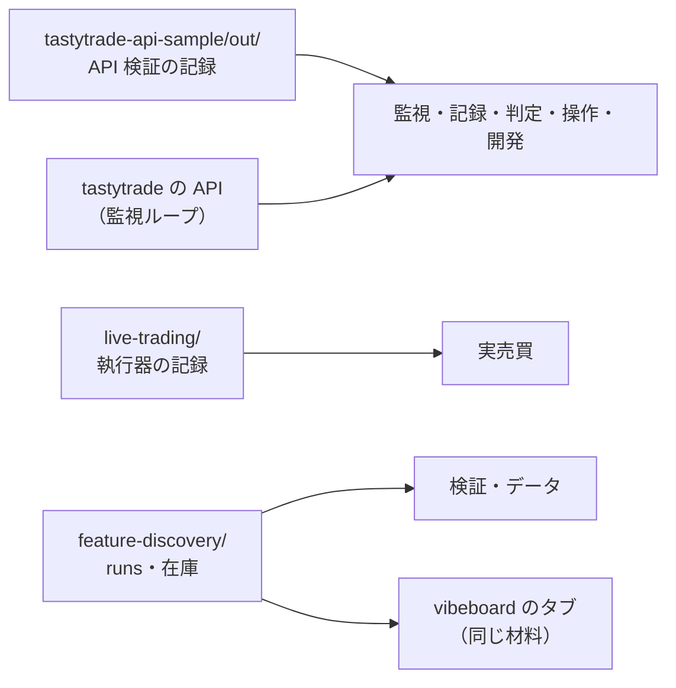
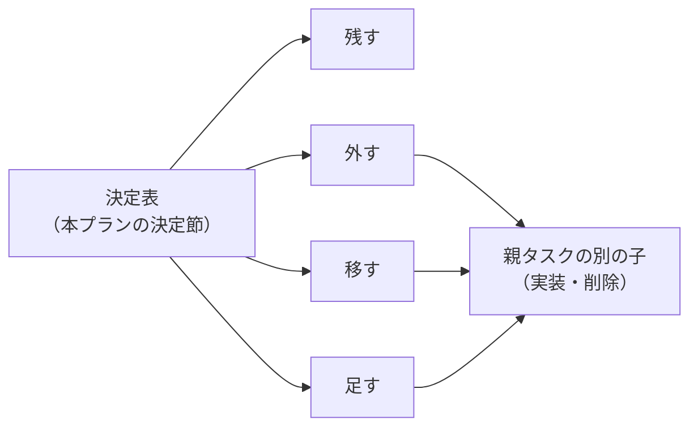

# 管理画面に必要な機能を決める

作成: 2026-09-18

## 目的・背景

利用者の指示（2026-09-18）: 管理画面（`dashboard/`）全体を設計しなおす。その最初の一歩として、**管理画面に必要な機能を決める**。

管理画面は 2026-09-05 に **tastytrade の API 検証**（`experiments/tastytrade-api-sample/`）の監視と操作のために作り、その後に画面を足してきた。

| 時期 | 足したもの | 目的 |
| --- | --- | --- |
| 2026-09-05 | 監視 `/`・記録 `/records`・判定 `/judge`・操作 `/ops`・開発 `/dev` | API 検証（6 観点） |
| 2026-09-08〜09 | 検証 `/experiments`・データ `/data` | 分析手法の検証の閲覧 |
| 2026-09-18 | 実売買 `/live` | トレーダー 3 人の実売買（2 つ目の例外） |

⚠ **目的が「API 検証」から「実売買の運用」へ移ったのに、画面の構成は足し算のままである。**
さらに、検証とデータは vibeboard のタブ（`dashboard/vibetab.py`。2026-09-10）にも同じ材料で出ている。
このため、「どの場面で何を見るか」から逆算して、残す・外す・移す・足すを決め直す。

⚠ **決めるのは利用者**。Claude は場面の書き出し・棚卸し・突き合わせと見立て（理由つき）を用意するところまでで、画面の実装や削除はしない（親タスクの別の子でやる）。

## 統合したタスク

同じ親の下にあった「現在の機能を列挙して、必要・不要を決める」は、中身が重なるので**本タスクの Phase 2 に統合し、TODO から削除した**（利用者の決定 2026-09-18）。
列挙は Phase 2、必要・不要の決定は Phase 4 で行う。

> この図の主張: ⚠ **「いまある機能」と「場面が求める機能」を突き合わせ、その差分を利用者が決める。**

## 対応方針

### 変えないもの（決め直しの対象外）

CLAUDE.md の決まりなので、機能の要不要を決めるときに**前提として固定する**。

| 項目 | 内容 | 正本 |
| --- | --- | --- |
| 面の規則 | 公開面は監視と停止だけ。操作と開発はローカル面だけ | [dashboard.md §2](../specs/dashboard.md) |
| 秘密 | client secret・トークン・口座番号をブラウザに送らない（全応答が `Redactor` を通る） | [dashboard.md §3](../specs/dashboard.md) |
| 停止 | 停止ボタン ＝ `HALT` を書き、働いている注文を全部取り消す。執行器も `HALT` を見る | CLAUDE.md・[live-trading.md §0-5](../specs/experiments/live-trading.md) |
| 本番の鍵 | 3 段（dry-run ／ 取消 ／ 発注 ＋ 確認文）。取消の鍵で発注は開かない | CLAUDE.md |
| 金銭の行動 | 本番の発注・執行器の起動は利用者が行う。画面から執行器は動かさない | CLAUDE.md・[dashboard.md §13-4](../specs/dashboard.md) |

⚠ **「外す」を選べるのはこの 5 つに触れない機能だけ。** 停止ボタンや面の検査は、要不要の決定表に載せても「残す（固定）」とだけ書く。

### Phase 1: 使う場面を書き出す

誰が・どこから・いつ・何のために管理画面を開くかを表にする。Claude が下書きし、利用者が足し引きする。

> この図の主張: ⚠ **場面は「どの面から開くか」で 2 つに分かれ、公開面から届くのは監視と停止だけ。**

下書き（⚠ **Claude の見立て。利用者が直す**）:

| # | 場面 | 面 | いつ | 何を見る ／ 何をする |
| ---: | --- | --- | --- | --- |
| 1 | 実売買の日次の確認 | 公開 ／ ローカル | 執行の窓の後（16:05 ET 以降） | トレーダー別の建玉・損益・差 1〜4、その日の注文と事象 |
| 2 | 異常時の停止 | 公開 ／ ローカル | いつでも | 停止ボタン・停止中の帯 |
| 3 | 本番 1 株のテストの立会い（Phase 5-1） | ローカル | 買う日・手仕舞う日の窓の中 | 認証・口座・注文の状態、停止ボタン（[live-trading.md §0-5](../specs/experiments/live-trading.md)） |
| 4 | cert での操作（dry-run → 発注 → 取消） | ローカル | 開発時 | `/ops` |
| 5 | 開発時のモック・selftest | ローカル | 開発時 | `/dev` |
| 6 | 検証・データの閲覧 | ローカル（vibeboard のタブと重複） | 実験の後 | `/experiments`・`/data` |
| 7 | API 検証の記録と判定 | 両方 | 6 観点の残り 1 つ（営業日を 2 日跨ぐ交換）が埋まるまで | `/records`・`/judge` |

⚠ **場面ごとに「今後も起こるか」を利用者に聞く**（例: 7 は 6 観点が全部埋まったら終わる場面か）。

### Phase 2: いまある機能を棚卸しする

旧タスク「現在の機能を列挙して、必要・不要を決める」の列挙の部分（必要・不要の決定は Phase 4）。

画面・経路・部品の単位で、いまある機能を 1 行ずつ表にする。

| 列 | 中身 |
| --- | --- |
| 機能 | 例: 監視の「認証の残り秒数」、`/records/diff` の「実行間の差分」 |
| 画面 ／ 経路 | `main.py` の経路（⚠ **31 本 ＝ GET 19・POST 12**【実測 2026-09-18、`@app.get` ／ `@app.post` を数えた】） |
| 面 | 両方 ／ ローカルのみ |
| 材料 | どの記録・API を読むか（`experiments/tastytrade-api-sample/out/`・`experiments/live-trading/`・`experiments/feature-discovery/runs/`・tastytrade の API） |
| 参照元 | その機能を名指しする文書・テスト・契約（手順書・§7 のデプロイ契約・pytest） |
| 使う場面 | Phase 1 の番号 |

- ⚠ **使った頻度は測れない**（アクセスの記録を残していない）。「使っているか」は利用者に聞き、測った値のように書かない
- 同じ材料を vibeboard のタブ（検証・データ・用語・ハード）も出しているので、⚠ **重複は列で示す**

> この図の主張: ⚠ **画面が読む材料は 3 系統あり、系統ごとに「誰の場面か」が違う。**

### Phase 3: 突き合わせて、決定表の下書きを作る

Phase 1 の場面 × Phase 2 の機能を突き合わせ、1 機能 1 行の決定表にする。

| 列 | 中身 |
| --- | --- |
| 機能 | Phase 2 の行（⚠ **いま無い機能**は「新」と印を付けて足す） |
| 場面 | Phase 1 の番号（どの場面からも使われない機能は空欄） |
| Claude の見立て | **残す ／ 外す ／ 移す（vibeboard へ）／ 足す ／ 残す（固定）** のどれか |
| 理由 | 見立ての根拠（場面・重複・参照元） |
| 外したときに直すもの | 参照元（文書・テスト・§7 の契約・手順書）の一覧 |
| 利用者の決定 | Phase 4 で埋める |

- ⚠ **「外す」「移す」の見立てには、参照元を grep で洗った結果を必ず付ける**（例: `/judge` は実売買のプランの手順が参照している。停止ボタンは live-trading.md の手順書が参照している）
- ⚠ **「足す」は場面から出たものだけ**（思いつきの機能は足さない）。候補の例: 執行器が今日動いたか（timer ／ cron の最終起動）、トレーダー別の停止条件の近さ、差 3 と B&H（Phase 4 の残り。依存は Phase 3 の紙上の対照）

### Phase 4: 利用者が決め、記録する

- 決定表を利用者に見せ、1 行ずつ決めてもらう（⚠ **Claude は決めない**。見立てと理由を示すだけ）
- 決まった表を本プランの「決定」節に写し、親タスク（設計しなおし）の入力にする
- ⚠ **この段では画面を変えない**（削除・移設・追加の実装は親タスクの別の子で行う）
- `dashboard.md` §1 の画面の表の下に、要不要を決めた日と本プランへのリンクを 1 行だけ足す

> この図の主張: ⚠ **決定は表に残し、実装は別のタスクに渡す。この段で画面は 1 行も変わらない。**

## 影響範囲

| ファイル | 変更 |
| --- | --- |
| `docs/plans/dashboard-required-features.md`（本プラン） | 場面の表・棚卸しの表・決定表・決定 |
| `docs/specs/dashboard.md` | §1 に 1 行（決定へのリンク）だけ |
| `TODO.md` | 本タスクの子（Phase 1〜4）のチェック |
| `dashboard/` のコード・テンプレート・テスト | ⚠ **触らない** |
| vibeboard（`vibeboard.config.json`・`dashboard/vibetab.py`） | ⚠ **触らない**（「移す」の決定が出ても、実装は別タスク） |

## テスト方針

コードを変えないので、pytest は流さない（変わらない）。代わりに表を検算する。

- ⚠ **棚卸しの漏れがない**: 表の経路が `main.py` の `@app.get` ／ `@app.post`（31 本）と 1 対 1 で対応する。テンプレート（15 本）と JSON（`/api/*`）も同じく照合する
- ⚠ **「外す」「移す」の行は参照元が埋まっている**: 文書（`docs/`・`CLAUDE.md`・`README`）とテスト（`dashboard/tests/`）と §7 のデプロイ契約を grep した結果を付ける
- ⚠ **「変えないもの」の 5 つに触れる行が「外す」になっていない**
- 図はノード 12 個以内、1 図 1 主張（CLAUDE.md の図の原則）

## Phase / Step

1. ⬜ Phase 1: 使う場面を書き出す（Claude が下書き → 利用者が足し引きする）
2. ⬜ Phase 2: いまある機能を棚卸しする（旧「現在の機能を列挙して、必要・不要を決める」を統合。経路 31 本と照合）
3. ⬜ Phase 3: 突き合わせて、決定表の下書きを作る（見立て・理由・参照元）
4. ⬜ Phase 4: 利用者が決め、本プランと `dashboard.md` §1 に記録する

## 決定

（Phase 4 で埋める）
