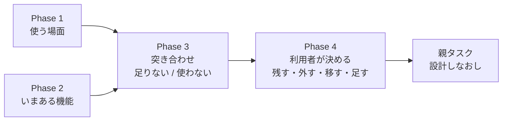
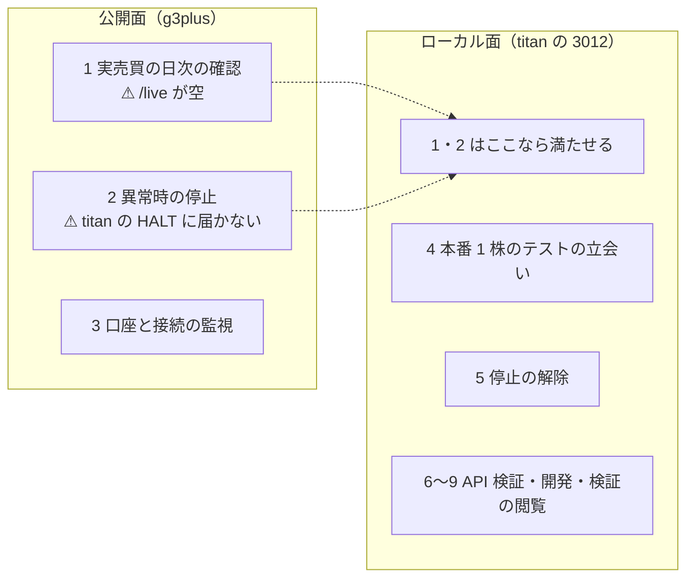
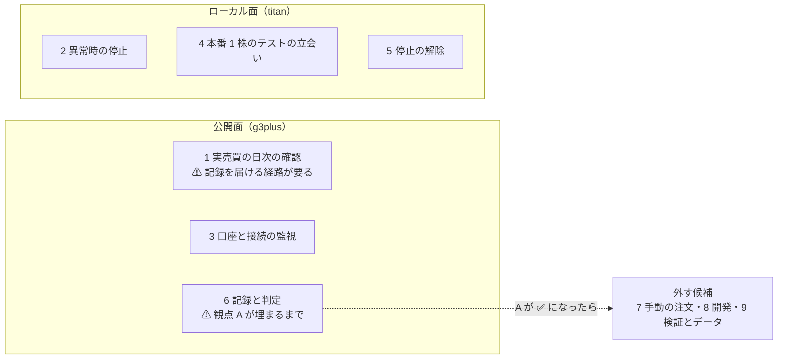
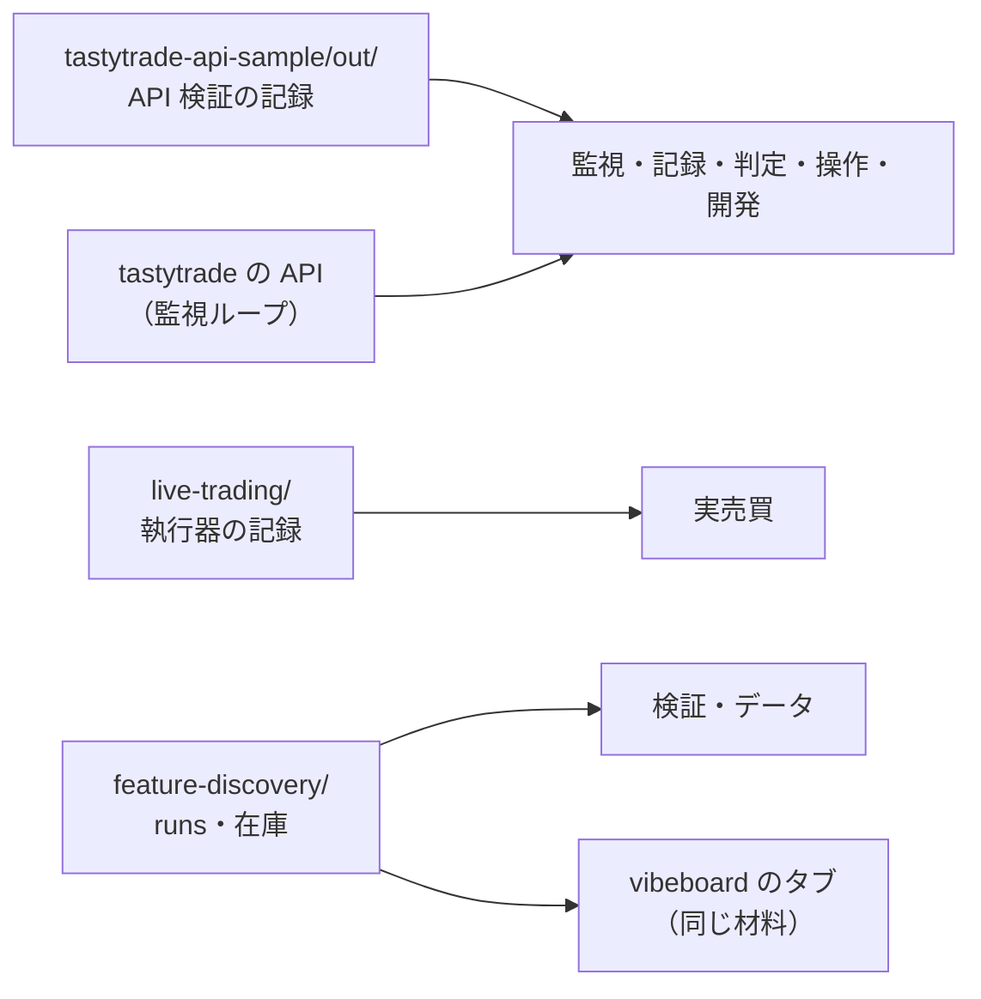
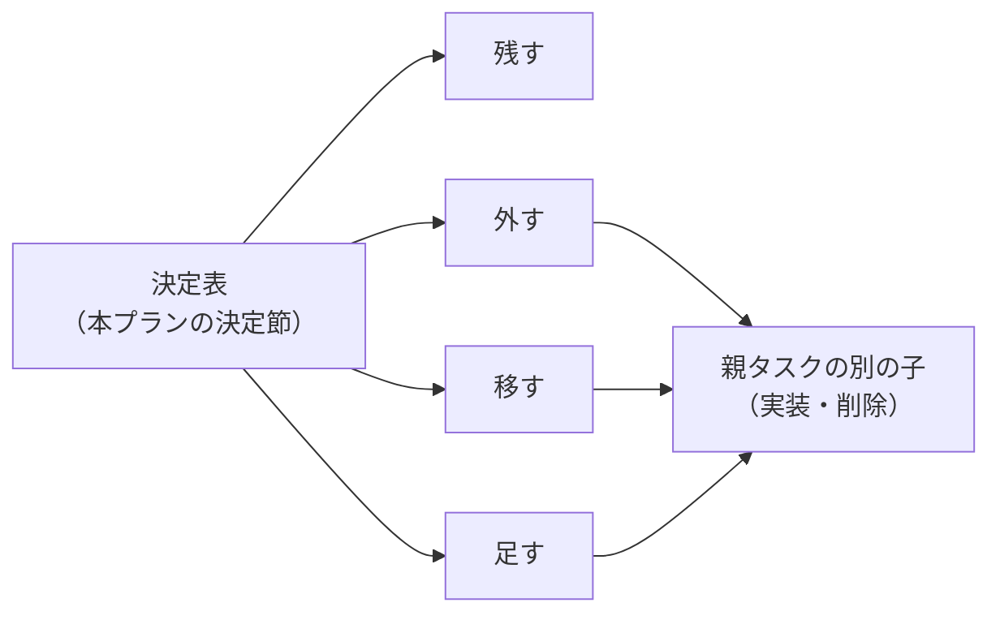

# 管理画面に必要な機能を決める

作成: 2026-09-18

## 目的・背景

利用者の指示（2026-09-18）: 管理画面（`dashboard/`）全体を設計しなおす。その最初の一歩として、**管理画面に必要な機能を決める**。

管理画面は 2026-09-05 に **tastytrade の API 検証**（`experiments/tastytrade-api-sample/`）の監視と操作のために作り、その後に画面を足してきた。

| 時期 | 足したもの | 目的 |
| --- | --- | --- |
| 2026-09-05 | 監視 `/`・記録 `/records`・判定 `/judge`・操作 `/ops`・開発 `/dev` | API 検証（6 観点） |
| 2026-09-08〜09 | 検証 `/experiments`・データ `/data` | 分析手法の検証の閲覧 |
| 2026-09-18 | 実売買 `/live` | トレーダー 3 人の実売買（2 つ目の例外） |

⚠ **目的が「API 検証」から「実売買の運用」へ移ったのに、画面の構成は足し算のままである。**
さらに、検証とデータは vibeboard のタブ（`dashboard/vibetab.py`。2026-09-10）にも同じ材料で出ている。
このため、「どの場面で何を見るか」から逆算して、残す・外す・移す・足すを決め直す。

⚠ **決めるのは利用者**。Claude は場面の書き出し・棚卸し・突き合わせと見立て（理由つき）を用意するところまでで、画面の実装や削除はしない（親タスクの別の子でやる）。

## 統合したタスク

同じ親の下にあった「現在の機能を列挙して、必要・不要を決める」は、中身が重なるので**本タスクの Phase 2 に統合し、TODO から削除した**（利用者の決定 2026-09-18）。
列挙は Phase 2、必要・不要の決定は Phase 4 で行う。

> この図の主張: ⚠ **「いまある機能」と「場面が求める機能」を突き合わせ、その差分を利用者が決める。**

## 対応方針

### 変えないもの（決め直しの対象外）

CLAUDE.md の決まりなので、機能の要不要を決めるときに**前提として固定する**。

| 項目 | 内容 | 正本 |
| --- | --- | --- |
| 面の規則 | 公開面は監視と停止だけ。操作と開発はローカル面だけ | [dashboard.md §2](../specs/dashboard.md) |
| 秘密 | client secret・トークン・口座番号をブラウザに送らない（全応答が `Redactor` を通る） | [dashboard.md §3](../specs/dashboard.md) |
| 停止 | 停止ボタン ＝ `HALT` を書き、働いている注文を全部取り消す。執行器も `HALT` を見る | CLAUDE.md・[live-trading.md §0-5](../specs/experiments/live-trading.md) |
| 本番の鍵 | 3 段（dry-run ／ 取消 ／ 発注 ＋ 確認文）。取消の鍵で発注は開かない | CLAUDE.md |
| 金銭の行動 | 本番の発注・執行器の起動は利用者が行う。画面から執行器は動かさない | CLAUDE.md・[dashboard.md §13-4](../specs/dashboard.md) |

⚠ **「外す」を選べるのはこの 5 つに触れない機能だけ。** 停止ボタンや面の検査は、要不要の決定表に載せても「残す（固定）」とだけ書く。

### Phase 1: 使う場面を書き出す

誰が・どこから・いつ・何のために管理画面を開くかを表にする。Claude が下書きし、利用者が足し引きする。

#### 1-1. 前提（【コードと文書から読んだ 2026-09-18】）

| 事柄 | 中身 | 出典 |
| --- | --- | --- |
| 執行器が動く機械 | **titan**（15:45 ET に timer ／ cron で起動）。g3plus は監視だけ | [プラン Phase 0 の 6](live-trading-three-models.md) |
| 執行の窓 | 15:45〜16:05 ET ＝ ⚠ **JST 04:45〜05:05**（EDT の間） | [live-trading.md §0-2](../specs/experiments/live-trading.md) |
| 執行器が見る `HALT` | titan の `experiments/tastytrade-api-sample/out/HALT`（`TT_HALT_FILE` で変更可） | `experiments/live-trading/run_day.py:126` |
| 停止ボタンが書く `HALT` | 記録の置き場 `records_dir` の `HALT`。⚠ **置き場は起動のしかたで変わる**: 開発機で `AIL_DATA_DIR` なし → サンプルの `out/`（⚠ **執行器と同じ**）／ Docker（g3plus）→ `/app/data/records/`／ デモ → `data/demo/records/` | `dashboard/app/config.py:129・194〜197・227〜228` |
| g3plus の `/live` | ⚠ **空**（g3plus には執行器の記録を置かない） | [dashboard.md §13-3](../specs/dashboard.md) |
| g3plus の資格情報 | 2026-09-08 時点では空で、デモで稼働（⚠ **いまの状態は未確認**。デプロイ設定は g3plus-ops 側） | DONE.md 2026-09-08 |

⚠ **ここから分かること**: 停止ボタンが**執行器の翌日以降の発注まで止める**（＝ titan の `HALT` を書く）のは、**titan で `AIL_DATA_DIR` なし・デモでなく起動した管理画面から押したときだけ**である。
g3plus（公開面）から押すと、働いている注文の取消（API 経由。prod は scope に trade があり、取消の鍵があるとき）は届くが、⚠ **titan の `HALT` は書かれず、次の営業日に執行器はまた発注する**【コードから読んだ。未実測】。

#### 1-2. 場面の下書き（⚠ **Claude の見立て。利用者が直す**）

> この図の主張: ⚠ **公開面から開きたい場面は 3 つあるが、いまの g3plus で満たせるのは監視だけで、実売買の確認と停止は titan のローカル面でしか満たせない。**

| # | 場面 | 開きたい面 | いつ | 見る ／ する | いまの画面 | いまの状態 |
| ---: | --- | --- | --- | --- | --- | --- |
| 1 | 実売買の日次の確認（⚠ **主な使い方**。1-4） | 公開 ／ ローカル | 窓の後（16:05 ET ＝ JST 05:05 以降） | ⚠ **トレーダーごとの行動と実績、トレーダー同士の比較**。その日の注文と事象、執行器が起動したか | `/live` | ⚠ **ローカル面だけ**（g3plus では空） |
| 2 | 異常時の停止 | 公開 ／ ローカル | いつでも（特に窓の中） | 停止ボタン → 翌日以降も発注しない ＋ 働いている注文の取消 | ヘッダの停止ボタン（`/ops/halt`） | ⚠ **titan のローカル面だけ完全**（g3plus からは取消だけ。1-1） |
| 3 | 口座と接続の監視 | 公開 ／ ローカル | いつでも | 認証の残り・残高・買付余力・建玉・働いている注文・ストリーマの接続・エラー | 監視 `/`（5 秒更新） | g3plus は資格情報が入っていればそのまま使える（⚠ いまの状態は未確認） |
| 4 | 本番 1 株のテストの立会い（Phase 5-1） | ローカル | 買う日・手仕舞う日の窓の中（JST 04:45〜05:05） | 3 の中身 ＋ 停止ボタン | 監視 `/` ＋ 停止ボタン | 満たせる（[live-trading.md §0-5](../specs/experiments/live-trading.md) の手順 4） |
| 5 | 停止の解除（再開） | ローカル | 停止の後 | `HALT` を消す | `/ops`（再開） | 満たせる（⚠ 解除はローカル面だけ。§2 の面の規則） |
| 6 | API 検証の記録と判定 | 両方 | 観点 A（営業日を 2 日跨ぐ交換）が埋まるまで | 実行記録・差分・6 観点の表 | `/records`・`/judge` | 満たせる。⚠ **観点 A が埋まった後も続く場面か**が未定 |
| 7 | cert での手動操作 | ローカル | 開発時 | dry-run → 発注 → 取消 → 後片付け | `/ops` | 満たせる。⚠ 執行器は自前で cert の dry-run を回す（`run_day.py --mode dry-run`）ので、**この画面を今後も使うか**が未定 |
| 8 | API サンプルの開発（モック・selftest・手順の実行） | ローカル | 開発時 | モックの起動・停止、`selftest.sh`、`sample.py` の手順 | `/dev` | 満たせる。⚠ 執行器の `mockrun.sh`・pytest は画面に無い |
| 9 | 分析手法の検証・データの閲覧 | ローカル | 実験の後 | 順位表・検査・データの在庫 | `/experiments`・`/data` | 満たせる。⚠ **vibeboard のタブ（`http://titan-income-vibeboard`）にも同じものがある**。g3plus では空 |

**場面から出た「いまの画面に無いもの」の候補**（⚠ Phase 3 で「足す」の見立てに使う。ここでは候補を並べるだけ）:

- 1 と 2 を公開面で満たすには、g3plus が titan の記録と `HALT` に届く経路が要る（または公開面では満たさないと決める）
- 1 の「執行器が起動したか」は、いまは `/live` の「起動 N 回」（事象 `start` の数）でしか分からない。起動しなかった日は行が出ない
- 20 営業日の判定（Phase 6）を画面で見る場面があるか（いまは `live-trading.md` に Claude が書く）

#### 1-3. 利用者に聞くこと

1. ⚠ **実売買の日次の確認（場面 1）は、どこから見るか**（外から公開面 ／ tailnet で titan ／ 家で titan の画面）
2. ⚠ **公開面から停止したい場面（場面 2）はあるか**（あるなら、g3plus の停止が titan の `HALT` に届かない件を設計しなおしの前提に入れる）
3. 場面 6〜8（API 検証・cert の手動操作・API サンプルの開発）は、この先も起こるか
4. 場面 9（検証・データ）は、管理画面と vibeboard のどちらで見ているか
5. 足りない場面はあるか

#### 1-4. 利用者の答え（2026-09-18）

| 問い | 答え | 設計しなおしへの意味 |
| --- | --- | --- |
| 場面 1 実売買の日次の確認はどこから見るか | ⚠ **外から公開面で** | ⚠ **g3plus の `/live` に執行器の記録を届ける経路が要る**（いまは空。§13-3） |
| 場面 2 公開面から停止したい場面はあるか | **ない（titan で止める）** | 公開面の停止は取消だけのままでよい。⚠ **止めるときは titan のローカル面から**（1-1 のとおり、そこだけが執行器の `HALT` を書く） |
| 場面 6 記録と判定（`/records`・`/judge`）は検証が終わっても使うか | ⚠ **観点 A が埋まるまで使い、その後は不要**（初めの答えは「使う」。説明を聞いて 2026-09-18 に変えた） | ⚠ **期限つきで残し、A が ✅ になったら外す候補**。A を見届けて `live-trading.md` §1 に写す手順（[プラン Phase 0 の 1](live-trading-three-models.md)）が済むまでは外さない。判定の結論は [tastytrade-api-sample.md §1](../specs/experiments/tastytrade-api-sample.md) に残るので、画面を外しても消えない |
| 場面 7 `/ops` の sandbox の手動の注文ボタンはこの先も使うか | **使わない** | ⚠ **外す候補**（停止の解除・本番の鍵は別で、固定） |
| 場面 8 開発 `/dev` はこの先も使うか | **使わない** | ⚠ **外す候補** |
| 場面 9 検証・データはどちらで見ているか | **vibeboard のタブ** | ⚠ **管理画面の `/experiments`・`/data` は外す候補**（vibeboard に任せる） |
| 足りない場面 | 挙がらなかった | Phase 3 で「足す」を出すときは、場面 1〜6 から出たものだけにする |
| ⚠ **主な使い方**（利用者が足した） | ⚠ **各トレーダーの行動と実績と、その比較** | 場面 1 の中身をこれに置き換える（1-6）。⚠ **管理画面の中心はこの場面** |
| ⚠ **見せ方の方針**（利用者が足した） | ⚠ **分かりやすさ重視・グラフも使う** | 設計しなおし全体の方針（1-7）。CSP と §15 の色の規約に触れる |

#### 1-5. Phase 1 の結果 — 残る場面

> この図の主張: ⚠ **ずっと残る場面は 5 つで、公開面で満たすのは「確認と監視」、止める・解除する・立ち会うは titan のローカル面で満たす。記録と判定は観点 A が埋まるまでの期限つき。**

| 区分 | 場面 | Phase 3 への引継ぎ |
| --- | --- | --- |
| 残る（公開面で満たす） | 1・3 | ⚠ **1 は「足す」の候補を持つ**: g3plus が執行器の記録（titan の `experiments/live-trading/`）を読める経路。⚠ **記録の置き場を変えると §7 のデプロイ契約と §13-3 に触れる** |
| 残る（titan のローカル面で満たす） | 2・4・5 | 停止ボタン・`/ops` の再開・監視 `/` は固定（「変えないもの」） |
| 期限つき（観点 A が埋まるまで） | 6 | ⚠ **外す時期は「A が ✅ ＋ `live-trading.md` §1 に写した後」**。参照元は 7・8・9 と同じく洗う（例: `/judge` は実売買のプラン Phase 0 の 1・CLAUDE.md が名指ししている） |
| 外す候補 | 7・8・9 | ⚠ **参照元を grep で洗ってから見立てる**（例: `/dev` は CLAUDE.md の管理画面の節・§1・pytest が名指ししている。`/experiments` は CLAUDE.md・§10・vibeboard の説明が名指ししている） |

#### 1-6. 主な使い方 — 各トレーダーの行動と実績と、その比較（利用者 2026-09-18）

⚠ **管理画面の中心は場面 1 で、中身は「トレーダーごとに何をしたか（行動）・どうだったか（実績）・トレーダー同士でどう違うか（比較）」である。**
いまの `/live` と突き合わせると、トレーダー別に出ているのは**最新の状態と今日の分だけ**で、⚠ **推移と比較が無い**【`dashboard/app/live.py`・`templates/live.html` を読んだ】。

| 見たいもの | 中身の例 | いまの `/live` | 正本・依存 |
| --- | --- | --- | --- |
| 行動（今日） | 合図（買い% ／ 出口%）・注文・約定・見送り | ✅ 出ている（合図の表・注文の表の「誰の分」） | `signals.jsonl`・`orders.jsonl` |
| 行動（推移） | 日ごとの合図・売買・保有の変化 | ⚠ **無い**（日次の表は全トレーダーをまとめた 1 行） | 同上（記録はある） |
| 実績（いま） | 建玉・原価・実現 ／ 含み損益 | ✅ 出ている（トレーダーの表。最新の 1 点） | `state/<env>/*.json`・`ledger.jsonl` |
| 実績（推移） | 損益の曲線（⚠ **実物と紙上の 2 本**。[プラン Phase 4 の 1](live-trading-three-models.md)） | ⚠ **無い** | 実物は `ledger.jsonl`（記録はある）。⚠ **紙上は Phase 3（紙上の対照）の後** |
| 執行の差（トレーダー別） | 差 1〜4 | ⚠ **全体の値だけ**（カード 5 枚・日次の表） | 差 1 は注文の `parts` で割れる。⚠ **差 3 は Phase 3 の後**（プラン §2-4 は「日次・トレーダー別」を求めている） |
| 比較 | 上のものをトレーダー横並びで | ⚠ **無い** | 上の全部 |

⚠ **比較の出し方には規則がある**（CLAUDE.md の 2 つ目の例外・[dashboard.md §13-4・§15-2](../specs/dashboard.md)）:

- ⚠ **損益の大小でトレーダー（手法）を採らない**（20 営業日では統計的に判定できない）。判定するのは執行の差と無人運転
- そのため、いまの画面は**損益に色を付けていない**。比較を足すときも、⚠ **損益の順位で並べる・勝ち負けの色を付ける、は規則に触れる**ので、Phase 3 で出し方の候補を示し、Phase 4 で利用者が決める
- 損益を**記録として並べて見せる**こと自体は規則の内（トレーダー別の損益は【実測】を取ってよい）

⚠ **Phase 3 への引継ぎ**: 「足す」の候補の中心は、⚠ **トレーダー別の推移（行動・損益曲線・執行の差）と横並びの比較**。紙上の損益曲線と差 3 は Phase 3（紙上の対照）に依存する。

#### 1-7. 見せ方の方針 — 分かりやすさ重視・グラフも使う（利用者 2026-09-18）

⚠ **設計しなおし全体の方針**として、⚠ **分かりやすさを重視し、表だけでなくグラフも使う**。1-6 の「推移」と「比較」は、表よりグラフのほうが読み取りやすい。

グラフを入れるときに触れる、いまの決まりと仕組み【コードと仕様から読んだ 2026-09-18】:

| 事柄 | いまの状態 | グラフへの効き方 |
| --- | --- | --- |
| CSP | `default-src 'self'; img-src 'self' data:; style-src 'self'; script-src 'self'`（`dashboard/app/main.py:132`） | ⚠ **CDN のグラフライブラリは読めない**。⚠ **インラインの `style` も使えない**。→ サーバで SVG を組むか、ライブラリを `app/static/` に同梱する（g3plus に載る。§7 のデプロイ契約に触れる） |
| 前例 | ハードのタブ（`dashboard/hwview.py`）は**ライブラリなしの SVG の折れ線**を自前で描いている（vibeboard の sidecar 側で、管理画面の CSP の外） | 描き方を流用できる候補 |
| 色の規約（§15-2） | ⚠ **色は環境（cert ／ prod ／ MOCK）と状態（ok ／ warn ／ ng）の 2 系統だけ** | ⚠ **トレーダーごとに系列の色を付けると 3 つ目の系統になる**。⚠ **ok の緑・ng の赤をトレーダーの色に使うと「良い ／ 悪い」に読める**ので使えない → §15 に「系列の色」を足す必要がある |
| 損益の色（§15-2 の 4・§13-4） | 損益には色を付けない（損益で手法を採らない） | ⚠ **損益の曲線に勝ち負けの色（0 より上は緑など）を付けない**。0 の基準線を引くのは可 |

⚠ **ここでは方針を記録するだけ**。グラフの種類・描き方・系列の色は、Phase 3 で候補を示し、Phase 4 で利用者が決める。

### Phase 2: いまある機能を棚卸しする

旧タスク「現在の機能を列挙して、必要・不要を決める」の列挙の部分（必要・不要の決定は Phase 4）。

画面・経路・部品の単位で、いまある機能を 1 行ずつ表にする。

| 列 | 中身 |
| --- | --- |
| 機能 | 例: 監視の「認証の残り秒数」、`/records/diff` の「実行間の差分」 |
| 画面 ／ 経路 | `main.py` の経路（⚠ **31 本 ＝ GET 19・POST 12**【実測 2026-09-18、`@app.get` ／ `@app.post` を数えた】） |
| 面 | 両方 ／ ローカルのみ |
| 材料 | どの記録・API を読むか（`experiments/tastytrade-api-sample/out/`・`experiments/live-trading/`・`experiments/feature-discovery/runs/`・tastytrade の API） |
| 参照元 | その機能を名指しする文書・テスト・契約（手順書・§7 のデプロイ契約・pytest） |
| 使う場面 | Phase 1 の番号 |

- ⚠ **使った頻度は測れない**（アクセスの記録を残していない）。「使っているか」は利用者に聞き、測った値のように書かない
- 同じ材料を vibeboard のタブ（検証・データ・用語・ハード）も出しているので、⚠ **重複は列で示す**

> この図の主張: ⚠ **画面が読む材料は 3 系統あり、系統ごとに「誰の場面か」が違う。**

### Phase 3: 突き合わせて、決定表の下書きを作る

Phase 1 の場面 × Phase 2 の機能を突き合わせ、1 機能 1 行の決定表にする。

| 列 | 中身 |
| --- | --- |
| 機能 | Phase 2 の行（⚠ **いま無い機能**は「新」と印を付けて足す） |
| 場面 | Phase 1 の番号（どの場面からも使われない機能は空欄） |
| Claude の見立て | **残す ／ 外す ／ 移す（vibeboard へ）／ 足す ／ 残す（固定）** のどれか |
| 理由 | 見立ての根拠（場面・重複・参照元） |
| 外したときに直すもの | 参照元（文書・テスト・§7 の契約・手順書）の一覧 |
| 利用者の決定 | Phase 4 で埋める |

- ⚠ **「外す」「移す」の見立てには、参照元を grep で洗った結果を必ず付ける**（例: `/judge` は実売買のプランの手順が参照している。停止ボタンは live-trading.md の手順書が参照している）
- ⚠ **「足す」は場面から出たものだけ**（思いつきの機能は足さない）。候補の例: 執行器が今日動いたか（timer ／ cron の最終起動）、トレーダー別の停止条件の近さ、差 3 と B&H（Phase 4 の残り。依存は Phase 3 の紙上の対照）

### Phase 4: 利用者が決め、記録する

- 決定表を利用者に見せ、1 行ずつ決めてもらう（⚠ **Claude は決めない**。見立てと理由を示すだけ）
- 決まった表を本プランの「決定」節に写し、親タスク（設計しなおし）の入力にする
- ⚠ **この段では画面を変えない**（削除・移設・追加の実装は親タスクの別の子で行う）
- `dashboard.md` §1 の画面の表の下に、要不要を決めた日と本プランへのリンクを 1 行だけ足す

> この図の主張: ⚠ **決定は表に残し、実装は別のタスクに渡す。この段で画面は 1 行も変わらない。**

## 影響範囲

| ファイル | 変更 |
| --- | --- |
| `docs/plans/dashboard-required-features.md`（本プラン） | 場面の表・棚卸しの表・決定表・決定 |
| `docs/specs/dashboard.md` | §1 に 1 行（決定へのリンク）だけ |
| `TODO.md` | 本タスクの子（Phase 1〜4）のチェック |
| `dashboard/` のコード・テンプレート・テスト | ⚠ **触らない** |
| vibeboard（`vibeboard.config.json`・`dashboard/vibetab.py`） | ⚠ **触らない**（「移す」の決定が出ても、実装は別タスク） |

## テスト方針

コードを変えないので、pytest は流さない（変わらない）。代わりに表を検算する。

- ⚠ **棚卸しの漏れがない**: 表の経路が `main.py` の `@app.get` ／ `@app.post`（31 本）と 1 対 1 で対応する。テンプレート（15 本）と JSON（`/api/*`）も同じく照合する
- ⚠ **「外す」「移す」の行は参照元が埋まっている**: 文書（`docs/`・`CLAUDE.md`・`README`）とテスト（`dashboard/tests/`）と §7 のデプロイ契約を grep した結果を付ける
- ⚠ **「変えないもの」の 5 つに触れる行が「外す」になっていない**
- 図はノード 12 個以内、1 図 1 主張（CLAUDE.md の図の原則）

## Phase / Step

1. ✅ Phase 1: 使う場面を書き出す（2026-09-18。残る場面 5 つ・期限つき 1 つ・外す候補 3 つ。⚠ 主な使い方は各トレーダーの行動と実績と比較。⚠ 見せ方は分かりやすさ重視・グラフも使う。1-4〜1-7）
2. ⬜ Phase 2: いまある機能を棚卸しする（旧「現在の機能を列挙して、必要・不要を決める」を統合。経路 31 本と照合）
3. ⬜ Phase 3: 突き合わせて、決定表の下書きを作る（見立て・理由・参照元）
4. ⬜ Phase 4: 利用者が決め、本プランと `dashboard.md` §1 に記録する

## 決定

（Phase 4 で埋める）
