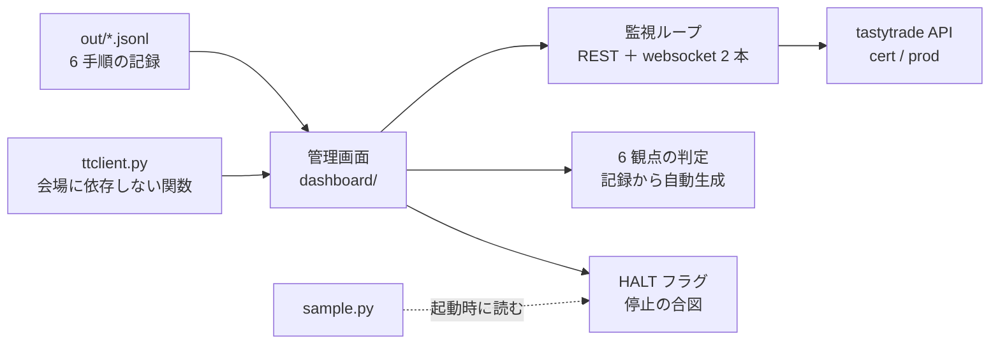
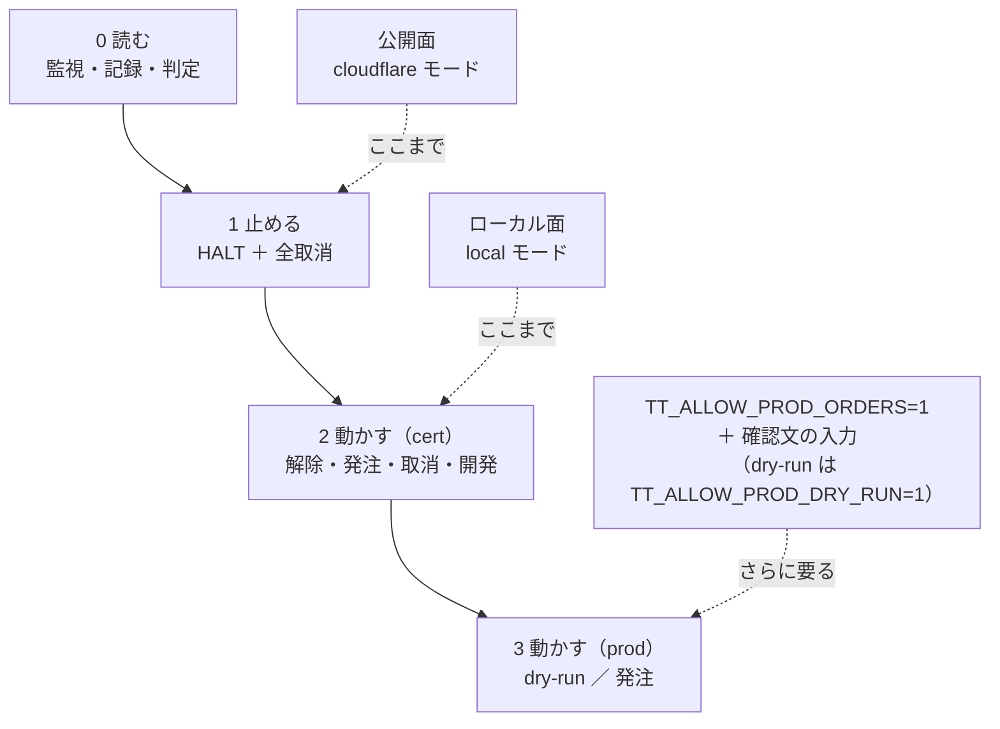

# 管理画面を作る（実運用の監視と、開発時の検証の両方）

起票: 2026-09-05（[TODO.md](../../TODO.md)「管理画面を作る」）。
これが**このプロジェクト最初のアプリ実装**になる（今まではドキュメントと `experiments/` の調査コードだけ）。

⚠ [vibeboard](../../vibeboard/) とは別物。あちらは `docs/` と `TODO.md` を見るローカル開発用。本件は**売買システムの管理画面**。

## 0. Phase 0 の決定（2026-09-05）

TODO に書かれていた論点を、着手前にここで確定する。

| 論点 | 決定 | 理由 |
| --- | --- | --- |
| **公開面に何を出すか** | **監視（読み取り）＋ 停止ボタンまで**。発注・停止の解除・開発時の検証は**ローカル面だけ** | 外から欲しいのは「今どうなっているか」と「止める」で、発注ではない。停止を外から押せるのは安全側 |
| **サーバに置く資格情報** | **既定は `read` スコープの grant**（本番用に別に切る）。cert（sandbox）の grant は置いてよい（金銭が動かない）。`trade` を置くかは利用者が決める | g3plus の侵害 ＝ 入金済み口座の侵害、にしないため。画面は token 応答の `scope` を常時表示し、どちらを置いたかが見える |
| 停止ボタンの中身 | (1) `HALT` フラグを記録ディレクトリに書く（資格情報不要）(2) 働いている注文を全部取り消す（**`trade` スコープがあるときだけ**。無ければ「取消は不可」と表示） | フラグは将来の自動売買が起動時・発注前に見る合図。取消は scope に従う |
| 実運用側 / 検証側を混ぜるか | **画面を分ける**。監視 / 記録 / 判定 / 操作 / 開発 の 5 画面。操作と開発はローカル面でしか出さない（公開面では 404） | 公開面に発注フォームの痕跡を残さない |
| 技術選定 | **Python 3.12 ＋ FastAPI ＋ uvicorn ＋ Jinja2 ＋ PyJWT**。フロントは素の HTML/CSS/JS（ビルドなし）。`ttclient.py` / `record.py` は**コピーせず `sys.path` で import** | 既存コードが Python で、会場に依存しない関数名をそのまま使える。ビルド工程を増やさない |
| 記録の置き場 | **JSONL をそのまま読む**（蓄積先を別に持たない）。監視で得たイベント（refresh の成否・切断・429）だけ `monitor/*.jsonl` に追記する | 記録形式は既に `venue` 列を持ち、他社を足しても読める |
| ポート | **3012**（TODO には 3011 とあったが、2026-08-21 に trip-note が取った。`git fetch` で判明） | g3plus-ops の採番規約 |
| サービス名 | `ail-dashboard`（ail ＝ ai-income-lab） | 短く、他サービスと衝突しない |
| 既存コードへの変更 | `ttclient.py` に**取消だけの第 3 の鍵** `allow_prod_cancel` を足す。`sample.py` に `TT_OUT_DIR`（記録先の差し替え）と **`HALT` の尊重**を足す | 停止ボタンが「取消はできるが発注は開かない」を満たすため。既存の 2 段ロックは崩さない（`selftest.sh` で回帰） |

## 1. 目的と背景

[tastytrade の API 検証](tastytrade-api-sample.md)で、6 手順の記録（`out/*.jsonl`）と会場に依存しないクライアント（`ttclient.py`）が揃った。
今は記録を目で読み、6 観点の判定表を手で書いている。9/8（火）の市場時間の実行を控え、**「今どうなっているか」を見る場所**と、**記録から判定を自動で組み立てる仕組み**が要る。

同時に、無人運転の前提を確かめるには**サーバ上で数日動かし続ける**必要がある（観点 A「refresh が無人で 1 営業日以上続く」は、放置して初めて測れる）。
管理画面を g3plus に載せて `read` の grant で監視を回せば、**それ自体が観点 A の実測になる**。

> この図の主張: 画面は既存の 2 つ（記録と クライアント）の上に載せ、新しい経路は「監視ループ」1 本だけ足す。

## 2. 対応方針

### 2-1. 2 つの面と 4 段の権限

`AIL_AUTH_MODE` で面を切り替える。**既定（未設定）は最も厳しい `loopback`**（ループバック以外は全部 403）。

| 面 | `AIL_AUTH_MODE` | 通す接続元 | 認証 | できること |
| --- | --- | --- | --- | --- |
| 公開面（g3plus） | `cloudflare` | cloudflared（同じ docker network） | **全リクエストで `Cf-Access-Jwt-Assertion` を検証**（GET 含む）。免除はループバックだけ | 監視・記録・判定の閲覧、**停止** |
| ローカル面（開発機） | `local` | ループバックと RFC1918 | なし（画面に「認証なし」を常時表示） | 上に加えて 停止の解除・操作・開発 |
| 既定 | `loopback` | ループバックのみ | なし | ローカル面と同じ |

`cloudflare` のときは `CF_ACCESS_TEAM` / `CF_ACCESS_AUD` / `CF_ACCESS_EMAIL` の 3 つが**全部そろわないと起動しない**（discord-manager と同じ fail-safe）。

> この図の主張: 権限は 4 段で、上に行くほど条件が重なる。公開面は 2 段目で止まり、本番の発注は 4 段目の 3 条件がすべて要る。

### 2-2. 秘密の扱い

- client secret・refresh token・access token・quote token・口座番号は**ブラウザに送らない**
- 画面と JSON API の応答は、`record.py` の `Masker` を通してから返す（JSONL と同じ置換 ＋ JWT の正規表現）
- 口座番号は `acct-<sha256 の先頭 4 桁>` のラベルに置き換える（複数口座を区別でき、元に戻せない）
- `Cache-Control: no-store`・CSP（`default-src 'self'`）・外部リソースなし
- **どの環境に繋がっているか（cert / prod）を、見間違えようのない形で常時表示する**（各パネルに色つきのバッジ。prod は赤）

### 2-3. 監視ループ（Phase 2）

設定された環境（cert / prod）ごとに 1 本。

| 何を | どう | 頻度 |
| --- | --- | --- |
| 認証 | access token を失効 60 秒前に refresh。**残り秒数**と refresh の成否・回数・最終エラーを持つ | 15 分ごと |
| 口座 | 残高・買付余力・建玉・働いている注文 | 30 秒ごと（`AIL_POLL_SECONDS`） |
| 現在値 | prod だけ REST の気配（`AIL_SYMBOL`、既定 SPY）と `updated-at` からの遅延 | 30 秒ごと |
| 口座ストリーマ | 繋ぎっぱなし。接続状態・最終受信時刻・切断と再接続の回数・直近の通知（Order / AccountBalance / CurrentPosition） | 常時 |
| DXLink（prod のみ） | 気配の購読。最終受信時刻・件数・再接続回数。quote token は 24 時間で取り直す | 常時 |
| エラー | `ApiError` の status / code / message と `error.errors[]` の抜粋。**429 の回数** | 発生時 |

イベント（refresh の成否・切断・再接続・429・失敗）は `monitor/<venue>-<env>-<日付>.jsonl` に追記する。
**観点 A の判定はこの追記から導く**（同じ refresh token で 1 営業日を跨いで refresh が通り続けたか）。

### 2-4. 判定の自動生成（Phase 1）

[プラン §2-2](tastytrade-api-sample.md) の成立条件を、記録の値だけから ✅ / ⚠ / ❌ に落とす。

| 観点 | 記録のどこを見るか |
| --- | --- |
| A 認証の寿命 | 手順 1 の `expires_in_s`・`jwt.lifetime_s`・`refresh_token_rotated`、手順 11 の `expired_401`、**監視ログの refresh が営業日を跨いだか** |
| B 常駐 | 同じ実行で手順 1・2・4・6 が ok（REST ＋ websocket だけで完結） |
| C 現在値 | prod の手順 3 の `delay_s`（**市場時間内の値だけ採用**。時間外は参考値）、手順 61 の `event_count` |
| D 発注の往復 | 手順 4 と 5 の ok。4 だけなら ⚠ |
| E レート制限 | 手順 7 の `60_per_minute` が 60 回通り `first_429_at_request` が無いか |
| F SDK | 記録の `sdk` 欄（直接叩き ＝ OpenAPI 仕様がある）。根拠は README §6 の【公表値】 |

各観点に「根拠にした run_id と手順」を付け、`venue` ごとに列を並べる（moomoo・IBKR を足したときにそのまま比較できる）。

### 2-5. 開発時の検証（Phase 4、ローカル面のみ）

- モックサーバ（`mock_server.py`）の起動・停止・ログ
- `selftest.sh` の実行と結果表示
- 手順を選んで `sample.py --step …` を実行し、標準出力をその場で流し、終わったら記録に飛べる
- ジョブは同時に 1 つ。履歴は `jobs/history.jsonl`

## 3. 影響範囲

| 場所 | 変更 |
| --- | --- |
| `dashboard/`（新規） | アプリ本体（`app/`）、テスト（`tests/`）、`requirements.txt`、`README.md`、`.env.example`、`run.sh` |
| `experiments/tastytrade-api-sample/ttclient.py` | `allow_prod_cancel`（取消だけの鍵）、`Token.scope` |
| `experiments/tastytrade-api-sample/sample.py` | `TT_OUT_DIR`、`HALT` の尊重（発注系の手順を拒否） |
| `experiments/tastytrade-api-sample/selftest.sh` | 上の回帰（取消の鍵で発注が開かないこと、HALT で手順 4 が止まること） |
| `docs/specs/dashboard.md`（新規） | 画面・権限・**デプロイ契約の正本** |
| `CLAUDE.md` | 構成とコマンド、vibeboard との棲み分け |
| `.gitignore` | `dashboard/.venv/`・`dashboard/.env`・`dashboard/data/` |
| `/home/ubuntu/g3plus-ops/ail-dashboard/`（別リポジトリ） | `docker-compose.yml` / `Dockerfile` / `.env.example`（`.env` は利用者） |
| `/home/ubuntu/g3plus-ops/docs/workflows/ail-dashboard.md`、CLAUDE.md の 4 箇所、`.gitignore` | 運用手順と索引 |

⚠ **ai-income-lab は public リポジトリ**。公開ホスト名・Access のポリシー・AUD は **g3plus-ops 側にだけ書く**。

## 4. Phase 構成

### Phase 0: 要件と範囲の確定 — §0 で完了

### Phase 1: 読み取りだけの土台（危険が無い）

- Step 1-1: 骨組み。設定（`config.py`）・面の判定（`access.py`）・マスク（`masking.py`）・テンプレート
- Step 1-2: 記録（`records.py`）。一覧・1 実行の詳細・**実行間の差分**（所要 ms・状態遷移の揺れ）
- Step 1-3: 判定（`judge.py`）。§2-4 の規則で 6 観点 × venue
- Step 1-4: テスト（`tests/`）。モックの記録を混ぜて、秘密が応答に出ないことを grep で確認

### Phase 2: 実運用の監視

- Step 2-1: 監視ループ（`monitor.py`）。認証の残り時間・口座・建玉・注文・気配
- Step 2-2: websocket 2 本の状態と再接続
- Step 2-3: エラーログと 429、`monitor/*.jsonl` への追記、観点 A への接続
- Step 2-4: 環境バッジ（cert / prod）と `scope` の常時表示

### Phase 3: 操作（既定は無効）

- Step 3-1: `ttclient.py` に `allow_prod_cancel`、`sample.py` に `HALT`・`TT_OUT_DIR`、`selftest.sh` で回帰
- Step 3-2: **停止ボタン**（両面）と解除（ローカル面）
- Step 3-3: cert の dry-run → 発注 → 取消 → 後片付け（ローカル面）
- Step 3-4: prod の 2 段ロック（`TT_ALLOW_PROD_DRY_RUN=1` / `TT_ALLOW_PROD_ORDERS=1` ＋ 確認文）と、実行前の注文内容の確認

### Phase 4: 開発時の検証（ローカル面）

- Step 4-1: モックの起動・停止、`selftest.sh` の実行
- Step 4-2: 手順の実行と出力の逐次表示、記録への導線

### Phase 5: g3plus に載せる

- Step 5-1: デプロイ契約を `docs/specs/dashboard.md` に書く（ベース・起動・必須 env・永続化）
- Step 5-2: `g3plus-ops/ail-dashboard/` の compose・Dockerfile・`.env.example`、`.gitignore`。開発機で `docker build` が通ることを確認
- Step 5-3: `docs/workflows/ail-dashboard.md`、CLAUDE.md の 4 箇所
- Step 5-4: ⚠ **サーバへの転送・起動・Cloudflare は利用者の判断で**。順序は「Access → `.env` → Tunnel hostname」。公開前に新しいホスト名を DNS で引かない

## 5. テスト方針

| # | 検証 | 方法 |
| --- | --- | --- |
| 1 | 秘密がブラウザに出ない | テストで偽の秘密（client secret・refresh・access・口座番号）を仕込み、全ページ・全 JSON の応答を grep して 0 件 |
| 2 | 面の判定 | `cloudflare` モードで JWT 無しは 403、ループバックは通る。`local` で公開 IP は 403。ローカル面だけの経路は公開面で 404 |
| 3 | 本番ガード | `allow_prod_cancel` で `submit_order` が開かない。dry-run の鍵で発注が開かない（既存の selftest に追加） |
| 4 | HALT | フラグがあると発注が拒否され、`sample.py --step 4` も止まる。`cleanup` は通る |
| 5 | 判定の再現性 | モックで作った記録から A〜F が決まり、同じ記録なら同じ判定 |
| 6 | 配線 | モックに対して監視ループが動き、websocket の再接続が数えられる |
| 7 | Docker | 開発機で `docker build` と起動（`loopback` モード）が通る |

## 6. 作業量の見積もり

| Phase | 見積もり |
| --- | --- |
| 1 読み取りの土台 | 3h |
| 2 監視 | 3h |
| 3 操作 | 2h |
| 4 開発時の検証 | 1.5h |
| 5 デプロイ設定と手順書 | 1.5h |
| **合計** | **約 11h**【推測】 |

費用: **0 円**【推測】。g3plus は既存、tastytrade の API は無料（[trading-fee-comparison.md §4](../specs/trading-fee-comparison.md)）。

## 7. 未確定・リスク

| # | 内容 | 扱い |
| --- | --- | --- |
| 1 | ⚠ **`out/` の記録が空**（2026-09-05 12:10 PT 時点。同日の実測記録は specs 側の本文にしか残っていない） | 開発はモックの記録で行う。実測の記録は 9/8 の実行で再び溜まる。本物の API には開発中に繋がない（失敗ログインの IP ブロックを避ける） |
| 2 | ⚠ 停止ボタンの「全取消」は `trade` スコープが要る | scope が `read` なら HALT だけ書き、「取消は不可」と表示する。利用者が `trade` の grant を置くかを決める |
| 3 | WSL2 から Windows のブラウザで開くと接続元がループバックにならないことがある | `local` モードは RFC1918 も通す |
| 4 | Cloudflare の設定と DNS は利用者の手作業 | 手順を `docs/workflows/ail-dashboard.md` に書く |
| 5 | 監視ループが本番の API を叩き続ける | 30 秒間隔・照会のみ（1 分あたり 8 回程度）。E の実測（60 回/分で 429 なし）の範囲内 |
| 6 | sandbox は 24 時間でリセットされる | 監視の cert 側は注文・建玉が消えることを前提に表示する |
