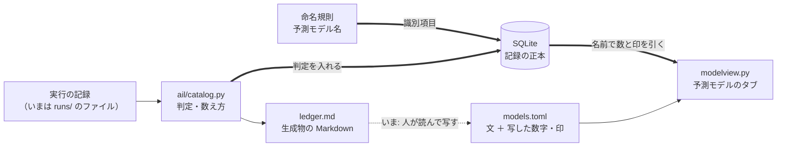
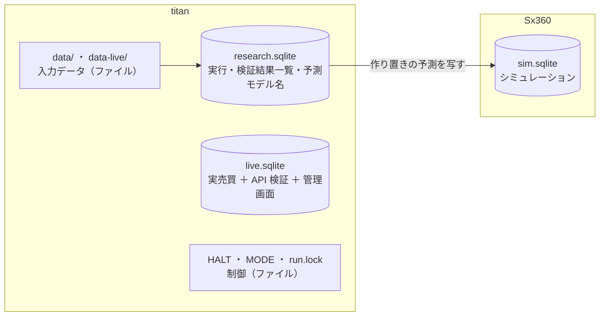
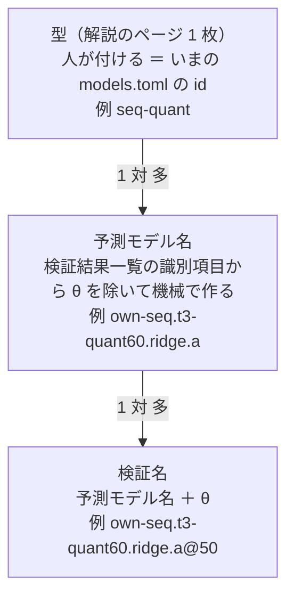

# 予測モデルの解説と DB での永続化を、いっしょに進める

2026-09-21 作成。利用者の指示（2026-09-21）: **TODO にある予測モデルの解説と DB での永続化を同時にやった方が良い**。
対象のタスク（[TODO.md](../../TODO.md)）:

- 「DBを使ったデータの永続化を行う」（2026-09-20。何を入れるか・どの DB かはプランで利用者と決める）
- 「vibeboard の「予測モデル」タブを、予測モデルを詳しく解説するものにする」（[プラン](vibeboard-models-tab-deep.md)。Phase 0〜4 は済み・Phase 5 の一覧のページは裁定待ち）
- 「名前の付け方（英語名）をそろえるか決める」（裁定待ち）→ ⚠ 2026-09-21 の裁定 ④ で**このプランの最初の段**になった

## 1. 目的・背景 ＝ なぜ重なるか

「予測モデル」タブの**事実の部分**（試した結果の印・試した経緯の「何通り・内訳」・「詳しく」の【実測】の数字）は、**いま人が記録から手で写している**。機械で引けないのは、引く先が無いから:

| 確かめたこと | 分かったこと | 出典 |
| --- | --- | --- |
| 判定（採る ／ 保留 ／ 落とす）はどこにあるか | ⚠ **生成物の Markdown（`ledger.md`）にしか無い**。`ail/catalog.py` の `ledger()` が毎回 `runs/` から組み立て、Markdown に吐くだけ | [dashboard.md §17-3](../specs/dashboard.md)・`ail/catalog.py:670` |
| タブの読み手（vibeboard の sidecar）は `runs/` を読めるか | ⚠ **読まない決まり**（標準ライブラリだけ・`runs/` は titan にしか無く git 管理外・解釈に pandas が要る） | §17 の図・`modelview.py` の冒頭 |
| 手で写した結果 | ⚠ **2026-09-20 の書き直しで 10 か所あまりの誤り**（「逆だった」「数が違った」「計算を直す前の行だった」） | §17-6 |
| 解説のページと検証結果一覧の行を結ぶ名前 | ⚠ **無い**。ページの識別名は `models.toml` の `id`（`own-ridge`）、トレーダーの設定は実験名 ＋ 数字の選び方・作り方の登録名（`trade_ownseq_ridge_a` ＋ `T3 QUANT（60日窓）`）、検証結果一覧の識別項目は 12 列（`catalog.KEY`）。⚠ 実験名は識別項目ではない（[rules.md 10-1](../specs/experiments/feature-discovery/rules.md)）。⚠ 検証結果一覧の「モデル」列は `Ridge` などの学習器で、利用者の言う「予測モデル」（入力データ・数字の選び方や作り方・学習器・学習範囲・較正の組）とは別物 | `catalog.KEY`・`config/traders/T3.toml` |

> この図の主張: いまは事実が人の手を 1 度通ってから画面に出る。命名規則で「予測モデル」に名前を付け、DB に記録を入れると、事実は名前で引く機械の経路で届き、人が書くのは文だけになる。

## 2. 裁定（2026-09-21・利用者）

| | 問い | 裁定 |
| --- | --- | --- |
| ① | 何を DB に入れるか | **予測モデルを作るときの入力データ以外**（「これで良いかも教えて」→ §3） |
| ② | DB の役割 | **2 か所には置かない。DB に入れたらファイルは削除**（＝ DB が正本） |
| ③ | どの DB | **SQLite** |
| ④ | 解説のどこを DB から引くか | **予測モデルの命名規則を作らないと解説に使えない** → 命名規則を Phase 1 にする（§5） |
| ⑤ | §3 の線引きと §4 の 5 点 | ✅ **「5 点問題ないので進める」**（2026-09-21）＝ 「データ」は実行や売買が生んだ記録 ／ 「1 実行 1 記録」への書き換え ／ 消す前に書き戻しの一致を確かめ、消すのは結果を見た利用者の了承のあと ／ DB の控えを置く ／ 実売買は 20 営業日のあと ／ DB ファイルは 3 つ |

## 3. ① の答え ＝ 「入力データ以外」で良いか

⚠ **良い。ただし「データ」を「実行や売買が生んだ記録」に限る**のを推す。設定・コード・文書・秘密・制御のファイルは「データ」に数えず、今までどおりファイル（git）に置く。

| 置き場 | 中身 | 大きさ【実測 2026-09-21】 | DB に入れるか |
| --- | --- | --- | --- |
| `feature-discovery/runs/` | 実行 1 本ごとの設定の写し・入力の指紋・結果・日次・持ち高・学んだ係数・ログ | 2.2GB（`daily.csv` 202 本で 1.95GB ／ `holds.csv` 0.29GB ／ `fitted/` 1,089 本で 0.01GB）。実行 255 本・検証結果一覧の行 1,155〔検証 667〕＋ leak 対照 992 | ✅ 入れる（Phase 2） |
| `feature-discovery/out/` | 診断・突き合わせ | 0.4MB | ✅ 入れる |
| `live-trading/out/`・`state/`・`state-backup/`・`journal.jsonl` | 実売買の注文・約定・売買履歴・控え | 0.3MB | ✅ 入れる（⚠ 時期は §4 の 4） |
| `live-trading/sim/`・`sim-predict/` | シミュレーションの記録・作り置きの予測 | 3.8MB（`sim-predict/`） | ✅ 入れる（⚠ 本物とは別の DB ファイル。§4 の 5） |
| `tastytrade-api-sample/out/` | API 検証の記録（2026-09-05〜） | 0.5MB | ✅ 入れる |
| `dashboard/data/` | 管理画面の監視・操作の履歴 | 0.1MB | ✅ 入れる |
| `feature-discovery/data/`・`data-live/`・外部系列 | ⚠ **入力データ**（日足・金利・為替など） | 4.5GB ／ 70MB | ❌ 入れない（裁定 ①） |
| `config/`・`models.toml` などの TOML・`docs/`・`ledger.md` | 設定・言葉の正本・文書（`ledger.md` は DB から作る**報告書**） | — | ❌ 入れない（git で差分を見て直すもの。⚠ `ledger.md` は「2 か所目」ではなく DB から作る読み物として残すのを推す） |
| `HALT`・`MODE`・`run.lock` | ⚠ **止める・切り替える・排他の仕組み** | — | ❌ 入れない（停止ボタンと起動の拒否がファイルの有無で決まる作り。DB が壊れても止められるようにする） |
| `.env` | 秘密 | — | ❌ 絶対に入れない |
| `dashboard/demo/` | デモのモックの記録（git 管理） | 0.6MB | ❌ 入れない（テストの部品） |
| `i7-dataset/out/` | 生成した評価セット（配るための成果物） | — | ❌ 推す（打ち切ったやり方・配るときはファイル） |

## 4. ② で変わること（⚠ 利用者の確認が要る 5 点）

1. ⚠ **`CLAUDE.md` の「緩めないもの」にある「1 実行 1 ディレクトリ」を書き換えることになる**（[rules.md 10 章](../specs/experiments/feature-discovery/rules.md) も）。中身の意図 ＝ 実行ごとに記録を分け・上書きせず・設定の写しと入力の指紋を必ず残す、は DB でも守れる。★ 書き換え案: **「1 実行 1 記録（実行の識別名で分け、上書きしない。設定の写し・入力の指紋・種・結果を同じ識別名で残す）」**
2. ⚠ **消すと戻せない**（`runs/` は git 管理外で、ほかに写しが無い）。★ 消す前に「DB から書き戻したものが元のファイルと一致する」を全部の実行で確かめ、一致しなかった実行は消さない。消すのは確かめの結果を見た利用者の了承のあと
3. ⚠ **DB が 1 つ壊れると全部を失う**（ファイルなら壊れるのは 1 本）。記録を失うと試した数（`n_trials`）を数え落とし、判定が甘くなる。★ **控え（SQLite の `.backup` で日付つきの 1 ファイル）を別の機械かディスクに置く**。控えは使う場所ではなく戻すためだけのもの ＝ 「2 か所に置かない」には当たらない、と考えるが、利用者の判断を待つ
4. ⚠ **実売買の執行器の書き込みを DB に替える時期**。明日（2026-09-22）が本番投入で、Phase 6 は「執行の差と無人運転の成立」を 20 営業日で見る。途中で書き込みの作りを替えると、無人運転の成立を同じ作りで測れなくなる。★ **20 営業日のあとに替える**（それまで実売買の記録はファイルのまま ＝ 同じ記録が 2 か所に置かれることはない）。早めるなら週末に執行器を止め、`mockrun.sh`・`sim2` を通してから
5. ★ **DB ファイルは 3 つに分ける**（研究 ／ 実売買 ／ シミュレーション）。本物とシミュレーションを混ぜない決まり（live-trading.md §0-7）をファイルの単位で守れる・実売買の書き込みが研究の長い書き込みを待たない。1 つの記録が置かれるのはどれか 1 つだけ

> この図の主張: 記録はどれも DB ファイルの 1 つにだけ置かれ、入力データと制御のファイルは今までどおりファイルのまま。

## 5. 命名規則（Phase 1 の案。⚠ 利用者の裁定）

⚠ 土台は [rules.md 10-1](../specs/experiments/feature-discovery/rules.md)（既存の名前は 1 つも変えない・計算が変わる変更は必ず名前を変える・名前から中身を読まない）。**新しい名前は別名として足す**。

> この図の主張: 名前は 3 段で、下の 2 段は検証結果一覧の識別項目から機械で作る。人が付けるのは一番上の「型」だけ。

| 段 | 何の単位か | 作り方（案） | いまの名前との関係 |
| --- | --- | --- | --- |
| 型 | 解説のページ 1 枚（いま 12） | 人が付ける。どの予測モデル名が入るかは型ごとの決まり（数字の選び方・作り方 ／ 学習器 ／ 入力データの組）で決める | `models.toml` の `id` をそのまま使う（リンクを切らない） |
| 予測モデル名 | トレーダーが使う単位（θ はトレーダーの側） | `catalog.KEY` から θ を除いた 11 列を、決まった順に短い綴りで並べる。⚠ **既定の値は書かない**（rules.md 10-1 の「水準」と同じ）＝ 日足・1 日・`adjusted`・既定の期間（2018-01-31 から）と銘柄数（63）・較正 `std` は書かず、外れたときだけ `~p1995`・`~cal-old` のように足す | 実験名（`trade_own_ridge_a`）は変えない。DB が実験名 → 予測モデル名の対応を持つ |
| 検証名 | 検証結果一覧の 1 行 ＝ `n_trials` の 1 | 予測モデル名 ＋ `@θ` | 検証結果一覧の行と 1 対 1 |

いま動かす 3 人の例（2026-09-21 に実装した綴り。⚠ 綴りは利用者の裁定待ち。入力データの部分は検証結果一覧の「特徴量の層」の空白を `-` にした機械の綴りで、実験名の略 `ownex`・`ownseq` とは別。`60` は観測期間 60 日の印）:

| トレーダー | 検証結果一覧の識別項目（θ 以外で既定から外れる列） | 予測モデル名（案） | 型 |
| --- | --- | --- | --- |
| `T1` | 全部使う（基準）× Ridge × `own` × 63 × 共通 × std | `own.all.ridge.a` | `own-ridge` |
| `T2` | 全部使う（基準）× LightGBM × `own cs rel ex` × 48 × 共通 × std | `own-cs-rel-ex.all.lgbm.a~n48` | `ownex-lgbm` |
| `T3` | T3 QUANT（観測期間 60 日）× Ridge × `own seq` × 63 × 共通 × std | `own-seq.t3-quant60.ridge.a` | `seq-quant` |

守ること（テストにする）:

- ⚠ **検証結果一覧の識別項目が違えば予測モデル名も必ず違う**（1 対 1。いまの 1,155 行 ＋ leak 992 行の全部で確かめる）
- ⚠ **言葉を決める**: 「予測モデル」＝ 入力データ・数字の選び方や作り方・学習器・学習範囲・較正の組 ／ 「学習器」＝ 検証結果一覧の「モデル」列（`Ridge` など）／ 「型」＝ 解説のページ。検証結果一覧の「モデル」列の名前は変えない（識別項目なので）が、画面と文書では「学習器」と呼ぶ
- ⚠ 名前は `n_trials` を動かさない（数え方は `catalog.is_trial` のまま）

## 6. 対応方針

⚠ **実装で決めた形（2026-09-21）**: 研究の DB は **ファイルの中身をそのまま 1 行ずつ入れる**（`runs`・`files`・`queue_state` の 3 つのテーブル。`ail/rundb.py`）。下のテーブルの案（`trials`・`gates`・`calibration` に分けて入れる）はやめた。理由:

- ⚠ **1 ビットも違わないことを確かめられる**（`sha256`。取り込みの前後で `ledger.md` が 1 文字も変わらない）。列に分けて入れると、CSV の数字の書き方（丸め・空欄・列の順）で戻したものが元と食い違い、「同じ記録か」を確かめられない
- ⚠ **判定の規則を 2 か所に書かない**（検証結果一覧の行・判定は今までどおり `catalog.ledger()` が記録から作る）
- 書き手・読み手の直しが入出力だけで済む（計算のコードは 1 行も変えていない ＝ 既定経路の指紋テストがそのまま通る）
- JSON は文字列のまま入れるので、DB の中で `json_extract` で引ける。CSV は zlib で縮めるだけ（2,321.7 MB → 313.4 MB【実測】）

⚠ **解説のタブ（Phase 3）が要るのは検証結果一覧の行と判定**で、これは pandas の要る `catalog` が作るので、標準ライブラリだけの sidecar は作れない。→ Phase 3 では **検証結果一覧を吐き直すときに、同じ `ledger()` の結果を DB のテーブル `ledger_rows` にも書く**（`ledger.md` と同じ生成物。毎回まるごと作り直す。⚠ 利用者に確かめる ＝ §9）。

以下は 2026-09-21 の最初の案（経緯として残す）。

- ⚠ **判定・数え方・識別項目は `ail/catalog.py` のまま**（DB は記録の置き場。判定の規則を 2 か所に書かない）。`ledger.md` は DB から作る報告書として残し、**DB に移す前後で 1 文字も変わらない**ことを確かめる
- 研究の DB（`research.sqlite`）のテーブル（⚠ Phase 2 の前に列まで決める）: `runs`（実行の識別名 ＝ いまのディレクトリ名・設定の写し・入力の指紋・種・コードの版・ログ）／ 結果のテーブル（`result`・`summary`・`daily`・`per_symbol`・`holds`・`selected`・`topk` ＝ いまの CSV と同じ列 ＋ 実行の識別名）／ `checks`（いまの `checks.json`）／ `fitted`（学んだ係数。JSON と `.pt` を中身ごと）／ `names`（実験名 → 予測モデル名 → 型）
- 書き手（`cli.run`・`cli.scenario`・`cli.queue`・`cli.predict` の作り置き）と読み手（`catalog.py`・`app/experiments.py`・`dashboard/vibetab.py`・`cli.report`）を DB に替える。⚠ `cli.queue` の再開（どこまで回ったか）も DB の実行の識別名で
- sidecar は標準ライブラリの `sqlite3` で**読み取り専用**に開く（`file:…?mode=ro`）。DB が無い機械では今までどおり TOML の文だけを出し、「DB が無い」の注を付ける
- ⚠ 画面の決まり（やさしい言葉・くらべる文を書かない・本数を数えない・売買結果を出さない・bp を本文に書かない）は変えない
- ⚠ 実売買の書き込みを替えるまで（§4 の 4）、`experiments/live-trading/`・`dashboard/app/` の記録の読み書きには触らない

## 7. Phase

- ✅ **Phase 0**: 裁定 ① 〜 ⑤（2026-09-21）
- 🔶 **Phase 1（命名規則）**（✅ 実装・テスト・rules.md 10-2 まで。⚠ 綴りの裁定待ち ＝ §9）: §5 の案を詰めて rules.md 10-1 の次の節に書く（⚠ **綴りは利用者の裁定**）。検証結果一覧の全行に名前を付けて 1 対 1 を確かめるテスト。既存の名前は変えない
- 🔶 **Phase 2（研究の DB）**（✅ 取り込み・一致の確かめ・書き手と読み手の切り替え・規約の書き換えまで。⚠ ディレクトリを消すのは了承待ち ＝ §9）: テーブルを作る → 書き手・読み手を DB に替える → いまの 255 本を取り込む → `ledger.md` が変わらない・`n_trials` 667 のまま・書き戻したものが元のファイルと一致、を確かめる → ⚠ **利用者の了承のあと** `runs/` のファイルを消す → `CLAUDE.md`・rules.md 10 章の「1 実行 1 ディレクトリ」を書き換える（⚠ 文面は利用者の了承）
- **Phase 3（解説のタブが DB を読む）**: 試した経緯の行に予測モデル名を書き、何通り・内訳・いつを DB から出す。`result.verdict` と DB の判定が食い違えばテストが落ちる。⚠ 食い違いが見つかったら、どちらが正しいかを記録で確かめて直し、§8 に残す
- **Phase 4（「詳しく」の【実測】）**: 較正の係数・門の数字などを、DB の値の差し込みに替える（出典の実行の識別名つき）
- **Phase 5（小さな置き場）**: `feature-discovery/out/`・`tastytrade-api-sample/out/`・`dashboard/data/`（管理画面の読み書きを替える）
- **Phase 6（実売買 ＋ シミュレーション）**: ⚠ **§4 の 4 の時期に**。執行器・控え・売買履歴・`paper.py`・`reconcile.py`・`recovery.py`・管理画面の読み手を `live.sqlite` に、シミュレーションを `sim.sqlite` に。`mockrun.sh`・`sim2`・執行器の pytest を通す。⚠ 本番で起動し直すのは利用者
- 予測モデルのタブの **Phase 5（一覧のページの形）** は元のプランのまま（裁定待ち。このプランとは独立）
- 後片付け: `TODO.md` → `DONE.md`・プランを archive へ・仕様（`dashboard.md` §17・rules.md 10 章・各 README）を直す

## 8. 影響範囲

| Phase | 直す | 直さない |
| --- | --- | --- |
| 1 | rules.md 10-1 の次の節・`ail/`（名前を作る関数）・テスト | 既存の名前（実験名・モデル名・選び方や作り方の登録名・`models.toml` の `id`） |
| 2 | `cli/run.py`・`cli/scenario.py`・`cli/queue.py`・`cli/report.py`・`ail/catalog.py`（読むところだけ）・`dashboard/app/experiments.py`・`dashboard/vibetab.py`・`.gitignore`・`CLAUDE.md`・rules.md 10 章 | 判定・数え方・識別項目（`catalog.judge`・`is_trial`・`KEY`） |
| 3〜4 | `dashboard/modelview.py`・`dashboard/models.toml`・`dashboard/tests/`・`dashboard.md` §17 | `traderview.py` の画面・vibeboard 本体 |
| 6 | `experiments/live-trading/` の記録の読み書き・`dashboard/app/` の記録の読み手・`tastytrade-api-sample/record.py` | 許可の 3 段・`HALT`・`MODE`・`run.lock`・`Masker`（DB に書く前も通す） |

- 反映: `modelview.py`・`vibetab.py` を直すので **sidecar（3015）の入れ直しが要る**（⚠ 利用者。§12-3 の罠）
- 費用: 追加の費用なし（SQLite は Python に同梱。titan の版は 3.45.1【実測 2026-09-21】）

## 9. テスト方針

- `cd experiments/feature-discovery && .venv/bin/python -m pytest -q tests`（名前の 1 対 1・DB の書き読み・`ledger.md` が変わらない・`n_trials` が変わらない・書き戻しの一致・既定経路の指紋テスト `tests/test_trading_run.py`・`tests/test_predict.py`）
- `cd dashboard && .venv/bin/python -m pytest -q tests`（いま 218 本＋。DB あり ／ なしで画面が壊れない）
- Phase 6 は `cd experiments/live-trading && ../feature-discovery/.venv/bin/python -m pytest -q tests`・`./mockrun.sh`・`./run-sim.sh --fresh --speed max`（⚠ titan では `LT_MODE_DIR` を scratch に向ける）
- 手元で見る: `python3 dashboard/vibetab.py --port 3016` → `http://127.0.0.1:3016/models/view?item=own-ridge`（3010・3015 に触らない）
- 【実測】で残す: 取り込みの所要時間・DB ファイルの大きさ（いまの `runs/` 2.2GB との比）・sidecar がページを返す時間

## 9. 進み具合と【実測】（2026-09-21）

### Phase 1（命名規則）

- `ail/names.py`・`config/names.toml`・`tests/test_names.py`（16 本）・rules.md 10-2
- 検証結果一覧の全行で識別項目 ↔ 名前が 1 対 1【実測】: 行 1,155 ＝ 検証名 1,155 ／ 予測モデル名 591（うち検証数に数える行を持つもの 333）／ leak 対照 992 行も 1 対 1 ／ いちばん長い名前 52 文字
- ⚠ **綴りの裁定待ち**（`T1` `own.all.ridge.a` ／ `T2` `own-cs-rel-ex.all.lgbm.a~n48` ／ `T3` `own-seq.t3-quant60.ridge.a`）。綴りを変えても記録は直さない（名前は識別項目から作り直せる）

### Phase 2（研究の DB）

| 確かめたこと | 【実測】 |
| --- | --- |
| 取り込み（`python3 -m cli.db import`） | 実行 255 ・ ファイル 3,479 ・ キューの状態 10 ／ 26.2 秒 ／ 2,321.7 MB → 313.4 MB（DB のファイル 316.7 MB） |
| 突き合わせ（`python3 -m cli.db verify`） | **一致 255 ／ 食い違い 0**（DB から取り出したバイト列の sha256 ＝ ディスクの sha256）・キューの状態も一致・5.0 秒 |
| 検証結果一覧 | **直す前のコード（ディレクトリ）で作った検証結果一覧と、DB だけ（ディレクトリの無い置き場）で作った検証結果一覧が 1 文字も違わない**（512,428 文字）・`n_trials` 667 のまま |
| 実行タブ（`app/experiments.py`） | 直す前（ディレクトリ）と直した後（DB）で一覧・詳細が同じ（本物 140 ・ leak 113） |
| テスト | 研究側 497 本（`test_rundb.py` 9 本・`test_names.py` 16 本を足した）・管理画面 218 本が通る |

- 書いたその場で入れる形にした理由: `cli.run` は自分の `summary.csv` が検証結果一覧に入った状態で `n_trials` を数える（`checks.n_trials_now`）。閉じるときにまとめて入れると 1 本数え落とす（DSR が甘くなる向き）。`tests/test_checks.py` が「閉じる前に数える」を確かめる
- `cli.report --recheck` は ⚠ **`checks.json` のある実行を書き換えない**ように直した（無い実行にだけ足す）
- ⚠ **まだ消していない**: `runs/` の実行ディレクトリ 255 と `runs/queue/*.json`（いまは DB とディスクの 2 か所にある）。消すのは `python3 -m cli.db remove-dirs --i-verified`（消す直前にもう一度突き合わせ、一致した実行だけを消す）

### 利用者に確かめること

1. 予測モデル名の綴り（§5・rules.md 10-2）
2. `runs/` の実行ディレクトリを消してよいか（一致 255 ／ 255）
3. 控えの置き場（別の機械かディスク。`python3 -m cli.db backup --to <道>`）。⚠ 消す前に 1 つ取るのを推す
4. Phase 3 で、検証結果一覧の行と判定を DB のテーブル `ledger_rows` にも書いてよいか（`ledger.md` と同じ生成物。毎回まるごと作り直す）
