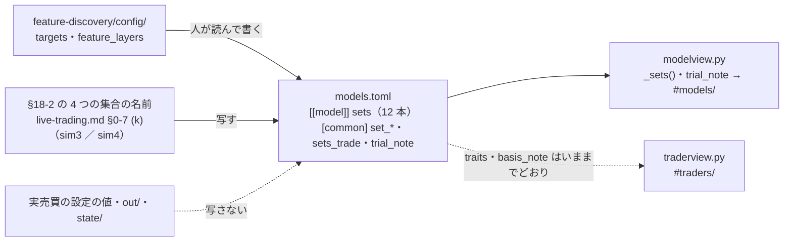

# 予測モデル一覧を直す（トレーダー・モデルの設定の説明 Step 5）

作成日: 2026-09-26。親: [売買に使うトレーダーやモデルの設定などの説明を分かりやすく書く](explain-trader-model-settings.md) の Step 5。アウトラインは [Step 2 の結果](explain-settings-outline.md) §5-2（予測モデル一覧の行）と §5-4 の決定 3・5。前の段は [Step 4](explain-settings-trader-page.md)（「トレーダーのしくみ」に 4 つの集合を**売買する株の側から**書いた）。

## 0. 目的・背景

予測モデルのタブ（`dashboard/models.toml` の `[[model]]` 12 本・画面 `dashboard/modelview.py`）は、モデル 1 本ずつの説明としては手厚いが、Step 1 の棚卸しと Step 2 の決定で 2 つの欠けが残っている。

| 欠け | いまの状態 | この Step で直すこと |
| --- | --- | --- |
| **O5**: 特性の出どころ | T2・T3 の特性「試し運転（64 日のシミュレーション）では、初日に見る株の全部を買い…」（`basis = trial`）の出どころは **`sim3`**（出力スコアを出す株の全部を金額を決めて売買する形）。いまの実際の売買の形（決まった本数を 1 株単位で買う ＝ `sim4` の形）とは、売買する株の数と買い方が違うのに、どちらの形の話かがページに書いていない | 「試し運転の 64 日」が何だったかを `[common]` に 1 か所で書き、**売り買いの本数の話**をしている特性・出力スコアの癖の文は、どの形の試し運転かを文の中で名指しする。いまの形（`sim4`）の数は「詳しく」に【実測】で足す |
| **4 つの集合**（2026-09-26 利用者決定「4 つの集合は重要なので記載する」＝ [dashboard.md §18-2](../specs/dashboard.md)） | 組み立ての表（`axes`）の `data`・`scope` の文の中に「見る株の全部（詰め合わせ商品もふくむ）」「出力スコアをつけるのは会社の株だけ」が埋まっていて、**材料に入れるもの ／ 学ぶ株 ／ 出力スコアを出す株** が書き分けられていない。「売買する株はトレーダーが決める」はモデルのページに無い | モデルのページに **3 つの集合の小さな表**（モデルの側の 3 つ）を足し、その下に「売買する株は、この中からトレーダーが決める」の 1 文と「トレーダーのしくみ」へのリンクを置く（12 本とも） |

⚠ **12 本とも残す**（2026-09-26 利用者決定「予測モデル一覧は全て説明する」）。`[[model]]` を消さない・`id` を変えない（リンクが切れる）。⚠ **設定の値（モデル・θ・銘柄・予算・`sizing`）は変えない**。⚠ 実験は回さない（文を直すだけ）。

## 1. 守る決まり

| 決まり | 出どころ | この Step への効き方 |
| --- | --- | --- |
| 言葉の正本は `models.toml`。Python・HTML に説明を書かない | dashboard.md §17-4 | 表の行の名前・1 文・注は全部 `[common]` の項目。コードは「その項目を描く」だけ |
| 本文はやさしい言葉（`FORBIDDEN`）・くらべる文を書かない（`COMPARING`）。用語・コードの場所・細かい数字は `[model.detail.*]` にだけ | `tests/test_models_tab.py`・`test_traders_tab.py` | 「端株」「成行」「執行」「notional」「sizing」「universe」「us63」「company」は本文に書けない → 「1 株単位」「金額を決めて買う」「出力スコアを出す株の全部」「会社の株だけ」 |
| **本文（`[common]` も）に 63・48・55・45・`$`・bp を書かない**（テストが弾く）。見る株の本数も書かない（`models.toml` の頭の決まり） | `test_common_words_are_plain_and_do_not_compare`・`models.toml` 13 行目 | 3 つの集合の表に本数を書かない（「見る株の全部（詰め合わせ商品もふくむ）」「会社の株だけ」）。本数は `detail.about` にだけ。`sim4` の「5 本」も本文には書かない（「決まった本数」） |
| 4 つの集合の名前は §18-2 と同じ綴り（材料に入れるもの ／ 学ぶ株 ／ 出力スコアを出す株 ／ 売買する株）。材料を「株」と呼ばない | §18-2（`test_system_tab.py` 112 行目と同じ検査をこちらにも置く） | `[common]` の行の名前 3 つ ＋ 1 文の中の「売買する株」 |
| 特性・出力スコアの癖には `basis`。確かめていない理由を言い切らない | §16-1・§17-2 | 書き換える特性は `basis = trial` のまま。`sim4` で見えたことを足すなら、それも `trial` で、数は「詳しく」に |
| 新しい欄はトレーダーのタブに出ない（人のページを長くしない） | `test_trader_page_does_not_grow` | 3 つの集合の表・試し運転の注は `modelview` だけが描く。⚠ ただし **`traits` の文と `why`・`basis_note` はトレーダーのページにも同じ文が出る**（`traderview.py` 294〜295 行目）＝ 特性の文を直せば両方に効く（O5 はトレーダーのページの問題でもあるので、それでよい） |
| 言葉は CLAUDE.md の表（売買基準値・観測期間・識別名…） | CLAUDE.md | 「窓」「台帳」「合図」を書かない |
| 試した経緯の数・門の数字・較正の係数は DB から引く | §17-3 | `history`・`{{gate|…}}`・`{{calib|…}}` には触れない（触ると DB との突き合わせが落ちる） |

## 2. 対応方針

> この図の主張: 足すのは `models.toml` の欄 2 つ（`sets`・`[common]` の注と 1 文）と、それを描くコード数十行だけで、値の正本（実験の config・実売買の設定）と、集合の決まり（§18-2）はそのまま写す。

### 2-1. 3 つの集合の表（`[[model]] sets = { material, learn, output }`）— 12 本ぶんの下書き

組み立ての表（`axes`。5 行）は変えない。その**直下**に「3 つの集合（このモデルの側）」の表を描き、下に `[common] sets_trade` の 1 文とリンクを置く。⚠ 本文に本数を書かない。⚠ `axes.data`・`axes.scope` から**集合の名指しだけ**を抜く（同じことを 2 か所に書かない）。数字（本数・`targets`）は `detail.about` に。

| id | 材料に入れるもの | 学ぶ株 | 出力スコアを出す株 | `axes` から抜く句 ／ `detail.about` に足す数 |
| --- | --- | --- | --- | --- |
| `own-ridge` | その株自身の値動き（毎日の値段と売買された量）だけ。ほかの株も、株の外の数字も入れない | 出力スコアを出す株の全部をまとめて 1 つ | 見る株の全部（株の詰め合わせ商品もふくむ）＝ 材料と同じ | `data` の「見る株の全部（詰め合わせ商品もふくむ）」／ 既に `targets = all`・63 本あり |
| `ownex-lgbm` | その株の値動き ＋ ほかの株と市場全体（詰め合わせ商品）の値動き ＋ 株の外の数字（為替・金利・天気・地震） | 会社の株だけをまとめて 1 つ | 会社の株だけ（詰め合わせ商品は材料にだけ使い、出力しない） | `data` の「出力スコアをつけるのは会社の株だけ」／ 既に `targets = company`・48 本・ETF は材料あり |
| `seq-quant`・`minirocket`・`hydra`・`patchtst` | その株の過去 60 日の値段の道すじだけ | 出力スコアを出す株の全部をまとめて 1 つ | 見る株の全部（詰め合わせ商品もふくむ） | `scope` の「見る株の全部を」→「学ぶ株の全部を」／ `about` に「材料 ＝ 学ぶ ＝ 出力 ＝ us63 63 本（targets = all）」の 1 句（`seq-quant` は既にあり） |
| `mlp` | 2 通り: その株の値動きだけ ／ ほかの株・市場全体・株の外の数字も | 見る株の全部 ／ 会社の株だけ（それぞれ、まとめて 1 つ と 株ごとに 1 つずつ の 2 通り） | 見る株の全部 ／ 会社の株だけ | `data` の「（会社の株だけ）」／ 既に us63・48 社あり |
| `gan-augment` | 基になる型と同じ 2 通り ＋ 材料から作ったにせの行 | 基になる型と同じ | 基になる型と同じ | — ／ 既に us63・48 社あり |
| `symbolic-regression` | その株の値動きだけ | 出力スコアを出す株の全部をまとめて 1 つ | 見る株の全部（詰め合わせ商品もふくむ） | `scope` の「見る株の全部を」／ 既に us63 あり |
| `trend-gates`・`entry-exit-gates` | その株の毎日の終わりの値段だけ（30 年ぶん。当時まだ無かった株は、あるところから） | 出力スコアを出す株の全部をまとめて 1 本の門 | 見る株の全部（詰め合わせ商品もふくむ） | `scope` の「見る株の全部を」／ 既に fold ごとの銘柄数 54〜63 あり |
| `cgan-scenario` | 大きな会社の株の詰め合わせ商品 1 本の、毎日の 6 つの数字 | その 1 本 | その 1 本（出力スコアではなく、5 日の筋書き） | — ／ 既に SPY あり |

`[common]` に足す項目（案。文は書くときに整える）:

| 項目 | 文（案） | 出る場所 |
| --- | --- | --- |
| `sets_title` | 3 つの集合（このモデルの側） | 表の見出し |
| `set_material` ／ `set_learn` ／ `set_output` | 材料に入れるもの ／ 学ぶ株 ／ 出力スコアを出す株（⚠ §18-2 と同じ綴り） | 表の行の名前 |
| `sets_trade` | 売買する株は、この中からトレーダーが決める（モデルの側では決めない）。出力スコアの無い株は売買できない。 | 表の下の 1 文 |
| `sets_link` | トレーダーのしくみ（売買する株の側から）→ `{ tab = "system", item = "trader" }` | 1 文の下のリンク |
| `trial_note` | 「試し運転の 64 日」＝ 過去の 64 営業日ぶんを仮の時計で通した試し運転（2026-09-20）。出力スコアは、いまの実際の売買と同じ作り方で、出力スコアを出す株の全部に出した。売り買いのほうは、出力スコアを出す株の全部を金額を決めて買う形で行った ＝ いまの実際の売買の形（決まった本数を 1 株単位で買う）とは、売買する株の数と買い方が違う。出力スコアの話はそのまま当てはまるが、「何本買った・売った」の話は、いまの形では同じにならない。 | 2「モデルの特性」の `basis_note` の下（⚠ モデルのページだけ。トレーダーのページに出すかは Step 6 で決める）。✅ 実装では **本文（`summary`・`traits`・`sees_note`・`how`・`axes`・`walk`・`score`・`limits`）に「試し運転」があるモデルのページにだけ出す**（`modelview._mentions_trial`。64 日の話の無いページに注だけ出さない ＝ 「欄の無いモデルは、その部分を出さないだけ」と同じ考え） |

### 2-2. 特性の出どころ `sim3` を明記する（O5）— 直す文の一覧

`models.toml` の「試し運転」の言及 9 か所（60・115・143・144・195・199・225・226・230・279 行目）を、**出力スコアの話**（作り置きの予測 `sim-predict`。`sim3` と `sim4` で共通・いまの本番と同じ作り方 ＝ そのまま当てはまる）と、**売り買いの本数の話**（`sim3` の注文 ＝ いまの形とは違う）に分ける。

| 場所 | いまの文 | 分け | 直し方 |
| --- | --- | --- | --- |
| `[common] basis_note`（60） | 試し運転で見えた: シミュレーションや過去のデータで試したときに見えたこと | — | 変えない（トレーダーのページにも出る）。説明は新しい `trial_note` に |
| `own-ridge` traits[2]（115）・score[0]（143） | 向きが逆・端が 44.98〜61.09 | 出力スコア | 文はそのまま（`trial_note` が受ける） |
| `own-ridge` score[1]（144） | 見る株の大半が毎日「買う」側 ／ 見る株の 9 割ちかく | 出力スコア | 「見る株」→「出力スコアを出す株」 |
| `ownex-lgbm` traits[0]（195）・traits[4]（199）・score[0]（225） | 全部の株が同じ値 ／ 4 分の 3 の日で逆 ／ 端 44.50〜57.72 | 出力スコア | 「全部の株」→「出力スコアを出す株の全部」（195 だけ） |
| `ownex-lgbm` traits[1]（196） | 見る株を全部いっぺんに買うか、1 本も買わないか | **売り買い** | 「売買する株を全部いっぺんに買うか…」に直し、`why` に「出力スコアを出す株の全部を金額を決めて買う形の試し運転でも、決まった本数を 1 株単位で買う形の試し運転でも、そうなった（数は詳しくに）」を足す（`basis = trial` のまま） |
| `ownex-lgbm` score[1]（226）・limits[0]（230） | 届いたのは 1 日だけ・全部がいっぺんに ／ 今日は買う日か | 出力スコア | 「全部の株」→「出力スコアを出す株の全部」 |
| `seq-quant` traits[0]（279） | 試し運転（64 日のシミュレーション）では、初日に見る株の全部を買い、最後の日も全部を持っていた。`why` ＝ 売りは買いの 4 分の 1 | **売り買い** | 「出力スコアを出す株の全部を金額を決めて売買する形の試し運転（64 日）では、初日に全部を買い、最後の日も全部を持っていた。決まった本数を 1 株単位で買う形の試し運転でも、持ち続ける形は同じだった。」`why` の「4 分の 1」は前の形の数と明記（`basis = trial`） |

「詳しく」（`detail.score`）に足す【実測】（出典 [live-trading.md §0-7 (k)](../specs/experiments/live-trading.md)・2026-09-20・titan）:

| モデル | 足す行 |
| --- | --- |
| 3 本とも | 「試し運転の 64 日」の出どころ ＝ 予測の作り置き `sim-predict/`（`cli.predict --asof` × 64 日 × 3 本。`sim3` と `sim4` で共通・本番の `run-live.sh` と同じ経路）。売買は `sim3`（`candidates/notional/` の写し・金額指定・us63 63 本 ／ T2 は会社株 48 本・1 銘柄の枠 $4.76 ／ $6.25）と `sim4`（`candidates/shares/` の写し・整数株・T・PFE・NKE・VZ・BAC の 5 本・枠 $60 ＝ いまの本番の形） |
| `own-ridge` | `sim4` の sim_S1: 買い 26 ／ 売り 22・最終日 4 本（既にある `sim3` の sim_T1 399 ／ 343 の横に） |
| `ownex-lgbm` | `sim4` の sim_S2: 買い 4 ／ 売り 0（最終日に一度に。`sim3` の sim_T2 48 ／ 0 と同じ形） |
| `seq-quant` | `sim4` の sim_S3: 買い 6 ／ 売り 1・最終日 5 本（`sim3` の sim_T3 85 ／ 22 の横に）・`too_small` 1（BAC が枠 $60 を超えた日 ＝ §0-7 (k) の 3） |

「見る株」の言い換え（17 か所。`grep -n 見る株 dashboard/models.toml`）: `scope` の「見る株の全部をまとめて」→「学ぶ株の全部をまとめて」（10 か所）／ 出力スコアの癖・特性の「見る株」→「出力スコアを出す株」（144・196・279）／ `trend-gates` の「見る株の組を変えて」（565・569）は試しの話なのでそのまま。⚠ `[common]` 13 行目のコメントは決まりの文なので触らない。

### 2-3. 3 つの集合の描き方 — 欄を足す（推し）か、`axes` の文に埋めるか

| 案 | 中身 | 良い点 | 代償 |
| --- | --- | --- | --- |
| **A（推し）: `sets` の欄と `[common]` の項目を足し、`modelview._sets()` で描く** | `SETS = ("material", "learn", "output")`・行の名前は `[common] set_<鍵>`（`axes` と同じ作り）・表の下に `sets_trade` ＋ `sets_link`・2 の段に `trial_note` | 4 つの集合の名前が**表の行の名前として** §18-2 と同じ綴りで出る（テストで固定できる）。トレーダーのしくみの表と同じ形で読める。`axes_note` の「5 つの組み合わせ ＝ 1 つ変えれば新しい試し」を汚さない | コード 30 行前後（`_sets`・`_model_body` の 2 か所）＋ テスト。⚠ `modelview.py` を変えるので sidecar（3015）の入れ直しが要る（利用者） |
| B: `axes.data` に「材料に入れるもの: …」・`axes.scope` に「学ぶ株: … ／ 出力スコアを出す株: …」と書き、`axes_note` に 1 文を足す | TOML だけ | コードを触らない・sidecar の入れ直し不要 | 集合の名前が 2 つの行の文の中に埋まり、書き分けたことにならない（いまと同じ形）。「売買する株はトレーダーが決める」が「1 つ変えれば新しい試し」の注に混ざる |

A を推す理由 ＝ 利用者が「4 つの集合は重要」と言っており、Step 4 のトレーダーのしくみでは表の行として書き分けたので、モデルのページも同じ形にそろえるため。⚠ 描き方を足しても**文はすべて TOML**（説明をコードに書かない）。利用者が B を選べば Step 5-2 は飛ばし、5-1 のテストは「`axes.data` に 3 つの名前が入っている」に変える。

### 2-4. Step（実装の順）

| Step | 中身 | 変えるファイル |
| --- | --- | --- |
| 5-1 | **テストを先に直す**（赤 → 緑で漏れを見つける）: `test_deep_parts_are_well_formed` に `sets ⊆ SETS`・本物の 12 本は全部に 3 つの集合がある・`[common]` の `set_*` が §18-2 の綴り（`["材料に入れるもの", "学ぶ株", "出力スコアを出す株"]`）・`sets_trade` に「売買する株」「トレーダー」がある・`trial_note` がある ／ 最小の置き場 `MODELS` に `sets`・`set_*`・`sets_trade`・`sets_link`・`trial_note` を足す ／ `test_model_page_deep_parts` に「組み立ての表の直後に 3 つの集合の表 → 1 文 → `/#system/trader` へのリンク」と「2 の段の `basis_note` の直後に `trial_note`」／ `test_trader_page_does_not_grow` に集合の表の文字と `trial_note` の文字 ／ 「試し運転」を含む本文の文には「出力スコア」か「金額を決めて」か「1 株単位」のどれかがある（出どころが読める）という検査を 1 本 | `dashboard/tests/test_models_tab.py` |
| 5-2 | **`modelview.py`**（案 A）: `SETS`・`_sets(common, m)`（`_axes` と同じ形の表 `class='axes'` ＋ `
` の 1 文 ＋ `_links([...])`）・`_model_body` の 1 の段で `_axes` の直後に・2 の段で `basis_note` の直後に `trial_note`。⚠ トレーダーのページ（`traderview.py`）は触らない | `dashboard/modelview.py` |
| 5-3 | **`models.toml` — 3 つの集合**: `[common]` の項目 6 つ（§2-1 の表）・12 本に `sets`（§2-1 の下書き。⚠ 本数を書かない・材料を「株」と呼ばない）・`axes` から集合の名指しの句を抜く・「見る株」の言い換え（§2-2 の末尾）・`detail.about` に本数と `targets` が無いモデルに 1 句足す（`minirocket`・`hydra`・`patchtst`・`symbolic-regression`・`trend-gates`） | `dashboard/models.toml` |
| 5-4 | **`models.toml` — 出どころ `sim3` の明記**: `[common] trial_note`・§2-2 の表のとおり 3 本の特性と出力スコアの癖の文を直す・`detail.score` に `sim4` の【実測】と作り置きの出どころを足す（出典つき）。⚠ `history`・`{{gate}}`・`{{calib}}`・`result` には触れない | `dashboard/models.toml` |
| 5-5 | **文書とコメント**: `dashboard.md` §17-2 の表の 1 行目（組み立ての後ろに「3 つの集合の表 ＋ 売買する株はトレーダーが決める」）・`[[model]]` の欄の一覧に `sets`・§18-2 の「モデル 1 本のページは前の 3 つ（組み立ての `data`・`scope`）」→「（3 つの集合の表 `sets`）」・§9 更新履歴 ／ `CLAUDE.md` の予測モデルのタブの項に 1 句 ／ `models.toml` の頭のコメント（欄の一覧に `sets`・試し運転の出どころの決まり）・`modelview.py` の頭 | `docs/specs/dashboard.md`・`CLAUDE.md`・2 ファイルの頭のコメント |
| 5-6 | **通しで確かめる**: `cd dashboard && .venv/bin/python -m pytest -q tests/test_models_tab.py tests/test_traders_tab.py tests/test_system_tab.py tests/test_help.py` → `./run-tests.sh --fast` → `python3 dashboard/vibetab.py --port 3016` で `http://127.0.0.1:3016/models/view?item=own-ridge`・`ownex-lgbm`・`seq-quant`・`cgan-scenario` を目で見る（3 つの集合の表が組み立ての直下・1 文とリンク・2 の段の注・特性の文）＋ `#traders/T1` で特性の文だけが変わり表は出ないこと。⚠ 動いている sidecar（3015）と vibeboard（3010）の入れ直しは**利用者**。⚠ Sx360 では `test_real_detail_plugs_match_the_db` が空の `research.sqlite` で落ちる（Step 4-6 で見つけた既知の件・この Step と無関係） | — |

### 2-5. 結果（✅ 2026-09-26・Sx360）

| Step | 結果 |
| --- | --- |
| 5-1 | `test_deep_parts_are_well_formed` に `sets == SETS`（12 本とも 3 つがそろう）・`set_*` の綴り・`sets_trade`・`sets_link`・`trial_note` の検査 ／ 新しい `test_trial_sentences_say_which_trial`（特性・癖は `text` ＋ `why` で 1 つ。`[common]` の札は外）／ 最小の置き場に `sets`（知らない集合 `other` は出さない）と `[common]` 7 項目 ／ `test_model_page_deep_parts` に 組み立て → 3 つの集合の表 → 1 文 → `/#system/trader` → 詳しく の順と、2 の段の `印の意味` の直後の注 ／ `desk-one`（`sets` 無し・「試し運転」無し）には表も注も出ない ／ `test_trader_page_does_not_grow` に表・1 文・リンク・注の文字（特性の文だけは両方に出る） |
| 5-2 | `modelview.py`: `SETS`・`TRIAL_WORD`・`TRIAL_KEYS`・`_sets()`（`_axes` と同じ形 `class='axes'`・`sets_trade` の `
`・`_links([sets_link])`）・`_mentions_trial()`・`_model_body` の 2 か所。`traderview.py` は触っていない |
| 5-3 | `[common]` 7 項目（`sets_title`・`set_*` 3・`sets_trade`・`sets_link`・`trial_note`）・12 本の `sets`・`axes` の `data`（own-ridge・ownex-lgbm・mlp）と `scope`（11 本。「見る株の全部を」→「学ぶ株の全部を」）・`detail.about` に `targets` と本数（seq-quant・mlp・gan-augment・symbolic-regression・trend-gates・entry-exit-gates・minirocket・hydra・patchtst・cgan-scenario）。⚠ `sets.output` の「見る株の全部（会社の株と、株の詰め合わせ商品）」は残した（試しに使う株の全部 ＝ 本数を書かない言い方）・trend-gates の `result`・`history` の「見る株の組」もそのまま（§2-2 のとおり） |
| 5-4 | §2-2 の表のとおり（own-ridge の score[1]・ownex-lgbm の traits[0]〔why〕・traits[1]・score[1]〔why〕・limits[0]・seq-quant の traits[0]）。`detail.score` に 3 本とも「出どころ」の 1 段落（作り置き ／ sim3 ／ sim4・too_small 1）＋ `sim4` の数（sim_S1 26 ／ 22・最終日 4 本 ／ sim_S2 4 ／ 0〔届いた日は作り置きが共通なので同じ 1 日〕／ sim_S3 6 ／ 1・最終日 5 本）。⚠ `too_small` 1 はどの人かを記録が書いていないので `sim4` 全体の数として書いた。`history`・`{{gate}}`・`{{calib}}`・`result` は触っていない |
| 5-5 | dashboard.md §17-2（表の 1・2 行目・図・欄の一覧・「試し運転」の決まり）・§18-2・§9 ／ CLAUDE.md の予測モデルのタブの項 ／ `models.toml`・`modelview.py` の頭 |
| 5-6 | `test_models_tab.py`・`test_traders_tab.py`・`test_system_tab.py`・`test_help.py` ＝ 70 ✅ ／ 1 ❌（`test_real_detail_plugs_match_the_db`「DB から引けない」＝ Sx360 の空の `research.sqlite`。既知・この Step と無関係・直す前も同じ）／ 1 skip。`vibetab.py --port 3016` で own-ridge・ownex-lgbm・seq-quant・cgan-scenario・mlp の 5 ページ ＝ 表 1・行 3・1 文 1・リンク 1・`
` 0、注は「試し運転」のある 3 本にだけ ／ `#traders/T1`・`T3` ＝ 表・注は出ず、特性の文だけ変わった。⚠ 動いている sidecar（3015）と vibeboard（3010）の入れ直しは利用者 |

## 3. 影響範囲

- 変える: `dashboard/models.toml`（`[common]` 6 項目・12 本の `sets`・`axes` の句・3 本の特性と癖の文・`detail` の【実測】）・`dashboard/modelview.py`（案 A。描くだけ）・`dashboard/tests/test_models_tab.py`・`docs/specs/dashboard.md` §17-2・§18-2・§9・`CLAUDE.md` の 1 句・頭のコメント 2 か所
- 変えない: `traders.toml`（Step 6）・`system.toml`・`glossary.toml`（Step 7）・`traderview.py`・`systemview.py`・`figures.py`・`vibetab.py`・`vibeboard.config.json`・実売買の設定の値・実験の config・執行器・`dashboard/app/`（g3plus に載る側には触れない ＝ **「デプロイ」は要らない**）
- URL は増えない・変わらない（`#models/<id>` の 12 本はそのまま）。トレーダーのページは、特性の文（`traits`）が直るぶんだけ変わる

## 4. テスト方針

- Step 5-1 のテストを TOML・コードより先に直す（赤 → 5-2〜5-4 で緑）
- やさしい言葉・くらべる文・設定の数字（63・48・55・45・`$`・bp）の検査は既存の `test_common_words_are_plain_and_do_not_compare`（`[common]` も歩く）と `test_traders_tab.py` の 3 本がそのまま新しい欄も見る（`sets`・`trial_note` は `FORMAL_KEYS`・`DETAIL_KEYS` の外 ＝ 本文の検査を受ける）
- `history`・`{{gate}}`・`{{calib}}`・`result` に触れないので、DB との突き合わせ（`test_real_history_matches_the_db`・`test_real_detail_plugs_match_the_db`）の答えは変わらない（titan で流して確かめる）
- 文の検査（機械で見られないもの）は目で: 12 本の `sets` が実験の config の `targets`・`feature_layers` と合っていること（§2-1 の表 ＝ `trade_own_*` は `all`・`trade_ownex_*` は `company`・trend 系は `all`・`cgan_spy` は `symbol = "SPY"`）／ 3 つの名前が §18-2 と 1 文字も違わないこと ／ 「試し運転」の文がどの形の話かを読んで分かること ／ 本文に 5 本・$60・T1〜T3・呼び名が無いこと
