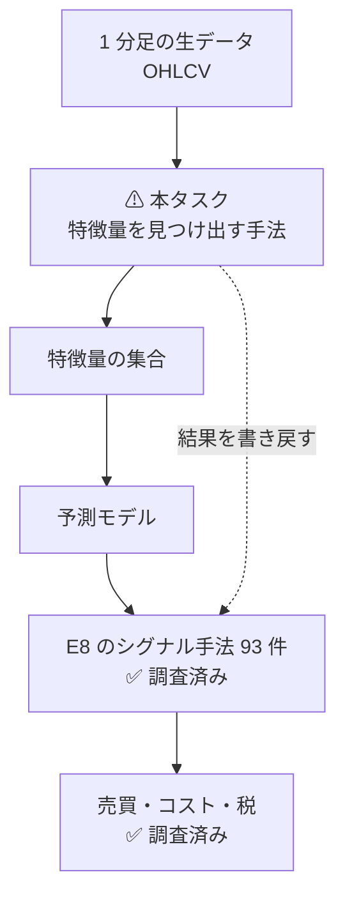
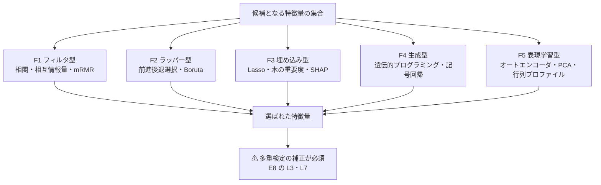
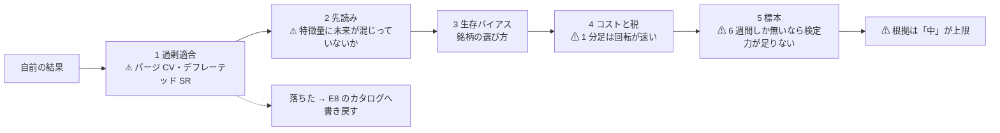

# 特徴量を見つけ出す手法を、1 分足の実データで検証する

作成日: 2026-09-08。派生元: [E8 の記録](../specs/experiments/e8-signal-methods.md)（手法カタログ 93 件と判定）。
成果物: `docs/specs/experiments/feature-discovery.md`（新規）＋ `experiments/feature-discovery/`（コード）。

## 0. この作業の形

利用者の指示（2026-09-08）は 3 手順。

| # | 指示 | プランでの形 |
| --- | --- | --- |
| 1 | **データを取得する。1 分間隔のデータが望ましい** | Phase 1。⚠ **1 分足がどこまで遡れるかが設計を決める**ので、まず経路を実測で確定する。§2 |
| 2 | **手法を調査し予測モデルを作成する** | Phase 2（特徴量発見の手法カタログ）＋ Phase 3（モデル） |
| 3 | **検証** | Phase 4。⚠ **E8 で決めた 5 ゲートをそのまま使う**。§4 |

### 0-1. ⚠ E8 から引き継ぐ 1 つの決定 — 自前の数字の扱い

[E8 §5-1](../specs/experiments/e8-signal-methods/evidence.md) で「⚠ **自前の計算は反証にだけ使う。良い数字が出ても根拠にしない。悪い数字が出たときだけ落とす根拠にする**」と決めた。
⚠ **本タスクは自前の数字を作る側なので、この非対称をどう扱うかを先に決めておく。**

| 出た結果 | 本タスクでの扱い |
| --- | --- |
| **悪い数字**（優位性が無い・コストで消える） | ⚠ **そのまま結論にしてよい。** E8 のカタログの該当行に反映する |
| **良い数字** | ⚠ **根拠の強さは「中」を上限**とする。査読論文の裏付けが別にある場合だけ「中」、無ければ**「弱」扱いで候補にしない**。⚠ **デフレーテッド SR（[E8 L3](../specs/experiments/e8-signal-methods/catalog.md)）と パージ CV（L2）を通していない数字は、良くても報告しない** |

⚠ **これは [E8 §9-1](../specs/experiments/e8-signal-methods/verdict.md) の限界 1（「自前のバックテストを 1 件も回していない」）を埋めにいく作業でもある。**

## 1. 目的と背景

E8 のカタログは **「どの手法があるか」を並べて属性を付けた**が、⚠ **手法が使う特徴量そのものは調べていない。**
本タスクは 1 段下がって「**価格・出来高から、予測に効く特徴量をどうやって見つけるか**」の手法を対象にする。

> この図の主張: E8 は「シグナルの手法」を並べた。本タスクはその 1 段下、⚠ **「特徴量を見つける手法」**を対象にする。両者は別の層である。

⚠ **入力の線引きは E8 と同じ**（[E8 §1-1](../specs/experiments/e8-signal-methods/frame.md)）。約定・気配・OHLCV と、そこから作る量だけ。決算・ニュース・センチメントは使わない。

## 2. Phase 1 — データ経路（1 分足）

### 2-1. 分かっていること【実測 2026-09-08】

| 経路 | 1 分足の深さ | ⚠ 制約 |
| --- | --- | --- |
| tastytrade DXLink `Candle` | ⚠ **約 8,000 本 = 6 週間**で頭打ち（`SPY{=m}` で実測） | ⚠ **`toTime` が効くかは【未確認】**。効かないなら 6 週間が上限 |
| Kraken `public/OHLC` | 直近 **721 本 = 約 12 時間** | 深い履歴は `public/Trades` を遡って自分で 1 分足に畳む必要がある |
| Kraken `public/Trades` | ⚠ **約定（L0）から自分で作れる** | 無登録。⚠ リクエスト回数と時間がかかる |

### 2-2. Phase 1 で決めること

| # | 問い | 決め方 |
| ---: | --- | --- |
| 1 | ⚠ **tastytrade の Candle に `toTime` は効くか** | プローブを 1 回足して実測する。効けば**窓を刻んで何年でも遡れる** |
| 2 | 銘柄をいくつ取れるか | 1 セッション 100 購読が上限【公表値】。8 銘柄同時は実測済み |
| 3 | 暗号資産（Kraken）を併用するか | ⚠ **24 時間・無登録・標本が多い**が、手数料が**片道 0.80%**（[E8 §6-2](../specs/experiments/e8-signal-methods/failures.md)）で必要優位性を 2 桁上回る |
| 4 | 保存の形 | `experiments/feature-discovery/data/` に Parquet か CSV。⚠ **git 管理外**（`out/` と同じ扱い） |

⚠ **1 が「効かない」なら、標本は 1 銘柄あたり 8,000 本しかない。** その場合は**銘柄を横に増やして標本を作る**（E8 の回避策 R10 と同じ手）。

## 3. Phase 2 — 特徴量を見つけ出す手法の調査

E8 の[カタログ](../specs/experiments/e8-signal-methods/catalog.md)と同じ作り方で、⚠ **「特徴量の作り方」ではなく「特徴量の見つけ方」**を並べる。起点は 5 系統。

> この図の主張: 見つけ方は 5 系統。⚠ **上 2 つはモデルの外で選び、下 3 つはモデルが選ぶ。**

| 系統 | 中身 | ⚠ 見どころ |
| --- | --- | --- |
| **F1** フィルタ型 | 相関・相互情報量・mRMR・分散比 | 速いが特徴量どうしの相互作用を見ない |
| **F2** ラッパー型 | 前進 / 後退選択・Boruta・再帰的特徴量削減 | ⚠ **試行回数が爆発する＝ 多重検定の温床** |
| **F3** 埋め込み型 | Lasso・Elastic Net・木の分岐重要度・SHAP・MDA | ⚠ **木の重要度は相関した特徴量で壊れる**（既知の落とし穴） |
| **F4** 生成型 | 遺伝的プログラミング・記号回帰・自動特徴量生成 | ⚠ **探索空間が広いほど過剰適合が確実に入る** |
| **F5** 表現学習型 | PCA・オートエンコーダ・行列プロファイル・ウェーブレット | 解釈が難しく、E8 の X5 に直行しやすい |

⚠ **一次情報を当てる**（査読論文・教科書）。⚠ **ブログ・商材の「効く特徴量」は数えない**（E8 の線引きと同じ）。

## 4. Phase 3・4 — モデルと検証

### 4-1. 予測対象と基準線

| 項目 | 置き方 |
| --- | --- |
| 予測対象 | ⚠ **Phase 1 の結果で決める**。候補: 次の k 分のリターンの符号（分類）／ リターン（回帰）／ 三重障壁のラベル（E8 F9） |
| 基準線 | ⚠ **必ず 3 本置く**: (a) 定数予測（常に上）／ (b) 直前のリターン（1 次の自己相関）／ (c) 正則化線形（E8 F3） |
| ⚠ 勝ち負けの判定 | ⚠ **「基準線 (c) を超えない複雑なモデルは採らない」**（E8 F3 の役割をそのまま使う） |

### 4-2. 検証の 5 ゲート（E8 からそのまま）

> この図の主張: E8 で決めた 5 ゲートを、今度は**自前の数字**に当てる。⚠ **通らなかったものは「落ちた」として E8 のカタログへ書き戻す。**

⚠ **コストの目安は E8 §1-4 のまま。** 1 分足で 1 日 20 回回すと年 5,000 往復、c = 10bp で**年 500% がコストで消える**。
⚠ **この時点で「1 分足の高回転は成立しない」ことがほぼ決まっている**ので、**予測の地平を長く取る設計**（1 分足を使って日次を当てる）も併せて試す。

## 5. 影響範囲

| 対象 | 中身 |
| --- | --- |
| `experiments/feature-discovery/` | **新規**。取得・特徴量・モデル・検証のコード。⚠ `data/` と `out/` は git 管理外 |
| `experiments/tastytrade-api-sample/candle_probe.py` | ⚠ `toTime` の実測のために引数を 1 つ足すかもしれない（読み取り専用は維持） |
| `docs/specs/experiments/feature-discovery.md` | **新規**。手法カタログ ＋ 検証結果 ＋ 判定 |
| [E8 のカタログ](../specs/experiments/e8-signal-methods/catalog.md) | ⚠ **落ちた行に自前の反証を書き戻す**（根拠の強さは上げない） |
| CLAUDE.md | ⚠ **触らない。** 資金は動かさないので方針の内側 |

## 6. テスト方針

| # | 見るもの |
| ---: | --- |
| 1 | ⚠ **先読みが入っていないこと**。特徴量の計算に未来の足が入らないかを、**わざと未来を混ぜた対照実験**で確かめる（混ぜると精度が跳ね上がることを確認する） |
| 2 | ⚠ **ラベルと特徴量の時刻が揃っていること**（1 本ずらす。オフバイワンの検査） |
| 3 | 取得したデータの欠損・重複・時刻の単調性 |
| 4 | ⚠ **基準線 (a)(b)(c) が先に動くこと**。複雑なモデルはその後 |
| 5 | ⚠ **同じ乱数種で再現すること**（種を記録に残す） |

## 7. Phase

| Phase | 中身 | 完了の目安 |
| --- | --- | --- |
| **1** | データ経路の確定と取得（⚠ **`toTime` の実測**・銘柄数・保存形式） | 1 分足が手元に揃い、深さと本数が記録に残る |
| **2** | 特徴量を見つけ出す手法のカタログ（5 系統） | 一次情報つきで表が埋まる |
| **3** | 基準線 3 本 ＋ モデルの作成 | 基準線が動き、比較の土俵ができる |
| **4** | 検証（5 ゲート）と判定 | ⚠ **良い数字は「中」止まり、悪い数字は E8 へ書き戻す** |
