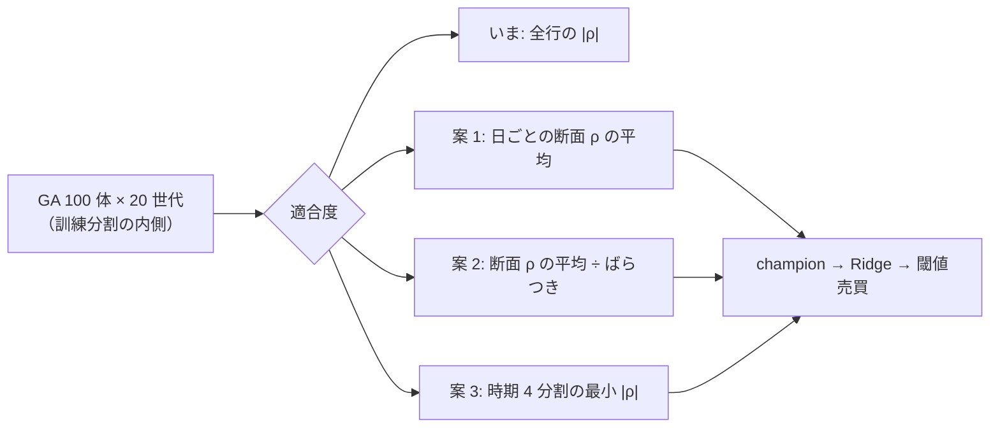

# GA の適合度を順位相関以外に替えて回す

2026-10-08 利用者決定「1」（研究側の 3 件 E・F・G を全部回す。G は「水準の案を先に見せる」）。TODO の子「GA の適合度を順位相関以外に替えて回す」。⚠ **水準（何通り試すか）は回す前に固定する**（rules.md 14-9・[evolutionary-search.md §7](../specs/experiments/evolutionary-search.md)）。

## 0. 目的・背景

いまの GA（F4-1 記号回帰・`ail/search/evolve.py` の `fitness`）は、式 1 列と y の **Spearman 順位相関の絶対値**（訓練内 holdout の全行をまとめて）で選ぶ。結果は 3 行とも落とすで、⚠ 訓練の内側で最も効いたのは **曜日**（`own_dow`）の式（適合度 0.2511 → 検証で −219bp）だった。全行をまとめた相関は「日ごとに全銘柄が同じ値を持つ列」（曜日・相場全体の動き）を拾いやすい。

この図の主張: 替えるのは「式の良さの測り方」だけで、探索・champion・後段の Ridge・θ・fold はそのまま。

## 1. 水準の案（⚠ 利用者の了承を取ってから回す）

| # | 適合度 | 何を嫌うか | 自由な数字 |
| ---: | --- | --- | --- |
| 1 | **日ごとの断面の順位相関の平均の絶対値**（その日の銘柄どうしで ρ を取り、日で平均） | 日ごとに全銘柄が同じ値の列（曜日など）は断面の ρ が出ない ＝ 0 | なし |
| 2 | **断面の順位相関の平均 ÷ 日ごとのばらつき**（IC の安定性） | たまたま数日だけ効く式 | なし |
| 3 | **holdout を時期で 4 つに切り、その中の \|ρ\| の最小値** | 一部の時期だけで効く式（小さい標本の高い適合度） | 4（切る数。事前に固定） |

- 揃えるもの: 表（`own_2018`）・(A) 共通・モデル Ridge・GA の設定（個体数・世代・打ち切り・種）・θ 50 ／ 55 ／ 60・コスト
- **n_trials ＋9**（3 案 × θ 3）・leak 対照 3 本。⚠ 結果を見てから案を足さない・数字を動かさない
- 判定は今までと同じ（対 B&H の上乗せの符号・rules.md 13-7）。いまの GA × Ridge の行との対の差（同じ表・同じ fold）を添える

## 2. Phase と Step（titan の Claude）

| Phase | 中身 |
| --- | --- |
| 0 | ✅ 2026-10-08 利用者が 3 案で了承（「1」＝ E は ＋12・G は 3 案）。⚠ ここから先は足さない ／ 削らない |
| 1 | rules.md と記録（`evolutionary-search.md` に §9）に、回す前の水準と読み方を書く |
| 2 | `fitness` を名前で選べるように（config の `fitness = "pooled" | "xs_mean" | "xs_ir" | "worst4"`。既定 `pooled` ＝ いまの結果を 1 ビットも変えない）・テスト（既定で同じ式・同じ適合度の SHA ／ 曜日のような列が案 1・2 で 0 ／ 検証分割を差し替えても選ばれる式が変わらない ＝ 既存の検査と同じ） |
| 3 | config 3 本 → `cli.queue`（leak つき）→ 検証結果一覧を吐き直す → 記録 §9 → TODO の子を `DONE.md` へ |

## 3. 影響範囲

`experiments/feature-discovery/ail/search/evolve.py`・`config/experiment/`・`config/queue/`。既定の `pooled` は今と同じなので、既存の GA の実行の再現は変わらない。執行器・管理画面は変えない。

## 4. テスト方針

上の Phase 2 のテスト ＋ `tests/test_evolve*.py` ＋ `./run-tests.sh`。

## 5. 作業量・費用【推測】

実装 半日・実行 1 本 10 秒前後 × 6（`evolutionary-search.md` §6 の実測から）。費用 0。
