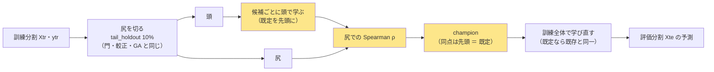

# ハイパーパラメータを訓練分割の内側で選ぶ（判断 2「モデルの構造・ハイパラを進化させるか」。2026-10-09 利用者決定「B」）

派生元: TODO「進化的探索を他のモデル・経路に広げる」の子「モデルの構造・ハイパラを進化させるか決める」。
利用者の問い（2026-09-16）: **遺伝的アルゴリズムは既存のモデル全てに当てはめることはできる？** → (b) モデルそのものを進化させるのは軽いモデルだけ、が残っていた判断。
2026-10-09 の比較（A 入れない ／ B 事前固定した候補から訓練分割の内側で選ぶ ／ C GA で構造まで進化させる）で、利用者の決定 **B**。

## 0. 目的・背景

- モデルの軸の結論（GA 9 行・変換なし 6 行ほか）は全部 **ハイパーパラメータ既定のまま**で出ている（[13-6 規約 3](../specs/experiments/feature-discovery/rules.md)「動かさない」）。その理由「振った水準の数だけ n_trials が増える」は**評価期間の結果で選ぶ**ときの理由で、訓練分割の内側で選ぶなら [14-11 規約 2](../specs/experiments/feature-discovery/rules.md) により champion だけを数える
- 問い: **既定のハイパーパラメータが足を引っ張っていないか。** 選ぶ段を 1 つ入れ、軽い 3 モデル（Ridge・LightGBM・MLP）で `own_2018` × (A) を回し、既定の対と並べる
- ⚠ 「進化」は要らない: Ridge は alpha 1 次元、LightGBM は格子 27 で尽くせる。MLP だけ層の数（1〜3）を候補に含める ＝ **構造はここまで**。GA（100 体 × 20 世代 ＝ 1 fold 最大 2,000 学習）は C として退けた（MLP 約 5.5 時間 ／ LightGBM 約 11 時間 per 本【推測】で、増えるのは尻への過適合だけ）
- ⚠ **示せないもの**: 「内側で選んだから良くなった」（14-11 の注 ＝ 示せるのは champion がどこに着地したかだけ）。**示せるもの**: 採否（対 B&H）・champion が既定からどれだけ離れたか・尻での改善が評価期間に届いたか
- ⚠ 回す理由は「効くはず」ではない（[14-10 規約 4](../specs/experiments/feature-discovery/rules.md)）。予想は §7 に回す前に書いた

比べた案（2026-10-09）:

| 案 | 中身 | 規約 | n_trials | 費用【推測】 | 決定 |
| --- | --- | --- | ---: | --- | --- |
| A 入れない | 13-6 規約 3 を残す | 変えない | 0 | 0 | — |
| **B 内側の選抜** | 事前固定した候補から訓練分割の尻で 1 つ選び、訓練全体で学び直す。軽い 3 モデル | 13-6 規約 3 の書き換え ＋ 14-12 | ＋9 | 実装 1 日・実行 約 1 時間 | ✅ 利用者 |
| C GA で構造まで | 個体 ＝ モデルの設定。fold ごと最大 2,000 学習 | B と同じ | ＋9 | MLP 5.5 時間 ／ LightGBM 11 時間 per 本 | — |

## 1. 対応方針

この図の主張: 選抜は訓練分割の尻だけで行い、評価分割は決まった champion を当てるときにしか触らない（GA の 14-11 と同じ置き場）。

| # | 決めごと | 中身 |
| ---: | --- | --- |
| 1 | 置き場 | **モデルとして登録**（`@register("model", "<モデル>（内側選抜）")`。`ail/models/tuned.py`）。`fold_buy_pct`・`calibrate.fit`・門がモデルを呼ぶ場所はそのまま ＝ ⚠ **モデルが呼ばれるたびに、その訓練の尻で選ぶ**（門・較正・本番の 3 回 ／ fold）。⚠ **config にこのモデル名が無ければ 1 ビットも変えない** |
| 2 | 尻 | `tail_holdout(Xtr, ytr, frac=0.1)`（隙間は既定）。切れなければ既定で動き、記録に「切れなかった」を残す（(B) 銘柄別の最初の fold はこうなる。今回は (A) だけ） |
| 3 | 候補 | 事前固定の一覧（§3 ＝ rules.md 14-12-1）。**既定を先頭に含める**。順序は固定 |
| 4 | 候補の学び方 | 候補ごとに `base(頭, y頭, 尻, {**ctx, **候補})`。⚠ LightGBM・MLP の早期打ち切りは頭の中でさらに尻を切る（選抜の尻と二重にならない） |
| 5 | 物差し | 尻での予測と y の **Spearman ρ（符号つき）**。NaN・定数の予測は最低点。**同点は先頭** |
| 6 | 学び直し | champion を訓練全体で `base(Xtr, ytr, Xte, {**ctx, **champion})`。⚠ **champion が既定なら既存のモデルと 1 ビットも違わない**（テスト）。⚠ 二重使い: ここの早期打ち切りの尻は選抜の尻と同じ。評価分割には漏れない・選ばれ方が楽観側に出るだけ、として受け入れる（直すなら尻を 2 つに割る ＝ 別の処置） |
| 7 | 基底のモデル | `trees.py`（葉の数・学習率・最小標本）・`deep.py`（層と幅・Dropout・学習率）が ctx から読む。⚠ **既定の値はいまの定数と同じ** ＝ 既存の config は指紋が動かない（`tests/test_trading_run.py`・`tests/test_predict.py`） |
| 8 | 記録 | 候補の一覧・候補ごとの尻の ρ・既定の ρ・champion・尻の行数を `ctx[tuned.DOC_KEY]` に積み、`fold_buy_pct` が本番の呼び出しの後に取り出して `fitted_doc[手法]["内側選抜"]`（較正・本番の 2 つ）に写す。門の呼び出し分は `gate.py` が取り出して捨てる（門は診断）。⚠ 次の実行では読み込まない（3 章 B） |
| 9 | 識別項目・綴り | 「モデル」列が `Ridge（内側選抜）`・`LightGBM（内側選抜）`・`MLP（内側選抜）` ＝ **新しいモデル**。`config/names.toml` の `[learner]` に `ridge-tuned`・`lgbm-tuned`・`mlp-tuned`（全角の括弧は `_LEARNER` の正規表現を通らないので直書き） |
| 10 | 規約 | 13-6 規約 3 を「評価期間の結果で動かさない」に書き換え・14-11 に 1 行・**14-12** を足す（✅ Phase 0。変更規約の 2 問は 14-12 の頭） |
| 11 | 数え方 | champion × θ 3 ＝ 1 モデル 3 検証。**3 モデル ＝ ＋9**（816 → 825。判断 1 の Phase 2〔GA × 先 10 日の門〕と Phase 3〔残り 5 変換〕が 2026-10-09 に先に回って 798 → 801 → 816。⚠ Phase 2 の記録では回す直前の `ledger.md` の数を出発点に読む）。leak 対照 3 本は数えない。⚠ 検証結果一覧が「全部使う × Ridge 以外のモデル」を検証に数える規則（`ledger.md` 冒頭）に `Ridge（内側選抜）` も乗ることを Phase 1 で確かめる |
| 12 | 軽いモデルの線 | 1 学習が数秒以内 ＝ Ridge（0.12〜0.14 秒【実測】）・LightGBM（1.3〜2.3 秒【実測】）・MLP（約 1 秒【推測】）。時系列分類器（3.4 分 ／ fold）・PatchTST（19 分 ／ fold）・TimeXer・Chronos-2 には当てない |

## 2. Phase と Step

| Phase | 誰 | 中身 | 済み |
| --- | --- | --- | --- |
| 0 | Sx360 の Claude | プラン・TODO・規約（13-6 規約 3・14-11 の 1 行・14-12・付録） | ✅ 2026-10-09 |
| 1 | titan の Claude | 実装（`ail/models/tuned.py`・`trees.py` ／ `deep.py` が ctx から読む・`fold_buy_pct` ／ `gate.py` の記録の拾い・`bootstrap.py` の import・綴り 3 行・config 3 本 `trade_own_{ridge,lgbm,mlp}_tuned_a.toml` ＋ queue `hp_inner.toml`）・テスト §4 |✅ 2026-10-09（`tests/test_tuned.py` 15 本・全 631 本 ✅・指紋そのまま） |
| 2 | titan の Claude | `cli.queue --config hp_inner`（本番 3 ＋ leak 3。約 1 時間【推測】。GPU）→ 記録 `docs/specs/experiments/hyperparam-inner-selection.md`（§0 事前固定の写し → §1 結果 → 対の差〔既定の実行と同じ fold・日次〕→ fold ごとの champion の表 → 尻の改善と評価期間の IC の変化 → 検算 ＋9・leak 3 本が跳ねる）→ `cli.report --catalog` で検証結果一覧を吐き直す | ✅ 2026-10-09（採る 0 ／ 9・816 → 825・合計 26 分【実測】。[記録](../specs/experiments/hyperparam-inner-selection.md)） |
| 3 | 利用者 → Sx360 | 「デプロイ」（`ail/models/trees.py`・`deep.py`・`cli/run.py` は 13500t の毎日の予測の経路。指紋テストが通ってから・15:00〜16:15 ET の外）→ TODO の子を DONE へ・プランを archive へ | |

## 3. 水準（⚠ 回す前に固定。結果を見て足さない・動かさない。正本は rules.md 14-12-1）

| モデル | 動かすもの | 候補（既定は **太字**） | 数 |
| --- | --- | --- | ---: |
| `Ridge（内側選抜）` | alpha | **1**・10・100・1,000・10,000・100,000・1,000,000 | 7 |
| `LightGBM（内側選抜）` | 葉の数 × 学習率 × 最小標本 | {7・**31**・127} × {0.02・**0.05**・0.1} × {20・**100**・500}。木の本数 500 ＋ 早期打ち切り 30・列の抽出 0.8・subsample 1.0 は固定 | 27 |
| `MLP（内側選抜）` | 層と幅 × Dropout × 学習率 | {(64)・(32,16)・**(64,32)**・(128,64)・(128,64,32)} × {0.0・**0.2**・0.5} × {3e-4・**1e-3**・3e-3}。batch 4096・最大 200 epoch・patience 10・AdamW は固定 | 45 |

- alpha の幅の理由: 標準化した 35 列 × 約 11.3 万行では、alpha が行数と同じ桁になるまで効かない【推測】。1 未満は 1 と見分けがつかないので置かない
- そろえるもの: 表 `own_2018`（作り直さない ＝ 13-8）・(A) 共通 1 本・選別「全部使う（基準）」1 本（⚠ `乱択（基準）` は入れない ＝ 候補の学習が 2 倍になるだけ。GA の config と同じ判断）・種 0・θ 50 ／ 55 ／ 60・コスト 5bp ＝ 既定の対 `trade_own_ridge_a`・`trade_own_lgbm_a`・`trade_own_mlp_a` と同じ条件
- 費用【推測】。fold ごとにモデルは 3 回呼ばれる（門・較正・本番）ので選抜は 15 回 ／ 本:

| モデル | 候補 × 15 × 1 学習 | 本番 ＋ leak |
| --- | ---: | ---: |
| Ridge | 7 × 15 × 0.13 秒 ≈ 14 秒 | 1 分以内 |
| LightGBM | 27 × 15 × 1.3〜2.3 秒 ≈ 9〜16 分 | 25〜40 分（leak は早期打ち切りが効かず 1.5 倍） |
| MLP（GPU） | 45 × 15 × 約 1 秒 ≈ 11 分 | 30〜35 分 |
| 合計 | | **約 1 時間**（queue の `time_budget_s` は 7,200） |

## 4. テスト方針（`tests/test_tuned.py` ＋ 既存）

| # | テスト | 固定すること |
| ---: | --- | --- |
| 1 | 指紋（既存）`tests/test_trading_run.py::test_default_path_fingerprint_is_unchanged`・`tests/test_predict.py` | `trees.py`・`deep.py` が ctx から読むようになっても、鍵の無い config は 1 ビットも変わらない |
| 2 | 既定だけの候補 ＝ 既存と同一 | 候補を既定 1 つにした `inner_select` の予測が、基底のモデルの予測と bit で一致する（Ridge・LightGBM `deterministic`・MLP は CPU・種固定） |
| 3 | 評価分割を差し替えても champion が変わらない | 14-11 規約 3 と同型（`Xte` を乱数に替えても champion と候補ごとの ρ が同じ） |
| 4 | 同点は先頭 | 全候補の予測が同じになる入力（例 y が定数に近い・alpha 候補が全部同じ出力）で既定が選ばれる |
| 5 | 尻が切れないときは既定 | 小さい標本（`MIN_TRAIN` 未満）で既定の候補で動き、記録に「切れなかった」 |
| 6 | 記録の形 | `fitted_doc[手法]["内側選抜"]` に 候補の一覧・ρ・champion・既定の ρ が入る ／ 新しいモデル名の無い実験では `"内側選抜"` の鍵が無い（既存の fitted は 1 バイトも変わらない）／ `ctx` に取り残しが無い（fold をまたいで混ざらない） |
| 7 | 綴り | `tests/test_names.py` の既存（登録名ごとに一意の綴り・検証結果一覧と 1 対 1） |
| 8 | 候補の一覧が事前固定どおり | `tuned.CANDIDATES` の数（7 ／ 27 ／ 45）と既定が先頭であることを写しで固定（rules.md 14-12-1 と同じ値） |

## 5. 影響範囲

- 変わる: `experiments/feature-discovery/ail/models/tuned.py`（新規）・`trees.py`・`deep.py`（ctx から読む）・`bootstrap.py`・`cli/run.py`（`fold_buy_pct` の記録の拾い）・`ail/validation/gate.py`（記録を捨てる）・`config/names.toml`・`config/experiment/` に 3 本・`config/queue/hp_inner.toml`・`tests/`・`rules.md`（✅ Phase 0）・記録 1 本・`ledger.md`（吐き直し）・`ledger_rows`
- 変わらない: `linear.py`（alpha はすでに ctx から読む）・`calibrate.py`・`prep.py`・検知器・本番 4 本の config・既存の実行と検証結果一覧の行・`dashboard/`
- ⚠ 本番: `ail/models/` と `cli/run.py` は 13500t の毎日の予測が通る ＝ Phase 3 でデプロイ（指紋が動かないことを確かめてから）。vibeboard の予測モデルのタブに載せるかは別（載せるなら `dashboard/models.toml` に `[[model]]`。今回は載せない）

## 6. 作業量・費用【推測】

| Phase | 時間 | 費用 |
| --- | ---: | ---: |
| 0 | 半日（Sx360） | 0 |
| 1 | 1 日（titan） | 0 |
| 2 | 回すのは約 1 時間 ＋ 記録 1〜2 時間 | 0（電気代） |
| 3 | デプロイ 20 分 | 0 |

## 7. ⚠ 先に書く予想と読み方（回す前。2026-10-09）

| # | 予想【推測】 | 読み方 |
| ---: | --- | --- |
| 1 | **採る 0 ／ 9** | 判定は 13-7（対 B&H）。同じ表でモデルを替えた差（±30〜390bp）が B&H との差（−111〜−1,199bp）より小さく、ハイパーパラメータの差はふつうそれより小さい |
| 2 | champion ≠ 既定 が fold の大半 | 候補が多いほど尻の最大は既定を上回る。⚠ **「既定が外れていた」とは読まない**（尻の雑音を拾っただけでも起きる） |
| 3 | 対の差（内側選抜 − 既定。同じ表・同じ fold・日次）は θ 50 で \|t\| < 1 | 差は診断。採否に使わない |
| 4 | 尻での ρ の改善（champion − 既定）は、評価期間の IC の変化より大きい | 過適合の向き。改善が評価期間に届いた fold の割合を記録に残す |
| 5 | LightGBM θ 60 の既定（取引 0・上乗せ 0.00）は内側選抜で取引が出る | 出ても採るにはならない見込み。保有日率を添える |

⚠ **次に何をしないか**: 結果を見てから候補を足さない・MLP の層を増やさない・C（GA）に進まない。進むなら新しい検証として先に水準を書き、数える。

## 8. 結果（2026-10-09。本文は [記録](../specs/experiments/hyperparam-inner-selection.md)）

- 採る 0 ／ 9（予想 1 どおり）・champion ≠ 既定 13/15 fold（予想 2）・対の差 \|t\| ≤ 2.05（予想 3 は θ 50 で \|t\| 0.80〜1.57 ＝ 1 を超えたものが 2 組）・尻の改善が評価期間に届いたのは 5/13（予想 4 の向き）。予想 5 は前提（既定の LightGBM θ 60 が取引 0）が対の相手の実行で成り立っておらず、読めない
- 費用は見積りの 1/2 以下（本番 3 本で 4.7 分・leak 込み 26 分）
- ⚠ **見つかったこと**: 較正と本番で champion が違う fold が 13/15（§1 の決めごと 1・規約 5 の帰結）。Ridge では較正の係数が本番の予測のスケールに合わない（記録 §2）。直すなら「1 度選んで較正にも配る」を新しい処置として先に登録する（利用者の判断。結果を見てから動かさない）
