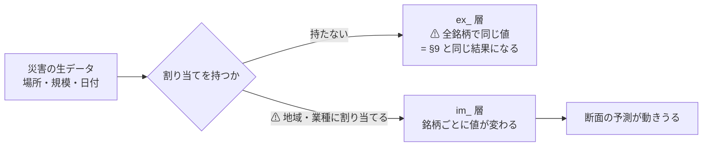
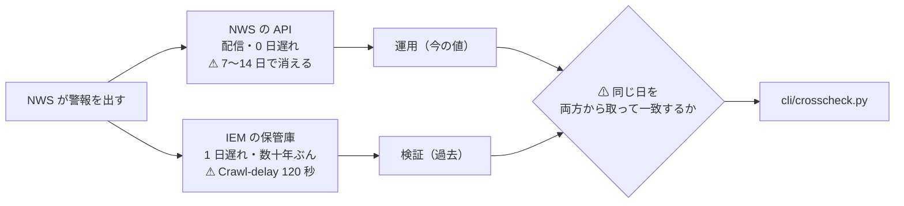
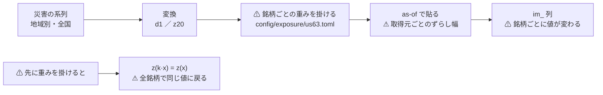

# 社会にインパクトを与えそうなデータを増やす

作成: 2026-09-09 ／ 対象: `experiments/feature-discovery/`
派生元: [daily-data-sources.md §9](../specs/experiments/daily-data-sources.md)（**本命は偽薬を超えなかった**）
関連: [rules.md](../specs/experiments/feature-discovery/rules.md) ／ [market-data-availability.md](../specs/market-data-availability.md)

## 1. 目的

利用者の指示（2026-09-09）: **気象と地震のような社会にインパクトを与えそうなデータを増やす。**
利用者の指示（2026-09-09・追加）: **データの検証を行うためにより多くのデータを取得する。**

## 2. 着手前に決めた 2 つ

### 2-1. ⚠ 気象と地震は「偽薬」のまま残す

⚠ **移さない。** 理由は 2 つある。

| # | 理由 |
| ---: | --- |
| 1 | ⚠ **結果を見てから枠を移すのは後付けである**（[§1 の決めごと 3](../specs/experiments/daily-data-sources.md)）。⚠ **[§9](../specs/experiments/daily-data-sources.md) で「気象・地震のほうが効いて見えたが雑音」と結論した直後に本命へ移すと、結論を自分で崩す** |
| 2 | ⚠ **移すと物差しを失う。** ⚠ **偽薬が無いと「本命が効いた」を検証できない**（それが §9 で効いた唯一の仕掛けだった） |

⚠ **新しく取るものを「本命」として足し、気象・地震は偽薬のまま基準線に置く。**
⚠ **本命の仮説は取得の前に 1 行で書く**（「なぜ値動きに効くと考えるか」）。

### 2-2. ⚠ 銘柄を区別できる形にする

> この図の主張: ⚠ **§9 が効かなかった理由は「データが悪い」ではなく「全銘柄で同じ値だった」ことにある。**

| 例 | 割り当て先 |
| --- | --- |
| メキシコ湾のハリケーン | 保険・エネルギー（XLE・XOM・CVX） |
| カリフォルニアの山火事 | 公益（XLU）・保険 |
| 日本の地震 | EWJ |

⚠ **割り当てを持てないデータは、取っても §9 と同じ結果になる。** ⚠ **取得の時点で「割り当てられるか」を見る。**

## 3. 方針

### 3-1. 取得の順番（[§2](../specs/experiments/daily-data-sources.md) と同じ）

⚠ **「取れるか」より先に「取ってよいか」。** ⚠ **米政府の公有（NOAA・USGS・FAA・DOE）を優先する。**
⚠ **CC BY-NC は「非商用と言えるか」の判断待ちに引っかかるので、代替があるなら避ける。**

### 3-2. ⚠ 粒度を最初に見る

⚠ **週次・月次は日次の検証に使えない**（NOAA の太陽活動が月次で落ちた）。⚠ **候補ごとに粒度を先に確かめる。**

### 3-3. 候補

| 枠 | 候補 | 仮説（なぜ効くと考えるか） | 割り当て |
| --- | --- | --- | :-: |
| **本命** | ハリケーン・熱帯低気圧 | 保険の支払いと製油所の停止が業績に直結する | ○ 地域 |
| **本命** | 竜巻・雹・暴風の報告 | 同上（規模は小さい） | ○ 地域 |
| **本命** | 山火事 | 公益（送電線）と保険 | ○ 地域 |
| **本命** | 停電 | 経済活動の停止の代理 | ○ 地域 |
| 本命（弱） | 政策不確実性指数 | 不確実性が上がると株が下がるという先行研究 | ✕ 全体 |
| 本命（弱） | 航空の遅延・便数 | 経済活動の代理 | ✕ 全体 |
| ⚠ **偽薬（既存）** | 気象・地震 | ⚠ **想定しない**（基準線として残す） | — |
| ⚠ **偽薬（追加）** | 気候の遠隔相関指数 ／ 月齢 | ⚠ **想定しない** | — |

## 4. Phase

| Phase | 中身 | 完了の判定 |
| ---: | --- | --- |
| 1 | 規約と粒度の確認 | 候補ごとに ✅ / ❌ と粒度が埋まる |
| 2 | 取得して層に置く | `raw/<取得元>/series/` に入り、検査と manifest が通る |
| 3 | ⚠ **地域・業種への割り当て**（`im_` 層） | ⚠ **銘柄ごとに値が変わることを検査で固定する** |
| 4 | 検証。⚠ **新しい偽薬を必ず併置する** | 台帳に行が増え、⚠ **本命が偽薬を超えたかが出る** |

## 4-2. Phase 2-3 と Phase 3 で決めた作り【2026-09-09】

### 4-2-1. 警報は 2 経路で取る

> この図の主張: ⚠ **検証と運用でデータの出どころが違うので、突き合わせないと同じ値である保証が無い。**

⚠ **期間は年でまとめて取る**（`Crawl-delay: 120`。日ごとだと 8 年で 100 時間）。
⚠ **同じ事象が「県ごとの行」と「多角形の行」で二重に出る**ので、VTEC の鍵で畳んでから数える。

### 4-2-2. ⚠ `im_` 層 — 割り当ての作り

> この図の主張: ⚠ **重みを掛けるのは変換の「後」である。** ⚠ **先に掛けると `z20` で消えて全銘柄が同じ値に戻る。**

⚠ **経路は 6 本にとどめた**（列が増えるほど多重検定が厳しくなる）。

| 経路 | 系列 | 重み | 仮説 |
| --- | --- | --- | --- |
| `geo_dmg` | NCEI の地域別被害額 | 地域への曝露 | 商売がある地域の被害が業績に効く |
| `geo_warn` | IEM の地域別警報 | 同上 | ⚠ **同じ曝露を 1 日遅れで拾える** |
| `ins` | NCEI の全国被害額 | 保険の引受 | 被害額がそのまま支払いになる |
| `fire` | IEM の西部の火災気象警報 | 公益・保険 | 送電線の停止と山火事責任 |
| `tropical` | IEM の湾岸の熱帯警報 | エネルギー | 湾岸の生産と製油の停止 |
| `rebuild` | IEM の全国警報 | 復旧需要 | ⚠ **災害で「上がる」側** |

### 4-2-3. ⚠ 新しい偽薬は「割り当ての入れ替え」

⚠ **気象・地震の偽薬（§9）はそのまま残す。** ⚠ **`im_` 層にはもう 1 つ別の偽薬が要る。**

| 何を変えるか | 本命 `impact_2018` | ⚠ 偽薬 `impact_placebo_2018` |
| --- | --- | --- |
| 災害の系列 | そのまま | ⚠ **同じ** |
| 重みの分布 | そのまま | ⚠ **同じ**（並べ替えなので集合が一致する） |
| ⚠ **銘柄への割り当て** | ⚠ **本物** | ⚠ **撹乱**（1 本も自分に戻らない） |

⚠ **本命が偽薬を超えないなら、効いて見えたのは「曝露にばらつきがあること」であって割り当ての中身ではない。**

⚠ **4 本を同じ条件で並べる**（違うのは特徴量の層だけ）。

| 実験 | 層 | 何を測るか |
| --- | --- | --- |
| `own_impact_2018` | 価格だけ | 土台 |
| `impact_ex_2018` | ＋ ⚠ **割り当てなし**（`ex_`） | ⚠ **§9-4 の再現**（全銘柄で同じ値） |
| `impact_2018` | ＋ ⚠ **割り当てあり**（`im_`） | ⚠ **決めごと 2 の答え** |
| `impact_placebo_2018` | ＋ ⚠ **割り当てを入れ替え** | ⚠ **偽薬** |

## 5. テスト方針

| # | 何を確かめるか | ⚠ 落ちなければ意味が無い検査 |
| ---: | --- | --- |
| 1 | ⚠ **`im_` 層が銘柄ごとに違う値になる** | ⚠ **全銘柄で同じなら `ex_` と変わらず、§9 と同じ結果になる** |
| 2 | ⚠ **1 日以上ずらしている** | 発表の遅れ（`ex_` と同じ） |
| 3 | ⚠ **事象が無い日は 0**（前方埋めしない） | ⚠ **災害は地震と同じ形。起きなかった日に前日の値が入ってはいけない** |
| 4 | 偽薬が基準線として残る | ⚠ **消えると偽発見率が測れない** |

## 6. ⚠ この作業で埋まらないもの

| # | 限界 | ⚠ 効き方 |
| ---: | --- | --- |
| 1 | ⚠ **割り当ては人が決める**（ハリケーン → 保険 など） | ⚠ **決め方そのものが仮説であり、外れれば効かない** |
| 2 | ⚠ **大きな災害は稀** | ⚠ **標本が薄い。** 8 年で数十回しか起きない事象は検定に耐えない |
| 3 | ⚠ **系列を足すほど `n_trials` が増える** | 偽薬を置いても補正は免除されない |
