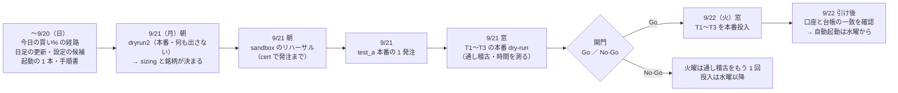
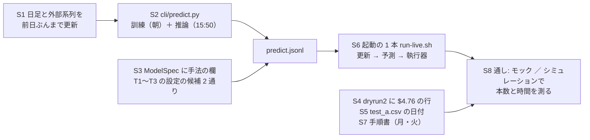
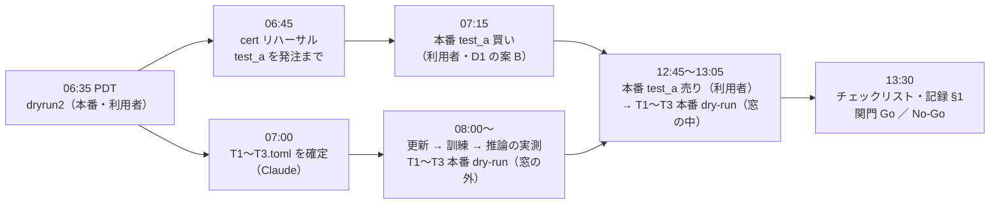
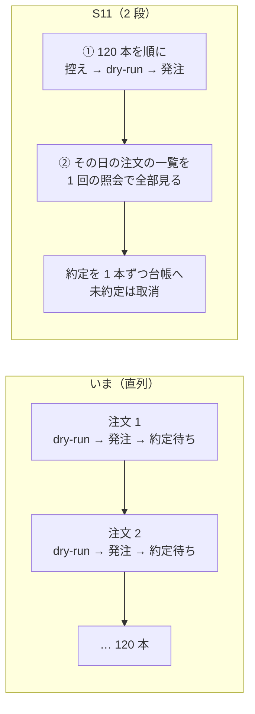

# 実売買を 2026-09-22（火）までに実運用へ — スケジュールと段取り

作成日: 2026-09-19（土・夜 PDT）。利用者の指示: **「TODO の実売買のテストを含めた実運用までを次の火曜日までに終わらせます。月曜と火曜は市場が開くのでその作業に当てます。その前の明日までには市場での売買以外の作業を終わらせます」**。

親: [実売買のプラン](live-trading-three-models.md)（Phase の番号はそちらのまま）。決めごとと手順書: [live-trading.md](../specs/experiments/live-trading.md)。属性: [B6 のプラン](live-trading-trader-attributes.md)。

⚠ **2026-08-27 の方針の 2 つ目の例外の内側**（CLAUDE.md）。⚠ **本番の鍵を入れて起動するのは利用者**。Claude はコード・手順書・cert（sandbox）まで。
⚠ **判定するのは執行の差と無人運転**。この 3 日で「儲かるか」は見ない。

## 0. 目的と「実運用」の線

| 語 | この文書での意味 |
| --- | --- |
| 実売買のテスト | Phase 5-1 ＝ 試験用トレーダー `test_a` で本番に最小額（T を 1 株・約 $25【実測 2026-09-18 の気配】）の買い → 売り |
| 実運用 | Phase 5-2 ＝ `T1`〜`T3` を規模 A（$300 × 3）で本番に投入し、1 日目の記録が残って口座と台帳が一致したところまで |
| 火曜までにやらないもの | 紙上の対照（Phase 3）・画面の差 3（Phase 4 の残り）・20 営業日の判定（Phase 6）・4 役への分け直し（A〜G）・g3plus の処理時間・規模 B。§5 |

時刻は PDT（利用者の機械 titan の時計）と ET を併記する。**執行の窓 15:45〜16:05 ET ＝ 12:45〜13:05 PDT**。市場 9:30〜16:00 ET ＝ 6:30〜13:00 PDT。9/21（月）・9/22（火）はどちらも通常の立会日（`nyse_calendar.py`）。

## 1. 全体の流れ

> この図の主張: 火曜の本番投入までの道は 1 本で、月曜の朝の `dryrun2` が「銘柄と株数の決め方」を決め、月曜の夜の関門（Go ／ No-Go）を通らなければ火曜は投入しない。

## 2. いまの状態【実測 2026-09-19 22:05 PDT・titan】

| 部品 | 状態 | 残り |
| --- | --- | --- |
| 執行器 `experiments/live-trading/` | ✅ 一式（状態機械・予算・鍵・HALT・再送・控え・突き合わせ・`reconcile.py`・シミュレーション） | 市場時間の sandbox リハーサル 1 日（Phase 2 の残り） |
| `kind = "experiment"` の読み手 | ✅ `signals.py` は `predict.jsonl` を読む | ⚠ **書き手 `cli/predict.py` が無い**（Phase 1。`cli/` に未作成） |
| 日足 | ⚠ **手元は 2026-09-08 まで**（`data/adjusted/d/SPY.csv` の最終行） | 前日ぶんまで更新する 1 コマンドが要る。T2 は外部系列（為替・金利 ＝ `cli.fetch --exog exog_daily`）も要る |
| `config/traders/T1〜T3.toml` | 無い | `dryrun2` の結果待ち。T3 は実験の中の手法（T3 QUANT）を指す欄が `ModelSpec` に要る |
| `config/signals/test_a.csv` | 日付が古い（2026-09-18 買い ／ 09-21 売り） | 月曜の日付に書き換える |
| `dryrun2`（`sample.py` 手順 10） | ✅ 実装済み・⏳ 未実施 | ⚠ **試すのは $5.00 だが、実際の 1 銘柄の枠は $4.76（T1・T3 ＝ 63 本）／ $6.25（T2 ＝ 会社株 48 本）**【計算】。最小額が $5 なら通らない ＝ $4.76 の行を足す |
| 毎日の起動 | 手で `run_day.py` | 「日足の更新 → 予測 → 執行器」を 1 本にまとめたものが無い。timer ／ cron（D16）も無い |
| `state/` のバックアップ | 未着手（live-trading.md §0-8 の限界） | 台帳を失うとトレーダーは「何も持っていない」つもりで買い直す |

## 3. 日ごとの作業

### 3-1. 〜 9/20（日）— 市場が開いていなくてもできる作業を全部終わらせる

> この図の主張: 日曜の作業は「予測を出す側」と「執行器に渡す側」の 2 本が `predict.jsonl` で合流し、合流した後に通し（シミュレーション ／ モック）で確かめる。

| # | 作業 | 担い手 | 見立て【推測】 | 出口 | 対応する TODO |
| --- | --- | --- | --- | --- | --- |
| S1 | 日足（`cli.fetch --dataset daily` → `cli.adjust` → `cli.build`）と外部系列（`--exog exog_daily`）を前日ぶんまで更新する 1 コマンド。かかる時間を測る | Claude（titan。読み取りだけ） | 1〜2 時間 | 9/18（金）までの足と 3 本の表・所要時間【実測】 | 新 |
| S2 | `cli/predict.py --experiment <名前> --asof <日付>`。⚠ **訓練（昨日までの行。朝に済ませて保存）と推論（15:50 の気配を終値の代役にした末尾 1 行）を分ける** ＝ T3 の時系列分類器は 1 fold の学習に 3.4 分【実測。TODO の進化的探索のメモ】で、15:50 → 15:55 の 5 分に入らない。テスト: 決定性・先読み（`asof` の y を壊しても不変）・3 モデルとも通る・既定経路の指紋が変わらない | Claude | 4〜6 時間 | `predict.jsonl`（日付・モデル・手法・銘柄・買い%・出口%・代役の価格・入力の指紋・commit）と所要時間【実測】 | Phase 1・B7・B8 |
| S3 | `trader.ModelSpec` に「実験の中の手法」を指す欄（T3 QUANT 用）。`T1`〜`T3` の設定を **2 通り**（`notional`・全銘柄 ／ `shares`・絞った銘柄）書き、⚠ **`config/traders/` の外（`config/traders/candidates/`）に置く**（半端な設定で起動できないように）。月曜に片方を写す | Claude | 1 時間 | 候補 2 通り ＋ `test_trader.py` | B6 Step 5 |
| S4 | `dryrun2` に `notional_market_4.76usd` の行を足す（＋ 小数 4 桁の売り。§0-7 (j) の 1 の未確認） | Claude | 30 分 | モックの selftest が通る | Phase 0 |
| S5 | `config/signals/test_a.csv` の日付を月曜（と決定 D1 しだいで火曜）に書き換える | Claude | 5 分 | — | Phase 5-1 |
| S6 | 起動の 1 本（プロジェクト直下の `run-live.sh`）: 日足の更新 → 訓練 → 窓まで待つ → 気配 → 推論 → `run_day.py`。`--mode dry-run` が既定。⚠ **本番の鍵は書かない**（利用者が環境変数と確認の引数を付けて起こす）。timer ／ cron の雛形（D16）も置くが**入れるのは火曜の後** | Claude | 1〜2 時間 | モックで 1 日通る | D16 |
| S7 | 月曜・火曜の手順書とチェックリストを [live-trading.md §0-5](../specs/experiments/live-trading.md) に書き足す（§0-9 本番投入。関門の条件 ＝ §4） | Claude | 1 時間 | 利用者が読んで流せる | Phase 5-1・5-2 |
| S8 | 通し: `T1`〜`T3` と同じ形（63 本 ／ 48 本・`experiment`）でモックに 1 日ぶん流し、⚠ **注文の本数と、15:55 → 16:00 に出し切れるか**を測る（注文は 1 本ずつ約定を待つ。最大 63 ＋ 48 ＋ 63 ＝ 174 本【計算】）。余力があれば `sim_T1`〜`sim_T3` を 10 営業日（`--days 10`） | Claude（モック）／ Sx360 は利用者 | 1〜2 時間 ＋ 計算 | 本数と所要時間【実測】 | `sim_T1`〜`sim_T3` |
| S9 | `state/prod/` のバックアップ（起動の前に日付つきで写すだけ） | Claude | 30 分 | `run-live.sh` に入る | 新 |
| S10 | 回帰: 執行器の pytest・`mockrun.sh`・`selftest.sh`・管理画面の pytest。管理画面がデモで `T1`〜`T3` の形の記録を出せること | Claude | 30 分 | 全部通る | — |

合計 10〜15 時間【推測】＝ 1 日に収まるかは際どい。⚠ **削る順**: S8 の `sim_T1`〜`sim_T3`（モックの 1 日ぶんは残す）→ S9 → S6 の timer の雛形。S1〜S5・S7 は削れない（月曜が止まる）。

**利用者が日曜のうちに決めるもの**（§6 の D1〜D4。月曜の朝に待ちを作らないため）。

### 3-2. 9/21（月）— 本番の dry-run・sandbox のリハーサル・実売買のテスト・通し稽古

> この図の主張: 月曜は「何も出さない確認 → sandbox で出す → 本番で 1 株出す → 3 人ぶんを本番で出さずに通す」の順に、危ないものほど後ろに置く。

| 時刻 PDT（ET） | 作業 | 担い手 | 出口 |
| --- | --- | --- | --- |
| 06:35（09:35） | `sample.py --step dryrun2 --allow-prod-dry-run`（⚠ 何もルーティングしない） | **利用者** | §0-3 の表が埋まる（Claude が記録から写す）→ `sizing` と銘柄集合が決まる（B6 Step 3・4） |
| 06:45（09:45） | sandbox のリハーサル: `run_day.py --traders test_a --env cert --mode submit --ignore-window`。⚠ `Session offline` の再送が効くか。約定の後に `/accounts/{n}/transactions` で手数料の実額が読めるか・注文番号を控える（火曜に日またぎの照会） | Claude（cert） | Phase 2 の残りが閉じる。「約定後の実際の手数料」の可否 |
| 07:00（10:00） | 候補から `config/traders/T1〜T3.toml` を写して確定 → `test_trader.py`。[live-trading.md §0-1](../specs/experiments/live-trading.md) の「`dryrun2` 待ち」を実値に | Claude | B6 Step 5 |
| 07:15（10:15） | **本番 `test_a` の買い**: dry-run → submit（D1 の案 B。案 A なら 12:45 の窓で） | **利用者** | `Filled`・`state/prod/test_a.json` と口座が一致 |
| 08:00〜（11:00〜） | `run-live.sh` の通し（本番の気配で 更新 → 訓練 → 推論）と、`run_day.py --traders T1,T2,T3 --env prod --mode dry-run --allow-prod-dry-run --ignore-window` | Claude（予測まで）／ **利用者**（本番の dry-run） | 所要時間・注文の本数・dry-run で断られる注文の有無【実測】 |
| 12:45〜13:05（15:45〜16:05） | ① **本番 `test_a` の売り**（案 B。1 注文）→ ② `T1`〜`T3` の本番 dry-run を**本物の窓の中で**（通し稽古） | **利用者** | 売りの経路が本番で通る・窓の中の時間【実測】 |
| 13:30（16:30） | §0-5 のチェックリスト・記録 §1 に 1 行・**関門（§4）** | Claude ＋ 利用者 | Go ／ No-Go |

### 3-3. 9/22（火）— 本番投入

| 時刻 PDT（ET） | 作業 | 担い手 | 出口 |
| --- | --- | --- | --- |
| 06:35（09:35） | sandbox: 月曜の注文を注文番号で照会できるか（控えからの復元 ＝ §0-8 の段 1）。cert の `test_a` を手仕舞い | Claude（cert） | TODO「前の営業日の注文を注文番号で照会」が閉じる |
| 朝 | 日足の更新 → 訓練（`run-live.sh` の前半） | Claude ／ 利用者 | 9/21 までの足で fit 済み |
| 12:45（15:45） | （案 A のときだけ）本番 `test_a` の売り | **利用者** | — |
| 12:50〜13:00（15:50〜16:00） | **`T1`〜`T3` を本番投入**（Phase 5-2）: `TT_ALLOW_PROD_ORDERS=1 ./run-live.sh --traders T1,T2,T3 --mode submit --i-know-this-is-real-money`（⚠ 文面は S7 で確定） | **利用者** | `orders.jsonl`・`state/prod/T*.json` |
| 13:05〜（16:05〜） | 確認: 全注文の `final_status`・`reconcile.py --env prod show` で口座 − 台帳 ＝ 0・`events.jsonl` の事象・管理画面・秘密の grep | Claude ＋ 利用者 | 記録 §1 に 3 行。**ここで「実運用」に入った** |
| 引け後 | timer ／ cron を入れる（水曜から無人。⚠ 鍵を置くのは利用者）・`TODO.md` ／ `DONE.md`・`CLAUDE.md` の更新 | 利用者 ／ Claude | D16 |

## 4. 関門（月曜 13:30 PDT）— 1 つでも外れたら火曜は投入しない

| # | 条件 | 外れたとき |
| ---: | --- | --- |
| 1 | `dryrun2` の結果から `sizing` と銘柄集合が一意に決まり、`T1〜T3.toml` がテストを通っている | 絞り方の裁定（D3）へ戻る |
| 2 | cert のリハーサルが `Filled` まで行き、台帳と cert の口座が一致 | 直して火曜の朝にもう 1 回 |
| 3 | 本番 `test_a` の買い（案 B なら売りも）が `Filled`・`state/prod/test_a.json` と口座が一致・秘密の grep が空 | 火曜は `test_a` の続きだけ |
| 4 | 更新 → 訓練 → 推論が時間に収まる（訓練は朝・推論 ＋ 計画が 15:50 → 15:55 の 5 分以内）【月曜に実測】 | 合図の時刻を前へ動かすか、投入を延ばす（⚠ 時刻を動かすのは §0-2 の決めごとの変更 ＝ 利用者の裁定） |
| 5 | `T1`〜`T3` の本番 dry-run で、断られる注文が無い（あれば理由が分かっている）・出し切る見込みの時間が 16:00 ET までに収まる | 同上 |

⚠ **No-Go は失敗ではない**。火曜に投入できなければ、火曜は通し稽古をもう 1 回にして水曜に投入する（期日は 1 日ずれる。正直に記録する）。

## 5. 火曜までにやらないもの（実運用を始めてから）

| もの | 後でよい理由 |
| --- | --- |
| Phase 3 紙上の対照（`daily.csv`）・Phase 4 の差 3 と B&H の列・「紙上の損益と差 3 を本物にする」 | `signals.jsonl` と公式終値から後で遡って計算できる。投入の日から記録は残る |
| Phase 6 20 営業日の判定 | 20 営業日後 |
| 4 役への分け直し（A1〜A5・C9〜C12・D13・D14・F21・F23・G24） | いまの執行器（1 日 1 回の窓）のまま始める。⚠ B7（毎日 fit し直す）・B8（`predict.jsonl`）・D15（`dryrun2` で決まる）・D16（timer）はこのスケジュールの中で事実上決まる |
| g3plus での処理時間の計測 | 予測は titan で動かす |
| 規模 B（$10,000）の実売買 | ⚠ **規模 B（$10,000）は実際の取引で使えない可能性がある**。火曜に入れるのは規模 A だけ |
| 管理画面の設計しなおしの残り・公開面への届け方 | 監視は titan のローカル面で足りる |

## 6. 利用者が決めるもの（⚠ 日曜のうちに）

| # | 決めること | 候補 | Claude の推奨と理由 |
| --- | --- | --- | --- |
| D1 | `test_a` の往復をいつやるか | **案 A**（手順書どおり）: 月曜の窓で買い・火曜の窓で売り ／ **案 B**: 月曜の朝に買い（`--ignore-window`）・月曜の窓で売り | **案 B**。売りの経路を月曜のうちに本番で確かめられ、火曜の窓を投入だけに使える。同日の往復は規制上は可（受渡し済みの資金で買った株。[§0-6](../specs/experiments/live-trading.md)）。⚠ 代償: 買いが決めごとの窓の外（試験用なので判定には混ぜない）。⚠ 同じ日に 2 回起動して買い → 売りが通ることを日曜にモックで確かめる |
| D2 | 火曜に 3 人を同時に始めるか | 同時 ／ 1 人ずつ日をずらす | 同時（プランどおり）。ただし関門 5 で時間が収まらなければ、人ではなく**時刻**を見直す |
| D3 | 端株が通らなかったときの絞り方と本数（B6 Step 4 の前倒し） | 株価の低い順 ／ 乱択 seed 0。N ＝ 3 ／ 5 ／ 10 | **会社株 48 本のうち、決めた日の終値の低い順に 5 本・3 人共通**（規模 A の枠 $60 で全部 1 株以上買える。T2 は会社株しか予測しないので ETF を入れない）。⚠ 成績を見て選ばない ＝ 月曜の結果を見る前に決める |
| D4 | 自動起動（timer）をいつ入れるか | 火曜から ／ 水曜から | **水曜から**（火曜は手で起動して 1 回成功を見てから） |
| D5 | §5 の「火曜までにやらないもの」でよいか | — | よい（特に Phase 3 は後から遡れる） |
| D6 | 執行器の発注を 2 段にしてよいか（§10 の S11） | する ／ しない（合図の時刻を早める ／ 端株が通らなければ不要） | **する**。S8 の実測で、いまの直列の形では初日の 120 本が窓に収まらない見込み |

✅ **2026-09-20 未明の利用者決定**: D1 ＝ 案 B ／ D2 ＝ 同時 ／ D3 ＝ 会社株 48 本のうち 2026-09-18 の終値の低い順に 5 本（T・PFE・NKE・VZ・BAC）／ D4 ＝ 水曜から ／ D6 ＝ する。**D5 ＝「できるものはすぐにやる」** → §5 のうち市場が要らないもの（紙上の対照 Phase 3 → 画面の差 3 と B&H の列）を、月曜が止まる作業（S5・S7・S6・S10）の後に前倒しする。20 営業日の判定・4 役への分け直し（利用者の裁定が要る）・g3plus の計測（g3plus に触る）・規模 B はそのまま後。

## 7. 影響範囲

| 場所 | 変更 |
| --- | --- |
| `experiments/feature-discovery/cli/predict.py`（新）・`ail/features/*`（末尾 1 行の入口が無ければ足す） | ⚠ **既定経路は 1 ビットも変えない**（指紋テスト）。台帳の n_trials は動かない |
| `experiments/live-trading/`（`trader.py`・`config/traders/`・`config/signals/test_a.csv`） | 手法を指す欄・`T1`〜`T3` |
| `experiments/tastytrade-api-sample/sample.py`（`dryrun2` の行） | $4.76・小数 4 桁の売り |
| `run-live.sh`（新・プロジェクト直下） | ⚠ 本番の鍵を書かない。既定は dry-run |
| `docs/specs/experiments/live-trading.md` | §0-1・§0-3・§0-5・§0-9・§1 |
| `CLAUDE.md`・`TODO.md`・`DONE.md` | 投入の後に現状を直す |

## 8. テスト方針

- 親プラン §6 のとおり（指紋・先読み・決定性・鍵・予算・秘密・窓）。足すのは `predict.py` の 4 本と `ModelSpec` の手法の欄
- 市場に触れる前に毎回: 執行器の pytest → `mockrun.sh` → `selftest.sh`
- 本番に出す前に必ず同じコマンドの dry-run を 1 回（§0-5 の (a) → (b) の順）

## 9. ⚠ 先に書く危ない所

| # | 危ない所 | 手当て |
| ---: | --- | --- |
| 1 | 日曜の作業量が 1 日に収まらない（10〜15 時間【推測】） | 削る順を §3-1 に固定した。Phase 1 が日曜に終わらなければ、その時点で期日がずれると言う |
| 2 | 注文が最大 174 本で、15:55 → 16:00 ET に出し切れない（16:00 を過ぎた成行は断られる） | 日曜にモックで・月曜に本番 dry-run で測る（関門 5）。初日は全員が持ち高 0 から買うので最も多い |
| 3 | `Notional Market` の最小額が枠（$4.76）より大きい | `dryrun2` に $4.76 の行（S4）。落ちたら D3 の絞り |
| 4 | 本番の売りの経路を初めて通す日と投入の日が重なる | D1 の案 B で月曜に分ける |
| 5 | cert が市場時間でも `Session offline` を返す（2026-09-08 に 25 分） | リハーサルを朝に置き、窓までに何度でもやり直せるようにした |
| 6 | 失敗ログインの連打で IP が約 8 時間ブロック（月曜に起きると火曜も潰れる） | 認証の 401 は再試行しない（実装済み）。⚠ 手でも連打しない |
| 7 | 初日の T2 が 48 銘柄を同時に買う ／ 1 本も買わない（全銘柄ほぼ同じ買い%） | 仕様どおり。驚かないよう手順書に書く |

## 10. 2026-09-19 夜の進み（日曜の作業の前倒し）

| # | 状態 | 結果 |
| --- | --- | --- |
| S1 | ✅ | `experiments/feature-discovery/live_update.sh`。置き場は `data-live/`（`AIL_DATA_DIR`）で、研究用の `data/` は変えない。初回 118 秒 ／ 足だけ 52 秒【実測】。⚠ **配信側が過去の足をさかのぼって変えていた**（41 銘柄に 2% 超の食い違い）ので、歴史は研究用の写しのまま凍らせて後ろだけ継ぐ形にした |
| S2 | ✅ | `cli/predict.py`。表は `build.assemble`・買い% は `run.fold_buy_pct`（どちらも既存のコードの切り出しで、切り出しの前後の出力は 1 ビットも同じ）。⚠ **訓練と推論を分ける必要は無かった**（3 本とも 表 31〜34 秒 ＋ fit 0.1〜2.7 秒・並列で 36 秒【実測】。§3-1 の S2 の「3.4 分」は 3 変換ぶんの数字で、QUANT 1 本は 2.7 秒） |
| S3 | ✅ | `ModelSpec.method`・`universe_group`・候補 2 通り（`config/traders/candidates/`）。⚠ shares の側は D3 が未決なので推奨の規則で書いた仮 |
| S4 | ✅ | `dryrun2` に 3 行（$4.76 ／ $6.25 ／ 小数 4 桁の売り）。計 9 行 |
| S6 | 🔶 | `run-live.sh`（モックで 37 秒で計画まで）。timer の雛形が残り |
| S8 | ✅ | ⚠ **見つけた問題**: モックで 120 本に 124 秒（1 本 1.03 秒）。sandbox の実測（dry-run 0.9 ＋ 発注 1.9 ＋ 約定 6.8 秒）を当てると 120 本で約 19 分【推測】＝ 窓に収まらない → S11 |
| S9 | ✅ | `run-live.sh` が submit の前に `state/` を `state-backup/` へ写す |
| S11（新） | ✅（D6 ＝ する。2026-09-20 未明） | 執行器の発注を 2 段にした（先に全部出す → 約定を 1 本ずつ確かめる。`--serial` で直列に戻せる）。同じ 120 本のモックの 1 日が 124 秒 → 2.4 秒【実測】。執行器のテスト 120 本・`mockrun.sh`・`sim2` が通る。⚠ 本物では ① の発注に 120 本で約 5.6 分【推測】かかるので、月曜に本番の dry-run の往復時間を測って関門 5 で決める |

| S5・S6・S7・S10 | ✅（2026-09-20） | `test_a.csv` は 9/21 の買い・`test_signal.py buy\|exit`（D1 ＝ 案 B。同じ日の 買い → 売り をモックで確認）／ timer の雛形 `experiments/live-trading/systemd/` ／ 手順書 [live-trading.md §0-5・§0-9](../specs/experiments/live-trading.md) ／ 回帰: feature-discovery 472・執行器 129 ＋ `mockrun.sh` ＋ `sim2`・`selftest.sh`・管理画面 167 |
| D5 の前倒し | ✅（2026-09-20） | 紙上の対照 `paper.py` → `out/daily.csv`（Phase 3。[§0-10](../specs/experiments/live-trading.md)）と、管理画面の差 3・B&H・紙上の線を本物に（Phase 4 の残り）。⚠ 残した後回し: 20 営業日の判定・4 役への分け直し（利用者の裁定が要る）・g3plus の計測（g3plus に触る）・規模 B・`sim_T1`〜`sim_T3` |

> この図の主張: いまの執行器は 1 本ごとに約定を待つので時間が本数に比例して積み上がる。2 段にすると、待ちは 1 回にまとまる。

## 11. 2026-09-21（月）の結果 — 関門 Go

予定（06:35〜）より遅れて 12:00 PDT から市場時間内に詰めて回した。5 条件すべて ✅ → **利用者決定「火曜にする」（Go）**。

| # | 結果【実測】 |
| ---: | --- |
| 1 | `dryrun2`: 金額指定は最低 $5・端株は 1 本 $0.10 → 規則が一意に決まらず利用者が裁定 ＝ 3 人とも `shares`・D3 の 5 本。`T1〜T3.toml` を確定 |
| 2 | 1 回目は 429 で台帳から漏れる穴が出て外れた → 執行器を直し、cert の売りで満たした |
| 3 | 本番 `test_a` 買い 508163899 ／ 売り 508187559・どちらも `Filled`・差 0・秘密の grep は空 |
| 4 | 更新 54〜55 秒 ＋ 予測 37〜38 秒（日足の取得の終わり方を直した後） |
| 5 | dry-run 10 本・問題 0・1 本 0.22 秒 |

⚠ 火曜の変更: 朝の `--prepare` は要らない（発注の回が更新 → 予測を行う）。cert の `test_a` は月曜に手仕舞い済み。経緯は [DONE.md](../../DONE.md)・直しは [live-trading-429-fix.md](archive/live-trading-429-fix.md)。
