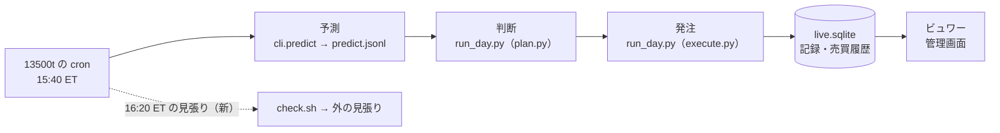

# 実売買の残りの決めごとを、推す案で決める

2026-09-25 作成。利用者の指示「全部おススメで直して」（TODO「トレーダー 3 人 … 実売買の仕組み」の下に残っていた決めごと）。

## 0. 目的・背景

TODO の実売買の親の下に、利用者の裁定待ちの項目が残っていた（無人運転の 3 つ・手数料・4 役の分け直しの A1〜A5・C10〜C12・D13 の残り・F23・G24）。利用者が「推す案で決めてよい」としたので、ここで決めて記録する。

⚠ 決めるときの前提（2026-09-25 の状態）:

- 本番は **13500t の host cron だけ**（9/25 から submit。titan へは戻さない）
- **1 日 1 回**（15:45〜16:05 ET）・**日足のモデル 1 本 × 3 人**・整数株 5 本・成行
- 20 営業日の記録（Phase 6）の途中 ＝ 1 日目 2026-09-23・20 日目の見込み 2026-10-20

> この図の主張: いまは「予測 → 判断・発注 → 見る」が 1 本の起動で順に流れていて、4 役はコードの中で既に分かれている。分けて別々に動かす利点は、1 日に何回も売買するときにしか出ない。

## 1. 決めたこと（推す案。2026-09-25）

⚠ **20 営業日のあいだは執行器（`run_day.py` ほか）を変えない**。記録の途中で作りを変えると、前半と後半で執行の差を同じ物差しで比べられなくなる。コードを変える案は全部 10/20 の判定の後に回す。

| 項目 | 決めたこと | 理由 |
| --- | --- | --- |
| 起動しなかった日の書き方 | §1 の日次の表に **1 行「起動なし」**（トレーダーは「全員」・注文 0・事象に理由）。⚠ **20 営業日は「起動した営業日」で数える**（起動しなかった日は数えず、判定のときに件数を別に書く） | 無人運転の成立は「起動しなかった日の数」で測る（別の柱）。執行の差は起動した日にしか取れない |
| 失敗の定義 | ① 起動しなかった（その日の `end rc=` が無い・機械が落ちていた）／ ② `rc≠0`（執行器は 注文の error ／ `unknown` ／ 口座と売買履歴の食い違いで止めた銘柄のどれかがあると 1 を返す ＝ 4 つのうち残り 3 つもここに入る） | `run_day.py` の戻り値が既に 3 つをまとめている |
| 知らせ方 | 段 1 ＝ 管理画面の帯（**済み**・「今日の起動が無い」）。段 2 ＝ **外の死活監視（dead man's switch）に 1 日 1 回、終了コードだけを送る**。13500t の cron に **16:20 ET の見張り `check.sh`** を足し、`trade.log` の今日の `end rc=` を読んで送る。送らない日（機械が落ちた）も外の側が「来ない」で知らせる | 同じ機械の中の見張りでは「機械が落ちた」を知らせられない。売買の `run.sh` には触らない（見張りが壊れても売買は止まらない） |
| 外へ出すもの | **終了コードと段の名前だけ**（例 `trade rc=1`）。口座番号・金額・銘柄・トークンは送らない | CLAUDE.md の「秘密を外へ出さない」 |
| 外の見張りの先 | healthchecks.io の無料枠（`https://hc-ping.com/<uuid>/<rc>`）を推す。⚠ **登録と URL の設定は利用者**（アカウントを作る ＝ 契約）。URL が無ければ `check.sh` は記録を 1 行書くだけ | 登録すればメールで届く・日程（cron 式と時間帯）と猶予を向こうで持てる |
| 約定後の実際の手数料 | **10/20 の判定の後**に、`/accounts/{n}/transactions` を sandbox で確かめてから入れる。それまでは dry-run の見積り（`fee_source: "dry_run_estimate"`）のまま | 20 営業日のあいだは執行器を変えない。手数料は整数株の成行で 1 注文 $0.001 級【実測 §0-3】＝ 判定に効かない |
| A. 4 役への分け直し（A1〜A5） | **いまは分け直さない**（保留）。再開の条件は D13 と同じ ＝ 1 日に何回も売買するモデルができたとき。そのときの見立て: A1 呼び名は **予測 ／ 判断 ／ 発注 ／ ビュワー**（ディレクトリ名は変えない）・A2 受け渡しは今の `predict.jsonl`（DB）・きっかけは定時・A3 売買履歴を書くのは発注だけ・A4 **全部 13500t**（2026-09-25 から）・A5 `run_day.py` から判断（`plan.py`）と発注（`execute.py`）の呼び出しを分ける | 役はコードの中で既に分かれている（図）。名前を変えると 284 か所・g3plus の契約・sidecar に波及する |
| C10 更新の時刻がずれるモデルの合わせ方 | **判断は取引時間帯に 1 回・その日の日付の予測だけを使う**（いまの作り ＝ 日付と手法が合わない予測は読まない）。朝と夕方に分かれるモデルを足すときに決め直す | いまの 3 本は全部 15:50 ET の 1 回 |
| C11 トレーダーの入れ替え・編集 | **編集はしない。変えるときは新しい識別名の新しい人**を作る。古い人は窓の中で持ち株を売り切ってから外す（売買履歴は消さずに残す）。止めるのは全員（市場の外で `HALT`） | 成績を人ごとに正確に残す（2026-09-19 の利用者決定「成績を正確に知りたい」と同じ考え）。持ち株の引き継ぎは成績が混ざる |
| C12 停止の単位 | **止めるのは全員（`HALT`）だけ**。含み損 20% は執行器は警告だけ・止めるのは人（2026-09-19 の決定のまま）。1 人だけ止めたいときは、13500t の `live.env` の `AIL_LIVE_TRADERS` から外す（利用者） | 仕組みを増やさない。1 人だけ止める道は設定 1 行で既にある |
| D13 注文の種類・気配 | **成行（`Market`・DAY）のまま**。気配は 15:50 ET に取る今の作りのまま | 測りたいのは「合図の気配 → 約定」の差（差 1）で、成行がいちばん素直に測れる。指値は約定しない日ができて売買履歴と判定が複雑になる。大型株 5 本・小口で差 1 は数 bp【実測 §1】 |
| F23 4 役が動いたかを画面に出すか | **いまは出さない**。見張り（起動なし）と外の見張りで足りる。4 役を分け直すときに決める | 1 本の起動なので「起動したか」で全部分かる |
| G24 1 日に何度も売買するときの差の定義 | **いまは決めない**（1 日 1 回に固定したため起きない）。20 営業日の数え方は上の「起動した営業日」 | D13 の決定（時間帯は広げない） |

## 2. 影響範囲

| 置き場 | 変えるもの |
| --- | --- |
| `TODO.md` | 上の項目を決定のメモつきで閉じる。残るのは見守り（cron）・Phase 6・手数料（10/20 の後）・外の見張りの登録（利用者） |
| `docs/specs/experiments/live-trading.md` | §1 に「起動なし」の行と 20 営業日の数え方 ／ §0-15（新）に失敗の知らせ方と今回の決めごと |
| `~/g3plus-ops/trade-runner/`（private・Sx360） | `check.sh`（新）・`live.env.example` に `AIL_HC_URL`・手順書 `docs/workflows/trade-runner.md`。⚠ `run.sh` は変えない。⚠ 13500t へ写すのと cron に 1 行足すのは利用者の了承のあと |
| 執行器・管理画面 | 変えない（20 営業日のあいだ） |

## 3. テスト方針

- `check.sh` は作業用の置き場で、偽の `trade.log` を 4 通り（rc=0 ／ rc=1 ／ 今日の行が無い ／ URL が無い）に置いて、送る先の URL と記録の行を確かめる（送り先は手元の偽の受け口）
- 執行器・管理画面は変えないので、`run-tests.sh` は流さなくてよい（文書だけ）

## 4. Phase

- [x] Phase 1: 決めて記録する（このプラン・TODO・live-trading.md）
- [x] Phase 2: `check.sh` を作って手元で確かめる（g3plus-ops）
- [ ] Phase 3: 13500t へ写して cron に 1 行足す・healthchecks.io に登録して URL を `live.env` に書く（⚠ 利用者）
