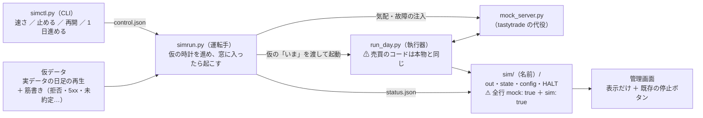
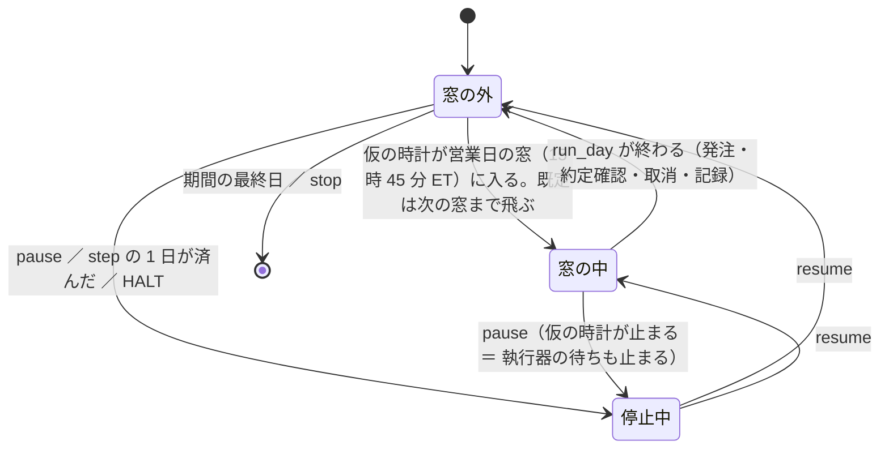
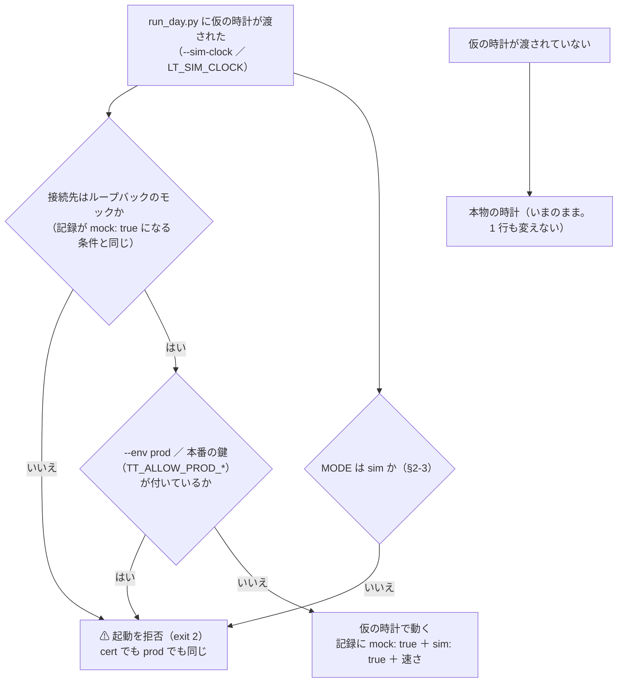
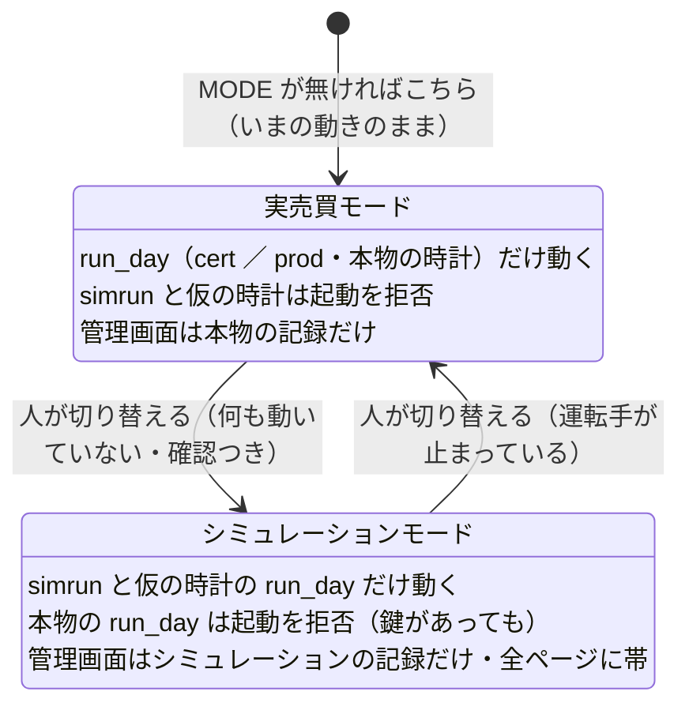
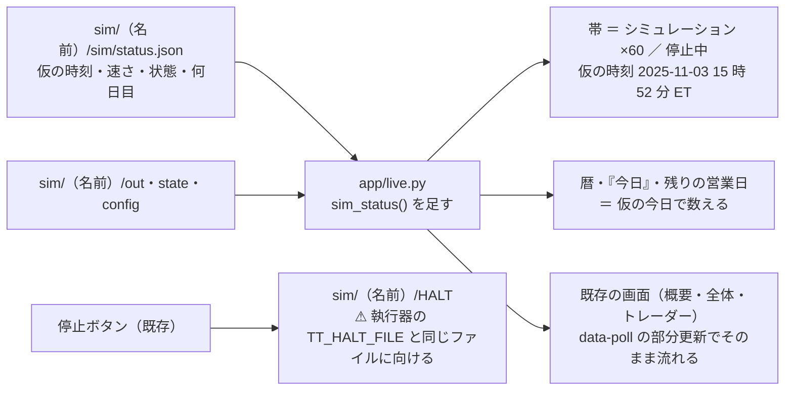

# 仮データと仮の時計で執行器を通しで動かす — 速さを変える・止める・管理画面で見る

作成日: 2026-09-19。利用者の指示（2026-09-19）: **「仮データを用意し実際の売買のコードを動かしテストを行う。時間経過は実際の何倍かで進めたり止めたりして管理画面でも確認できる」**。
親: [実売買のプラン](live-trading-three-models.md)。関連: [live-trading.md](../specs/experiments/live-trading.md)（執行器の決めごと）・[dashboard.md §6-2・§13](../specs/dashboard.md)（デモと実売買の画面）。

⚠ **これはプランだけ**（実装はしていない）。§1 の 4 つは利用者の裁定が要る。推奨を先に書いた。
✅ **2026-09-19 利用者決定: 操作は CLI だけ・管理画面は表示だけ**（§1 の 2。いったん「管理画面から操作」に決めたが、同日に最初の案へ戻した ＝ シミュレーションは端末が手元にある開発機で回すので CLI で足りる・管理画面の「読むだけ ／ 停止だけ」の線を動かさない）。残る裁定は 1・3・4。
✅ **2026-09-19: Phase 0 を済ませた**（利用者の指示「Phase0やって。実装はしないで止めて」）。1・3・4 は推奨どおりで確定し、値（仮の期間・銘柄・3 人の設定・合図の規則・速さ）まで [live-trading.md §0-7](../specs/experiments/live-trading.md) に書いた。⚠ **実装（Phase 1 以降）は利用者の指示を待つ。**
✅ **2026-09-19 利用者決定（案 A）: Sx360 をシミュレーション専用の機械にし、tastytrade の `.env` を置かない**（titan は実売買と日足の取得。[live-trading.md §0-7 (f)](../specs/experiments/live-trading.md)）。仕組み（`MODE`・`run.lock`）はどちらの機械にも入れる ＝ 機械を分けるのは、その外側にもう 1 枚足す守りである。
✅ **2026-09-19 利用者決定: 実売買に係わる状態とシミュレーションの状態は排他にし、必ず分かるようにする**（§2-3。⚠ **このプランでいちばん上に置く決まり**。ほかの節はこれに従う）。

## 0. 目的・背景

執行器（`experiments/live-trading/run_day.py`）は、いまは「日付を引数で渡して 1 日ぶんを 1 回流す」ものしかない。`mockrun.sh` は 20 営業日を数十秒で一気に流して最後に検査するだけで、**流れている途中を見ることも、止めることも、実際の時間の流れ（窓を待つ・再送を待つ・取消を待つ・休場日に拒否する）を確かめることもできない**。

本番に 3 人を入れる（Phase 5-2）前に、**実物と同じコードを、仮のデータと仮の時計の上で何十日ぶんも通しで動かし、管理画面で眺めながら確かめる**場を作る。

| 確かめたいこと | いまの `mockrun.sh` | この仕組み |
| --- | --- | --- |
| 1 日ぶんの配線（合図 → 注文 → 約定 → 記録） | ✅ | ✅（同じコード） |
| 窓（15:45〜16:05 ET）を待って自分で起きる・休場日と半日立会で拒否する | ❌ `--ignore-window` で飛ばしている | ✅ 仮の時計が窓に入ると起きる |
| 再送 60 秒 × 3・取消 600 秒が窓の中で片付くか | ❌ 0.1 秒に縮めている | ✅ 仮の時計の上で本来の秒数 |
| 拒否・5xx・429・資金不足・未約定が起きた日の記録と画面 | ❌ 全部 Filled | ✅ 仮データの側から起こす |
| 流れている途中を管理画面で見る・停止ボタンを押す | ❌ 終わった記録を見るだけ | ✅ 速さを落として眺める・止める |
| 「起動しなかった日」・含み損 20% の停止 | ❌ | ✅ 筋書きに入れる |

⚠ **2026-08-27 の方針の内側**（資金は動かさない。接続先はモックだけ）。⚠ **tastytrade の挙動の【実測】にはならない**（記録は全部 `mock: true`）。確かめるのは自分のコードの配線と時間の扱いである。
⚠ **仮データの損益・差は判定（Phase 6）に混ぜない。**

## 1. ⚠ 利用者に決めてもらうこと（推奨つき）

| # | 決めること | 推奨 | 他の案 |
| ---: | --- | --- | --- |
| 1 | **仮データの中身**（✅ 2026-09-19 推奨どおりで確定。⚠ 値段は 2026-06-01 からの足・日付は 2026-10-01〜12-31 の営業日 64 日に当てる ＝ 半日立会 11-27・12-24 を暦を書き換えずに踏む。live-trading.md §0-7 (c)） | **取得済みの実データの日足を再生する**（`feature-discovery/data/adjusted/d/*.csv`。⚠ 過去の期間を「仮のいま」として流す）。値段が本物なので整数株の制約・予算の検査が現実と同じ形で出る。休場日も NYSE の暦（執行器と共有）がそのまま効く | 作り物（いまの `mockrun.sh` の正弦波）。軽いが、$100 の銘柄 1 本では予算や枠の検査がほとんど働かない |
| 2 | **速さ・停止・再開の操作の置き場** | ✅ **決定（2026-09-19・利用者）: 操作は CLI だけ**（`simctl.py`）。**管理画面は表示だけ**（全ページの帯に「シミュレーション ×60 ／ 停止中 ／ 仮の時刻」）。管理画面の操作は 2026-09-18 に「停止 ／ 解除と履歴だけ」に絞ったままにする。⚠ 操作パネルを後で足したくなったときの線は §4-1 に残す（どちらも同じ `control.json` を書くだけなので、後から足しても作り直しにならない） | ローカル面の `/ops` に操作パネルを足す（⚠ 見送り。§4-1） |
| 3 | **動かすトレーダー**（✅ 2026-09-19 推奨どおりで確定。3 人の設定は §0-7 (d)） | まず**試験用の 3 人**（`sim_a`・`sim_b`・`sim_c`。`test = true`・合図は `kind = "file"`）。合図は仮データから決まった規則で作る（例: 20 日移動平均の上なら買い）。実際の `T1`〜`T3` は Phase 1（`predict.py --asof`）ができてから `kind = "experiment"` で差し替える | Phase 1 を待ってから作る（⚠ この仕組みが Phase 1 の配線の確認にも使えるので、待つ理由が薄い） |
| 4 | **1 日の窓の数**（✅ 2026-09-19 推奨どおりで確定。§0-7 (e)） | いまの執行器どおり **1 日 1 回**（15:45〜16:05 ET）で作る。ただし、窓を「時刻の一覧」として持ち、後から足せる形にする | 4 役の決めごと（C9・D13）が決まるまで待つ |

## 2. 全体の形

> この図の主張: 足すのは「仮の時計」「仮データを流す運転手」「操作の口」の 3 つだけで、執行器の売買のコード（合成 → θ → 状態機械 → 予算 → 注文 → 約定確認 → 記録）は 1 行も別物にしない。

| 部品 | 置き場 | 中身 |
| --- | --- | --- |
| 仮の時計 | `experiments/live-trading/simclock.py` | 仮の「いま」＝ 基準の仮時刻 ＋（実時間の経過 × 速さ）。止めると進まない。`sleep(仮の秒)` は 実時間 ＝ 仮の秒 ÷ 速さ だけ待つ（止まっている間は待ち続ける）。速さ・停止は `control.json` を読み直して反映 |
| 運転手 | `experiments/live-trading/simrun.py` | モックを起こす → 仮の時計を進める → 営業日の窓に入ったら、その日の気配と筋書きをモックに流して `run_day.py` を起こす → `status.json` を書く。「次の窓まで飛ぶ」（窓の外は何も起きないので既定で飛ばす。飛ばさない設定も持つ） |
| 操作の口 | `experiments/live-trading/simctl.py`（⚠ **CLI だけ**。管理画面には置かない） | `speed 60` ／ `pause` ／ `resume` ／ `step`（1 営業日進めて止まる）／ `status` ／ `stop` ／ `mode sim <名前>` ／ `mode real`。`control.json`（と `MODE`）を書くだけで、運転手がそれを読み直す |
| 仮データ | `experiments/live-trading/simdata.py` ＋ `config/sim/<名前>.toml` | 期間・銘柄・トレーダー・速さの初期値・筋書き（何日目に何を起こすか）。日足の終値を 15:50 の気配の中心にし、約定はモックの `--fill-noise` |
| 記録の置き場 | `experiments/live-trading/sim/<名前>/`（git 管理外） | 管理画面が読む形そのまま（`config/traders`・`state/cert`・`out/<日付>`）＋ `sim/status.json`・`control.json`・`HALT`。⚠ **本物の `out/`・`state/` とは別の木** |

### 2-1. 時間の進み方

> この図の主張: 運転手の状態は 4 つだけで、「止める」はどの状態からでも効き、執行器の中の待ち（再送・取消）も同じ仮の時計で縮む。

| 速さ | 意味 | 使いどころ |
| ---: | --- | --- |
| ×1 | 実時間どおり（窓の 20 分は 20 分） | 無人運転の通し稽古（D16 の timer ／ cron と組む） |
| ×60 | 窓の 20 分が 20 秒。再送 60 秒が 1 秒 | 管理画面で 1 日の流れを眺める |
| ×1440 | 1 日が 1 分（窓の外を飛ばさない場合） | 日をまたぐ挙動（受渡し T+1・起動しなかった日） |
| 最速 | 待たない（いまの `mockrun.sh` 相当） | 回帰テスト。20 営業日を数十秒で |

### 2-2. ⚠ 仮の時計を本番に持ち込めないようにする

執行器に「いま」を外から渡す口を作るのは、窓の検査（発注してよい時間帯）を外せる口を作ることでもある。**口は作るが、モックに繋いでいるときしか開かない**ようにする。

> この図の主張: 仮の時計は「接続先がモック」のときだけ受け付け、それ以外は起動を拒む。本番の経路では時計は必ず本物である。

| 緩めないもの | 守り方 |
| --- | --- |
| 本番の鍵の 3 段・`HALT`・取消の鍵で発注は開かない | `ttclient.Client` は触らない。運転手は `.env` を読まない（`TT_ENV_FILE` を空のファイルに向ける。`mockrun.sh` と同じ） |
| 仮の時計で本番・cert に発注できない | 上の図をテストで固定（モック以外の接続先 × 仮の時計 ＝ 拒否 ／ `--env prod` × 仮の時計 ＝ 拒否 ／ ⚠ **MODE が `real` × 仮の時計 ＝ 拒否**） |
| ⚠ 実売買とシミュレーションが同時に動かない | §2-3（`MODE` ＋ `run.lock`）。シミュレーションモードでは本物の `run_day.py` が起動を拒否する |
| 仮の時計を渡さない実行は 1 行も変わらない | 既存の pytest 38 本がそのまま通る。`now_et()` と `sleep` の既定は本物 |
| 記録を混ぜない | 置き場は `sim/<名前>/`。全行に `mock: true` と `sim: true`。管理画面は `mock` の日を「実物の日数」に数えない（いまの `live.index` のまま） |
| 判定に混ぜない | トレーダーは `test = true`（記録に `test: true`）。Phase 6 の集計は `mock` ／ `test` を外す（いまのまま） |

### 2-3. ⚠ 実売買とシミュレーションは排他 — 必ず分かるようにする（2026-09-19 利用者決定）

利用者の指示: **「実売買に係わる状態とシミュレーションの状態は排他にし、必ず分る様にする」**。
「接続先がモックのときしか仮の時計を受け付けない」（§2-2）は 1 回の起動の中の守りで、それだけでは「実売買の執行器とシミュレーションが同じ機械で同時に動く」「管理画面がどちらを見せているのか分からない」を防げない。**機械全体の「モード」を 1 つだけ持ち、全部の部品がそれに従う**形にする。

> この図の主張: モードは「実売買」か「シミュレーション」のどちらか 1 つで、切り替えは何も動いていないときに人が明示的に行う。片方のモードでは、もう片方の部品は起動を拒む。

#### 排他の仕組み

| 部品 | 中身 |
| --- | --- |
| モードの正本 | `experiments/live-trading/MODE`（git 管理外。`{"mode": "real" ／ "sim", "name": "<シミュレーションの名前>", "since": …, "by": …}`）。⚠ **無ければ `real`** ＝ いまの動きを 1 行も変えない（既存のテスト・`mockrun.sh`・リハーサルはそのまま） |
| 起動の排他 | `experiments/live-trading/run.lock`（`flock`。中に モード・pid・開始時刻）。執行器も運転手も、起動時に取り、終わるまで持つ。⚠ **取れなければ起動しない** ＝ 同じモードの二重起動も防ぐ |
| 実売買モードで | `simrun.py` は起動を拒否 ／ `run_day.py` に仮の時計を渡しても拒否（§2-2 の条件に「MODE が sim」を足す）／ `simctl.py` の速さ・停止の操作も拒否（操作する時計が無い） |
| シミュレーションモードで | ⚠ **本物の `run_day.py`（cert ／ prod・本物の時計）は起動を拒否**（`TT_ALLOW_PROD_ORDERS=1` と確認の引数があっても）。拒否は**本物の記録** `out/<日付>/events.jsonl` に `refused_mode_sim` として残す ＝ その日が「起動しなかった日」になった理由が後から分かる |
| 切り替え | `simctl.py mode sim <名前>` ／ `simctl.py mode real`（⚠ **CLI だけ。管理画面には置かない**）。⚠ **`run.lock` が取れない（何かが動いている）ときは拒否**。切り替えは `mode.log` に残し、管理画面は帯と「全体の詳細」にいまのモードと切り替えた時刻を出す |
| ⚠ 実売買の最中にシミュレーションへ入るとき | 本物の状態（`state/prod/*.json`）に建玉が残っていたら、**「シミュレーション中は実売買の執行器が動かない ＝ 手仕舞いも出ない」**と表示し、追加の確認（CLI は `--real-trading-will-stop`）を要求する |
| 状態の置き場 | 本物 ＝ `out/`・`state/<env>/`・`out/HALT`（いまのまま）／ シミュレーション ＝ `sim/<名前>/` の下だけ。⚠ **互いの木に 1 バイトも書かない**（テストで固定）。停止ボタンの `HALT` も、モードに応じてその木のものだけを書く |
| トレーダーの名前 | ⚠ **シミュレーションのトレーダーは名前が `sim_` で始まること**（`sim_a`・後で `sim_T1`）。運転手が検査し、そうでなければ起動しない。本物の設定（`T1`〜`T3`・`test_a`）をシミュレーションの木に置けない ＝ 画面や記録で名前だけ見ても取り違えない |

#### 必ず分かるようにする — どこを見てもモードが出る

| 見る場所 | 実売買モード | シミュレーションモード |
| --- | --- | --- |
| 管理画面の全ページ | 既存の帯（環境 cert ／ prod・デモ） | ⚠ **全ページの最上部に、実売買では使わない色の帯**「シミュレーション — 仮データ・仮の時計（×60）。実売買ではない」＋ 仮の時刻。左ペイン・ページの題（`<title>` の頭に `[SIM]`）にも出す |
| 管理画面の数字・図 | — | 大きな数字・損益の図・表の見出しに「仮」の印（既存の `.chip.placeholder` と同じ扱い。`dashboard.md` §15-8） |
| 管理画面が読む記録 | ⚠ **モードから決まる**: 本物の記録だけ | シミュレーションの記録（`sim/<MODE の name>/`）だけ。⚠ **1 つの画面に両方を混ぜて出さない**。`AIL_LIVE_DIR` を手で指定しても、木の種類（`sim/status.json` の有無）がモードと食い違えば、数字を出さずに「モードと記録が食い違っている」とだけ出す |
| `/api/*` の応答 | `"mode": "real"` | `"mode": "sim"`・`"sim": {名前・速さ・仮の時刻}` |
| 記録の行 | `mock` ／ `sim` なし（cert のモックは `mock: true`） | 全行に `sim: true`・`mock: true`・`test: true` |
| CLI | `run_day.py`・`simrun.py`・`simctl.py` は、最初の 1 行にモードを大きく出す（例「=== シミュレーション sim1（×60）— 実売買ではない ===」）。拒否のときは理由にモードを書く | 同左 |
| 操作の履歴・ログ | 1 行ごとにモードの欄 | 同左 |
| 公開面（g3plus） | 常に実売買の側だけ（`sim/` も `MODE` も載せない） | ⚠ titan がシミュレーションモードの間、公開面には「実売買の執行器が起動していない」としか見えない。記録を公開面へ届ける経路（4 役の F21）を作るときに、モードも一緒に届ける |

⚠ **デモ（`AIL_DEMO=1`。鍵なしで画面を見るためのモックの記録）は、いまのまま別の帯**で、この排他の対象にしない（デモは何も動かさない・読むだけ）。

## 3. 仮データと筋書き

| 要素 | 作り方 | ⚠ 注意 |
| --- | --- | --- |
| 気配 | その日の日足の終値を中心に、スプレッド（例 2bp）を付けて `/_mock/quote` で銘柄ごとに流す | ⚠ いまのモックは気配が 1 本（全銘柄同じ値）。**銘柄ごとの気配を持てるようにモックを広げる** |
| 約定 | モックの `--fill-noise`（気配 ×（1 ± noise））。種は固定 | 差 1（気配 → 約定）が 0 にならない |
| 合図 | 試験用: 仮データから決まった規則で `config/signals/sim_*.csv` を作る（買い% ／ 出口%）。後で: Phase 1 の `predict.jsonl` | ⚠ 合図の規則は成績を見るためのものではない（売買が適度に起きればよい） |
| 暦 | NYSE の暦（`nyse_calendar.py`。執行器の窓と管理画面が共有）をそのまま使う | 半日立会の日は既定で「発注しない」＝ その拒否が記録と画面に出ることを確かめる |
| 筋書き（故障の注入） | `config/sim/<名前>.toml` の `[[events]]`: 何日目に何を起こすか | 下の表 |

筋書きで起こすもの（モックに `/_mock/fault` を足す。1 つずつ・組み合わせは後）:

| 筋書き | モックの振る舞い | 確かめること |
| --- | --- | --- |
| `session_offline` × N | 発注に N 回 `Session offline` を返してから通す | 再送 60 秒 × 3 が窓の中で片付く ／ 4 回目は諦めて記録に残る |
| `http_5xx` ／ `429` | 5xx・429 を返す | 再送するもの・しないものの線（`execute.is_transient`） |
| `auth_5xx` ／ `auth_401` | 認証で落とす | 5xx は 1 回待って取り直す・401 は再試行しない |
| `reject_funds` | 資金不足の 4xx | エラーとして記録・再送しない・まとめた注文が全員ぶん失敗する（`parts`） |
| `no_fill` | 成行を約定させない | `--cancel-after` で取り消す・状態が進まない |
| `skip_day` | 運転手がその日を起こさない | 管理画面の「起動しなかった日」 |
| `crash_mid` | 発注の後・記録の前に執行器を落とす | 次の日に `external-identifier` で重複を見つけて二重発注しない |
| `drawdown` | 気配を続けて下げる | 含み損 20% で発注をやめて持ち越す（投げ売りしない） |
| `halt` | 運転手ではなく人が管理画面の停止ボタンを押す | `HALT` で発注を拒否・全取消・解除で再開 |

## 4. 管理画面

> この図の主張: 管理画面は記録の木を読むだけのまま。足すのは「モードの帯（仮の時刻・速さ）」と「今日 ＝ 仮の今日」の 2 点だけで、操作は足さない（速さ・停止・切り替えは CLI）。

- ⚠ **管理画面がどの記録を読むかは `MODE` から決まる**（§2-3）: `real` なら本物の記録、`sim` なら `sim/<name>/`。⚠ **両方を 1 つの画面に混ぜない**。`MODE` が無い・`real` のときは帯も操作パネルも出ない ＝ 本番・デモの画面は変わらない
- ⚠ **シミュレーションモードの間は全ページの最上部に帯が出る**（§2-3 の表）。帯は部分更新の外に置き、消せない
- ⚠ **停止ボタンが書く `HALT` は管理画面の記録ディレクトリの下**（`config.halt_file`）。シミュレーションで停止ボタンの通し稽古をするには、執行器の `TT_HALT_FILE` をそこへ向ける（運転手が環境変数で渡す）。⚠ **本物の `out/HALT` を書かないことをテストで確かめる**
- 帯の文言・色は `dashboard.md` §15（デザイン規約）に合わせ、用語は `dashboard/glossary.toml` に足す（i マークの正本）
- ⚠ 公開面（g3plus）には出さない（`sim/` は COPY の対象外。`MODE` も載せないので帯は出ない）

### 4-1. ⚠ 見送り: 操作パネル（管理画面から速さを変える・止める・進める）— 後で足すときの線

⚠ **2026-09-19 に見送った**（利用者決定「CLI だけにして管理画面は表示だけにします」）。**いまは作らない。** 下は、CLI を使ってみて足したくなったときに守る線の控えである（足すと決めるのは利用者）。

| 操作 | 経路 | 中身 |
| --- | --- | --- |
| 速さ | `POST /ops/sim/speed` | ⚠ **決まった選択肢だけ**（×1 ／ ×10 ／ ×60 ／ ×300 ／ ×1440 ／ 最速）。自由入力は受けない（サーバ側で検査） |
| 止める ／ 再開 | `POST /ops/sim/pause` ／ `/ops/sim/resume` | 仮の時計を止める ／ 動かす。⚠ 停止ボタン（`HALT`）とは別物 ＝ `HALT` は「発注をやめて全取消」、こちらは「時間を止める」。画面でも並べて置かず、文言で区別する |
| 1 日進める | `POST /ops/sim/step` | 次の営業日の窓を 1 回流して止まる |
| 終了 | `POST /ops/sim/stop` | 運転手に終わるよう伝える（確認ダイアログつき。記録は残る） |
| 状態 | 帯 ＋ `/ops` のパネル | 仮の時刻・速さ・状態（窓の外 ／ 窓の中 ／ 停止中）・何日目 ／ 全何日・運転手が生きているか（`status.json` の更新時刻が古ければ「運転手が止まっている」） |

| 守る線 | 守り方 |
| --- | --- |
| ローカル面だけ | 既存の `require_local()`（`/ops/resume` と同じ）。⚠ **公開面（cloudflare）では 5 本とも開かない**ことをテストで固定。`dashboard.md` §3 の権限の表に 1 行足す |
| ⚠ シミュレーションモードのときだけ | `MODE` が `sim` のときだけパネルを出し、経路も開く（§2-3）。⚠ **実売買モード・デモでは 404**（操作する時計が無い）。⚠ **モードの切り替えは、パネルを足すときも CLI に残す** |
| 書けるのは 1 ファイルだけ | 管理画面が書くのは `AIL_LIVE_DIR/sim/control.json` だけ（パスは設定から組み立て、リクエストからは受け取らない）。⚠ **運転手・執行器のプロセスを起こさない・殺さない**（起動は `simrun.sh` ＝ CLI のまま。web からプロセスを起こす口は作らない） |
| 発注の経路は増やさない | 操作パネルは注文に触れない。⚠ **「管理画面に発注の経路は無い」（2026-09-18）はそのまま**。`ops.py` のクライアントは取消の鍵しか開けない、も変えない |
| 操作の履歴 | 既存の操作の履歴（`/ops`）に、誰がいつ何倍にしたか・止めたかを残す |
| CSP | フォームの POST と既存の `app.js` の確認ダイアログだけ（インラインのスクリプト・style は書かない。§15-9） |

⚠ **運転手の起動・モードの切り替えは、パネルを足すときも CLI に残す**（web からプロセスを起こす口・実売買モードへ戻す口は作らない）。

## 5. 影響範囲

| 場所 | 変更 |
| --- | --- |
| `experiments/live-trading/` | 新規 `simclock.py`・`simrun.py`・`simctl.py`・`simdata.py`・⚠ **`mode.py`（`MODE` と `run.lock`。§2-3）**・`config/sim/*.toml`・`config/traders/sim_*.toml`・`tests/test_sim*.py`・`tests/test_mode.py`・`simrun.sh`。`run_day.py` は「いま」と `sleep` を 1 か所から引く形に直し、⚠ **起動時にモードを見て `run.lock` を取る**（既定は本物・`MODE` が無ければ `real` ＝ いまの動きのまま。§2-2 の拒否を足す）。`.gitignore` に `sim/`・`MODE`・`run.lock`・`mode.log` |
| `experiments/tastytrade-api-sample/mock_server.py` | 銘柄ごとの気配（`/_mock/quote` に `symbol`）・`/_mock/fault`。⚠ 既存の selftest・`mockrun.sh`・管理画面のデモが変わらないこと |
| `dashboard/app/live.py`・`main.py`・`templates`（帯は共通の枠）・`glossary.toml`・`tests` | `MODE` と `status.json` の読み取り・全ページの帯・`[SIM]`・「仮」の印・「今日」の差し替え・`/api/*` の `mode`。⚠ **操作は足さない**（`ops.py`・`/ops` は変えない。POST の経路は 1 本も増やさない） |
| 文書 | `live-trading.md` に節（使い方・筋書きの一覧・モードと排他・緩めないもの）・`dashboard.md` §13 ／ §6-2 ／ §15（帯と「仮」の印）・`CLAUDE.md`（実験コードの節・管理画面の節に帯の 1 行）・`README.md`。⚠ `dashboard.md` §3 の権限の表は変えない（操作を足さないので） |
| 変えないもの | `ttclient.py` の鍵・`plan.py`・`state.py`・`execute.py` の売買の中身（`sleep` は既に差し替えられる）・本物の `out/`・`state/` |

## 6. Phase

| Phase | 中身 | 見積り【推測】 |
| --- | --- | --- |
| 0 | §1 の 4 つの裁定 → `live-trading.md` に決めごとを書く | ✅ 2026-09-19（[§0-7](../specs/experiments/live-trading.md)） |
| 1 | ⚠ **モードと排他（`mode.py`・`MODE`・`run.lock`。§2-3）を最初に入れる** ＋ 仮の時計（`simclock.py`）と `run_day.py` の「いま」の一本化・§2-2 の拒否・CLI の 1 行目にモード・テスト（既存 38 本が変わらない） | 1.5 日 |
| 2 | 仮データ（日足の再生・銘柄ごとの気配・合図の CSV）と運転手・`simctl.py`。故障なしで 20 営業日を ×60 と最速で通す | 1.5 日 |
| 3 | 筋書き（§3 の 9 つ）をモックと運転手に足し、1 つずつテスト | 1〜1.5 日 |
| 4 | 管理画面（⚠ **表示だけ**: モードに従って記録を選ぶ・全ページの帯・`[SIM]`・「仮」の印・`/api/*` の `mode` ＝ §2-3 ／ 仮の今日 ／ 既存の停止ボタンの通し稽古 ／ 用語）とブラウザ確認・スクリーンショット | 1.5 日 |
| 5 | 手順書（`live-trading.md`。⚠ **Sx360 での立ち上げ ＝ `.env` を置かない・日足は titan から写す・venv の作り方** を含む）・`CLAUDE.md`・後片付け。⚠ Phase 1（`predict.py`）ができたら `T1`〜`T3` を `kind = "experiment"` で流す項を足す | 0.5 日 |

合計 6.5〜7 営業日【推測】・費用 $0。Phase 1〜2 で「速さを変えて通しで動き、管理画面で見える」ところまで行く（2.5 日）。

## 7. テスト方針

| # | 検査 | 置き場 |
| ---: | --- | --- |
| 1 | 仮の時計: 速さ × 経過 ＝ 進み ／ 止めると進まない ／ 再開で飛ばない ／ `sleep` が速さで縮む・止まっている間は返らない | `tests/test_simclock.py`（実時間を差し替えて決定的に） |
| 2 | ⚠ 仮の時計 × モック以外の接続先 ＝ 拒否 ／ × `--env prod` ＝ 拒否 ／ × 本番の鍵 ＝ 拒否 | `tests/test_run_day.py` に追加 |
| 3 | 仮の時計を渡さない実行は記録の形も結果も変わらない | 既存 38 本 ＋ `mockrun.sh` |
| 4 | 窓: 営業日の 15:45 に起きる ／ 休場日と半日立会は拒否が記録に残る ／ 窓の外では発注しない | `tests/test_simrun.py` |
| 5 | 筋書き 9 つが、それぞれ決めごとどおりの記録になる（再送の回数・エラーの種類・状態が進まない・二重発注しない） | 同上 |
| 5-2 | 運転手は `sim` モードで資格情報の `.env` を見つけたら警告を出す（拒否はしない）。資格情報が 1 つも無い環境で 64 営業日が最後まで通る（⚠ **Sx360 と同じ条件**。`TT_ENV_FILE` を空のファイルに向けて検査） | `tests/test_simrun.py` |
| 6 | 記録の全行に `mock: true` と `sim: true` ／ 本物の `out/`・`state/`・`HALT` に 1 バイトも書かない ／ 秘密が出ない | `simrun.sh` の検査（`mockrun.sh` と同じ形） |
| 7 | 管理画面: `status.json` があれば帯が出る・無ければ出ない ／ 「今日」が仮の今日 ／ `/api/live` に秘密が出ない | `dashboard/tests/test_live.py` に追加 |
| 0 | ⚠ **排他と見分け（§2-3）**: `MODE` が無ければ `real` ／ `real` で `simrun`・仮の時計が拒否 ／ `sim` で本物の `run_day` が拒否（本番の鍵と確認の引数があっても）し、本物の `events.jsonl` に `refused_mode_sim` が残る ／ `run.lock` を持っている間は二重起動も切り替えも拒否 ／ 建玉が残っているときの切り替えは追加の確認が要る ／ シミュレーションの木に `sim_` で始まらないトレーダーがあれば起動しない ／ 互いの木の mtime が動かない ／ 全行に `sim: true` | `tests/test_mode.py`（新規）・`tests/test_run_day.py` |
| 0-2 | ⚠ 管理画面の見分け: `sim` のとき全ページ（概要・全体・トレーダー・記録・判定・操作）の HTML に帯と `[SIM]` がある ／ `real` のとき無い ／ `/api/*` に `mode` ／ モードと木が食い違うと数字を出さない ／ 1 つの応答に本物とシミュレーションの行が混ざらない | `dashboard/tests/test_mode_banner.py`（新規） |
| 7-2 | ⚠ 管理画面に操作が増えていない: POST の経路の一覧がいまと同じ（`/ops/halt`・`/ops/resume`・`/ops/retry-auth` だけ）／ 管理画面のプロセスが `sim/` の下に書くのは、シミュレーションモードで停止ボタンを押したときの `HALT` だけ ／ 既存の「取消の鍵だけ」のテストが通る ／ CSP 違反 0 件（ブラウザ確認） | `dashboard/tests/test_mode_banner.py` |
| 8 | 同じ設定・同じ種なら、速さを変えても記録（時刻の欄を除く）が一致する | `tests/test_simrun.py` |

## 8. ⚠ 先に書く限界

| # | 限界 | 読み方 |
| ---: | --- | --- |
| 1 | モックは tastytrade ではない | 拒否の文面・資金不足のコード・約定の遅れは想像で作る。⚠ 本物の挙動は sandbox のリハーサル（Phase 2 の残り）と本番の 1 発注（Phase 5-1）でしか分からない |
| 2 | 日足の再生では日中の値動きが無い | 15:50 の気配 ＝ 終値 ± 雑音。「合図の時刻から引けまでの 10 分の値動き」（差 1 の一部）は測れない |
| 3 | 過去の日足を流すと、損益は「その期間に何が起きたか」で決まる | ⚠ 仮データの損益を成績として読まない（判定にも混ぜない） |
| 4 | 速さを上げると、実時間に依存する部分（HTTP の往復・プロセスの起動）が相対的に長くなる | ×1440 を超える速さでは「窓の中で片付くか」を読まない。読むのは ×1〜×60 |
| 5 | 1 日に何度も売買する形（4 役の C9・D13）はまだ決まっていない | 窓を時刻の一覧で持つところまで。決まったら足す |
