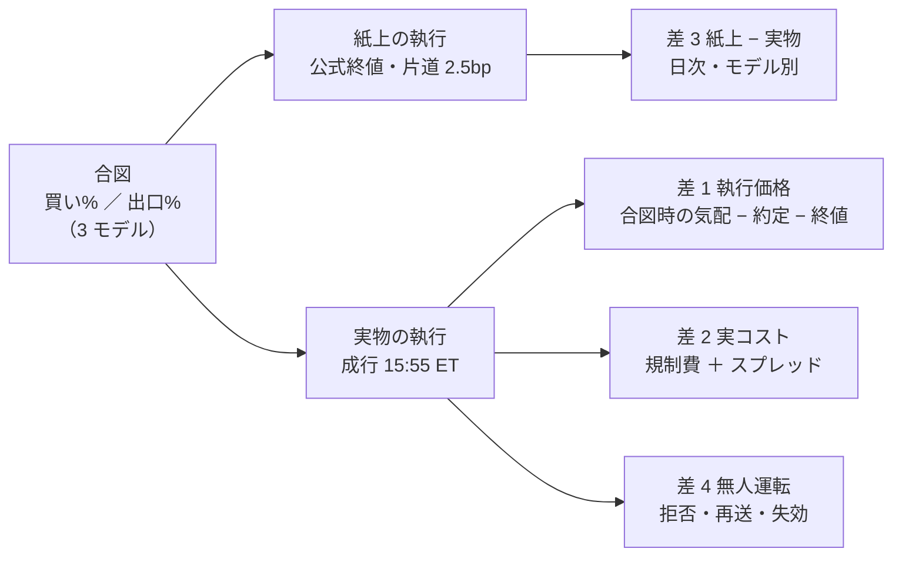

# 予想モデル 3 本に予算を割り振り、tastytrade の本口座で実際に売買して記録を残す

作成日: 2026-09-17。利用者の指示: **実際に売買を行う仕組みを実装します。予想モデルを 3 つほど用意してそれぞれに予算を割り振り実際の取引をしてデータを検証できる形で残します。**

派生元: 「tastytrade で、実際の API 取引のサンプルプログラムを動かす」（2026-09-05〜09-16。[DONE.md](../../DONE.md) へ移した。プランは [archive/tastytrade-api-sample.md](archive/tastytrade-api-sample.md)、記録は [tastytrade-api-sample.md](../specs/experiments/tastytrade-api-sample.md)）。
残っていた Phase 6「本番で 1 株」は本プランの Phase 5 の最初の段（最小額で 1 発注）に取り込む。

記録先（作るもの）: `docs/specs/experiments/live-trading.md`（決めごと・日次の要約・判定）。
コード（作るもの）: `experiments/live-trading/`（執行器）＋ `experiments/feature-discovery/cli/predict.py`（「今日の買い%」を出す経路）＋ `dashboard/`（`/live` 画面）。

## 0. ⚠ 方針との関係 — これは 2026-08-27 の方針の 2 つ目の例外である

CLAUDE.md は「資金を動かす実行は行わない」（2026-08-27）とし、tastytrade の API 検証だけを例外にした（2026-09-05。本番で 1 株まで）。
本タスクは **その例外を「3 本の予想モデルに予算を割り振って毎日売買する」まで広げる**。利用者の 2026-09-17 の指示による。CLAUDE.md に同日追記した。

変えないもの:

| | 内容 |
| --- | --- |
| 実行するのは利用者 | 本番の鍵（`TT_ALLOW_PROD_ORDERS=1` ＋ 確認文）を入れて執行器を起動するのは利用者。Claude はコードと手順まで。⚠ **Claude は本番の鍵を `.env` に書かない・執行器を本番で起動しない** |
| 鍵の 3 段 | dry-run ／ 取消 ／ 発注 の鍵は `ttclient.py` のまま。⚠ **取消の鍵で発注は開かない** |
| 停止 | `HALT` があれば発注しない。管理画面の停止ボタンで全取消 |
| 判定の物差し | ⚠ **「儲かったか」で採否を決めない**（§2-3。数週間の実売買では上乗せの有無は統計的に判定できない）。判定するのは**執行の差と無人運転の成立**。収入は【実測】として残すが、それで手法を採らない |

## 1. 目的 — 何を知りたいか

バックテスト（[feature-discovery](../specs/experiments/feature-discovery/rules.md) 13 章の閾値売買）は「足 t の終値で執行し、翌日の終値までのリターンを得る。コストは片道 2.5bp」という理想化の上に立つ。
実際の口座で同じ合図を毎日執行すると、理想化と現実の差が数字で出る。**その差を、モデル 3 本 × 日次で、後から検証できる形に残す**のが目的である。

| 問い | バックテストの前提 | 実売買で測れるもの | 記録 |
| --- | --- | --- | --- |
| **執行価格の差** | 終値で執行 | 合図を出したときの価格（15:50 ET の気配）・約定価格・公式終値の 3 つの差 | 注文ごと |
| **実コスト** | 片道 2.5bp【推測】 | 手数料 $0【公表値】＋ 規制費（SEC $20.60/百万ドル・FINRA TAF $0.000195/株【公表値】）＋ スプレッドの半分（実測） | 注文ごと |
| **紙上と実物の差** | 純利 bp（シミュレータ） | 同じ合図を公式終値で回した紙上の純利と、口座の損益の差 | 日次・モデル別 |
| **無人で回るか** | — | 発注の拒否（`Session offline` 等）・再送・429・認証の失効が、日次の窓の中で片付くか | 日次 |
| **口座の制約** | 資金は無限に割れる | 整数株 ／ 端株の可否・最小注文額・現金口座の受渡し（T+1）が合図の執行をどれだけ歪めるか | Phase 0 で実測、以後日次 |

> この図の主張: 実売買は「合図 → 執行」の間にある 4 つの差を測る装置であり、合図そのものの良し悪しはバックテストの側で決まっている。

### 1-1. 既に分かっていること（前タスクから引く）

| 項目 | 事実 | 出典 |
| --- | --- | --- |
| 口座 | 本口座は開設済み・**現金 $1,000 着金済み**【実測 2026-09-16】。買付余力 1000.0。⚠ `cash-available-to-withdraw` 0.0（引き出し保留） | [記録 §0-5](../specs/experiments/tastytrade-api-sample.md) |
| 口座の種類 | `equities-margin-calculation-type: Cash Secured Margin`・`is-pattern-day-trader: false`。⚠ **現物の現金口座扱い**なので、⚠ **売った代金は受渡し（T+1）まで再投資できない可能性がある**（Phase 0 で確かめる） | 記録 §0・§0-5 |
| 発注の往復 | sandbox で指値・取消・成行・反対売買が通る。⚠ **市場時間でも `Session offline` で拒否されることがある**（25 分後に通った） | 記録 §0-4 |
| 認証 | access token 900 秒で失効。refresh token は数日またいで使える。⚠ **失敗ログインの連打で IP が約 8 時間ブロック** | 記録 §0-4・README |
| 気配 | 本番の資格情報で REST 気配と DXLink が取れる。遅延はサーバの時計で −0.12 秒 | 記録 §0-4 |
| 相場データ | sandbox は配信しない（全経路 502）。⚠ **リハーサルでは「合図は本番の気配、注文は sandbox」に分ける**（`sample.py` と同じ） | 記録 §0 |
| 監視 | 管理画面（g3plus）が cert に繋いで認証・口座・注文を監視している。停止ボタンで `HALT` ＋ 全取消 | [dashboard.md §2・§4](../specs/dashboard.md) |
| 価格の水準 | SPY 1 株 ≈ $766【実測 2026-09-08】。⚠ **$1,000 では SPY 1 株で資金の 77% を使う** | 記録 §0-4 |
| 手法の成績 | 台帳に「採る」は 0 件・保留 78 件。⚠ **どのモデルも B&H を安定して超えていない**（[ledger.md §0](../specs/experiments/feature-discovery/ledger.md)） | 台帳 |
| 検出限界 | 符号 5/5 で拾えるのは fold あたり +1,700bp 級。日次 σ は 49〜77bp【実測】 | [validation-power.md §3-2](../specs/experiments/feature-discovery/validation-power.md) |

## 2. 対応方針

### 2-1. 3 本のモデル — 候補と推奨

⚠ **選ぶ基準は「儲かりそう」ではなく「族が違う 3 本で、同じ表・同じ期間・同じ形式 (A) で回っていること」**。族が違えば、執行の差がモデルの性質（回転の多さ・保有の長さ）でどう変わるかを見られる。
⚠ **結果を見る前に決め、`live-trading.md` §0 に書いてから動かす**（rules.md 14-9 と同じ規律）。

| 枠 | 候補（推奨） | 族 | 台帳の判定 | 選ぶ理由 | ⚠ 注意 |
| --- | --- | --- | --- | --- | --- |
| M1 | `trade_own_ridge_a` θ=50 | 線形（Ridge・own 35 列） | 保留（閉じる。+12.79bp/fold） | 最も単純。回転が多い側の対照 | 上乗せは雑音の大きさ |
| M2 | `trade_ownex_lgbm_a` θ=55 | 木（LightGBM・own cs rel ex） | 保留（+48.72bp/fold。⚠ 3 実行の幅 123bp） | 外部データ（為替・金利）を使う唯一の保留行。fold を丸ごと休む癖がある | 再現の幅が大きい ＝ 種で合図が変わる。⚠ **種は 0 に固定して記録に残す** |
| M3 | `trade_ownseq_ridge_a` T3 QUANT θ=50 | 時系列分類器（60 日窓の道筋） | 保留（閉じる。fold 2 の 1 本頼み） | 入力の形が違う（手作りの列ではなく価格の道筋） | 保有 7 日中央値・強制清算 13.5% |
| 対照 | B&H（買い% 常に 100） | 基準線 | — | ⚠ **紙上だけで回す**（実物の枠は使わない。B&H の執行差は fold に 2 回しか出ない） | — |

代替: M2 を `trade_ownex_ridge_a` に替えると 3 本とも Ridge の頭になり「入力だけ違う」形になる（族の差は消える）。利用者が「モデルの中身の差」より「入力の差」を見たいならこちら。

作業量・費用・期間の見立て:

| 項目 | 数字 | 区分 |
| --- | --- | --- |
| 実装（Phase 0〜4） | 5〜7 営業日 | 【推測】 |
| 初期費用 | $0（手数料 $0【公表値】。規制費は売却 $1,000 あたり $0.02 ＋ 株あたり $0.000195【公表値】） | 【公表値】 |
| 危険にさらす資金 | 予算の合計（§2-2。既定 $900） | 【実測の残高から】 |
| 想定収入 | ⚠ **B&H ± 雑音**。台帳の上乗せは日次 +0.03〜+0.14bp/日【推測】で、$900 なら月 $0.1 未満 | 【推測】 |
| 判定できるまで | 執行の差: **20 営業日**で注文 100 件前後が溜まる。上乗せの有無: ⚠ **判定できない**（§2-3） | 【推測】 |

### 2-2. 予算の割り振りと株数 — ⚠ $1,000 では等加重 63 銘柄を再現できない

バックテストのポートフォリオは「63 銘柄の日次純利の等加重平均」で、各銘柄に資金の 1/63 が固定で割り当てられている（rules.md 13-7）。$300 の枠なら 1 銘柄 $4.76 で、⚠ **整数株では 1 株も買えない**（us63 の株価の中央値は $100 超【推測】）。

| 案 | 中身 | 成立条件 | 推奨 |
| --- | --- | --- | --- |
| (a) 端株（Notional Market） | tastytrade の注文種別に `Notional Market`（金額指定）がある【記憶・未確認】。$4.76 の注文が通れば 63 銘柄の等加重をそのまま再現できる | ⚠ **Phase 0 で本番の dry-run（`TT_ALLOW_PROD_DRY_RUN=1`。何も執行しない）で確かめる**: 端株の可否・最小額・API から出せるか | ✅ 通れば第一候補 |
| (b) 銘柄を事前固定で絞る | 各モデル同じ N 本（例 10 本）に絞る。⚠ **選び方は結果と無関係に**（us63 から seed 0 の乱択、または株価の低い順） | 端株が通らないとき | (a) が落ちたら |
| (c) 入金を増やす | 利用者の判断。$10,000 なら 1 枠 $3,000・1 銘柄 $47 | 利用者 | 提案のみ（Claude は実行しない） |

既定の割り振り（Phase 0 で利用者が確定する）:

| 枠 | 予算 | 用途 |
| --- | ---: | --- |
| M1 ／ M2 ／ M3 | $300 × 3 ＝ $900 | 各モデルの執行。⚠ **枠を超える買いは執行器が拒む**（dry-run の `buying-power-effect` と自前の台帳の両方で） |
| 予備 | $100 | 規制費・約定の端数・受渡しの遅れ |

⚠ **同じ銘柄を M1 が売り M2 が買う日が起きる。** 口座は 1 つなので、⚠ **注文は銘柄ごとに 3 枠の差分を合算して出し、枠ごとの持ち分は執行器の台帳で分ける**（口座の建玉は合算しか見せない）。wash sale（§4）もこの合算で起きる。

### 2-3. ⚠ 判定の物差し — 上乗せの有無は判定しない

日次 σ が 50bp 級【実測】で、台帳の上乗せが 0.1bp/日 級【推測】なら、20 営業日の t 値は 0.1 × √20 ÷ 50 ≈ 0.01。⚠ **1 年回しても 0.03**。実売買で「モデルが効くか」は測れない。

判定するのは次の 4 つで、⚠ **すべて事前に閾値を書く**（`live-trading.md` §0）。

| 観点 | ✅ | ⚠ | ❌ |
| --- | --- | --- | --- |
| 執行価格の差（合図時の気配 → 約定） | 中央値 ≤ 5bp | 5〜10bp | > 10bp（片道 2.5bp の前提が崩れる。紙上の純利を割り引く） |
| 紙上 − 実物（モデル別・日次） | 差の中央値 ≤ 5bp/日・説明できる（規制費・端数） | 説明できない差が週 1 回以下 | 説明できない差が続く（配線の誤り） |
| 無人運転 | 20 営業日で人手 0 回 | 再送で片付いた拒否がある | 手で直した日がある |
| 口座の制約 | 合図どおりに執行できた日が 95% 以上 | 受渡し待ちで見送った日がある | 合図の半分以上が執行できない |

### 2-4. 執行のタイミング — 終値の代わりに 15:50 ET の気配で合図を出す

バックテストは「足 t の特徴量 → 足 t の終値で執行」。生では終値が確定してから注文すると翌日の寄付きになり、検証していない時間の向きが入る。

| 案 | 中身 | 差 | 推奨 |
| --- | --- | --- | --- |
| (b) 引け前に出す | 15:50 ET に当日の気配を「終値の代役」として特徴量を作り、15:55 ET に成行を出す | 10 分の値動き ＋ スプレッド（⚠ **どちらも記録して測る**） | ✅ |
| (a) 翌日の寄付き | 終値確定後に特徴量 → 翌 9:31 ET に成行 | 引け → 寄りの隙間（検証していない） | 落とす |
| (c) MOC | 引け成行 | ⚠ API の注文種別に無い【記憶・未確認】。Phase 0 で確かめ、あれば (b) より良い | あれば ✅ |

> この図の主張: 1 営業日の窓は 15:45〜16:05 ET の 20 分で、その中に「取得 → 合図 → 差分 → dry-run → 発注 → 約定確認 → 記録」が入る。この外では発注しない。

### 2-5. 「今日の買い%」を出す経路 — バックテストの fit をそのまま使う

`cli/run.py` の `evaluate_trading` は fold ごとに「訓練 → 較正 → 買い%」を作る。生では **訓練 ＝ 直近までの全行、検証 ＝ 今日の 63 行** にして同じ関数群（`registry`・`calibrate.fit`・検知器）を呼ぶ。⚠ **モデル・較正・変換のコードは 1 行も書かない**（配線だけ足す）。

| 要素 | 生での扱い | ⚠ 注意 |
| --- | --- | --- |
| 訓練の範囲 | 表の先頭〜昨日（ラベル y が確定している行まで） | ⚠ **今日の行は y が無いので訓練に入れない**（先読み禁止・7 章） |
| 較正（Platt） | 訓練の内側で fit（13-2） | fold と同じ |
| 再学習の頻度 | ⚠ **毎日 fit し直す**（fold 1 本と同じ扱い。計算は Ridge で秒・LightGBM で分【推測】） | 決定性: 種 0・入力の指紋を毎日記録 |
| 特徴量 | `cli.build` と同じ関数で、15:50 の気配を当日の終値の代役にして末尾 1 行を作る | ⚠ **代役の値と公式終値の差を記録**（差 1 の一部） |
| 出力 | `predict.jsonl`（日付・モデル・銘柄・買い%・出口%・代役の価格・入力の指紋・commit） | 紙上（Phase 3）も同じファイルから回す |
| 検算 | 過去のある日 t を「今日」に見立てて回し、⚠ **その日を含む fold の買い% と一致しないことを前提に**、訓練の範囲だけが違うことを指紋で示す | fold の訓練は「fold の手前まで」、生は「昨日まで」で違う。⚠ **一致を要求しない。同じコードを通ることを要求する** |

## 3. 影響範囲

| 場所 | 変更 |
| --- | --- |
| `CLAUDE.md` | 例外の追記（2026-09-17。済） |
| `experiments/feature-discovery/cli/predict.py`（新） | 「今日の買い%」。`ail/` は触らない |
| `experiments/feature-discovery/ail/features/*` | ⚠ **末尾 1 行だけ作る入口が無ければ足す**（既存の経路は 1 ビットも変えない。指紋テストで縛る） |
| `experiments/live-trading/`（新） | 執行器・状態機械・台帳・紙上の対照・記録。`ttclient.py` / `record.py` を import |
| `experiments/tastytrade-api-sample/mock_server.py` | 端株・`Notional Market` のモック（Phase 0 の結果次第） |
| `dashboard/app/live.py`（新）・`templates/live.html` | `/live`（読むだけ。公開面でも見える）。HALT は既存の停止ボタン |
| `docs/specs/dashboard.md` | §13 実売買の画面 |
| `docs/specs/experiments/live-trading.md`（新） | 決めごと・日次要約・判定 |
| `.gitignore` | `experiments/live-trading/out/`・`.env` |

## 4. ⚠ 規約・法令・税で先に指摘するもの

| 項目 | 中身 | 出典 |
| --- | --- | --- |
| API の自動売買 | tastytrade の API Terms は algorithmic trading systems を明示的に許容（R3）。`automated-source: true` を注文に付ける | [trading-api-availability.md](../specs/trading-api-availability.md) |
| wash sale | 3 枠が同じ銘柄を 30 日以内に売り買いすると、損失の控除が繰り延べられる。⚠ **口座は 1 つなのでブローカーは合算で報告する**。税は個別に CPA 確認 | [trading-tax.md](../specs/trading-tax.md) |
| Pattern Day Trader | 1 日 1 回の執行なら同日の往復は起きない。⚠ **再送や取消の設計で同日往復を作らない** | 記録 §0-5（`is-pattern-day-trader: false`） |
| 現金口座の受渡し | 売却代金は T+1 まで再投資できない可能性（good faith violation）。⚠ **Phase 0 で `cash-available-to-trade` 系の値を確かめ、執行器は受渡し前の代金を使わない** | Phase 0 |
| 予定納税 | 短期益に源泉徴収は無い。金額は月 $1 未満【推測】なので実務上は無視できるが、記録は残す | trading-tax.md §6 |
| 非表示利用の申告 | API で相場データを取って自動発注に使うのは NYSE の Non-Display Use の例示に当たる。⚠ **ブローカー経由の個人契約での扱いは未確認のまま** | trading-api-availability.md 付録 A-7 |

## 5. Phase と Step

| Phase | 内容 | 実行者 | 出口 |
| --- | --- | --- | --- |
| 0 | 決めごとと本番の読み取り・dry-run | Claude（dry-run は `TT_ALLOW_PROD_DRY_RUN=1` を利用者が入れる） | `live-trading.md` §0 に全部書く |
| 1 | 「今日の買い%」の経路 | Claude | `predict.py`・テスト |
| 2 | 執行器（モック → sandbox） | Claude | モックで 20 日ぶん・sandbox で 1 日 |
| 3 | 紙上の対照と日次の突き合わせ | Claude | 差 1〜4 の日次表 |
| 4 | 管理画面 `/live` | Claude | 公開面から読める |
| 5 | 本番投入 | **利用者** | 最小額 1 発注 → 予算どおり |
| 6 | 20 営業日の記録と判定 | Claude | `live-trading.md` の判定 |

### Phase 0: 決めごとと本番の読み取り

1. 管理画面の `/judge` で観点 A（営業日を 2 日跨ぐ交換）が ✅ になっているか確かめ、記録 §1 に写す
2. 本番の読み取り（`sample.py --step probe`）: 残高・`margin-or-cash`・受渡し関連の項目・買付余力
3. 本番の dry-run（何も執行しない）: `Notional Market` ／ 小数の `quantity` ／ `Market` の $5 相当 ／ MOC 相当の注文種別 — 通るもの・エラー文を記録
4. 3 本のモデル・予算・銘柄集合・執行の時刻・停止条件・判定の閾値（§2-1〜§2-4）を `live-trading.md` §0 に書く。⚠ **利用者の確認を取ってから Phase 1 へ**
5. 停止条件（事前固定）: 枠の含み損が予算の 20% ／ 1 日の注文数が 63 × 3 を超える ／ 説明できない差が 3 日続く ／ `HALT` — どれかで執行器は発注をやめ、建玉は持ち越す（⚠ **自動で投げ売りしない**）
6. 執行器を動かす機械: titan（データと venv がある）。systemd timer か cron で 15:45 ET 起動。⚠ **`setsid nohup` で切り離す**（過去に nohup & だけで死んだ）。g3plus は監視だけ

### Phase 1: 「今日の買い%」の経路（feature-discovery 側）

1. `cli/predict.py --experiment <名前> --asof <日付> [--proxy-quotes <jsonl>]`: 表を読み、`asof` より前を訓練・`asof` の行を検証にして `evaluate_trading` と同じ関数群で買い%・出口% を出す
2. 末尾 1 行の特徴量: `cli.build` の関数で、代役の価格を末尾に足した足から作る。⚠ **既存の表・既定経路は 1 ビットも変えない**（指紋テスト）
3. テスト: (1) 決定性（同じ入力で 2 回回して同一） (2) 先読み（`asof` の y を変えても出力が変わらない） (3) 3 モデルとも通る (4) 代役を公式終値にしたときの出力と、気配にしたときの出力の差を返す
4. 実行時間の実測（3 モデル。M2 の LightGBM が最長の見込み）

### Phase 2: 執行器

1. `experiments/live-trading/`: `state.py`（枠 × 銘柄の 0/1・持ち分・受渡し待ち）・`plan.py`（合図 → 目標 → 差分 → 注文）・`execute.py`（dry-run → 発注 → 約定確認 → 取消）・`ledger.py`（枠別の損益）・`run_day.py`（§2-4 の窓を 1 回通す）
2. 記録: `out/<日付>/predict.jsonl`・`orders.jsonl`（注文 JSON・dry-run・応答・遷移・約定価格・合図時の気配・時刻）・`positions.jsonl`・`balances.jsonl`・`events.jsonl`（拒否・再送・429）。全部 `record.Masker` を通す
3. 安全: HALT ／ 枠の上限 ／ 窓の外では発注しない ／ `external-identifier` で再送前に重複を探す ／ `Session offline` は 60 秒おき 3 回 ／ 未約定は 16:05 に取消 ／ 認証失敗は再試行しない（IP ブロック）
4. モックで 20 営業日ぶんを通す（`mock_server.py` を拡張。約定価格に乱数のずれを入れて差 1 が出ることを確かめる）
5. sandbox のリハーサル（市場時間・1 日）: 合図は本番の気配、注文は cert。⚠ **cert の `Session offline` の再送が効くか**

### Phase 3: 紙上の対照

1. 同じ `predict.jsonl` を公式終値・片道 2.5bp で `simulate()` に流し、枠別の紙上純利を日次で出す
2. 差 1〜4（§1）を `daily.csv` に 1 日 1 行 × 3 枠 で書く。説明できる差（規制費・端数・受渡し待ち）は列で分ける
3. B&H の紙上も同じ表に置く

### Phase 4: 管理画面

1. `/live`: 枠別の予算・建玉・実物と紙上の損益曲線・今日の合図と注文・差 1〜4 の直近 20 日。⚠ **読むだけ。発注は画面から出さない**（公開面でも見える）
2. 停止は既存の `/ops/halt`（`HALT` を執行器も見る）
3. `dashboard.md` §13 とテスト（秘密が応答に出ない・デモで 200）

### Phase 5: 本番投入（利用者）

1. 最小額で 1 発注（旧 Phase 6）: 1 枠だけ・1 銘柄・最小額で 1 日回し、約定と記録を確かめる
2. 3 枠を予算どおりに起動。最初の 5 営業日は毎日 `/live` を見る
3. ⚠ **Claude が行うのは手順書とチェックリストまで**

### Phase 6: 記録と判定

1. 20 営業日で §2-3 の 4 観点を判定し、`live-trading.md` に書く（数字は全部【実測】）
2. 続けるか・止めるか・予算を変えるかは利用者。⚠ **判定を見てモデルを入れ替えるのは新しい試行**（台帳の n_trials に足す）

## 6. テスト方針

| 何を | どう |
| --- | --- |
| 既定経路が変わらない | `cli.build` / `cli.run` の指紋テスト（`tests/test_trading_run.py` と同じ形） |
| 先読み | `--asof` の y を壊しても買い% が変わらない |
| 鍵 | prod で発注の鍵が無ければ dry-run で止まる（`test_guard.py` に足す）。取消の鍵で発注が開かない |
| 枠 | 予算を超える差分が dry-run の前で落ちる |
| 秘密 | `out/` の全行に口座番号・トークンが無い（`test_record.py` と同じ grep） |
| 窓 | 15:45〜16:05 ET の外で `run_day.py` が発注しない（時計を差し替えて確認） |
| 画面 | `/live` が公開面で 200・POST が無い・デモで空でも 200 |

## 7. ⚠ 先に書く失敗モードと限界

| # | 失敗 | 対処 |
| ---: | --- | --- |
| 1 | 端株が通らず、(b) の絞りで「バックテストと違う銘柄集合」になる | 紙上の対照も同じ集合で回す（比べるのは執行の差なので集合が同じなら成立） |
| 2 | 15:50 の代役と終値の差が合図を反転させる（θ 付近の銘柄） | 反転した銘柄数を日次に数える。多ければ 15:55 に寄せる |
| 3 | 現金口座の受渡し待ちで買えない | 「執行できなかった合図」を記録し観点 4 で数える。⚠ 信用口座への変更は利用者の判断 |
| 4 | 20 営業日では執行の差の中央値しか言えない | それが目的。上乗せは言わない（§2-3） |
| 5 | 3 枠が同じ銘柄で打ち消し合い、口座には注文が出ない日がある | 枠の台帳では売買したことにし、実物のコスト 0 として差 3 に残す |
