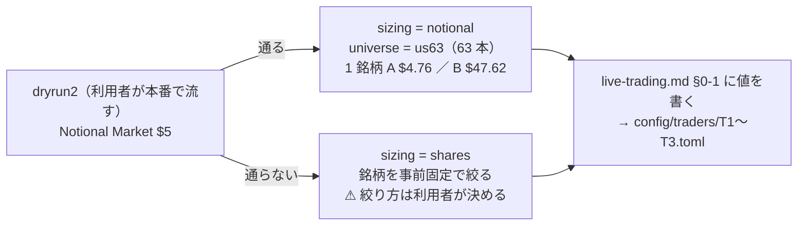

# B6: 実際に動かすトレーダー 3 人の属性を決めて書く

作成日: 2026-09-19。派生元: [TODO](../../TODO.md) の「B6: 実際に動かす 3 人の属性（モデル・θ・予算・銘柄集合）」（利用者の指示 2026-09-19「B6 3 人の属性を進めます」「候補プランでよい」）。
親: [実売買のプラン](live-trading-three-models.md) §2-2・§2-3。書き込む先: [live-trading.md §0-1](../specs/experiments/live-trading.md)。

## 0. 目的・背景

2026-09-17 から「未設定」だった 3 人の属性を事前固定する。これが決まらないと Phase 1（今日の買い%）・Phase 3（紙上の対照）・Phase 4 の残り・Phase 5-2（本番投入）が動かない。

⚠ **2026-08-27 の方針の 2 つ目の例外の内側**（CLAUDE.md）。この作業は文書と設定を書くだけで、⚠ **口座にも執行器にも触れない**。本番の鍵を入れて起動するのは利用者。
⚠ **選ぶ基準は「儲かりそう」ではない**。族が違う 3 本で執行の差を見る（親プラン §2-2・§2-4。損益で手法を採らない）。

## 1. 決まったこと（2026-09-19。利用者「候補プランでよい」）

| トレーダー | モデル（実験名） | 手法の行 | θ | 合成 | 予算 | 種 |
| --- | --- | --- | ---: | --- | ---: | ---: |
| `T1` | `trade_own_ridge_a` | 全部使う（基準）・Ridge | 50 | `asis` | A $300 ／ B $3,000 | 0 |
| `T2` | `trade_ownex_lgbm_a` | 全部使う（基準）・LightGBM | 55 | `asis` | A $300 ／ B $3,000 | 0 |
| `T3` | `trade_ownseq_ridge_a` | T3 QUANT（60日窓）（検知器） | 50 | `asis` | A $300 ／ B $3,000 | 0 |
| 予備 | — | — | — | — | A $100 ／ B $1,000 | — |

- ⚠ **予算は 2 つの規模を並べて持つ**（2026-09-19。利用者の指示「$1000 と $10000 の両方を比較できるようにして。$10000 は実際の取引で使えない可能性があるのでそれを明記する」）: **規模 A ＝ $1,000**（$300 × 3 ＋ 予備 $100。口座の残高【実測】＝ 実際に使える）／ **規模 B ＝ $10,000**（$3,000 × 3 ＋ 予備 $1,000）。⚠ **規模 B（$10,000）は実際の取引で使えない可能性がある**（口座に入っていない。追加入金は利用者の判断）。執行器の上限の既定は規模 A のままで、規模 B は `--max-total-budget 10000 --max-day-usd 10000` を明示したときだけ。比較の表は [live-trading.md §0-1](../specs/experiments/live-trading.md)
- 名前は `T1`〜`T3`（記録と画面の鍵。⚠ 後から変えない）
- 種は 3 本とも config の `seed = 0` のまま（すでにそう書いてある。変えない）
- 台帳の数字【実測・生成日 2026-09-19】: 対 B&H 上乗せ ＋12.79 ／ ＋48.72 ／ ＋61.92 bp/fold、fold の符号 1/5 ／ 2/5 ／ 2/5。3 本とも「保留」で「採る」ではない
- ⚠ **T1 の「保留 ＋12.79」は較正「旧」（2026-09-12 より前の、数値解が止まっていた Platt 較正）の行の数字**。いまのコード（較正 std）で同じ構成を回すと θ=50 は **純利 1,381.12・対 B&H −270.89bp/fold・fold 2/5 ＝「落とす」**（台帳の std の行。4 実行・一致【実測 2026-09-19】）。⚠ **実売買の「今日の買い%」はいまのコード ＝ std で出るので、T1 は台帳では「落とす」の構成である**。選んだ基準は族の違いで成績ではないので確定は動かさないが、替えるなら新しい試行として利用者が決める（上位 K の実行の素の行で気づいた。[topk-holdings.md](archive/topk-holdings.md)）

## 2. まだ決まらないもの — 銘柄集合と株数の決め方（`dryrun2` 待ち）

> この図の主張: 銘柄集合と `sizing` は `dryrun2` の 1 行（`notional_market_5usd`）で二択に分かれ、どちらに落ちても結果（損益）を見る前に決まる。

| 分かれ目 | 設定 | ⚠ 注意 |
| --- | --- | --- |
| 端株が通る | `sizing = "notional"`・`universe = "us63"` | バックテストの等加重をそのまま再現できる |
| 通らない | `sizing = "shares"`・銘柄を N 本に絞る | ⚠ 1 人の予算 ÷ N が 1 株の値段を超える銘柄しか買えない（us63 の終値は 最小 $25.6・中央値 $209.8・最大 $1,123.9【実測】。整数株で買える本数は 規模 A: N=63・20 で 0 本 ／ 10 で 2 本 ／ 5 で 8 本 ／ 3 で 13 本、規模 B（⚠ 実取引では使えない可能性）: N=63 で 5 本 ／ 20 で 23 本 ／ 10 で 42 本 ／ 5 で 55 本 ／ 3 で 61 本）。絞り方（乱択 seed 0 ／ 株価の低い順）と N は**利用者の裁定**（未決）。入金を増やす案（親プラン §2-3 (c)）も利用者の判断 |

`dryrun2` は市場時間内に流す（時間外は成行が `tif_no_after_hours_opening_market_orders` で拒否される。live-trading.md §0-4）。

## 3. 対応方針

| Step | 中身 | 担い手 | 状態 |
| --- | --- | --- | --- |
| 1 | モデル・θ・予算・合成・種を `live-trading.md` §0-1 に書く。銘柄集合と `sizing` は §2 の条件つきの規則で書く | Claude | ✅ 2026-09-19 |
| 2 | 親プラン §2-2 の T2 の注意（「種で合図が変わる」）を実測に合わせて直す（§5） | Claude | ✅ 2026-09-19 |
| 3 | `dryrun2` を本番で流し、§0-3 の表を埋める | ⚠ **利用者** | 未 |
| 4 | 端株が通らなかったときの絞り方を決める（通れば不要） | ⚠ **利用者** | 未 |
| 5 | `config/traders/T1.toml`〜`T3.toml`（`kind = "experiment"`）を書く。⚠ **`sizing` と銘柄が決まってから**（半端な設定を置くと誤って起動できてしまう）。T3 は実験の中の手法（T3 QUANT）を指す欄が `ModelSpec` に要る ＝ Phase 1 の `predict.jsonl` の形と一緒に決める | Claude | 未 |
| 6 | 利用者の確認 → Phase 1 へ | 利用者 | 未 |

## 4. 影響範囲

- 文書: `live-trading.md` §0-1・親プラン §2-2・`CLAUDE.md`（「属性はまだ設定しない」の行）・`TODO.md`
- コード: この Step 1〜2 では変えない。Step 5 で `experiments/live-trading/config/traders/` と `trader.py`（手法を指す欄）
- 台帳: ⚠ **n_trials は動かない**（既存の構成をそのまま使う）。属性を書いた後にモデル・θ・合成規則を替えるのは新しい試行（親プラン Phase 6）

## 5. 種（seed）について確かめたこと【実測 2026-09-19】

親プラン §2-2 は T2 を「再現の幅が大きい ＝ 種で合図が変わる」と書いていたが、`runs/` を見比べると違った。

| 実行 | 種 | 入力の表 | θ=55 の純利 bp |
| --- | ---: | --- | ---: |
| 2026-09-13T08-58-42 | 0 | 修正前の `ex_` / `im_`（built 2026-09-10） | 1,575.9303 |
| 2026-09-17T16-51-25 | 0 | 修正後 | 1,699.3344 |
| 2026-09-17T16-58-20 | 0 | 修正後 | 1,699.3344 |

- ⚠ **同じ種・同じ入力の 2 本は小数 4 桁まで一致** ＝ 種を固定すれば合図は再現する
- ⚠ **幅 123bp は種ではなく入力の差**（2026-09-17 の `ex_` / `im_` の回し直し。[daily-data-sources.md §16](../specs/experiments/daily-data-sources.md)）。⚠ T2 の「保留」（上乗せ ＋48.72）は修正後の実行の数字で、修正前は B&H 以下だった
- 種を変えた実行は無いので、「種を変えると合図がどれだけ動くか」は未測

## 6. テスト方針

- Step 1〜2 は文書だけ。`dashboard` の `test_vibetab.py`（リンク先の検査）が通ること
- Step 5 で足すもの: `test_trader.py` に T1〜T3 の読み込み（`test = false`・`kind = experiment`・予算の合計 ≤ `--max-total-budget`）と、手法を指す欄の検査
