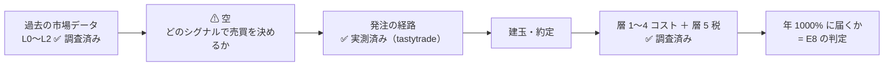
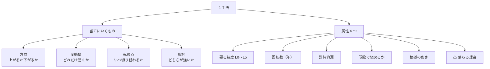
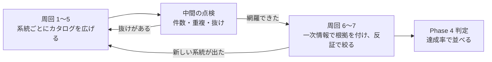
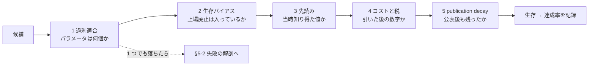
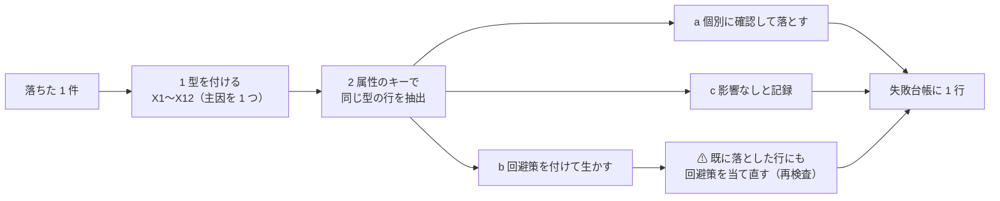
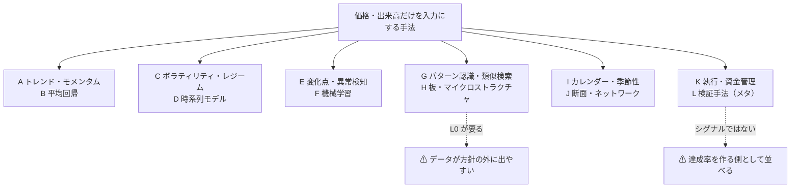
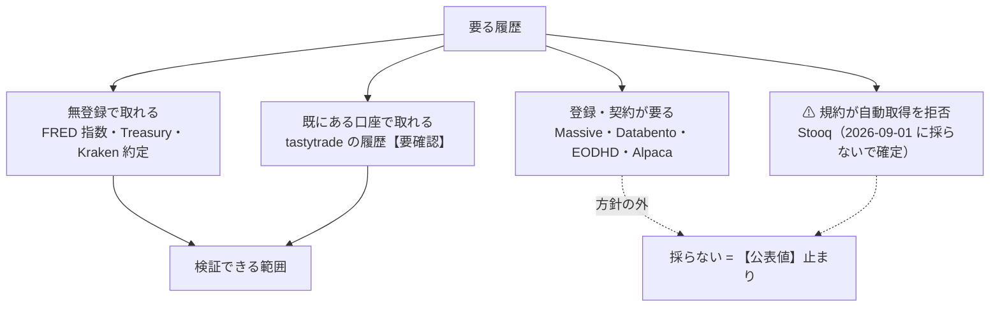

# 上昇・下降のシグナルを中心に、データ分析の手法を広く調べる

作成日: 2026-09-08。前の起票（「トレード予想に使う計算手法を調査する」）を、利用者の指示 3 本で作り直したもの。
対象: [online-tradable-assets.md](../specs/online-tradable-assets.md) の **E8（譲渡益を繰り返し実現する運用）**。成果物は `docs/specs/experiments/e8-signal-methods.md`（新規）。

## 0. この作業の形

| # | 指示（2026-09-08） | プランでの形 |
| --- | --- | --- |
| 1 | **過去の市場データだけを入力にし、上昇・下降のシグナルで売買する** | 入力を全周回で固定（約定・気配・OHLCV とそこから作る量のみ。決算・ニュース・センチメントは外す）。§2-1 |
| 2 | **目標利回りは年 1000%。通常の手法では届かない。他の手法で達成できてもよい** | **判定の物差し**として §3 に置く（年 1000% ＝ 1 営業日 ＋1.06〜1.15%）。商品は 3 段（現物 → 信用・レバレッジ → 先物・オプション）で、届かなければ段を開ける。§2-2 |
| 3 | **主にデータ分析の手法を広く調査する** | ⚠ **これが本体**。**手法カタログを作る**のが主成果物で、判定はその後に置く。§2-3 の分類軸 ＋ §6 のカタログ（**80 件前後を目標**）。周回は「母集団を広げる」ために回す。§4 |
| 4 | **検証で失敗したときに「何故上手くいかなかったのか」を検証する工程を含め、他の手法に反映させる** | ⚠ **§5 を独立した工程にした**。落ちた 1 件ごとに **失敗の型（X1〜X12）** を付け、**属性をキーに同じ型の行を抽出**して、落とす / 回避策を付けて生かす / 影響なし を 1 件ずつ判定する。結果は**失敗台帳**（§5-4）として成果物に入れ、⚠ **横展開が収束するまで周回を止めない**（§4-2 の 5） |

⚠ **3 によって作業の重心が変わった。** 前の版は「1 件でも成立するものがあるか」を探す形だったが、
本版は **「どんな手法があるかを網羅して属性を付ける」ことが先**で、達成率での順位付けは最後に 1 回行う。
体系側の [catalog.md](../specs/income-taxonomy/catalog.md)（手法 64 件に属性を付けた表）と同じ作り方をする。

⚠ **先に書いておく（調査を歪めないため）。** 年 1000% は監査された公表運用成績としては確認されていない水準である【要確認・§4-4 の周回 6 で当たる】。
このプランは「達成できる手法を探す」だけでなく、**カタログの上で「どこまで届くか」「何が上限を作っているか」を出す**形にしてある。

## 1. 目的と背景

> この図の主張: 売買の経路の両端（データの入手と、発注・コスト・税）は既に調べ終わっていて、真ん中の 1 箱だけが空である。**この作業はその箱の中身を並べる。**

| 問い | 中身 | どこで決まる |
| --- | --- | --- |
| **どんな手法があるか** | 価格・出来高だけから上昇・下降を当てにいく手法の**網羅**（80 件前後） | **Phase 2（§6）— 本体** |
| **何を当てにいく手法か** | 方向 / 変動幅 / 転換点 / 相対 のどれを予測するか | §2-3 の属性 |
| **動かすのに何が要るか** | データの粒度（L0〜L5）・計算資源・更新頻度・回転数 | 同上 |
| **根拠はどれだけ強いか** | 査読論文 ／ 独立した再現検証 ／ 監査された運用成績 ／ 二次情報のみ | Phase 3 |
| **年 1000% に対してどこまで届くか** | コスト・税・破産確率を引いた達成率で並べる | Phase 4（§3 の物差し） |

### 1-1. そのまま引く材料

| 項目 | 値 | 出典 |
| --- | --- | --- |
| 元手・投下時間・居住地 | **$100,000**、週 **5〜15 時間**、米国 WA 州 | [overview.md §6](../specs/overview.md)【確定】 |
| 現物株の売買手数料 | **$0**（tastytrade ほか）。API プレミアムも $0 | [trading-fee-comparison.md §0](../specs/trading-fee-comparison.md)【公表値】 |
| 規制費（売り側） | SEC §31 **$20.60/百万ドル**、FINRA TAF **$0.000195/株** | 同 付録 B【公表値】 |
| 税 | 現物短期 **24 / 40.8%**、現物 1 年超 15 / 23.8%、§1256 **18.6 / 30.6%** | [trading-tax.md §6-1](../specs/trading-tax.md)【推測（税率は公表値）】 |
| wash sale | ⚠ 現物株に効く（先物には効かない） | 同 §2-2【公表値】 |
| 発注の往復 | dry-run **877 ms** / 発注 **1,885 ms** / 取消 **387 ms**、約定まで **6.8 秒** | [tastytrade-api-sample.md](../specs/experiments/tastytrade-api-sample.md)【実測】 |
| 気配の遅延 | サーバの時計で **−0.12 秒**（12 回の中央値） | 同【実測】 |
| データ | 米国上場は L0 まで存在。⚠ **個別銘柄はどの経路も登録が要る** | [market-data-availability.md](../specs/market-data-availability.md)【公表値 ＋ 実測】 |

## 2. 調査の枠

### 2-1. 入力の線引き（全周回で固定）

| 区分 | 採る | 外す |
| --- | --- | --- |
| 価格系 | 約定値・出来高・気配（板）・OHLCV と、そこから作る量（移動平均・ボラティリティ・相関・出来高比・約定の偏り） | — |
| 参照値 | ⚠ 条件つきで採る: 指数（`SP500`・`NASDAQCOM`・`VIXCLS`）・国債利回り。**市場が付けた値だから** | 第三者の推計値・格付・予想 |
| 企業情報 | — | 決算・ガイダンス・開示・財務指標 |
| 文章その他 | — | ニュース・SNS・センチメント・オルタナティブ |
| 自分の記録 | 自分の建玉・約定・支払った手数料 | — |

### 2-2. 商品の段（第 1 段が主。届かなければ次を開ける）

| 段 | 商品 | 税（短期） | ⚠ 制約 |
| --- | --- | --- | --- |
| **1（主）** | 米国上場株・ETF の買い持ち、暗号資産の現物 | 24 / 40.8% | ⚠ 空売りの脚が無い ／ ⚠ 現金口座は **T+1 決済**で回転に上限【未確認】 ／ ⚠ wash sale |
| **2** | 信用・空売り・レバレッジ ETF | 24 / 40.8% | ⚠ 金利・逆日歩・日次リバランスの減価 ／ ⚠ 追証 |
| **3** | 先物・オプション | **18.6 / 30.6%** | ⚠ 税は軽いが元本の毀損が速い ／ ⚠ 手数料が月 $172〜179 |

### 2-3. 分類軸と属性（カタログの列）

> この図の主張: 手法は「何を当てにいくか」で 4 種に分かれ、そこに 6 つの属性が付く。**カタログはこの形の 1 行で書く。**

| 列 | 値の取り方 |
| --- | --- |
| ID | 系統の記号 ＋ 連番（A1、B3 …）。系統は §6 の 12 |
| 手法 | 一般に通っている名前。⚠ 別名があれば併記 |
| 当てにいくもの | **方向 / 幅 / 転換点 / 相対** |
| 要る粒度 | L0 tick・板 ／ L1 分足 ／ L2 日足 ／ L3 週次〜（[market-data-availability.md §1-2](../specs/market-data-availability.md) の階梯） |
| 回転数 | 年あたりの往復の目安（コストと税の計算に直結） |
| 計算資源 | 表計算で足りる ／ 手元の CPU ／ ⚠ GPU・低遅延の設備が要る |
| 現物で組めるか | ○ ／ ⚠ 片脚だけ ／ ✕（空売り・デリバティブが要る） |
| 根拠の強さ | **強**（査読 ＋ 独立再現 ＋ 監査済み成績）／ **中**（査読または監査済み成績）／ **弱**（二次情報のみ。⚠ 候補にしない） |
| ⚠ 落ちる理由 | **失敗の型 X1〜X12**（§5-2）。⚠ 型を書くだけでなく、根拠（出典・計算）を失敗台帳（§5-4）に残す |

⚠ **属性は、失敗を他の手法へ配るためのキーでもある。** 粒度・回転数・現物可否・パラメータ数は、
§5-2 の「横展開のキー」列で使う抽出条件そのものなので、⚠ **カタログを埋める時点で機械的に選べる形（数値・○ / ⚠ / ✕）にしておく。**

## 3. 判定の物差し（Phase 4 で 1 回だけ使う）

年 1000%（税引後）＝ 元本の **11 倍**（$100,000 → $1,100,000）。現物は §1256 が使えないので短期 24 / 40.8% が乗る。

| 見方 | 中位（24%） | 上位（40.8%） | 算出 |
| --- | ---: | ---: | --- |
| 税引後に必要な倍率 | **11.0 倍** | **11.0 倍** | 指定値 |
| ⚠ 税引前に必要な倍率 | **14.2 倍** | **17.9 倍** | 利益 ÷ (1 − t)。年内の複利は税引前で回るという単純化 |
| 月あたり（複利・税引前） | ＋24.7% | ＋27.2% | 14.2^(1/12) / 17.9^(1/12) |
| 週あたり | ＋5.2% | ＋5.7% | 同 (1/52) |
| **営業日あたり** | **＋1.06%** | **＋1.15%** | 同 (1/252) |

> この図の主張: 年 1000% は「1 営業日あたり ＋1.06%」に等しい。カタログの各行は最後にこの 1 行と突き合わせる。

### 3-1. 回転数とコスト【推測（算術）】

1 往復のコストを c、年間の往復を n とすると、コストだけで n × c が削れる。中位（営業日 ＋1.06%）で割ると:

| 1 日の売買回数 | 年間の往復 | 1 取引の**純**必要優位性 | c = 5bp 込みの**粗** | c = 10bp 込みの**粗** | n × c（c = 10bp） |
| ---: | ---: | ---: | ---: | ---: | ---: |
| 1 回 | 250 | 1.06% | 1.11% | 1.16% | 25% |
| 5 回 | 1,250 | 0.21% | 0.26% | 0.31% | **125%** |
| 20 回 | 5,000 | **0.05%** | **0.10%** | **0.15%** | **500%** |

⚠ **回転を上げるほど 1 取引の必要優位性は下がるが、コストが優位性と同じ桁になる。** 1 日 20 回では粗で 2〜3 倍を当て続けないと届かない。

### 3-2. 破産確率（目標が高いほど効く）

| 論点 | 中身 |
| --- | --- |
| ベット比率 | 年 11 倍を狙うと投入比率が**ケリー基準の最適を超える**領域に入りやすい。超えると成長率は下がり破産確率だけが上がる【要確認】 |
| 集中 | 銘柄を広げるほど市場平均に近づくので、11 倍には集中が要る。⚠ 集中は 1 銘柄の事故で終わる |
| 目標の性質 | ⚠ **「期待値が最大」と「11 倍に届く確率が最大」は別の設計**（後者は分散を上げるほうが有利になりうる） |
| 参考の下限 | 分配で置くだけなら税引後 $2,601〜$3,542（[online-tradable-assets.md §4](../specs/online-tradable-assets.md)）。⚠ **目標に届かない候補が、これすら超えないなら E8 は E1/E2 に劣る** |

## 4. ループの設計 — 広げてから絞る

> この図の主張: 周回の前半（1〜5）は**母集団を広げる**ために回し、後半（6〜7）は**根拠と達成率で絞る**ために回す。同じ 5 ステップだが目的が逆。

### 4-1. 1 周 = 5 ステップ

| ステップ | 広げる周回（1〜5） | 絞る周回（6〜7） |
| --- | --- | --- |
| 1 仮説 | その系統で「まだ表に無い手法」を列挙する | 残った候補の設定（回転数・商品の段・投入比率）を固定 |
| 2 一次情報 | 教科書・総説・査読論文で**名前と定義**を確定する（⚠ 出典と取得日） | **根拠の強さ**を付ける（査読 ／ 独立再現 ／ 監査済み成績） |
| 3 式に載せる | 属性（粒度・回転数・資源・現物可否）を埋める | §3 の物差しで**達成率**と破産確率を出す |
| 4 反証 | ⚠ 重複・別名・粒度の誤りを潰す | §5 の 5 ゲート |
| **5 解剖と横展開** | 落ちた行（重複・データ無し）に**型**を付け、§5-3 で他の行へ配る。件数と抜けている系統も書く | 落ちた行に**型**を付け、§5-3 で他の行へ配る。⚠ **回避策が出たら既に落とした行に当て直す** |

### 4-2. 終了条件（先に決める）

| # | 条件 | 帰結 |
| --- | --- | --- |
| 1 | **広げる側**: 2 周連続で新規の手法が 3 件未満 | カタログを確定して絞る周回へ |
| 2 | **絞る側**: 達成率 ≥ 1.0 の候補が根拠中以上で 5 ゲートを通り、破産確率が許容内 | **成立**。作業量・初期コスト・期間を【推測】で試算 |
| 3 | 2 周連続で最良の達成率が改善しない ／ **最大 7 周** | **打ち切り**。⚠ **到達した最良の年率と上限の理由を成果物にする** |
| 4 | 一次情報が尽きた | 同上。⚠ 「探しきれなかった」と「無い」を分ける |
| **5** | ⚠ **横展開が収束する**: 直近の周回で新たに落ちる行・復活する行が **0 件** | 失敗台帳（§5-4）を確定して判定へ |

⚠ **カタログと失敗台帳は打ち切りでも残る。** 判定が「届かない」でも、**80 件前後の手法に属性と根拠の強さが付いた表**と、
**「どの型で何件落ちたか」の集計**（§5-4）は成果物として残り、条件（目標利回り・商品の段・データ）が変わったときに再利用できる。

### 4-3. 周回の初期案

| 周 | 中身 |
| --- | --- |
| **1** | 系統 A トレンド・モメンタム／B 平均回帰（教科書的なテクニカル。⚠ **publication decay の検証が最も多い帯**） |
| **2** | 系統 C ボラティリティ・レジーム／D 時系列モデル／E 変化点・異常検知 |
| **3** | 系統 F 機械学習／G パターン認識・類似検索 |
| **4** | 系統 H 板・マイクロストラクチャ／I カレンダー・季節性／J 断面・ネットワーク |
| **5** | 系統 K 執行・資金管理／L 検証手法（メタ）。⚠ **シグナルではないが達成率を作る側**なので同じ表に並べる |
| **6** | 一次情報で根拠の強さを付ける。⚠ **年 1000% 級の実在**（監査された運用成績）もここで当たる |
| **7** | 反証（5 ゲート）と達成率の計算。⚠ 高ボラ資産・回転数・商品の段を振って上限を探す |

### 4-4. 「最良」の定義

| 軸 | 目盛り |
| --- | --- |
| **達成率** | 税引後の年率 ÷ 1000%。コスト・税・破産確率を引いた後の値 |
| **根拠の強さ** | 強 ／ 中 ／ ⚠ **弱は達成率がいくら高くても採らない**（年 1000% を謳う情報は商材側に多い） |

## 5. 反証と失敗の解剖 — 落ちた理由を他の手法へ反映する

⚠ **落ちた候補をそのまま捨てない。** 1 件が落ちるたびに **(1) なぜ落ちたかを型に分け、(2) 同じ型に当たる他の行を属性から機械的に抽出し、(3) 落とす / 回避策を付けて生かす / 影響なし を 1 件ずつ判定する**。
この 3 段が本プランの中心の工程で、⚠ **カタログの属性列（§2-3）は、この横展開のキーとして使うために設計してある。**

### 5-1. 反証のゲート

> この図の主張: 5 つのゲートを順に通す。1 つでも落ちたら、そこで止めて **§5-2 の解剖に送る**。

⚠ **自前の計算は反証にだけ使う。** 良い数字が出ても根拠にしない。**悪い数字が出たときだけ落とす根拠にする。**
非対称にするのは、自前の検証には過剰適合と先読みが必ず入るためで、⚠ **年 1000% を目標にするとその誘因が最大化する**。

### 5-2. 失敗の型（12 種）と、横展開のキー

⚠ **落ちた工程（どのゲートか・属性を埋めている途中か）と、落ちた原因（型）は別物として記録する。** 同じゲートで落ちても原因は違う。

| 型 | 中身 | 見分け方 | **横展開のキー（同じ型に当たる行の抽出条件）** |
| --- | --- | --- | --- |
| **X1** データが無い | 方針の内側で履歴が手に入らない | §7 の経路に無い | 粒度 = **L0** の行、**個別銘柄が多数要る**行 |
| **X2** コストで消える | 回転数 × c が優位性を上回る | §3-1 の表で必要優位性 < コスト | **回転数 ≥ 250** の行 |
| **X3** 税で消える | 短期 24 / 40.8%、⚠ wash sale の繰り延べ | 税引前は超えるが税引後で落ちる | **保有 < 1 年**の行、損切り前提（K5）に依存する行 |
| **X4** 容量・流動性 | 高ボラ・小型でスプレッドが広がる、板が薄い | c を実勢に置き換えると落ちる | **流動性フィルタ（K7）が要る**行、高ボラ資産前提の行 |
| **X5** 過剰適合 | パラメータ数・多重検定・データ覗き | L3 デフレーテッド SR で有意が消える | **パラメータ ≥ 3** の行、**F 系**全般 |
| **X6** 先読み・生存バイアス | 検証の作り方の誤り | 当時知り得ない値・上場廃止の欠落 | **G3・J 系**、独立再現の無い行 |
| **X7** publication decay | 公表後に効果が縮小・消滅 | 公表前後で分けた検証がある | **A・B・I 系**（教科書的な帯） |
| **X8** 実行の制約 | 往復 1,885 ms・T+1 決済・空売り不可・設備 | 実行手順に落とすと成立しない | **現物可否 = ⚠ / ✕** の行、**L0** の行 |
| **X9** 標本不足 | 回転数が低く検定力が無い | 取引回数が年 12 回以下 | **回転数 ≤ 12** の行 |
| **X10** 定義・別名 | 実は既存の行と同じもの | 定義を並べると一致 | **同じ系統の近接行**（A1 と A2、A5 と B2、E5 と G3） |
| **X11** 破産確率 | 目標に要るベット比率が許容を超える | §3-2 で許容ドローダウンを超える | **K3・K4 に依存する**行すべて |
| **X12** 方向を当てていない | 幅・リスクの改善であって超過収益ではない | 期待収益は動かず分散だけ動く | **C2・C4・A8・C1** などフィルタ系 |

### 5-3. 横展開の 3 段

> この図の主張: 1 件の失敗は、型 → 抽出 → 3 分岐 の順で他の行へ配る。⚠ **回避策が出たときは、既に落とした行にも当て直す。**

| 段 | やること | ⚠ 守ること |
| --- | --- | --- |
| 1 型を付ける | X1〜X12 から**主因を 1 つ**選ぶ（副因は併記可） | ⚠ 「なんとなく駄目」で終わらせない。型に落ちないなら**新しい型を足す** |
| 2 抽出 | 上表の右列で該当行を機械的に選ぶ | ⚠ 抽出は自動でよいが、**判定は 1 件ずつ**（一括で落とさない） |
| 3-a 落とす | 同じ理由が個別に確認できた行だけ落とす | ⚠ 型が同じでも中身が違うことがある（例: X2 でも c が小さい銘柄なら残る） |
| 3-b 生かす | **回避策**（回転数を下げる・保有を 1 年超にする・流動性で銘柄を絞る・商品の段を変える・パラメータを減らす）を付けて条件付き生存にする | ⚠ 回避策は**条件として明記**する。根拠の強さは上がらない |
| 3-c 影響なし | 該当しない理由を 1 行で書く | ⚠ 空欄にしない（後で見直せなくなる） |
| 再検査 | 新しい回避策が出たら、**既に落とした行に当て直す** | ⚠ 復活は**条件付きでのみ**認める |

### 5-4. 失敗台帳（成果物に入れる表）

| 列 | 中身 |
| --- | --- |
| 周回 | 何周目で落ちたか |
| 手法 ID | A3、F5 など |
| 落ちた工程 | 属性を埋めている途中 ／ ゲート 1〜5 のどれ ／ 達成率の計算 |
| **型** | X1〜X12（主因）＋ 副因 |
| 根拠 | 出典（URL・取得日）または計算（§3 の式のどこで落ちたか） |
| **横展開先** | 抽出した行の ID を全部書く |
| **横展開の結果** | 落とした n 件 ／ 条件付き生存 n 件 ／ 影響なし n 件 |
| **生まれた回避策** | 他の行にも当てられる形で 1 行 |

⚠ **失敗台帳はカタログと対になる成果物である。** 判定が「届かない」で終わっても、
**「どの型で何件落ちたか」の集計は、条件（目標利回り・商品の段・データ）が変わったときに真っ先に見る表**になる。
⚠ **型ごとの件数が偏ったら、それ自体が結論**（例: X2 コストと X3 税で大半が落ちるなら、E8 は手法選びではなく**回転数の設計**の問題になる）。

## 6. カタログの起点（12 系統・81 件）

> この図の主張: 系統は 12 で、上 4 つが値動きそのもの、中 4 つが統計・学習、下 4 つが場・時間・資金の扱い。**周回はこの順に回す。**

⚠ **下の表は「起点」であって完成品ではない。** 名前・定義・属性は周回のステップ 2 で一次情報を当てて埋める。
現時点の粒度・回転数・現物可否は**すべて【推測】**で、根拠の強さの列は Phase 3（周回 6）まで空にしておく。

### A. トレンド・モメンタム（方向）

| ID | 手法 | 粒度 | 回転数（年） | 現物 | ⚠ 見どころ |
| --- | --- | --- | ---: | --- | --- |
| A1 | 移動平均クロス（SMA/EMA） | L2 | 4〜24 | ○ | ⚠ publication decay の代表 |
| A2 | MACD | L2 | 12〜50 | ○ | A1 の派生。独立性を確認 |
| A3 | ドンチャン・チャネル / タートル | L2 | 10〜30 | ○ | 勝率が低く連敗が深い |
| A4 | 時系列モメンタム（TSMOM、12-1 か月） | L2 | 4〜12 | ○ | 査読論文が多い帯 |
| A5 | 相対力指数の順張り運用 | L2 | 20〜60 | ○ | 逆張り運用（B2）と区別する |
| A6 | 変化率・ROC / KAMA（適応平滑） | L2 | 12〜50 | ○ | 平滑のパラメータ数に注意 |
| A7 | ブレイクアウト（N 日高値・出来高確認つき） | L2 ＋ 出来高 | 10〜50 | ○ | ⚠ 高ボラ資産では利幅が大きい |
| A8 | トレンド強度フィルタ（ADX・R²・ハースト指数） | L2 | — | ○ | 単体では売買しない**フィルタ** |

### B. 平均回帰（方向・幅）

| ID | 手法 | 粒度 | 回転数（年） | 現物 | ⚠ 見どころ |
| --- | --- | --- | ---: | --- | --- |
| B1 | ボリンジャーバンド逆張り | L2 | 30〜120 | ○ | 1 回の利幅が小さくコストに弱い |
| B2 | RSI・ストキャスティクスの逆張り | L2 | 30〜150 | ○ | A5 と同じ指標で向きが逆 |
| B3 | z-score・移動平均乖離 | L2 | 30〜150 | ○ | B1 の一般形 |
| B4 | 短期反転（1 日〜1 週の反転） | L2 | 100〜250 | ○ | ⚠ 税・コストの直撃帯 |
| B5 | ペア取引・共和分 | L2 ＋ 個別多数 | 20〜100 | ⚠ 片脚 | ⚠ **空売りが要る**／データが取れない可能性 |
| B6 | Ornstein-Uhlenbeck 過程の当てはめ | L2〜L1 | 30〜150 | ⚠ 片脚 | B3 の連続時間版 |
| B7 | VWAP・当日基準値からの乖離 | L1〜L0 | 100〜1,000 | ○ | ⚠ 回転が速く §3-1 で落ちやすい |

### C. ボラティリティ・レジーム（幅・転換点）

| ID | 手法 | 粒度 | 回転数（年） | 現物 | ⚠ 見どころ |
| --- | --- | --- | ---: | --- | --- |
| C1 | ATR・実現ボラの水準でフィルタ | L2 | — | ○ | 単体では売買しないフィルタ |
| C2 | GARCH 族（GARCH・EGARCH・GJR） | L2 | — | ○ | **幅は当たるが方向は当たらない**点を明記 |
| C3 | ボラ収縮からの膨張（squeeze） | L2 | 10〜40 | ○ | A7 と組む前提 |
| C4 | ボラティリティ・ターゲティング | L2 | 12〜50 | ○ | ⚠ 超過収益ではなく**リスク調整**の改善 |
| C5 | レジーム切替（マルコフ切替・HMM） | L2 | 4〜24 | ○ | 状態数の決め方で過剰適合 |
| C6 | 実現ボラと VIX 系指数の関係 | L2 ＋ `VIXCLS` | 12〜50 | ○ | ⚠ VIX は無登録で取れる（FRED） |
| C7 | 日内ボラの U 字（時間帯フィルタ） | L1 | — | ○ | 執行（K 系）と接続する |

### D. 時系列モデル（方向・幅）

| ID | 手法 | 粒度 | 回転数（年） | 現物 | ⚠ 見どころ |
| --- | --- | --- | ---: | --- | --- |
| D1 | ARIMA / SARIMA | L2 | 12〜250 | ○ | ⚠ 価格系列は単位根で当たりにくい |
| D2 | VAR・グレンジャー因果 | L2 ＋ 複数系列 | 12〜50 | ○ | 系列間のリードラグ（J3）と接続 |
| D3 | 状態空間・カルマンフィルタ | L2 | 12〜250 | ○ | B5 のヘッジ比の推定にも使う |
| D4 | 分散比検定・自己相関検定 | L2 | — | ○ | **売買ではなく「効率性の検定」**。効率的市場仮説の当て所 |
| D5 | ハースト指数・フラクタル次元 | L2 | — | ○ | A8 のフィルタとして使う |
| D6 | スペクトル解析・ウェーブレット | L2〜L1 | — | ○ | 周期の実在は要検定 |
| D7 | 長期記憶（ARFIMA）・分数差分 | L2 | — | ○ | 定常化と情報保持の折衷 |
| D8 | エントロピー・情報量（近似・順列） | L2 | — | ○ | 予測可能性の**測り方**として使う |

### E. 変化点・異常検知（転換点）

| ID | 手法 | 粒度 | 回転数（年） | 現物 | ⚠ 見どころ |
| --- | --- | --- | ---: | --- | --- |
| E1 | CUSUM・ページ検定 | L2〜L1 | 12〜100 | ○ | 閾値 1 つで済む＝過剰適合が少ない |
| E2 | ベイズ変化点検知 | L2 | 12〜100 | ○ | 事前分布の選択が効く |
| E3 | ジャンプ検定（BNS・Lee-Mykland） | L1〜L0 | 20〜200 | ○ | 高頻度データが要る |
| E4 | 異常検知（Isolation Forest・LOF） | L2〜L0 | 20〜200 | ○ | 異常＝収益機会とは限らない |
| E5 | マトリクスプロファイル（モチーフ・ディスコード） | L2〜L1 | 12〜100 | ○ | G3 の類似検索と重複しやすい |
| E6 | 出来高急増の検知（相対出来高・スパイク） | L2 ＋ 出来高 | 20〜150 | ○ | ⚠ **高ボラ資産で当たりやすい帯** |

### F. 機械学習（方向・幅）

| ID | 手法 | 粒度 | 回転数（年） | 現物 | ⚠ 見どころ |
| --- | --- | --- | ---: | --- | --- |
| F1 | 勾配ブースティング（XGBoost・LightGBM） | L2〜L0 | 任意 | ○ | 特徴量が価格だけだと情報が薄い |
| F2 | ランダムフォレスト | L2 | 任意 | ○ | F1 との比較用 |
| F3 | 線形・正則化（Lasso・Ridge・ElasticNet） | L2 | 任意 | ○ | ⚠ **単純な基準線として必ず置く** |
| F4 | SVM・カーネル法 | L2 | 任意 | ○ | 標本数と次元の釣り合い |
| F5 | LSTM / GRU | L1〜L2 | 任意 | ○ | ⚠ 計算資源と過剰適合 |
| F6 | Transformer 系の時系列モデル | L1〜L2 | 任意 | ○ | ⚠ GPU が要る |
| F7 | CNN（チャート画像・特徴写像） | L2 | 任意 | ○ | G1 のパターンを学習で代替 |
| F8 | 強化学習（建玉の決定を直接学習） | L1〜L0 | 任意 | ○ | ⚠ 報酬設計に手数料・税を入れないと無意味 |
| F9 | メタラベリング・三重障壁（López de Prado） | L2〜L0 | 任意 | ○ | ⚠ 検証手法（L 系）と対で読む |

### G. パターン認識・類似検索（方向・転換点）

| ID | 手法 | 粒度 | 回転数（年） | 現物 | ⚠ 見どころ |
| --- | --- | --- | ---: | --- | --- |
| G1 | チャートパターン（ヘッドアンドショルダー等）の自動検出 | L2 | 10〜50 | ○ | ⚠ 定義の恣意性。査読の検証あり【要確認】 |
| G2 | ローソク足パターン | L2 | 20〜100 | ○ | 同上 |
| G3 | 類似日検索（DTW・k-NN アナログ法） | L2 | 20〜100 | ○ | ⚠ 先読みが入りやすい |
| G4 | フラクタル・自己相似（Zigzag・スイング分解） | L2 | 10〜50 | ○ | 転換点のラベル付けに使う |
| G5 | 波動理論・フィボナッチ | L2 | 10〜50 | ○ | ⚠ **根拠が弱の代表**。落とす前提で 1 行残す |
| G6 | 市場プロファイル・出来高分布（VPOC） | L1〜L0 | 20〜150 | ○ | 板（H 系）と接続 |

### H. 板・マイクロストラクチャ（方向・転換点）

| ID | 手法 | 粒度 | 回転数（年） | 現物 | ⚠ 見どころ |
| --- | --- | --- | ---: | --- | --- |
| H1 | オーダーフロー不均衡（OFI） | **L0** | 1,000〜 | ○ | ⚠ §3-1 のコスト表で落ちやすい |
| H2 | 板の厚み・不均衡（book imbalance） | **L0** | 1,000〜 | ○ | 同上 |
| H3 | 約定の偏り（テープ・サイズ分布） | **L0** | 500〜 | ○ | 暗号資産なら無登録で取れる |
| H4 | VPIN・毒性フロー | **L0** | — | ○ | 指標としての妥当性に議論あり【要確認】 |
| H5 | Hawkes 過程（約定の自己励起） | **L0** | — | ○ | 計算資源が要る |
| H6 | キューポジション・約定確率 | **L0** | — | ⚠ | ⚠ **執行**寄り。個人の指値では推定が難しい |
| H7 | 板の消失・見せ板の検出 | **L0** | — | ○ | ⚠ データ入手が方針の外に出やすい |

### I. カレンダー・季節性（方向）

| ID | 手法 | 粒度 | 回転数（年） | 現物 | ⚠ 見どころ |
| --- | --- | --- | ---: | --- | --- |
| I1 | 曜日・月内効果 | L2 | 12〜250 | ○ | ⚠ publication decay の代表 |
| I2 | 月末・月初（リバランス需要） | L2 | 12〜24 | ○ | 需給の説明が付く分だけ強い |
| I3 | オーバーナイト vs 日中の分解 | L2 | 250 | ○ | ⚠ 米国株で報告のある分解【要確認】 |
| I4 | 年内の季節性（sell in May 等） | L2 | 2〜4 | ○ | 標本が少なく検定が弱い |
| I5 | 満期・指数入替に伴う需給 | L2 | 4〜12 | ○ | ⚠ 入替情報は「価格だけ」の外に出る恐れ |

### J. 断面・ネットワーク（相対）

| ID | 手法 | 粒度 | 回転数（年） | 現物 | ⚠ 見どころ |
| --- | --- | --- | ---: | --- | --- |
| J1 | 相対強弱によるランキング（断面モメンタム） | L2 ＋ 個別多数 | 12〜50 | ⚠ 片脚 | ⚠ 個別銘柄の履歴が要る |
| J2 | 主成分分析による統計的裁定 | L2 ＋ 個別多数 | 20〜100 | ⚠ 片脚 | ⚠ 空売りが要る |
| J3 | リードラグ（先行する銘柄・指数） | L2 | 20〜150 | ○ | D2 と接続 |
| J4 | 相関クラスタリング・グラフ | L2 ＋ 個別多数 | — | ○ | 銘柄選択のフィルタとして使う |
| J5 | 指数と構成銘柄の乖離 | L2 ＋ 個別多数 | 20〜100 | ⚠ 片脚 | ⚠ ETF 裁定は機関の領域 |

### K. 執行・資金管理（シグナルではないが達成率を作る）

| ID | 手法 | 粒度 | 効き方 | 現物 | ⚠ 見どころ |
| --- | --- | --- | --- | --- | --- |
| K1 | 指値 vs 成行・時間帯の選択 | L1〜L0 | コスト減 | ○ | ⚠ **c を 10bp → 5bp にできれば §3-1 の必要優位性が変わる** |
| K2 | 分割執行（TWAP・VWAP） | L1 | コスト減 | ○ | 元手 $100,000 では効きが小さい可能性 |
| K3 | ポジションサイジング（固定比率・ボラ調整） | — | 達成率と破産確率 | ○ | §3-2 に直結 |
| K4 | ケリー基準・部分ケリー | — | 同上 | ○ | ⚠ 目標が高いと最適を超える |
| K5 | 損切り・トレーリングストップ | L2〜L1 | 分布の形 | ○ | ⚠ 税（wash sale）と相互作用 |
| K6 | 利益確定の規則（時間・幅・目標） | L2 | 同上 | ○ | 保有期間 1 年超で税率が変わる |
| K7 | 銘柄の流動性フィルタ（出来高・スプレッド） | L2〜L0 | コスト減 | ○ | ⚠ 高ボラ資産ほどスプレッドが広い |

### L. 検証手法（メタ。カタログの信頼性を決める）

| ID | 手法 | 何のため | ⚠ 見どころ |
| --- | --- | --- | --- |
| L1 | ウォークフォワード検証 | 先読みの排除 | 窓の決め方で結果が動く |
| L2 | 交差検証（パージ・エンバーゴ付き） | 系列相関による漏れの排除 | F9 と対 |
| L3 | デフレーテッド・シャープレシオ | 多重検定の補正 | ⚠ **年 1000% を謳う数字の検算に使う** |
| L4 | リアリティチェック・SPA 検定 | 「最良の手法」の有意性 | 同上 |
| L5 | ブートストラップ・並べ替え検定 | 標本の少なさへの対処 | 回転数が低い手法ほど重要 |
| L6 | 取引コスト・税を入れた再計算 | 公表値との差 | ⚠ **本プロジェクトの判定はここで決まる** |

**合計 81 件**（A8・B7・C7・D8・E6・F9・G6・H7・I5・J5・K7・L6）。⚠ 周回で増減する。

## 7. データ経路（Phase 1）

> この図の主張: 方針（登録・契約をしない）の内側で取れる履歴は限られていて、**取れない系統はカタログに残っても検証できない**。

| 経路 | 取れるもの | 状態 | 効く系統 |
| --- | --- | --- | --- |
| FRED `fredgraph.csv` | `SP500`・`NASDAQCOM`・`DJIA`・`VIXCLS`（日次・無登録） | ✅ 実測済み | A・B・C・D・I |
| Kraken `public/Trades` `public/OHLC` | 暗号資産の**約定（L0）** | ✅ 実測済み | E・H（⚠ **板系を試せる唯一の無登録経路**） |
| tastytrade | 気配は取れる。⚠ **過去の足が取れるかは未確認** | ⚠ Phase 1 で確認 | 個別銘柄が要る B5・J1・J2 |
| Massive・Databento・EODHD・Alpaca | 個別銘柄の tick・日足 | ⚠ 登録が要る＝方針の外 | 同上（【公表値】止まり） |
| Stooq | 日足 CSV | ⚠ **採らない**で確定 | — |

⚠ **無登録で個別銘柄の履歴が取れないなら、J 系（断面）と B5 は「検証できない」で落ちる。** 手法の良し悪しではなく方針から来る制約なので、判定にはその旨を明記する。

## 8. Phase と成果物

| Phase | 中身 | 完了の目安 |
| --- | --- | --- |
| **0** | 調査の枠（§2-3 の分類軸・属性・記号）と、判定の物差し（§3）を固定 | カタログの列と達成率の測り方が決まる |
| **1** | データ経路の確定（§7） | 「検証できる範囲」の表が埋まる |
| **2** | **カタログを周回で広げる**（周回 1〜5。系統 A〜L、80 件前後） | 2 周連続で新規 3 件未満 |
| **3** | 一次情報で**根拠の強さ**を付ける（周回 6）＋ 反証ゲート（周回 7）＋ ⚠ **失敗の解剖と横展開**（§5。落ちるたびに毎回行う） | 強 / 中 / 弱 の 3 段が全行に付き、⚠ **横展開が収束する**（新たに落ちる行・復活する行が 0） |
| **4** | 判定。達成率で並べ、E8 の結論を出す | 成果物と反映先が更新される |

**成果物**: `docs/specs/experiments/e8-signal-methods.md`（**カタログ本体 ＋ 失敗台帳（§5-4）＋ 判定**）。
⚠ **失敗台帳はカタログと対で読む表**で、「どの型で何件落ちたか」の集計が判定の根拠になる。
**反映先**: [online-tradable-assets.md](../specs/online-tradable-assets.md) の E8、[overview.md §6](../specs/overview.md) の結果表。

## 9. 方針との関係

| 方針 | 本プランでの扱い |
| --- | --- |
| 資金・機材を動かす実行はしない（2026-08-27） | **守る**。⚠ 目標が高くても売買はしない。tastytrade の例外は API の挙動だけで、本プランは乗らない |
| 登録・契約・課金をしない | **守る**（§7）。登録が要る経路は【公表値】止まり |
| 数値は【実測】/【公表値】/【推測】を明示 | カタログの列として持つ。⚠ **年 1000% は「目標」であって予測ではない**と冒頭に書く |
| 投資助言ではなく調査資料 | [trading-tax.md](../specs/trading-tax.md) と同じ扱い。⚠ 特定の銘柄・売買は推奨しない。破産確率と前提を同じ節に併記する |

## 10. 検証（この作業自体の品質）

| # | 見るもの |
| --- | --- |
| 1 | カタログの各行に**出典と取得日**があるか。⚠ 年 1000% を謳う二次情報を根拠に数えていないか |
| 2 | 数値に【実測】/【公表値】/【推測】が付いているか |
| 3 | 重複・別名が潰されているか（A2 と A1、B2 と A5、E5 と G3 など） |
| 4 | ⚠ **落ちた行すべてに型（X1〜X12）と根拠が付き、横展開先の ID が書かれているか**（空欄の「影響なし」を含む） |
| 5 | ⚠ **回避策が出たあと、既に落とした行に当て直したか**（再検査の記録があるか） |
| 6 | 達成率の計算が §3 の物差しと一致しているか（コスト → 税 → 破産確率の順） |
| 7 | 図と本文が食い違っていないか（食い違ったら本文を正として図を直す） |
